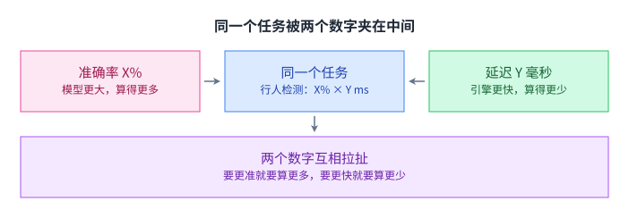
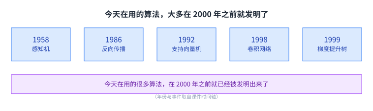
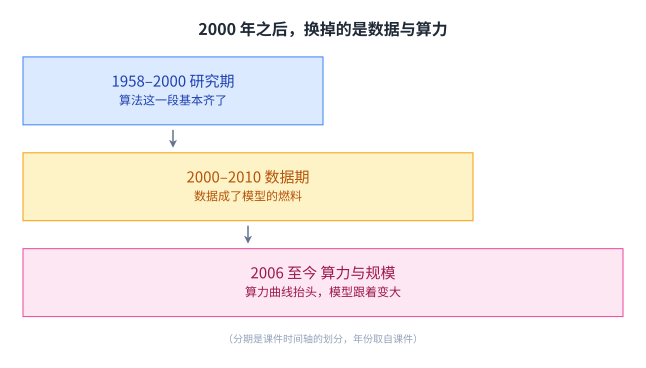
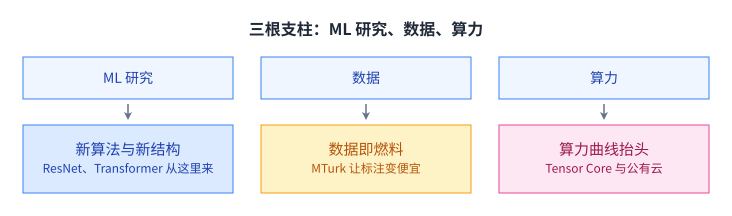
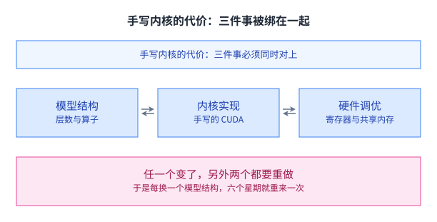
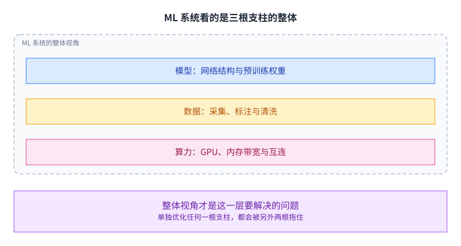
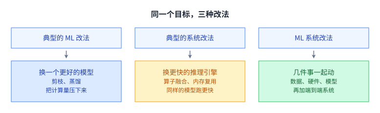

+++
title = "为什么需要机器学习系统"
lecture = 1
slug = "why-ml-systems"
status = "reviewed"
source_kind = "slides"
source_url = "https://mlsyscourse.org/slides/01-course-introduction.pdf"
source_title = "Week 1: Why ML Systems?（Tianqi Chen 主讲，2026-01-12）"
output_mode = "explanation"
+++

> 来源课程：Carnegie Mellon University 15-442 / 15-642 Machine Learning Systems（Tianqi Chen、Zhihao Jia）；
> 对应讲次：Week 1 — Why ML Systems?（Tianqi Chen 主讲，2026-01-12，第一教学周）；
> 原文课件：https://mlsyscourse.org/slides/01-course-introduction.pdf ；
> 上游许可：CC BY-NC 4.0（课程仓库根 LICENSE）—— 允许翻译与改编，须署名、且不得商用；
> 本文由 CourseLingo 原创撰写：按课件的推进顺序用中文重新讲解，关键定义处给出英文原文短引，配图为自绘 SVG，未转载原图与整页文字；本文非官方材料，CourseLingo 与 CMU 及本课程教学团队无隶属关系；如与原文有出入，以原文为准。

## 这一讲要解决什么

课件的题目是 Why ML Systems?。它要回答两件事：为什么机器学习需要一门关于系统的课，以及这门课把哪些东西算作自己的地盘。

先把「系统」这个词说清楚。这门课里的系统，指的是模型之外、但决定模型能不能用起来的那一整层东西：把算法跑在加速器上的那套软件、把数据搬来搬去的那套调度、以及让训练与推断在规定时间与容量内完成的那套取舍。模型回答「预测什么」，系统回答「这件事在真实硬件上要怎么才跑得起来」。后面每一讲讲的都是后半句。

课件给的入口是一个任务：把自动驾驶里的行人检测做到 X% 的准确率，同时每次推断必须压在 Y 毫秒以内。课件用 X 与 Y 当占位符，不给具体数值，因为这两个数取决于车型与场景；这里也照原样保留。

这句话里挂着两个数字，而它们属于两个不同的领域。X% 是模型侧的问题，Y 毫秒是系统侧的问题。麻烦在于两者在物理上互相拉扯：想让准确率更高，通常要把模型做大、算得更多；算得越多，单次推断就越慢。

这对数字不是随便挑的。延迟预算来自物理：车速越高，留给检测与制动的时间越短，所以车厂给的是毫秒级的硬指标，而不是「越快越好」这种软要求。准确率那一侧，误检与漏检的代价并不对称，漏掉一个行人可能直接是事故。

图里左边是准确率，右边是延迟，中间那个任务是同一件事。把两个数字并排放在一起看，才会发现只在模型侧调参收不了场。

这一讲的推进顺序是：先看机器学习这几十年到底换了什么，再落到一个具体案例上，最后回到「系统」这两个字到底指什么。

## 好算法在 2000 年前就已经齐了

课件先放了一条时间轴，把今天还在用的算法标在年份上，然后给出一句结论。

课件的原句是 `Many algorithms we use today are created before 2000.`，意思是：今天在用的很多算法，在 2000 年之前就已经被发明出来了。

图上五个节点都落在 2000 年以前。感知机属于 1958 年，反向传播属于 1986 年，[[term:convolutional-neural-network]] 的雏形在 1998 年就出现了。

这些想法到今天仍然是主流模型的地基：感知机给了「用可学习的权重做分类」这个框架，反向传播给出了「把误差传回去更新权重」的方法，支持向量机把分类变成了凸优化问题，卷积网络引入了局部连接与权重共享。

这件事为什么重要。因为它说明「算法还不够好」解释不了后来发生的变化。如果瓶颈一直卡在算法上，那么 2012 年之后那次跃升就没有地方安放。换个说法：后来发生的事集中在「怎么把这些算法跑起来」这一侧。

## 之后换掉的是数据，然后是算力

课件把 2000 年之后分成两段。

2000 到 2010 年是数据的一段。这段时间出现了几件让标注变便宜的事，课件上标出的一件是 2004 年的 MTurk：把标注切成小块分发给很多人做。（下面这句机制说明是我们的展开，课件只标了 MTurk 这个名词。）它的机制值得多说一句：任何一个普通人做完一小块就结算一次，于是「雇一批人做几个月」变成了「按需买几万次点击」，成本与周期一起掉下来。

2006 年之后是算力与规模的一段。课件在这里标出了 2016 年的 [[term:tensor-core]] 与 2017 年的公有云。（下面两句是对这两个名词的展开，课件只给了名词。）张量核心的意义很具体：它是 GPU 上专门做小矩阵乘加的电路，一次能干完过去好几条指令的活。公有云改变的是另一件事：算力从「自己买机器」变成「按小时租」，没有机房的研究组也能做大规模实验。

三个标签是并列摆的，没有先后箭头，也没有阶梯。它们是课件时间轴上的三个划分，算法、数据、[[term:compute]] 这三样并非互相取代，而是每补上一块，前一块才终于派上用场。

这里有一处容易看错。课件标的「2000 到 2010 数据」与「2006 至今 算力与规模」在 2006 到 2010 年之间是重叠的，所以课件给的是三个并列的标签，而不是三个首尾相接的阶段。数据变便宜与算力变便宜这两件事，实际是同时往前推的。

## 三根支柱：ML 研究、数据、算力

课件把 ML 应用拆成三根支柱：ML 研究、数据、算力。这里的「研究」指的是算法与模型结构那一侧，不包含把它们跑起来的那一层。

这个拆法的用处是定位问题。一件事做不成时，先问卡在哪一根上：是没有好算法，是没有数据，还是算不动。三根里缺了任何一根，另外两根都发挥不出来。

三根支柱之间也不是简单的加法。有算法没数据，模型学不到东西；有数据没算力，训练跑不完；有算力没算法，跑出来的结果不对。所以在这门课里，「补最短的那一块」往往比「把最长的那块拉得更长」更划算。

图上第一行是三根支柱，第二行是每根支柱当时的状况。真正的变化集中在后两根上，第一根提供的是几十年前就备好的方法。

## AlexNet 的配料表

课件选的案例是 2012 年的 AlexNet，论文标题是 ImageNet Classification with Deep Convolutional Neural Networks。

课件把这份方案拆成一张配料表：方法、数据、算力。

方法那一栏里是 [[term:gradient-descent]] 里的 SGD、Dropout、卷积网络与权重初始化，这些在上一节的时间轴上都已经出现过。数据那一栏是 100 万张带标注的图像。算力那一栏是两块 GTX 580，训练六天。

还有一处细节值得留意：两块 GTX 580 是消费级显卡，单卡显存装不下当时的网络，所以那篇论文必须把网络切开放在两块卡上，还要自己写卡间通信。（这一句属于背景补充，课件只写了「两块 GTX 580」。）这个「显存不够」的约束，正是后面并行化与省内存两讲的起点。

所以 AlexNet 的分量不在于它发明了什么新算法，而在于它证明了一件事：当数据与算力到位时，一批老方法能一次性爆发出新的水平。

## 代价落在工程量上：44k 行与六个月

课件接着放了一张很扎眼的表：2010 年的那个「第一个深度学习项目」。

课件上标注的数字是：一个模型变体约 44k 行代码，其中包含为 GTX 470 手写的 CUDA 内核；代价是六个月的工程量；而课件的评价是「这个项目最后没有做成」。

那一页贴的是按语言分行的代码统计表。表里能直接读出来的一行是 CUDA：21 个文件、7,871 行代码。换句话说，这 44k 行里有相当一部分是为一块具体显卡手写的内核，这也解释了为什么换一块卡就要重来。

为什么会这样。按我们的归纳，那个年代的手写 [[term:kernel]] 把三件事绑在了一起。课件在那一页只给了代码量与工期两个事实，没有解释原因。

图上是三块内容，它们必须同时对上。改一层网络的形状，就要重写对应的内核；换一块卡，寄存器怎么分、共享内存怎么切又得重来。44k 行就是这么长出来的：它并非设计得差，而是每换一个结构就要重来一遍。

这里说的内核，指的是在 GPU 上并行执行的那段函数。它和你在 CPU 上写的循环是两种东西：CPU 上你关心「第几步做什么」，GPU 上你关心「几万个线程各自拿哪一块数据」。这个转换没有通用公式，只能针对具体的算子和具体的卡去调，这也是它贵的原因。

## 系统抽象把代价压下来

课件把同一件事换了个做法，又算了一次账。

左边是 2010 年的手写路线，右边是今天用 [[term:ml-framework]] 的路线。右边只需要 100 行 Python，几小时就能改完，因为张量与算子的组织、[[term:computational-graph]] 的维护、[[term:automatic-differentiation]] 的推导都由框架提供，换结构时不用重写内核。

课件用的词是 System Abstractions。按我们的归纳，这层抽象大致管五件事：把张量表示出来，把算子拼成计算图，沿着图自动求导，把图里的算子映射到具体内核，以及调度这些内核的并行执行。换一种网络结构，你改的是前两步；后面几步由框架兜住。

把课件的两个数直接相除：44,000 ÷ 100 = 440。这个 440 倍的落差，其实是软件工程里很常见的一件事：把重复的部分抽成一层接口，用的人就只需要写差异的部分。

## ML 系统看的是整体

课件的原句是 `A holistic approach (ML, Data, Systems, Hardware) to solve the problem of interest.`，意思是：要解决问题，就得把机器学习、数据、系统与硬件放在一起看。

这句话里的四样，与前面出现的两套说法是同一个东西的不同切法，这里把对应关系交代清楚。四样里的 ML 与前文的「ML 研究」是同一根，「数据」与「算力」各自是一根，这就对上三根支柱里的三根；剩下的 Systems 与 Hardware 是把「算力」那一根再拆开看的结果：Hardware 是一块块具体的加速器，Systems 是让这些加速器能被用起来的那一层软件与调度。所以三根与四样并不矛盾，差别只在把第三根拆不拆。

所以 [[term:machine-learning-system]] 这个说法覆盖的不只是模型。它把模型、数据、算力，连同承载它们的系统与硬件，放进同一个问题里。

虚线框里是三样东西，框外那句话是这一节的重点。一个现成的例子：把模型换大，准确率上去了，但 [[term:latency]] 也上去了；把批处理开大，[[term:throughput]] 上去了，单次延迟又变差。

整体视角也带来一个新的麻烦：优化目标不再单一。在这门课里，「更好」至少要拆成准确率、延迟、吞吐量、显存占用与成本五项，而它们经常此消彼长。后面每一讲在介绍一种技术时，都会顺带说清它是在为哪一项付账。

## 同一个目标，三种改法

回到开头那个行人检测的目标，X% 准确率、Y 毫秒延迟。课件列了三条不同的下手路线。

典型的 ML 改法是把模型本身换掉：用 [[term:pruning]] 剪掉贡献小的权重，或者用 [[term:knowledge-distillation]] 让小模型去模仿大模型，把计算量压下来。

典型的系统改法让模型不动，只换一个更快的 [[term:inference-engine]]。课件在这一页只写了「换一个更好的推理引擎来降低延迟、并跑更准确的模型」；算子融合、内存复用与调度改进这三项常见手段，是我们补的举例。

课件给的第三条是 ML 系统的改法：收集更多数据、引入专用 [[term:hardware-accelerator]]、针对这块硬件去设计模型结构，再把它们拼成 [[term:end-to-end]] 的系统。

第三条为什么可能更好。因为前两条各自都会碰到天花板：模型压到某个程度会掉准确率，引擎优化到某个程度会碰到硬件上限。三条路线的差别还在于**可改动的变量个数**：第一条只能动模型，第二条只能动引擎，第三条允许同时动数据、硬件与模型结构。能动的变量越多，越可能找到一条别人没走过的组合。

课件也提到这一片已经变成研究领域：NeurIPS 上有 AI Systems 的 workshop，系统与数据库的会议上出现了 MLSys 分轨，还有专门的 MLSys 会议（mlsys.org）。

## 这门课想给你什么

课件的标题页之后有一段 Why study machine learning and systems?，给了三条理由。

第一条是目标层面的：要推动今天的 AI 应用往前走，就得对问题有整体视角，并且能更有效地用起已有的系统。第二条是职业层面的：为做机器学习工程做准备。第三条最直接：亲手造出自己的 ML 系统，这件事本身有意思。

这三条的排列顺序也透露了一点：这门课预设你已经会一点机器学习，它要补上的是另一半。如果你已经在模型结构上花过很多时间，那么这里讲的东西正好是别处不容易系统学到的部分。

课件也写明了学完之后应该能做什么：理解现代机器学习框架的通用组成部分，包括自动微分、硬件加速、并行化与省内存的技术；理解面向生成式 AI 应用的那些系统技术；并且自己动手实现一个机器学习系统项目。

## 这门课怎么上

课件的后半段是课程信息，这里只挑对读者有用的部分。

课程由四块组成：课堂讲座、个人编程作业、小组期末项目、Piazza 上的讨论。评分里作业与小组项目各占 45%，课堂参与占 10%；期末项目按 2 到 3 人一组做。

先修要求是系统编程、线性代数、一点数学基础，以及 Python 与 C++ 的开发经验。课件补了一句提醒：这是一门偏系统的课，动手之前先确认自己写系统程序是舒服的。

课件里还有一条自嘲式的声明值得抄下来：这是第三次开这门课，讲义正在翻新以纳入最新的进展，因此内容与作业里几乎肯定会有 bug。对读者的实际影响是，某些页面上的数字与结论可能在这一学期里被改动，遇到对不上的地方以最新课件为准。

## 读完应该能回答

1. AlexNet 的配料表分成方法、数据、算力三栏。请说明这三栏里哪一栏在 2012 年才真正变了，以及这个判断依赖什么证据。
2. 2010 年那个项目为什么要写 44k 行代码。请用「模型结构、内核实现、硬件调优三者绑定」这条机制解释，并说明今天的框架接过了其中哪一部分。
3. 手写 CUDA 内核时，换一块 GPU 需要重做哪些决定，换一种网络结构又需要重做哪些，两次重做有没有共同的部分。
4. 在行人检测这个任务上，ML 侧的改法与系统侧的改法各自的天花板在哪里，以及课件为什么认为把它们放在一起看更有希望。
5. 请用一个批处理的具体例子说明：为什么「降低单次延迟」与「提高吞吐量」经常互相牺牲。

## 脉络回顾

这是全课的第一讲，没有上一讲可接。它先关掉一条错误的解释：算法在 2000 年之前就基本齐了，之后变的是数据与算力，所以「模型还不够好」解释不了 2012 年之后的跃升。转折落在一个具体的项目上，2010 年那份方案写了 44k 行代码、花了六个月、最后没做成，而同一件事今天用一百行 Python 就够，中间差的 440 倍就是系统抽象。它同时立下了全课的坐标：准确率与延迟、吞吐与显存互相拉扯，后面每一步都在为其中一项付账。最先收口的地方是显存，第 9 到第 11 讲从那里接上。

## 溯源

- 对应：CMU 15-442 / 15-642 Machine Learning Systems，Week 1 — Why ML Systems?（Tianqi Chen 主讲，2026-01-12）。
- 原文课件：https://mlsyscourse.org/slides/01-course-introduction.pdf
- 上游许可：CC BY-NC 4.0（课程仓库根 LICENSE，19,342 B）。允许翻译与改编，须署名且不得商用。本页未转载原图与整页文字，配图全部自绘。
- 本讲取材范围：课件的 Why ML Systems 部分（ML 发展的三个时段与时间轴年份、三根支柱、AlexNet 案例、2010 年项目的 44k 行与六个月、系统抽象带来的 100 行 Python、MLSys 作为研究领域、行人检测的三种改法）与课程信息部分（学习目标、课程资源、先修要求、四个组成部分、评分构成、期末项目分组、翻新免责声明）。
- 数字与年份以课件页面为准；课件没有展开的推论属于 CourseLingo 的讲解，不当作原文引用，正文里逐处标了「这是我们的展开」。
- 属于我们展开、课件里没有依据的部分，逐条列在这里。其中一类是因果归纳：「440 倍落差来自抽象层」这个因果、三根支柱之间不是简单的加法、卷积网络作为地基的作用。另一类是名词与机制的展开：MTurk 的结算机制、张量核心与公有云各自改变了什么、手写内核把三件事绑在一起这条机制、System Abstractions 大致管的五件事、推理引擎的三项常见优化、内核是什么。最后一类是各条路线与后续讲次的对应关系。
