+++
title = "机器学习系统导论"
lecture = 2
slug = "introduction-to-mlsys"
status = "draft"
source_kind = "slides"
source_url = "https://mlsyscourse.org/slides/02-introduction-to-MLSys.pdf"
source_title = "Week 1: Introduction to Machine Learning Systems（Tianqi Chen 主讲，2026-01-14）"
output_mode = "explanation"
+++

> 来源课程：Carnegie Mellon University 15-442 / 15-642 Machine Learning Systems（Tianqi Chen、Zhihao Jia）；
> 对应讲次：Week 1 — Introduction to Machine Learning Systems（Tianqi Chen 主讲，2026-01-14，第一教学周）；
> 原文课件：https://mlsyscourse.org/slides/02-introduction-to-MLSys.pdf ；
> 上游许可：CC BY-NC 4.0（课程仓库根 LICENSE）—— 允许翻译与改编，须署名、且不得商用；
> 本文由 CourseLingo 原创撰写：按课件的推进顺序用中文重新讲解，关键定义处给出英文原文短引，配图为自绘 SVG，未转载原图与整页文字；本文非官方材料，CourseLingo 与 CMU 及本课程教学团队无隶属关系；如与原文有出入，以原文为准。

## 这一讲要解决什么

第 1 讲回答了「为什么需要机器学习系统」。这一讲要解决的是另一半：这套系统到底由哪些部分组成。

课件给的入口是一张总览图，它把 machine learning systems 的组成排成一个七格的栈。这里要先把编号说清楚，因为课件自己的编号与「从上往下数第几格」不是一回事。

七格从上到下依次是：模型、网络、自动微分、图级优化、并行化、内核生成、显存优化。课件只给其中三格编了号：自动微分是 Layer 1，图级优化是 Layer 2，并行化是 Layer 3。最上面两格（模型与网络）是模型本身，课件没有编号；最下面两格（内核生成与显存优化）课件也没有编号，本页为了指代方便称它们为第 4、5 层，这是我们的编号，不是课件的。下面每一节的小节标题用的都是这套编号。为了便于对照，这里给出换算：**本页的「第 N 层」一律指从自动微分那一格开始往下数第 N 格**，也就是格号减 2。换算的用处是避免混用：单独看「第 4 层」容易被读成「第 4 格」（图级优化，课件叫它 Layer 2），而「第 5 层」在这里指显存优化那一格，与「第 5 格」（并行化）不是一回事。

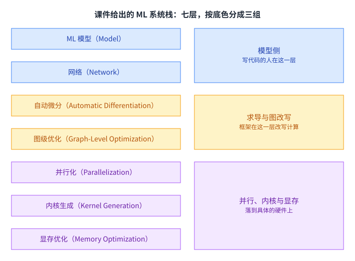

图的左列是课件列出的七格，右列按「谁在管」把它们归成三组，与正文用同一套分法：最上面两格合起来是模型结构，写代码的人自己定；接着两格是自动微分与图级优化，由 [[term:ml-framework]] 代劳；最下面三格是并行化、内核生成与显存优化，它们直接和硬件打交道。

这么分组不是为了好看。它的用处是回答问题出在谁身上：模型不收敛，去看最上面两格；图上出现了编译器不认识的算子，去看接着那两格；模型能训但训不完、或者一块卡装不下，去看最下面三格。不上不下地猜，通常只会改错地方。

这一讲就沿着这个栈从上往下走一遍。走完之后你会知道每一层在解决什么问题、上一层给下一层留下了什么，以及为什么同一份模型换一块显卡就可能变慢。

## 先看一台机器长什么样

要理解下面几层，先得知道它们落到什么形状的硬件上。

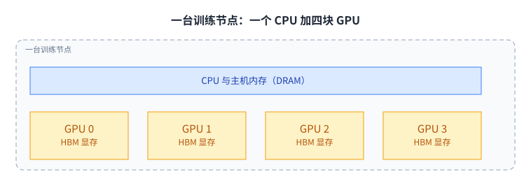

节点里有一个 CPU 和四块 GPU，每块 GPU 自带 HBM 显存，主机侧另有 DRAM。这张图的关键在层级：HBM 离计算单元最近、带宽最高，但容量最小；DRAM 容量大得多，速度却慢一档，两者之间靠数据搬运连起来。

容量与带宽之所以反着走，原因在物理距离。把存储做进芯片旁边，线短、能并行拉宽，带宽就高，但面积有限所以装不下多少；做大做远能把容量堆上去，代价是每次访问要等更久。这个取舍在整门课里反复出现：你能选的从来不是「又快又大」，而是「这一份数据放在哪一级最划算」。

为什么先讲这个。因为后面几乎每一个优化都在回答同一个问题：把数据放在哪一级，以及要搬几趟。[[term:compute]] 与内存带宽是两个不同的瓶颈，而这一讲的很多设计是被后者逼出来的。一块现代加速器每秒能做的浮点运算，通常快过它每秒能喂进去的数据（这个量级对比是业界的标准结论，课件里没有对应文字，属于我们的补充）。

## 第 1 层：自动微分

这一节讲课件编号的第 1 层，[[term:automatic-differentiation]]（它在七格栈里从上往下数是第三格）。课件给它的说明只有一句：把反向的计算图自动建出来。

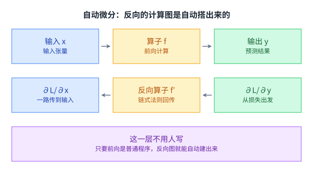

上排是前向：输入张量进去，预测结果出来。下排是反向：从损失出发，把梯度一路传回输入与权重。这两张图不是各写一遍的，用户只写了前向那段普通程序，反向图由框架顺着程序结构生成。

反向那一排之所以能从右往左走通，靠的是链式法则：一个复合函数的导数，等于每一小步导数的连乘。手算这个连乘在有几百层的网络上是不现实的，而程序知道每一层的结构，于是这件事可以机械地做出来。

不这样做会怎样。如果反向要人手写，每改一次网络结构就得重新推导一遍梯度公式；而推错了不会报错，只会让训练悄悄变差。第 4 讲会把这一层展开。

## 第 2 层的起点：DNN 本身就是一张计算图

在讲图级优化之前，课件先做了一次回顾：一个深度网络拆开看，只有两样东西。

课件的原话是 `A collection of simple trainable mathematical units that work together to solve complicated tasks.`，意思是：一堆简单、可训练的数学单元合起来解决复杂任务。这两个单元分别是张量与张量代数算子。

图上张量（也就是 n 维数组）与算子（卷积、矩阵乘这类运算）交替出现，串起来就是一张 [[term:computational-graph]]。[[term:convolutional-neural-network]] 这类结构之所以能被编译器处理，靠的就是这个表示。

这个表示的价值在于它是一条分界线。分界线以上是用户的世界：你关心层数、通道数、激活函数。分界线以下是编译器的世界：它只看到一堆张量和算子，以及它们之间的依赖。两边用同一张图对话，于是只要新结构能被拆成已有的那些算子，换架构就不用换编译器，换后端也不用改模型代码；反过来，如果新结构用到了编译器还不认识的算子，那就得先补上这一层。

承认这一点之后，编译器才有下手的地方：既然计算被表示成图，改写图就等于改写计算。

## 图级优化：把能合并的算子合并

有了图，第二层就有活干了。课件先给了一个最直观的例子。

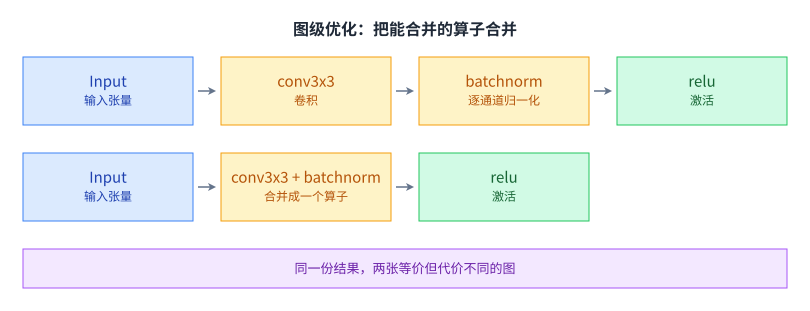

上排是原始计算图：卷积之后紧跟一个逐通道归一化，再过一个激活。下排是优化后的图：前两个算子合并成一个，节点少了一个，算的还是同一件事。

少一个节点为什么更快。因为算子各跑各的时候，前一个的输出要先写回显存，后一个再读回来。合并成一个算子，这份中间结果就留在片上，省掉一次写和一次读。在 GPU 上，省内存带宽通常就等于省时间。

要省掉这一次往返，有两条不同的路，下面几节都会用到，先把它们分开命名。

第一条叫**循环合并**：把两段计算的循环合成一遍。它要求后一个算子是逐元素的——每个输出只依赖对应位置的那一个输入。卷积后面接一个逐元素激活就属于这一类：读一次输入，算完卷积顺手就把激活做了，中间那张完整的结果根本不需要落盘。

第二条叫**代数合并**：把两步的算式改写成一步。它要求两步都是线性的（准确的说是仿射的），于是可以把它们的参数合成一份。下一页讲的卷积加归一化就是这一类。

两条路要的东西不同，省下的东西也不同：循环合并省的是「把中间结果写出去再读回来」这两趟，代数合并省的是「多做一步计算」本身。两者可以叠加，也可以各自单独成立。这类改写合起来在编译器里叫算子融合，是「省带宽」思路最典型的形态。

## 融合凭什么成立

合并当然不能随便合。课件用卷积加归一化做了一次完整的推导。

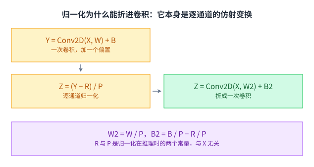

第一步是卷积加偏置，Y = Conv2D(X, W) + B。第二步是逐通道归一化，Z = (Y − R) / P，其中 R 与 P 是推理时固定下来的两个常量，与输入 X 无关。

关键在归一化本身也是仿射变换：先减一个常量，再除一个常量。两次仿射可以合成一次，于是整个式子能写成 Z = Conv2D(X, W2) + B2，其中 W2 = W / P、B2 = B / P − R / P。原本两步的计算，变成一次卷积加一个偏移。

换个角度看这笔账：新的权重只是把原来的权重按通道除了一下 P，新的偏置只是把原来的偏置除 P 再减 R / P。也就是说融合没有改变模型能表达的东西，它只是把两个连续的线性步骤合成了一个。

上一节说的两条路里，这里走的是第二条（代数合并），而它成立的前提正是这两步都是仿射的。

要是中间夹着一个非线性算子，代数合并这条路就断了：非线性没法折进权重里，权重与偏置也就没有一份「等价的新参数」可算。

但断的只是这一条。**循环合并那条路还在**，前提是这个非线性算子是逐元素的——卷积加 ReLU 就属于这一类，可以一边算卷积一边把 ReLU 做掉，省掉的正是上一节说的那两趟往返。两条路的区别到这一步就清楚了：代数合并动的是**算式**，循环合并动的是**遍历次数**；而如果那个算子连逐元素都不是（比如要在整批数据上求均值方差，或者 softmax 那种要先看一圈的运算），那么连循环合并也做不了，只能老老实实分成两步。

## 规则库：200 条规则，53,000 行代码

前面那条「卷积加归一化可以融合」的规则，是人事先写进优化器里的。课件接着给了这个规则库的规模。

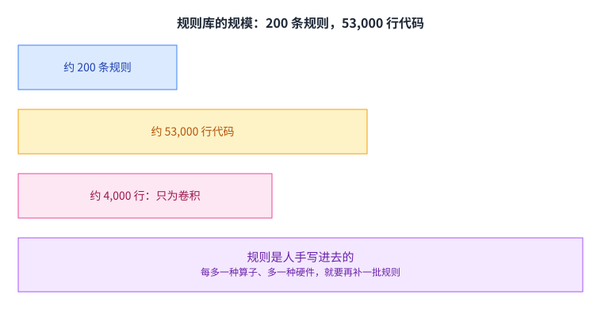

数字是：TensorFlow 当时内置约 200 条图优化规则，加起来约 53,000 行代码；其中光是为了优化卷积这一个算子，就用了约 4,000 行。

这些规则的形状都很像：认出一段特定的子图，把它换成另一段等价的子图。课件举的例子是「融合卷积与激活」「融合卷积与归一化」「融合多个卷积」。

写成伪代码大致是这样：匹配输入里的一段模式，检查它满足前置条件，然后用替换模式改写这段子图。真正的难点不在改写，而在前置条件：融合卷积与归一化要求归一化的参数确实是常量，融合多个卷积要求中间张量只被这一处用到。条件写漏一个，改出来的图就不等价，而错的结果往往不会崩，只是精度悄悄掉一点。

## 规则库的三个局限

靠人手写规则，课件列了三个问题。

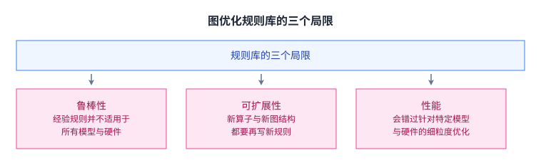

鲁棒性上，这些规则来自工程师的经验，而经验并不覆盖所有模型与硬件。课件在这一页贴了两句真实抱怨，一句是 `the training speed is about 20% slower`（训练速度慢了约 20%），另一句是 `With XLA, my program is almost 2x slower than without XLA`（用了 XLA 之后，程序反而比不用慢将近一倍）。

可扩展性上，每来一种新算子或新图结构，都要再写一批规则。课件给的证据就是那约 4,000 行：它只覆盖了卷积一个算子。

性能上，规则的写法是通用的，于是会漏掉针对某个具体模型、某块具体硬件的细粒度优化。

## 一个动机例子：ResNet 上的图变换

课件接着用一个真实网络把问题摆了出来。它选的是 ResNet，引用是 Kaiming He 等人 2015 年的 Deep Residual Learning for Image Recognition。

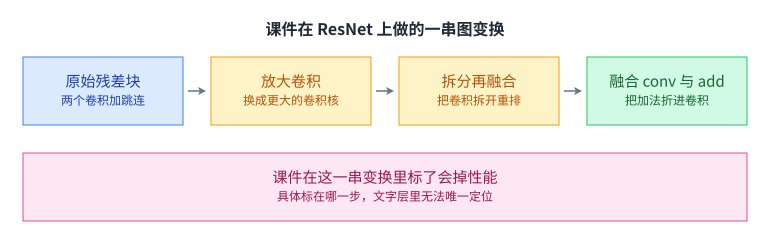

实验从一个残差块出发：两个卷积加一条跳跃连接。课件从它开始做了**三步**变换，课件自己给这三步起的名字是 `Enlarge convs`、`Split / Fuse convs`、`Fuse conv & add`（引自课件）：先把小卷积放大，再把卷积拆开重新合并，最后把加法与卷积融在一起。**起点那一帧不算变换**，所以是「一个起点加三步」，而不是四步。

课件在这串变换的图上标了 `(Decrease performance)`，也就是这一步会掉性能。这个标注在引入 `Enlarge convs` 那一帧上第一次出现，之后几帧沿用同一套图注。它在文字层里出现三次，所以单看文字层无法断定标注具体贴着哪一步；按帧的先后次序，它最先出现在放大卷积那一帧上。

为什么要把卷积放大。因为在 GPU 上，一个算子的实际耗时并不只由它做了多少次乘加决定，还要看这些乘加被组织得够不够好。卷积核的形状决定了数据复用率：同一份输入能不能被反复用上，权重能不能常驻在片上。把 1×1 的卷积换成 3×3，或者反过来把 3×3 拆成几个小卷积，都会改变复用率，而改变的方向在不同的 GPU 上并不一致。

这一步也解释了后面那组数字为什么会出现。图上的一次改写，落到不同硬件上，可能落到复用率更高的那一侧，也可能落到更低的那一侧。

## 同一张图，两块卡上结论相反

真正说明问题的是最后那组数字。

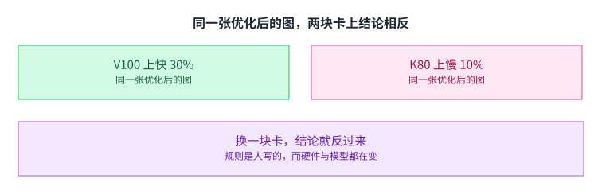

最终得到的计算图在 V100 上快 30%，在 K80 上慢 10%。同一个模型、同一串变换，只换了显卡，结论就反过来了。

这件事为什么难办。规则是人写的，而硬件在换代，模型结构也在换代。写规则的人不可能预先枚举「哪种变换在哪块卡上更快」，因为这是组合爆炸：算子有多少种、图结构有多少种、硬件有多少种，乘起来就没法人工覆盖。课件在这一页的结论直接写在图上：`Infeasible to manually design graph optimizations for all cases.`（要为所有情况人工设计图优化，是做不到的。）

再补一句为什么「多写点规则」救不了。规则之间会互相干扰：一条规则改写完的图，可能正好让另一条规则的前提不再成立，于是应用顺序也变成了要枚举的东西。规则越多，这个顺序空间越大，人工维护的成本不是线性涨的。

## 出路：把图优化本身自动化

课件给的答案是：既然人工枚举不可行，就让程序自己去枚举，并且自己证明。

流程分五步。先从机器学习的数学性质出发，那里有一批能被证明的等式，比如刚才那条仿射合成的等式。生成器拿这些等式提出候选变换；候选交给验证器，由它证明变换前后两张图算的是同一件事；只有验证通过的才交给图优化器真正落地。

要点在中间那一步的分工。生成器的任务只是多提，对错不管；验证器负责把错的挡住。于是搜索空间可以开得很大，正确性仍然有人兜底。

代价也很清楚：验证本身要花钱。每次提出一个候选，都要跑一遍等价性证明，而证明可能比尝试一次改写贵得多。所以这条路线能不能成，取决于候选的质量，以及验证能不能做得足够快。这条路线在第 19 讲会展开。

## 第 3 层：怎么把训练并行起来

栈往下走到并行化。课件先回顾了一次训练迭代的三步。

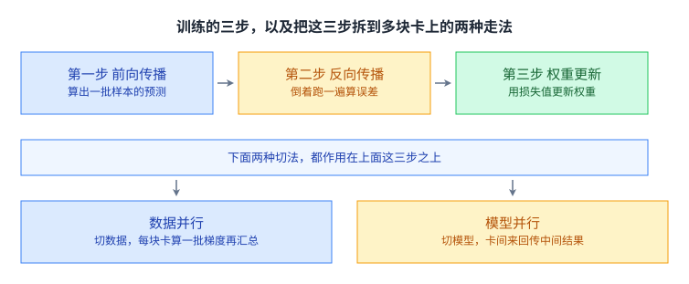

第一步是前向传播：把一批样本喂进模型，顺着算子算出预测。第二步是反向传播：把模型倒着跑一遍，为每个可训练权重算出误差。第三步是权重更新：用损失值去更新权重。这三步循环很多次，就是随机梯度下降，也就是 [[term:gradient-descent]] 里的 SGD。

把这三步拆到多块卡上，课件给了两条路，而两条路都不是「只针对某一步」的：它们作用在上面这三步的整体之上。[[term:data-parallelism]] 切的是数据：每块卡拿一批不同的样本，各自走完前向与反向算出梯度，再把梯度汇总起来。模型并行切的是模型：一张图被拆成若干子图分给不同设备，于是每一步都要在卡与卡之间来回传中间结果。

两条路的取舍很清楚。数据并行不动模型，通信的是梯度；模型并行能装下单卡装不下的模型，但通信的是每一层的中间结果，量大得多。前向的每一个中间张量都要在设备之间过一次，而反向还要按相反的方向再过一次。第 9、10 讲会分别展开。

## 第 4、5 层（我们的编号）：内核从哪来，显存为什么是天花板

栈底还有两层，课件各给了一页。

第一个问题是算子怎么跑快。以前的答案是厂商手写：GPU 上卷积走 `cudnnConvolutionForward()`，矩阵乘走 `cublasSgemm()`，它们都在 cuDNN、cuBLAS 这些库里。

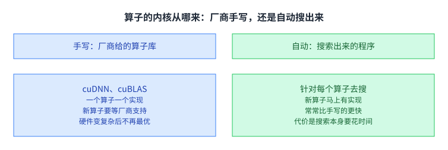

手写路线的两个问题写在课件上：新算子拿不到即时支持，要等厂商补；硬件越来越复杂，手写的 [[term:kernel]] 反而不一定最优。现在的答案是自动代码生成，针对每个算子去搜一个高性能程序。好处是新算子马上有实现，而且搜出来的常常比手写的更快；代价写在最后一行，搜索本身要花时间。

手写为什么一定会落后。一个算子要跑得快，得同时决定分块大小、片上缓存怎么用、一个线程算多少个输出、数据以什么顺序读。这几项在不同 GPU 上的最优组合并不一样，而厂商的库只能针对已有的算子、已有的卡各写一版。算子一旦变多、卡一旦换代，人手就跟不上了，而搜索可以把这份人力换成计算时间。

第二个问题是显存。

课件给的判断是：能训多大的模型由 GPU 显存决定，而更大的模型通常效果更好。原因在前向传播那一侧，每一层的中间结果都要留到反向传播用，所以显存占用随模型深度与批量大小一起涨。

算一下这笔账：显存里要同时装下权重、梯度、优化器状态和一批中间结果，而中间结果这一项大致正比于「批量大小 × 模型深度 × 每层的激活尺寸」。权重只跟模型大小有关，中间结果却跟着批量一起涨，所以想靠加大批量来提速，最先撞到的就是显存。

这就是为什么显存要单独占一层：省下来的每一块显存，都能换成更深的模型或者更大的批量。第 11 讲会讲两种省法，重算与换出。

## 训练与推理：同一套栈，两边压的地方不一样

到这里这一讲讲的都是训练侧。但机器学习系统并不只在训练时存在，模型上线之后还要一直回答请求，而那一侧的问题形状不同。这一节把两边对照一次，好让上面那七格的位置更清楚。

最直观的差别是要存的东西。训练时显存里要同时放下权重、梯度、优化器状态和一批中间激活；推理时不需要梯度和优化器状态，但多了一块随序列长度增长的键值缓存。

第二个差别是关心的指标。训练关心「多久训完」，也就是整批数据的吞吐；推理关心「单个请求多快返回」，也就是延迟，而这个延迟还要除以同时服务的请求数才划算。

第三个差别落在并行上。训练侧那两条路（切数据、切模型）主要是为了装下更大的模型或者更快地跑完；推理侧切分还要考虑一件事：多切一块就多一次跨设备通信，而通信的代价直接加在每一个请求的延迟上。

同一格在两侧的取舍方向甚至可以相反。比如显存优化：训练侧重算激活值是为了腾出空间给更大的批量，而推理侧不会去重算权重，因为那会拉长每个请求的响应时间。

需要说明的是，课件这一讲举的例子全部在训练侧，推理侧的对照是本页补的。推理与训练的系统差异，课程在后面用了整整一块来讲，第 14 与第 16 讲会展开。
## 读完应该能回答

1. 课件把 ML 系统的组成排成七格、并给其中三格编了号。请说出这三格的编号与名字，以及最上面两格与最下面两格各是什么。请说明「图级优化」这一层为什么必须排在「自动微分」下面，顺序换过来会出什么问题。
2. 卷积与逐通道归一化能合并成一次卷积，靠的是哪个数学性质。请写出这个性质，并说明中间如果夹一个激活函数为什么不能照搬同样的推导。
3. 规则库的三个局限里，哪一个最根本，另外两个是不是它的推论。请给出你的理由。
4. 同一个计算图在 V100 上快 30%、在 K80 上慢 10%。请说明这个现象对「用手写规则做图优化」意味着什么。
5. 数据并行与模型并行各自要在设备之间搬什么。请从搬运量的角度说明，为什么模型并行通常更贵。
6. 训练与推理在「显存里装什么」和「关心哪个指标」上各有什么差别，为什么显存优化在两侧的取舍方向可以相反。

## 溯源

- 对应：CMU 15-442 / 15-642 Machine Learning Systems，Week 1 — Introduction to Machine Learning Systems（Tianqi Chen 主讲，2026-01-14）。
- 原文课件：https://mlsyscourse.org/slides/02-introduction-to-MLSys.pdf
- 上游许可：CC BY-NC 4.0（课程仓库根 LICENSE，19,342 B）。允许翻译与改编，须署名且不得商用。本页未转载原图与整页文字，配图全部自绘。
- 本讲取材范围分两块。一是总览：七格栈、硬件节点图，以及第 1、2、3 层各自的一页（自动构造反向计算图、DNN 即计算图、融合卷积与归一化的推导、规则库的约 200 条规则与约 53,000 行、三个局限、ResNet 上的四步变换与 V100 的 30% 与 K80 的 10%、生成器与验证器）。二是栈底与并行化：SGD 的三步、数据并行与模型并行、cuDNN 与 cuBLAS、自动代码生成，以及显存作为训练天花板那一页。
- 数字与公式以课件页面为准。未展开的推论属于 CourseLingo 的讲解，分三种。一是因果归纳，例如「融合之所以合法是因为两步都是仿射的」。二是机制解释，例如融合的前置条件、卷积核形状与数据复用率的关系、规则之间会互相干扰、验证本身的成本。三是量级参照与编排，例如算力与带宽的对比、各层与后续讲次的对应关系。
- 本页作出的跨讲承诺在此登记，供后续讲次产出时回核。第 4 讲：展开自动微分这一层。第 9、10 讲：分别展开数据并行与模型并行。第 11 讲：展开显存的两种省法（重算与换出）。第 14、16 讲：展开推理与训练的系统差异。第 19 讲：展开「生成器加验证器」那条路线。
- 关于硬件节点那一页：课件的文字层把 CPU、GPU、HBM、DRAM 这些标签拆成了单字符（`C P U G P U …`），按整词检索会一无所获，但它们确实在那一页上；本页的节点配图就是按这串标签画的。
