+++
title = "深度学习与编程抽象"
lecture = 3
slug = "deep-learning-abstraction"
status = "draft"
source_kind = "slides"
source_url = "https://mlsyscourse.org/slides/03-deep-learning-programming-abstraction.pdf"
source_title = "Week 2: Intro to deep learning and programming abstraction（Tianqi Chen 主讲，2026-01-21）"
output_mode = "explanation"
+++

> 来源课程：Carnegie Mellon University 15-442 / 15-642 Machine Learning Systems（Tianqi Chen、Zhihao Jia）；
> 对应讲次：Week 2 — Intro to deep learning and programming abstraction（Tianqi Chen 主讲，2026-01-21，第二教学周）；
> 原文课件：https://mlsyscourse.org/slides/03-deep-learning-programming-abstraction.pdf ；
> 上游许可：CC BY-NC 4.0（课程仓库根 LICENSE）—— 允许翻译与改编，须署名、且不得商用；
> 本文由 CourseLingo 原创撰写：按课件的推进顺序用中文重新讲解，关键定义处给出英文原文短引，配图为自绘 SVG，未转载原图与整页文字；本文非官方材料，CourseLingo 与 CMU 及本课程教学团队无隶属关系；如与原文有出入，以原文为准。

## 这一讲要解决什么

前两讲一直站在系统这一侧看问题。这一讲换了方向：先看清今天要跑的东西长什么样，再看框架是用什么抽象把它们接住。

课件的目录只有两行：Overview of deep learning，以及 Programming abstractions for deep learning。也就是先把模型这一侧过一遍，再讲计算图这套抽象。

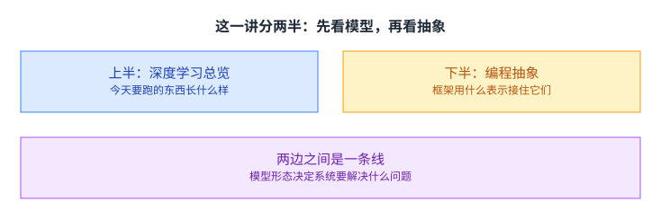

两半的顺序不是随便排的。这门课讲的是 [[term:machine-learning-system]]，而系统的形状是被应用压出来的。卷积、循环、注意力、图、混合专家这几个家族，对内存、带宽与并行度的要求各不相同；不知道它们各自在算什么，就很难听懂后面为什么要做那些优化。

所以这一讲要解决的是两件事之间的那条线：模型长什么样，以及框架用什么表示把它与硬件隔开。

## 机器学习的三个要素

课件先退回到最一般的位置，把机器学习拆成三样东西。

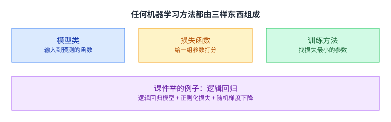

课件给的说明是：模型类是一个带参数的函数，描述输入怎么映射到预测；损失函数回答「对一组给定的参数，我们做得有多好」；训练方法是一个过程，用来找出一组让损失最小的参数。三个名字听起来抽象，落到逻辑回归上就很具体：逻辑回归模型、正则化损失、随机梯度下降（[[term:gradient-descent]]）。

把「带参数的函数」这句话展开一点：参数是一堆可调的数字，函数是一条固定的计算路径。训练做的事就是沿着这条路径反复试，把数字挪到让损失更小的位置。于是「模型」在现代框架里其实分成两半：结构是代码，参数是数据。

这个三分法的用处是定位改动。出了问题先问改的是哪一栏：换模型结构改的是第一栏，换损失改的是第二栏，换优化器或学习率改的是第三栏。三栏混着改，就说不清是哪一处起了作用。

## 深度学习改的是哪一栏

课件接着只加了一条设定，深度学习就出现了。

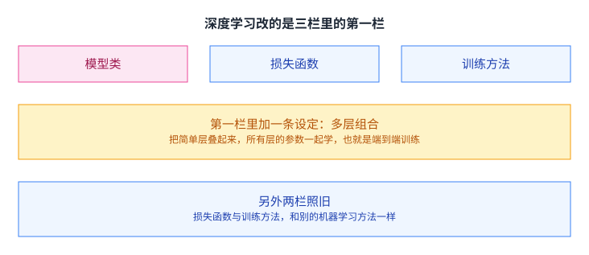

它加的是「组合式的多层模型」：把很多简单的层叠起来，并且所有层的参数一起学，这就是端到端训练。课件在这一页还专门写了一句提醒：其余两样配料，也就是损失与训练方法，和别的机器学习方法一样。

这句话值得停一下。深度学习的「深」改的只是模型那一栏的表达能力，它没有发明新的损失函数，也没有发明新的优化器。理解了这一点，后面看到「换一个更好的优化器」这类说法时就不会混淆层次。

「所有层一起学」也不是免费的。中间那些层没有直接的监督信号，它们的好坏只能通过最后一层的损失反推回来。能做这件事的前提是整条链路可导，而可导链条的建立与维护，后面会占掉框架很大一块工程量。

## 今天要面对的五个模型家族

课件把当下常用的模型分成五个家族，逐个过一遍。

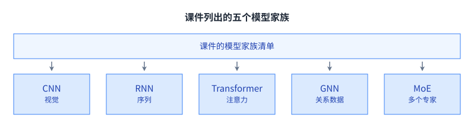

它们各自的定位是：[[term:convolutional-neural-network]] 做视觉，循环网络处理序列，Transformer 靠注意力，图神经网络处理关系数据，混合专家把一个大模型拆成若干个专家。课件在每一节结束时都会把这张清单再放一次，标出当前走到哪一个。

五个家族对系统提出的要求差别很大。卷积要反复读同一份输入，考验存储层次；循环网络的依赖链拉得很长，考验并行度；注意力每一步都要访问整个序列，考验中间结果的存放；图数据的形状不规整，考验调度的灵活性；混合专家的参数远大于单次计算要用的量，考验显存。下面按课件的顺序看其中几个。

## 从卷积说起：视觉任务

课件先列了卷积网络的用途，然后讲它到底在算什么。

用途那一页列了六项：分类、检索、检测、分割、自动驾驶与图像合成。它们都是视觉任务，输入是一张图或者一段视频。


课件对卷积的解释是：把滤波器在图上滑动，每滑到一个位置就和那一小块做一次点积。滤波器就是一小块权重，同一块权重在整个图上被反复使用。

省参数的原因就在这里。如果改成全连接，图上每个像素到下一层的每个输出都要一个权重，参数会随图像尺寸平方增长；卷积只学这一小块滤波器，于是参数与图像大小无关。代价是表达能力被限制成「同一套模式在任何位置都成立」。

卷积网络的整体结构写在下一页：一叠卷积层，中间夹着池化、归一化与激活函数，这一页引的是 Zeiler 与 Fergus 2013 年的工作。这三种夹层各有分工：池化把空间尺寸压小，归一化把数值范围拉稳，激活函数提供非线性。

卷积对系统提出的要求很明确：同一份输入要被反复读。滤波器滑过整张图，每个位置都要读一小块像素，读的遍数越多，越考验存储层次。这也是为什么后面要花那么大力气做数据布局与分块。

## 循环网络：有内部状态，代价是并行度

第二个家族处理的是序列：文本、视频、动作。

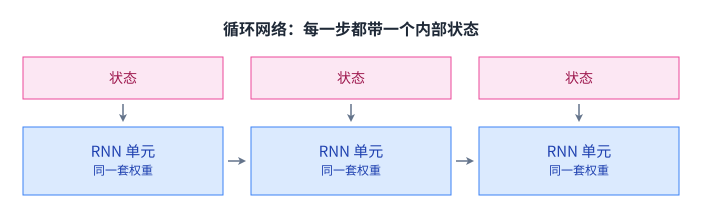

课件给的关键想法是：循环网络有一个内部状态，在处理序列的过程中不断更新。同一套权重在每一步重复使用，所以输入与输出的个数都可以是任意的。用途那一页举了几个例子：图像生成文字、视频帧预测动作、视频描述、机器翻译。

课件还专门讲了一个表示上的问题。[[term:computational-graph]] 必须是有向无环图，而循环网络带自环。它的解法是把循环展开：给定一个最大深度，把环拆成一串首尾相接的单元。展开之后就是一张普通的前向图，代价是序列有多长，图就有多长。

代价也在这里。

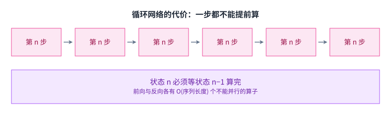

课件给的判断是：循环网络缺少可并行性。前向与反向都有 O(序列长度) 个不能并行的算子，因为一个状态必须等它前面所有状态都算完才能算。这会直接卡住长序列的训练。

换一个说法：循环网络把「长度」换成了 [[term:latency]]。序列越长，能同时做的事情并没有变多，只是要等的轮数变多了。在 GPU 这类靠大量线程同时干活换取吞吐的硬件上，这几乎是致命的。

## 注意力：把序列内部的并行打开

课件紧接着给出了绕开这个限制的想法。

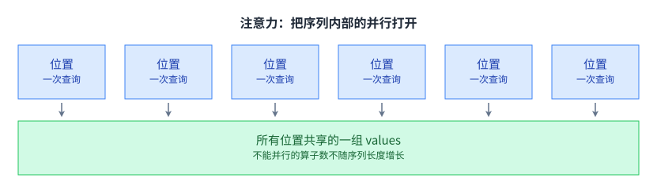

它的说法是：把每个位置的表示当成一次查询，去访问并吸收一组 values 里的信息。位置之间不再互相等待，每个位置各自发出查询。

课件把好处写得很直白：可并行度极高，不能并行的算子数量不随序列长度增长。序列变长，能同时做的事情也跟着变多，而不是排队等。

代价也转移了。每一步都要和整个序列打交道，于是中间结果的规模随序列长度平方增长，长序列的显存开销会很快顶到上限。这份账在后面讲注意力优化时会重新出现。

再往系统这一侧看一层：注意力把一个「等」的问题换成了一个「读」的问题。循环网络的瓶颈是要等的轮数，注意力的瓶颈是每一步要读多少数据。要等的东西靠增加并行度解决，要读的东西只能靠提高数据复用率或者换更快的存储来解决，两边的解法完全不同。

这一页还列了后面会展开的三个概念：自注意力、掩码注意力与多头注意力。第 8 讲会把它们讲透。

## 关系数据与多专家

第四个家族处理的是图结构的数据。

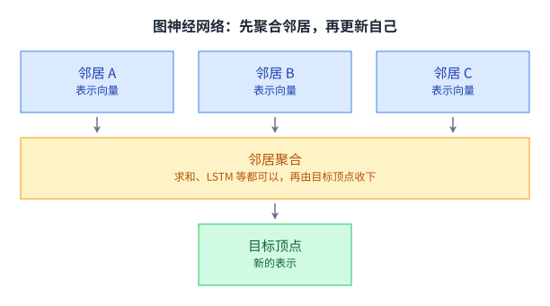

课件把它和普通神经网络并排放：普通网络的输入是固定形状的张量，而图神经网络的输入是顶点与边。它的做法是先对邻居做聚合，聚合可以是求和、LSTM 之类的操作，再把结果用来更新目标顶点的表示。课件给的概括是：把图的传播与神经网络算子合起来。

它对系统的挑战在「不规整」这三个字。张量的形状是固定的，所以可以预先切成整齐的块；图的邻居数每个顶点都不一样，切出来的块大小参差，硬件最擅长的「大家一起做同一步」就不好安排了。

第五个家族是混合专家。

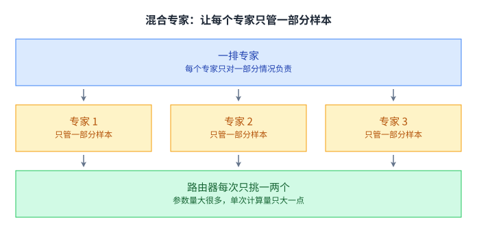

课件给的关键想法是：让每个专家专注于预测一部分情况下的正确答案。它举的例子是 Switch Transformer，也就是 Transformer 加上混合专家。

这条路对系统的意义很直接：参数量可以远大于每次计算要用的参数量。整个模型可能装不下，但每次只激活其中一两个专家，于是 [[term:compute]] 并没有跟着参数一起涨。便宜是从别处换来的：参数仍然要放得下，而「每次挑哪个专家」这件事本身也可能成为新的瓶颈。

## 这些配料会反过来改变系统设计

模型这一侧讲完，课件用一页把话题转回系统。

它先给了两个别的领域的类比：数据管理这一侧的三个组件是声明式语言（SQL）、执行规划器与存储引擎；数据处理这一侧的三个组件是分布式原语（MapReduce）、容错层与工作负载迁移。也就是说，一个领域的应用形态，决定了它那一层的系统长什么样。

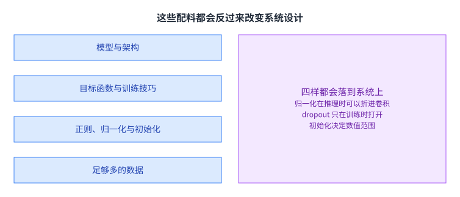

课件列的四样配料是：模型与架构、目标函数与训练技巧、正则化与归一化以及初始化，还有足够多的数据。其中第二和第三样被特别标注为「与建模耦合」。

关键在于它的提问方式：这些配料会怎样影响 [[term:ml-framework]] 的设计。举几个具体的：批归一化既然可以在推理时折进卷积，那它就不只是一个数学层，而是一个可以被优化的结构；dropout 只在前向训练时打开，反向与推理都不需要它，于是它不该占显存；Xavier 初始化决定了权重的数值范围，也就决定了用什么精度存它才不丢信息。

这一页其实在提问，答案散在后面每一讲里。读这门课时可以留一个习惯：每学一种技术，回头问它是在为哪一样配料付账。

反过来也成立：框架能提供什么，会限制模型能长成什么样。一个框架如果只能处理形状规整的张量，图神经网络就很难在上面写得舒服；一个框架如果只支持静态形状，那变长序列就要靠补齐来凑。模型与系统是互相塑造的，不是单向的。

## 计算图抽象

课件用一页给出了这套抽象的定义，它是这一讲后半段的中心。

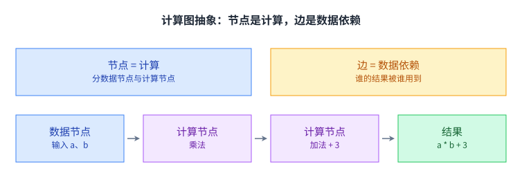

课件写得很短：节点代表计算，边代表算子之间的数据依赖。它举的例子是 a 乘 b 再加 3，那张图有三个节点。

这套抽象的价值在于它把两件事分开了。用户描述的是「算什么」，也就是节点与边；框架负责的是「怎么算」，也就是节点落到哪个 [[term:kernel]]、边上的数据要不要搬运、能不能合并。上一讲说的图级优化，动的就是后半段。

分开之后还有一个好处：同一张图可以落到不同的后端上。图里写的是矩阵乘与卷积，至于它被翻译成哪一块硬件的哪条指令，是后端的事。模型的代码因此不用为每一种芯片重写一遍。

课件接着安排了一个案例研究，用的是一套 TF1 风格的接口。它在这里加了两句提醒：今天的框架大多已经换了写法，但底下的机制是一样的；看这些例子时要同时留意抽象与实现这两层。

## 案例：一段逻辑回归

课件选的任务是 MNIST 手写数字上的逻辑回归，模型本身只有一层线性加一个 softmax。

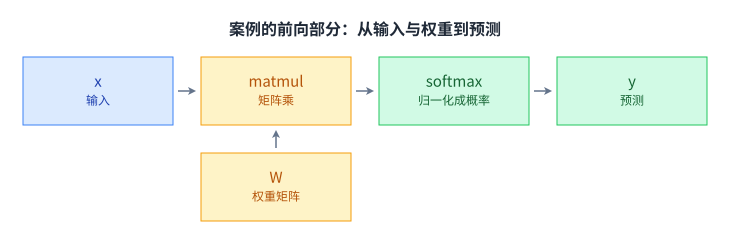

课件的代码大致是这样（`import tinyflow as tf` 是课件用的示例接口，机制与 TensorFlow v1 一致）：

```python
x = tf.placeholder(tf.float32, [None, 784])     # 输入：28×28 的图拉平
W = tf.Variable(tf.zeros([784, 10]))            # 权重：784 个像素到 10 个数字
y = tf.nn.softmax(tf.matmul(x, W))              # 前向：预测

y_ = tf.placeholder(tf.float32, [None, 10])     # 标签
cross_entropy = tf.reduce_mean(
    -tf.reduce_sum(y_ * tf.log(y), reduction_indices=[1]))   # 损失

W_grad = tf.gradients(cross_entropy, [W])[0]    # 反向图由这一步接上
train_step = tf.assign(W, W - 0.5 * W_grad)     # 更新规则
sess.run(train_step, feed_dict={x: xs, y_: ys}) # 到这一行才真的算
```

这段代码里有两处值得停一下。第一处是 784 与 10：输入的每一行是一张 28×28 的图，拉平就是 784 个数；输出是 10 个数字各自的概率，所以权重矩阵是 784 乘 10。

第二处是最后一行。前面那些语句全都只是「声明」，它们没有算任何东西，只是在搭图。真正开始计算是在 `sess.run` 这一行，课件在那一页专门标了一句：real execution happens here。这个「先声明、后执行」的分工，正是计算图抽象最直接的体现。

分工带来两个后果。一个后果是同一张图可以被反复执行：训练循环跑上一千次，图只建了一次，省掉了每次重新解析的开销。另一个后果是出错的位置会推迟：图建错了当场不会报，要等执行的时候才暴露出来，这也是它后来被换掉的原因之一。

## 那张图是怎么一段段长出来的

课件把上面那段代码拆成四步，每一步只画出它新增的那部分图。

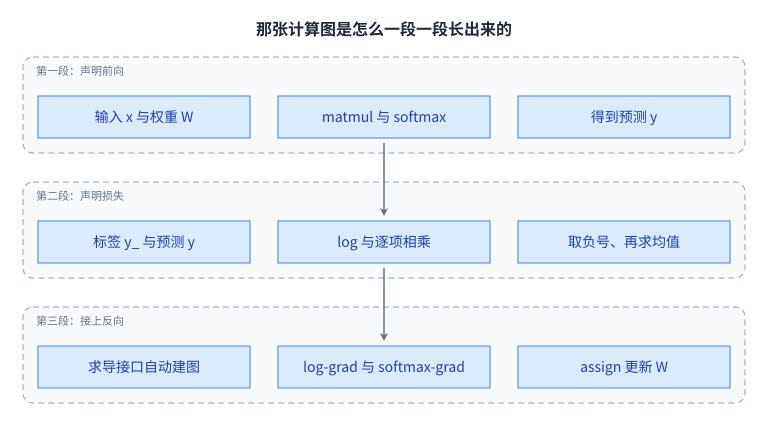

第一段是前向：x 与 W 交给矩阵乘，再过 softmax，得到预测 y。第二段是损失：标签 y_ 与预测 y 一起过对数、乘法与求均值，得到交叉熵。

第三段是反向：调用求导接口，框架自动把 log-grad、softmax-grad、除以批量大小、矩阵乘转置这些节点接上去，最后送回权重的梯度；再加上学习率乘法、减法与赋值，就得到了更新那一步。

这张图值得看两件事。一件事是 [[term:automatic-differentiation]] 的位置：第三段的那些节点不是人写的，是求导接口根据前两段的图生成的。这与第 2 讲说的第 1 层是同一件事，只是这里能看到它具体长什么样。

另一件事是规模。这一页只是一个逻辑回归，图里已经有十几个节点。换成一个真实的网络，节点数是几千到几万量级。课件在这一页留了两个问题给读者：计算图抽象到底带来了什么好处，以及在这套抽象之上还能做哪些实现与优化。第二个问题就是这门课后面所有内容。

## 两种构造方式

课件最后把两种写法摆在一起。

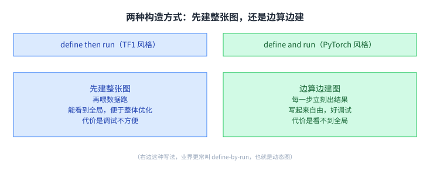

课件用的名字是 define then run 与 define and run。前一种是 TF1 风格的写法：先把整张计算图建出来，再喂数据去跑。后一种是 PyTorch 这一类框架的写法：一边算一边把图建出来，图是跟着计算走的。

两种写法的差别落在两件事上。可调试性上，边算边建图每一步都能立刻拿到结果，出问题当场就能看到；先建后跑要等整张图都建好才开始算，中间态很难观察。

全局优化的能力上，结论反过来。先建后跑在动手算之前就能看到整张图，于是可以整体地做改写，也就是第 2 讲讲的那些图级优化；边算边建图每次只看到一个局部，很难做全局判断。

课件在这一页也写了当前的走向：这仍然是个活跃的研究方向，混合方案比如即时编译正在把两边的好处拼起来。换句话说，这不是一道已经分出胜负的选择题，而是一个还在移动的边界。

## 读完应该能回答

1. 课件把机器学习拆成三样东西。请说明深度学习改动了其中哪一样，另外两样为什么可以照旧。
2. 循环网络为什么必须先把环展开成一张无环图，展开之后图的大小由什么决定。
3. 请说明循环网络缺少并行性的具体位置：是哪一类算子不能并行，以及为什么它的数量正比于序列长度。
4. 注意力为什么能绕开上面那个限制。请说明它把什么变成了并行，以及代价转移到了哪里。
5. 混合专家让参数量与单次计算量脱钩，请说明这份便宜是从哪里换来的。
6. 先建整张图再跑、与边算边建图，各自在什么场景下更占优势，请各举一个理由。

## 溯源

- 对应：CMU 15-442 / 15-642 Machine Learning Systems，Week 2 — Intro to deep learning and programming abstraction（Tianqi Chen 主讲，2026-01-21）。
- 原文课件：https://mlsyscourse.org/slides/03-deep-learning-programming-abstraction.pdf
- 上游许可：CC BY-NC 4.0（课程仓库根 LICENSE，19,342 B）。允许翻译与改编，须署名且不得商用。本页未转载原图与整页文字，配图全部自绘。
- 课件示例代码按原文给出的机制缩写重排，只用于说明计算图的构造顺序，未逐行照录。
- 本讲取材分两半。第一半是深度学习总览，包括机器学习的三个要素与逻辑回归的例子、深度学习的两个关键想法、五个模型家族。第二半是编程抽象，包括计算图抽象的定义与 a 乘 b 加 3 的例子、TF1 风格逻辑回归案例与逐段建图、两种构造方式与各自的代价。
- 五个家族的取材范围是：卷积网络的六项用途与卷积的定义、循环网络的内部状态与展开、缺少并行性的代价、注意力的并行性、图神经网络的邻居聚合、混合专家的 Switch Transformer 与「配料怎样影响系统设计」那一页的四样配料与两个跨领域类比。
- 数字与定义以课件页面为准。课件未展开的推论属于 CourseLingo 的讲解，不当作原文引用。这类推论包括：循环网络把长度换成延迟、混合专家的便宜从别处换来、卷积省参数的原因、注意力代价转移到显存，以及各家族与后续讲次的对应关系。
