+++
title = "自动微分"
lecture = 4
slug = "automatic-differentiation"
status = "draft"
source_kind = "slides"
source_url = "https://mlsyscourse.org/slides/04-automatic-differentiation.pdf"
source_title = "Week 3: Automatic Differentiation（Tianqi Chen 主讲，2026-01-26）"
output_mode = "explanation"
+++

> 来源课程：Carnegie Mellon University 15-442 / 15-642 Machine Learning Systems（Tianqi Chen、Zhihao Jia）；
> 对应讲次：Week 3 — Automatic Differentiation（Tianqi Chen 主讲，2026-01-26，第三教学周）；
> 原文课件：https://mlsyscourse.org/slides/04-automatic-differentiation.pdf ；
> 上游许可：CC BY-NC 4.0（课程仓库根 LICENSE）—— 允许翻译与改编，须署名、且不得商用；
> 本文由 CourseLingo 原创撰写：按课件的推进顺序用中文重新讲解，关键定义处给出英文原文短引，配图为自绘 SVG，未转载原图与整页文字；本文非官方材料，CourseLingo 与 CMU 及本课程教学团队无隶属关系；如与原文有出入，以原文为准。

## 这一讲要解决什么

第 2 讲把 [[term:machine-learning-system]] 拆成七层，其中第一层就是自动微分。这一讲把那一层单独拿出来讲透。

课件先回顾了三要素，然后给出一句判断：算损失函数对模型参数的梯度，是机器学习里最常发生的运算。

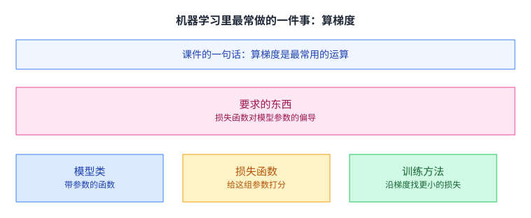

这句话决定了这门课的优先级。一次参数更新要一份梯度，一次训练迭代要一份梯度，而这个循环要跑成千上万遍。梯度这一段代码因此是整条链路上最热的一段，它慢一点、或者多占一点显存，代价都会乘以轮数被放大。

还有一个更隐蔽的影响：梯度算得准不准，不会报错。算错了的训练仍然会跑下去，损失曲线看起来也像是那么回事，只是模型最终差一截。这类「静默失败」是后面反复出现的主题。

所以这一讲要解决两件事：怎么把梯度算得又快又准，以及为什么今天所有框架（PyTorch、TensorFlow、JAX）都选了同一种做法。

## 求梯度有三条路

课件的引言把数值微分与符号微分分别讲了一页，本讲把三条路线摆在一起看，方便比较。

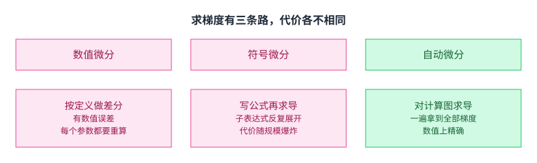

数值微分按定义做差分，符号微分把公式展开再求导，[[term:automatic-differentiation]] 则是对计算图本身求导。课件先把前两条的问题讲清楚，再引出第三条。

三条路的差别可以用一句话概括：数值微分不推导、只测量；符号微分推导到底、再把式子交给计算机；自动微分只推导「一步」，把剩下的事交给图的遍历。

先记住它们各自的位置。数值微分不需要任何数学知识，但只在测试里有价值；符号微分数学上没问题，工程量会爆炸；自动微分两边都要，它是这一讲的主角。

顺带一句：[[term:gradient-descent]] 每一步都要一份完整梯度，所以「一遍拿到全部梯度」这件事本身就是个硬指标，也是后面选择走法的唯一依据。

## 数值微分：能用，但只适合当尺子

课件对数值微分的评价是两点：按定义直接算，是一种数值上更精确的近似方法；但它带数值误差，算起来也慢。

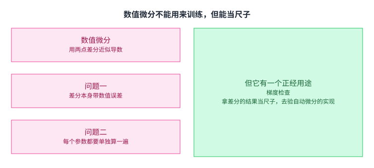

先说那两个问题。差分是用两个靠得很近的点估计斜率，两个点的函数值各自带浮点舍入误差，相减之后误差会被放大。于是步长成了一个两难：取大一点，截断误差变大；取小一点，舍入误差变大。中间只有一个很窄的窗口，而这个窗口的大小还取决于函数本身的尺度。

「慢」则更直接：它每求一个参数的偏导，就要多算一遍函数。有几百万个参数，就要多算几百万遍。

所以它不能用来训练。

但它有一个正经用途，课件专门用一页讲：拿差分的结果当尺子，去验自动微分的实现对不对。做法是从单位球里取一个方向向量，看自动微分给出的方向导数与差分结果对不对得上。这在单元测试里非常有用，原因正是上一节说的那个特点：自动微分的实现写错了通常不会崩，只会算出一个看起来合理的错值。

## 符号微分：公式是对的，代价是重复计算

第二条路是把公式写出来，按和、积与链式法则求导。课件在这里只提了一个问题：朴素做法会做很多无用功。

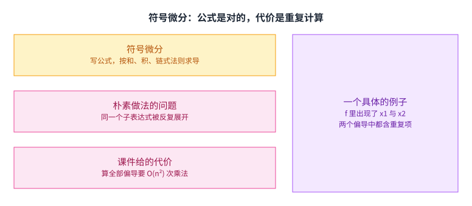

问题出在子表达式的重复。求导过程中同一段式子会在不同的偏导里被反复展开，于是计算量随输入个数的平方增长。课件给的量级是 `Cost n(n − 2) multiplies to compute all partial gradients`，也就是算全部偏导要 n(n−2) 次乘法。

课件的例子是一段 n 个输入的连乘：f 等于 θ1 到 θn 全部乘起来，而对第 k 个输入的偏导等于除它之外其余 n−1 个的乘积。看清这个式子就明白重复在哪：每一个偏导都要把几乎同一串乘法重做一遍，而 n 个偏导加起来就是 n(n−2) 次。真正省事的做法是把中间结果记下来复用，而「记下来复用」这件事，恰好就是计算图要做的事。

这个量级为什么致命。课件只说了输入个数 n 很大；放到现实里，一个模型的参数有几百万到几千亿个（这个量级是我们的参照，课件没有给具体数字），平方之后完全不可接受。符号微分的数学没有错，它输在工程量上。

还有一层麻烦在表达式本身。符号求导的输出是一段越来越长的公式，而不是一串可执行的步骤。公式长到某个程度，人就看不懂，编译器也不好优化它。自动微分不产出公式，它产出的是一张图，图是可以被程序处理的。

## 计算图：把程序写成一张图

要讲清楚第三条路，得先有一张图。课件在这里回顾了 [[term:computational-graph]]。

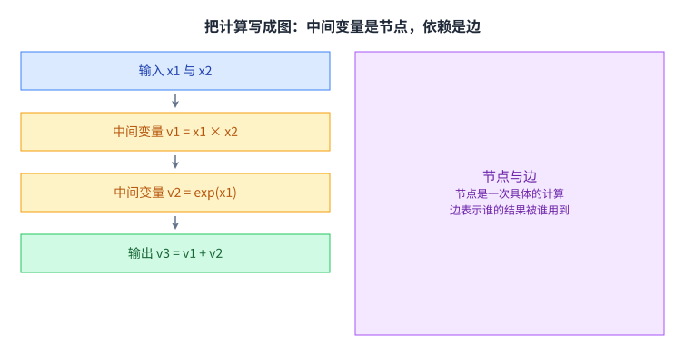

节点是一次具体的计算，边表示谁的结果被谁用到。任何一个程序只要能写成这样一张图，求导就变成了在图上的一个机械过程：对每个节点，只需要知道它的局部导数，也就是输出随输入怎么变。

这一点是整讲的枢纽。把求导拆成「每步的局部导数」加「沿边走」，就不需要为整个复合函数推一个闭式公式了。算子的作者只要为自己的算子写一份局部导数，剩下的组合由框架完成；这也解释了为什么加一个新算子时，工程量能落在很小的一个范围内。

这张图有两个方向可以走。从输入往输出走叫正向，从输出往输入走叫反向。课件接下来的两种模式，差别只在这里。

## 前向模式：把切线跟着值一起往前推

第一种走法是正向的。

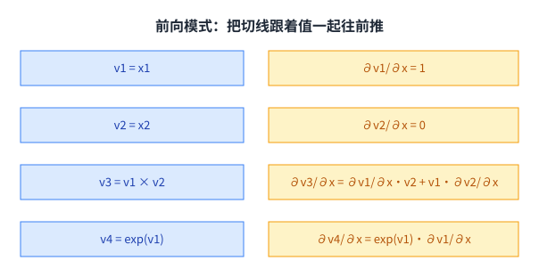

做法是给每个变量再配一个数，表示它对某个输入的偏导。两个数一起沿正向拓扑序往下走：值按原来的运算走，导数按求导法则走。

拿图里的两个例子看。加法那一行，两个输入的导数直接相加；乘法那一行，导数按乘积法则展开成两项。每一步只看自己这一个节点，这就是「局部导数加沿边走」的具体样子。

沿着一条链往下看会更清楚：每经过一个节点，导数就乘上这个节点的局部导数。整条链走完，乘起来的就是复合函数的导数。链式法则在这里没有消失，它只是被摊平到了每一步上。

一遍前向走完，你就拿到了所有中间变量对**某一个**输入的导数。

注意这里的重点在「某一个」。一遍只回答一个输入的问题，这是前向模式天生的性质，也是它后面碰壁的原因。

## 前向模式的天花板

课件紧接着把这个性质推到了尽头。

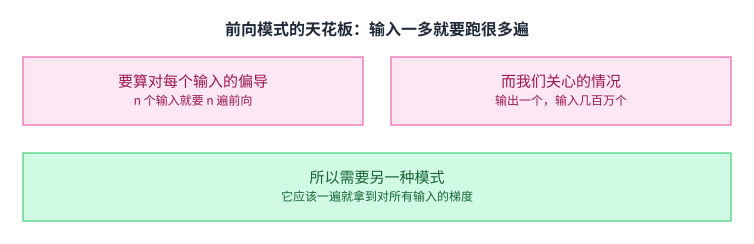

它给的判断是：对于 n 个输入的函数，要拿到对每个输入的梯度，就需要 n 遍前向。而机器学习里最常见的情况恰恰是输出只有一个（一个标量损失），输入有几百万个（模型参数）。

也就是说，前向模式的[[term:compute]]开销正比于参数个数。参数越多越贵，而参数变多正是这个领域的趋势。这条路的方向反了。

这里值得把账算清楚一点。前向模式的每一遍都不贵，问题在遍数。反向模式的每一遍贵得多（要留着中间结果），但只需要一遍。在「输出少、输入多」这个前提下，用一遍贵的换掉几百万遍便宜的，是压倒性的划算。

## 反向模式：换成伴随量，倒着走

课件换了一个定义。

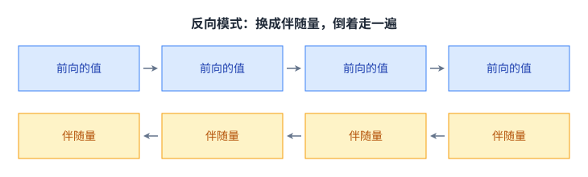

它引入的量叫伴随量：输出对这个变量的偏导。伴随量从输出出发，按逆拓扑序往输入方向推，推的规则与正向的求导法则一一对应，只是方向相反。

一遍反向走完，你拿到的是**输出对每一个变量**的导数。输出只有一个，所以这一遍就够了。前向模式的账在这里被算平了：需要几遍取决于要对几个东西求导，要对全部参数求导，那就从输出端出发走一遍。

代价立刻出现在另一个地方：反向要用到每个中间变量的值，所以这些值不能算完就扔。第 2 讲说过显存是训练的天花板，反向模式就是那块天花板的主要来源之一。后面讲内存优化的那一讲，省的就是这里。

## 一个节点被多条路径用到

反向走的时候有一个细节，课件单独推了一遍。

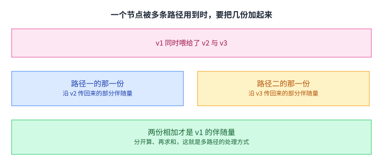

如果某个变量同时喂给了下游的两个节点，那么从这两条路径都会传回来一份导数。课件把它们叫作部分伴随量：每一对输入输出节点之间各算一份，最后把这些份加起来，才是这个变量的伴随量。

这件事看起来只是个加法，工程含义却不小。它意味着一个节点的伴随量要等它全部下游都处理完才能确定，所以反向遍历必须按逆拓扑序。它也意味着同一份内存要能被多次累加，于是「累加」这个动作在实现里要专门照顾。

把这一条与前向模式对照一下会更清楚。前向模式里，一个变量如果源自多个上游，它的导数在正向就自然地汇总了，不存在等待的问题。多路径这件事只在反向这一侧才变成一个需要专门处理的问题，这正是两种走法不对称的地方。

## 反向 AD 的算法骨架

课件用一段伪代码把上面几页收成一个循环。

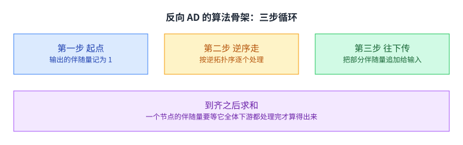

课件的骨架大致是这样：

```python
def gradient(out):
    node_to_grad = {out: [1]}          # 输出的伴随量记为 1
    for i in reverse_topo_order(out):  # 按逆拓扑序
        grad_i = sum(node_to_grad[i])  # 部分伴随量到齐后求和
        for j in inputs(i):            # 沿每一条输入边往下传
            partial = grad_i * local_derivative(i, j)
            node_to_grad[j].append(partial)   # 追加，不是覆盖
    return adjoint_of_input
```

三个细节值得留意。第一个是 `node_to_grad` 存的是一个列表，不是一个数，因为同一个节点可能收到很多份部分伴随量。第二个是 `append` 而不是赋值，赋值会把先到的那些份丢掉。第三个是求和的时机：先求和再往下传，而不是每收到一份就传一份，这在数值上更稳，也让实现更简单。

还有一个隐含条件：`reverse_topo_order` 必须能排出来。图里不能有环，这一点在第 3 讲讲循环网络时出现过，那里是靠展开消掉自环的。

把这段骨架与前面几页对上：`node_to_grad` 就是「部分伴随量的清单」，`sum` 就是多路径那一页的求和，`local_derivative` 就是每个节点自己的那份求导规则。整段代码里没有一处用到具体的数学公式，它对所有算子一视同仁。这正是自动微分与符号微分的分界：符号微分要为每一类式子写推导，自动微分只要求每个算子交出一份局部导数。

## 把反向过程也建成一张图

上面那段伪代码是「手工算」的思路。课件接着问了一个更好的问题：能不能把反向过程本身也画成一张图？

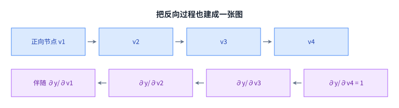

答案是能。做法是给伴随量单独建节点，与正向的节点并列放在同一张图里。课件在推导这一步时专门注了一句：输出那里的伴随量是一个恒等函数，取值为 1。

这么做的意义不只是好看。反向过程一旦也是一张图，它就可以被进一步组合、被图级优化改写，也可以再被求一次导。后面讲 [[term:kernel]] 生成与图级优化时，动的正是这两张图。

## 反向传播与反向 AD

课件把两种实现摆在一起对照。

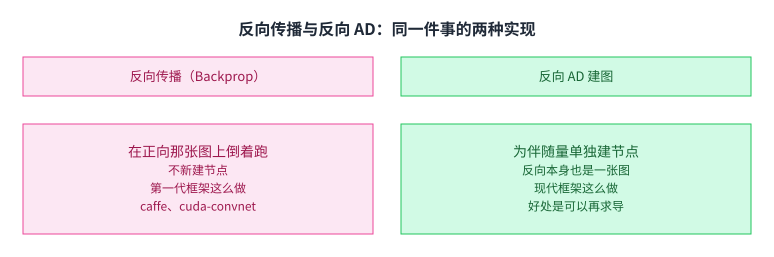

第一种叫反向传播：直接在正向那张图上倒着跑，不新建节点。课件注明它是第一代深度学习框架的做法，例子是 caffe 与 cuda-convnet。（下面这句是我们的背景补充，课件那一页只有四条要点。）那个年代的模型主要是 [[term:convolutional-neural-network]]，网络是手写的一长串层，反向也就跟着硬编码进去。

第二种是反向 AD 建图：为伴随量单独建节点，反向过程因此成为一张独立的图。课件注明这是现代 [[term:ml-framework]] 的做法。

差别落在扩展性上。前者要在框架里为每一种算子手写一条反向路径；后者只要算子能描述成图里的节点，反向就能自动推出来。后者多花的那点建图开销，换来的是不用为每个新算子改框架。

课件在这一页没有下结论，只留了一个讨论题，让读者自己比较两种做法的优劣。这个问题值得想清楚，因为后面几讲遇到的很多设计选择，都能追到这一步的分岔上。

## 张量上的伴随

前面几页一直在用标量举例。课件把定义推广到张量。

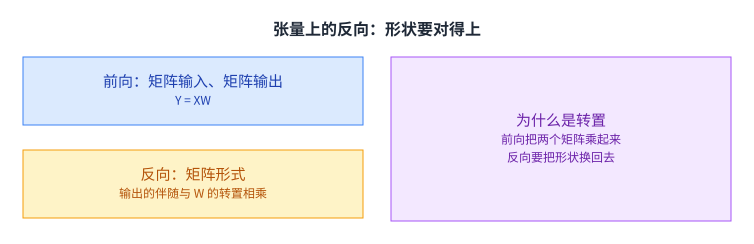

前向写成 Y = XW，也就是一次矩阵乘。（课件在那一页用的记号是 Z = XW，本讲统一写成 Y 以免与前一节的 Y 混淆。）反向要用矩阵形式：课件给出的那一条是输出的伴随乘上 W 的转置，得到 X 的伴随；W 的伴随同理，是 X 的转置乘以输出的伴随（这一条是我们的补充，课件那一页只写了 X 的伴随）。

为什么一定出现转置。因为前向把两个矩阵乘在一起时做了形状的配对，反向要把形状换回去，才能让伴随量与它对应的那个张量同形。形状对不上，加法就没法做，整个传播链会断。

实现上，这意味着每个算子除了前向计算，还要写一份「给定输出的伴随，算出输入的伴随」的规则。这份规则就是前面说的局部导数，也是第 3 讲那段框架代码里求导接口真正在做的事。

## 两个延伸话题

课件最后留了两页，各自指出一个方向。

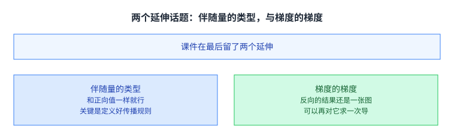

第一个是伴随量的类型。课件给的要点是：伴随量通常和正向值用同一种数据类型，只要定义好传播规则，上面那个算法原样就能用。它把这一点推广到了数据结构上，也就是说伴随量可以是元组甚至更复杂的结构，而不只是张量。课件的提醒是：不必支持最一般的形式，但支持「元组值」往往就够用了。

第二个是梯度的梯度。既然反向的结果本身还是一张计算图，那就可以把这张图继续扩展，再对它跑一遍反向模式，从而得到二阶导数。课件注明这部分是作业内容。

这一页其实在提示一件事：自动微分不是一组特例公式，而是一套可以自我嵌套的机制。理解了这一点，后面看到框架里那些看起来奇怪的接口时就不会意外。

## 读完应该能回答

1. 课件说算梯度是机器学习里最常用的运算。请说明这句话对系统设计意味着什么，以及为什么它值一整讲。
2. 数值微分有两个问题，请说明它们各自是什么，以及为什么它仍然值得保留在工具箱里。
3. 符号微分的数学没有错，请说明它的代价从哪里来，以及为什么这个代价随输入个数平方增长。
4. 前向模式与反向模式各自一遍能得到什么。请说明为什么机器学习场景下必须选反向。
5. 反向模式里，一个节点收到多份部分伴随量时该怎么处理，以及为什么不能一收到就往下传。
6. 反向传播与反向 AD 建图的差别在哪里，请从「加一个新算子要不要改框架」这个角度说明。

## 脉络回顾

第 2 讲把自动微分压成一句话，说它是「把反向的计算图自动建出来」，这一讲把那句话补成一整层。三条求导路线并排摆开之后，选谁只由一个问题决定：要对多少个输入求导。数值微分只能当尺子，符号微分的代价随输入个数平方涨，前向模式一遍只回答一个输入，而机器学习里恰好是一个损失对几百万个参数，于是反向模式拿一遍贵换掉几百万遍便宜。账留在同一处，反向要用到每个中间变量的值，那些值不能算完就扔，第 11 讲省的就是这块。末尾把反向过程本身也画成图，是为了让它能被后面的图级优化与内核生成接手。

## 溯源

- 对应：CMU 15-442 / 15-642 Machine Learning Systems，Week 3 — Automatic Differentiation（Tianqi Chen 主讲，2026-01-26）。
- 原文课件：https://mlsyscourse.org/slides/04-automatic-differentiation.pdf
- 上游许可：CC BY-NC 4.0（课程仓库根 LICENSE，19,342 B）。允许翻译与改编，须署名且不得商用。本页未转载原图与整页文字，配图全部自绘。
- 课件给的伪代码按原结构重排并加上中文注释，只用于说明反向传播的遍历顺序与求和时机。
- 本讲取材范围有三块。第一块是三种求导方式的对照，包括数值微分的两个问题与梯度检查的用途，以及符号微分的平方级代价。第二块是计算图与两种走法，包括计算图的定义、前向模式的定义与前向求值轨迹、前向模式「n 个输入要 n 遍」的限制、反向模式的伴随量定义与反向求值轨迹、多路径情形的部分伴随量与求和。第三块是实现与推广，包括反向 AD 的算法骨架、把反向过程建成图的做法、反向传播与反向 AD 建图的对照、张量上的矩阵形式反向、伴随量的数据类型与梯度的梯度。
- 数字与定义以课件页面为准。课件未展开的推论属于 CourseLingo 的讲解，不当作原文引用。这类推论分三组。一组是因果与判断：把「最常用的运算」读成系统设计的优先级、梯度算错会造成静默失败、差分中步长与两类误差的取舍、平方级代价在实践中为什么不可接受、反向模式用一遍贵的换掉很多遍便宜的这笔账、反向模式是显存天花板的主要来源，以及自动微分「可以自我嵌套」这一概括。一组是现实参照：真实模型的参数量级、第一代框架所处的模型形态。还有一组是记号与公式的补充：矩阵乘结果的记号由课件的 Z 改写为 Y、W 的伴随那一条式子，以及把三条路线并列比较这个安排本身。
