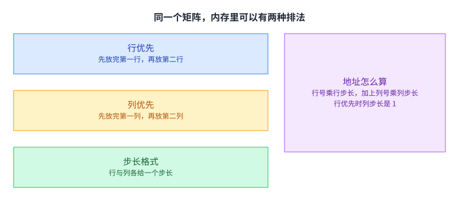
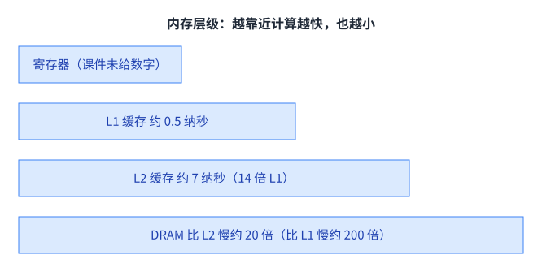
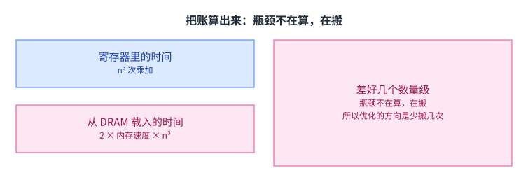
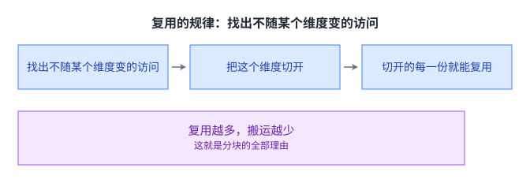
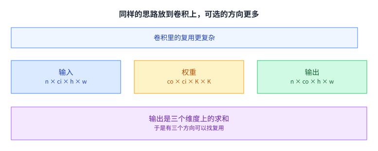

+++
title = "优化线性代数：硬件加速"
lecture = 5
slug = "optimizing-linear-algebra"
status = "draft"
source_kind = "slides"
source_url = "https://mlsyscourse.org/slides/05-hardware-acceleration.pdf"
source_title = "Week 3: Optimizing Linear Algebra（Tianqi Chen 主讲，2026-01-28）"
output_mode = "explanation"
+++

> 来源课程：Carnegie Mellon University 15-442 / 15-642 Machine Learning Systems（Tianqi Chen、Zhihao Jia）；
> 对应讲次：Week 3 — Optimizing Linear Algbera（Tianqi Chen 主讲，2026-01-28，第三教学周）；
> 原文课件：https://mlsyscourse.org/slides/05-hardware-acceleration.pdf ；
> 上游许可：CC BY-NC 4.0（课程仓库根 LICENSE）—— 允许翻译与改编，须署名、且不得商用；
> 本文由 CourseLingo 原创撰写：按课件的推进顺序用中文重新讲解，关键定义处给出英文原文短引，配图为自绘 SVG，未转载原图与整页文字；本文非官方材料，CourseLingo 与 CMU 及本课程教学团队无隶属关系；如与原文有出入，以原文为准。

## 这一讲要解决什么

前面几讲一直停在高层次：你写的是张量、算子、计算图。这一讲要解决的是这些描述落到裸机之后，怎么才能跑得快。

课件用一行代码点题：参数更新那一步写成 `w = w - lr * grad`。在高层次看，它只是一次减法；落到机器上，它要读三块数据、算一次乘加、再写回去，而这几步的开销差别极大。

课件把这一层标成 hardware [[term:kernel]] acceleration。它先问了一个问题：在你的程序上，你能做哪些事让它更快，无论是在 CUDA、x86 还是别的后端上。

这一讲要解决的就是这个问题。它先给三个通用的手段，再用矩阵乘做一次完整的案例研究。之所以先讲通用的三个，是因为它们与算法无关，换了硬件、换了算子都还在。

看这一讲时可以先记住一件事：[[term:hardware-accelerator]] 再强，也得有人把数据喂到它嘴边。后面所有的技巧，本质上都在解决喂数据这件事，而这件事又和这门课反复提到的 [[term:machine-learning-system]] 的整体视角有关：单看算子，它是算得动的；放到整条链路里，它常常在等数据。

## 向量化：一条指令处理多个数

第一个手段是向量化。

课件的例子是两段数组相加，长度 256。标量写法循环 256 次，每次算一个加法；向量写法把四个数打包成一条指令，循环 64 次，每次算四个加法。代码的形状几乎没变，只是循环体里从「一个数」换成了「一组数」。

它有一个硬条件，课件专门写了出来：这三块内存都要按 128 位对齐。为什么。因为向量指令是把连续的一段内存一次搬进寄存器，如果起点没有落在那个宽度的边界上，硬件就没法用一条指令读完。

对齐这件事有个副作用：它把内存布局从「无所谓」变成了「有所谓」。下一节讲的数据布局，很大一部分就是被这件事推出来的。

## 数据布局与步长

第二个手段是决定数据在内存里怎么排。课件先问了一句：一个矩阵在内存里该怎么存。

最直接的两种叫行优先与列优先。行优先是先放完第一行再放第二行，列优先反过来。课件给出的地址公式是：行优先时，第 i 行第 j 列的元素在 `i × A.shape[1] + j` 的位置，也就是行号乘列数再加列号；列优先时两个下标调换，变成 `j × A.shape[0] + i`。

比这两种更一般的写法是步长格式：给行与列各存一个步长，元素的地址就是行号乘行步长，加上列号乘列步长。行优先与列优先只是两组具体步长取值而已。

[[term:ml-framework]] 里到处是这套表示，原因就在它足够一般：矩阵的形状可以变、起点可以挪、行列可以交换，而表示本身只有两个数字。

## 步长格式：变换不用搬数据，代价是访问不连续

这套表示好在哪，课件列了三条。

切片只改起点与形状，转置只交换两个步长，广播则把某个步长设成 0。三种常见操作都只动那两个数字，一个字节的数据都不用搬。这在工程上很值钱：一个几百兆的矩阵做转置，零拷贝几乎是瞬间完成的。

代价落在另一边，课件也列了三条：内存访问不再连续；向量化因此更难做；很多线性代数运算要先把它压实成连续的数组才能算。

这里的取舍很典型。省下的是搬运，付出的是访问效率，而访问效率正是上一节刚说过的对齐问题。真实框架的做法通常是两头都要：平时保持步长格式不动数据，真到要算的时候再压实一次。

## 并行化：把循环切给多个线程

第三个手段是把循环切开。

课件的例子在循环前面加一行编译指令，计算就被分配到多个线程上执行。这一页用的是 OpenMP 的写法：`#pragma omp parallel for`，一行指令就把下面这个循环交给多个线程。四个线程各领四分之一的区间，同时开算。

它同样带着前提，而且这个前提比对齐更要紧：切出来的各段必须互不重叠。重叠了就会有两个线程同时写同一个位置，结果取决于谁先谁后，程序会变得时对时错。

这类手段换来的是[[term:throughput]]：同一段时间里完成的活变多了，而其中任何一件活花的时间并没有变短。反过来，如果目标是把某一件活做快，切线程通常帮不上忙，甚至因为协调开销而更慢。后面讲并行化的几讲会反复回到这个区分上。

这个条件在后面的并行化几讲里会被反复提起。到那时切的不再是循环，而是数据与模型，但「分出来的部分要能各自算各自的」这条要求一直没变。

## 案例的起点：朴素矩阵乘

三个通用手段讲完，课件转入案例研究。案例是矩阵乘 C 等于 A 乘 B 的转置。

朴素写法是三层循环，逐项累加，代价是 n³ 次乘加。课件马上把它引向了另一个方向：问题不在乘加次数，而在每次乘加的数据从哪里来。

这句话是整讲的转折。n³ 次乘加是算法层面的固定成本，谁也躲不掉；但从内存里搬多少次数据，是可以用工程手段改的。后面几页都在算这笔搬运的账。

## 内存层级：越靠近计算越快，也越小

要算这笔账，先得知道数据的几层存放。课件引的是那组经典的延迟数字。

课件引的是那组经典的延迟数字，出处就写在页上：Latency numbers every programmer should know。三个数字与三条倍数是：L1 缓存约 0.5 纳秒；L2 缓存约 7 纳秒，比 L1 慢约 14 倍；再往外是 DRAM，比 L2 慢约 20 倍、比 L1 慢约 200 倍。课件还标了寄存器与 CPU 线程两级，但没有给具体数字。

这里要交代一句归属。课件这一页的文字层没有保住「哪一级对哪个数」的版面绑定，上面这组归属是我们用课件同时给出的三条倍数反推出来的：0.5 与 7 正好相差 14 倍，与「L2 比 L1 慢 14 倍」对上；而 0.5 的 200 倍与 7 的 20 倍都指向 100 纳秒附近，所以最外面那一级取这个量级。这与那组公开的经典数字一致。

这几级之间的差距不是线性的，是数量级的。于是「数据现在在哪一级」这件事，比「算了多少次」更能决定程序的快慢。[[term:latency]] 在这里第一次成为一个可以量化、也可以被利用的东西。

课件把这张图放在案例研究的开头，用意是给后面所有的分析提供一把尺子。[[term:compute]] 只是机器的能力，而这份能力能不能兑现，取决于数据有没有按时送到。一块 GPU 上每秒能做的浮点运算是一个很大的数，但它的显存带宽是一个相对小得多的数，两个数相除得到的比值，决定了这段代码到底受哪一边限制。后面讲 GEMM 与内核生成时会一直用到这个比值。

容量与速度反向这件事在每一级都成立：寄存器最快但只有几百个，DRAM 最慢但有几个 GB。所以可行的做法不是「把数据都放进寄存器」，而是「让数据在被用到的那段时间里尽量待在快的那一级」。

## 把账算出来：瓶颈不在算，在搬

有了层级数字，课件把朴素写法的开销拆成两笔。

第一笔是寄存器里的运算：n³ 次乘加，这部分很快。第二笔是从 DRAM 载入数据：每一次乘加都要取两个数，于是载入的次数也是 n³ 量级（严格说是 2n³ 次），再乘上每次访问内存的延迟。

两笔账一比就清楚了：运算那笔是纳秒级的，搬运那笔是几十到几百纳秒级的，而次数还是同一个量级。差的这几个数量级，就是全部优化空间所在。

顺带一句：如果按次数算，这台机器的[[term:compute]]能力其实是够的；它只是在挨饿。后面所有分块技巧的目标，都是把这份饥饿补上。

## 第一层：寄存器分块

课件给的第一种办法是寄存器分块。

做法是把三个维度各切一刀：沿 i 切出 v1，沿 j 切出 v2，沿 k 切出 v3。切完之后，循环的结构没变，但循环体每次算的是一小块 C，而不是一个元素。

好处立刻出现：这一小块里的 a 被复用了 v2 次，b 被复用了 v1 次。也就是说，同一个数据一旦被读进寄存器，就可以服务很多次乘加，不必每算一次就回内存里取一次。

课件的量级是：载入次数按倍数降下来（a 的载入次数降到 n³ 除以 v2）。乘加次数本身不随分块改变，仍是 n³；降的是搬运。块的尺寸越大，省得越多，上限由寄存器有多少个决定。

## 第二层：缓存行分块

只做寄存器分块还不够，因为寄存器太小，装不下一次要用的完整数据。课件接着加了第二层。

外层分块面向缓存：把 A 的一行和 B 的一行整段放进 L1，让接下来的一轮计算都在这段里取数。内层分块则是在放进来的一小块里再做一次寄存器分块，也就是上一节那一步。

课件的顺序值得留意：它先讲寄存器分块，再回头讲缓存分块，最后说明内层可以再套一层寄存器分块。这个嵌套结构不是凑出来的，它对应的是真实的内存层级：每一级都要有自己的一块，数据才会一级一级地往下走，而不是每次都从最外面重新取。

只做一层会怎样。只做寄存器分块，数据还是要反复从 DRAM 里取，缓存没被利用；只做缓存分块，L1 里那一段数据仍然要被反复读进寄存器。两层叠起来，载入次数才真正降下来。

## 复用的规律

讲完两种分块，课件把背后的规律抽了出来。

它用矩阵乘举了一例：访问 A 的时候用到了 i 和 k，与 j 无关。既然与 j 无关，那么把 j 方向切成 v 份之后，同一份 A 就能被这 v 份依次用上，等于复用了 v 次。

这条推理可以照搬到别的算子上：先看哪个维度不参与某份数据的寻址，再把那个维度切开。切开之后每一份都能共用同一份数据，复用倍数就等于切出来的份数。

复用越多，搬运越少。这就是分块的全部理由，别的说法都是它的变体。

还有一点值得点明：切开一个维度会同时带来两件事，一件是复用，另一件是额外的一层循环。复用的收益是乘性的，额外循环的开销是加性的，所以只要块不是特别小，收益就压得住开销。真实实现里块的尺寸是调出来的：调大了寄存器装不下，调小了复用倍数不够，中间那一段才是可用的区间。

## 卷积里的复用

最后一个例子是卷积。它属于那种维度多、可复用方向也多的算子。

课件的写法是：输出是一个四维张量，它的每一项等于输入与权重在三个维度上的求和，也就是通道维与卷积核的两个空间维。输入、权重、输出各是一个四维张量。

维度越多，可以找复用的方向越多，这是好事；同时也是它难优化的原因。矩阵乘只有三个维度，分块方案数得过来；卷积有通道、批、高、宽、卷积核的高与宽，可选的分块组合多得多，哪一种最好取决于具体的形状与硬件。

还有一个区别在寻址。矩阵乘的下标都是整块的连续访问，卷积的输入窗口每滑一步就整体平移一格，相邻两个输出用到的输入块大面积重叠。这份重叠既是复用的来源，也让地址计算变复杂：不能简单地按步长线性推进，而要显式算出每一块的起点。这也是卷积内核比矩阵乘内核难写的一大原因。

这也解释了一个现象：为什么 [[term:convolutional-neural-network]] 的算子库往往比矩阵乘的库厚得多。矩阵乘只要调好几个参数，卷积要为每一种形状各准备一套。

## 读完应该能回答

1. 向量化、数据布局、并行化这三个手段，为什么课件把它们放在具体案例之前讲。
2. 向量指令要求内存对齐，请说明这条要求会怎样影响矩阵在内存里的排布方式。
3. 步长格式让切片与转置变成零拷贝，代价是什么？请举一个它反而更慢的场景。
4. 朴素矩阵乘的 n³ 次乘加是躲不掉的，请说明课件为什么说「问题不在乘加次数」。
5. 寄存器分块把乘加次数降到 n³ 除以 v2，请说明 v2 这个上界由什么决定，以及为什么还需要再加一层缓存分块。
6. 复用的规律是「找出不随某个维度变的访问，再把那个维度切开」。请用它解释卷积里有哪几个方向可以切。

## 脉络回顾

这一讲的转折可以先用一句话说完：问题不在乘加次数，而在每次乘加的数据从哪里来。前面几讲的视角一直停在张量、算子与计算图上，到这里第一次把那些描述按到裸机上。三个手段之所以排在案例之前，是因为它们与算法无关，换一块硬件、换一个算子都还在；后面的技巧都只是在回答同一件事，怎么把数据喂到算力嘴边。n³ 次乘加躲不掉，但这份计算要挨饿多久是可以改的，内存层级那组延迟数字就是量它的尺子。分块的道理由此推开，找不参与某份数据寻址的那个维度，切开它，复用倍数就是切出来的份数。第 6 讲把这条规律从 CPU 的缓存搬到 GPU 的共享内存上再讲一次。

## 溯源

- 对应：CMU 15-442 / 15-642 Machine Learning Systems，Week 3 — Optimizing Linear Algbera（Tianqi Chen 主讲，2026-01-28）。
- 原文课件：https://mlsyscourse.org/slides/05-hardware-acceleration.pdf
- 上游许可：CC BY-NC 4.0（课程仓库根 LICENSE，19,342 B）。允许翻译与改编，须署名且不得商用。本页未转载原图与整页文字，配图全部自绘。
- 本讲的例子代码按课件给出的结构重排并配上中文说明，只用于讲清向量化、并行化与分块的写法。
- 本讲取材范围有三块。第一块是三个通用手段，包括向量化的浮点四元组例子与 128 位对齐要求、行优先与列优先以及步长格式的地址公式、步长格式的三条好处与三条代价、并行化的编译指令与「各段不重叠」的前提。第二块是内存层级与开销分析，包括课件引用的那组延迟数字、基于寄存器与 DRAM 的两笔开销估算。第三块是矩阵乘的案例，包括朴素写法的三层循环、寄存器分块的三个维度与复用倍数、缓存行分块与两层嵌套、复用规律的抽取，以及卷积里输入权重输出的形状与三处求和。
- 数字与定义以课件页面为准。课件未展开的推论属于 CourseLingo 的讲解，不当作原文引用。这类推论包括：对齐要求会反过来影响内存布局的选择、零拷贝与访问效率之间的取舍在真实框架里的处理方式、并行化「各段不重叠」这条前提在后续几讲的延续、把两笔开销差几个数量级读成「算力够但挨饿」，以及卷积算子库为什么比矩阵乘库厚。
- 另外三处需要点名。一是并行化那一页只给了 `#pragma omp parallel for` 与「在多个线程上执行计算」，「四个线程各领一段、彼此不重叠」这个具体分法是我们的示意。二是内存层级那组数字的级别归属，用课件给出的三条倍数反推，理由写在正文里。三是把「不这样会怎样」写成一段后果推演的部分（例如只做一层分块会怎样），属于我们的解释。
