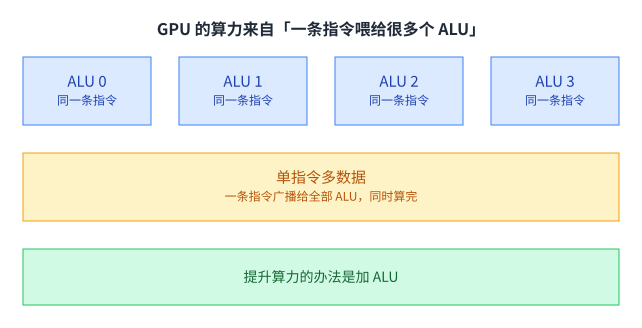
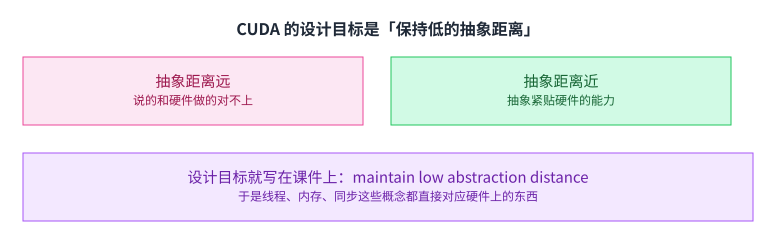
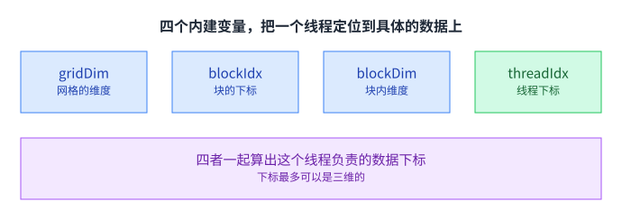
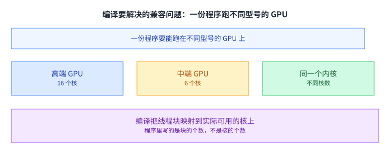

+++
title = "GPU 架构与 CUDA 编程（上）"
lecture = 6
slug = "cuda-programming-1"
status = "draft"
source_kind = "slides"
source_url = "https://mlsyscourse.org/slides/06-CUDA-programming.pdf"
source_title = "Week 4: GPU Architecture and CUDA Programming (1)（Zhihao Jia 主讲，2026-02-02）"
output_mode = "explanation"
+++

> 来源课程：Carnegie Mellon University 15-442 / 15-642 Machine Learning Systems（Tianqi Chen、Zhihao Jia）；
> 对应讲次：Week 4 — GPU Architecture and CUDA Programming (1)（Zhihao Jia 主讲，2026-02-02，第四教学周）。
> 本讲与第 7 讲共用同一份课件 `06-CUDA-programming.pdf`；按课件自己的分节页切分，本讲覆盖前四块中的前两块，与第 7 讲不重叠；
> 原文课件：https://mlsyscourse.org/slides/06-CUDA-programming.pdf ；
> 上游许可：CC BY-NC 4.0（课程仓库根 LICENSE）—— 允许翻译与改编，须署名、且不得商用；
> 本文由 CourseLingo 原创撰写：按课件的推进顺序用中文重新讲解，关键定义处给出英文原文短引，配图为自绘 SVG，未转载原图与整页文字；本文非官方材料，CourseLingo 与 CMU 及本课程教学团队无隶属关系；如与原文有出入，以原文为准。

## 这一讲要解决什么

前几讲讲的是上层：计算图、自动微分、分块。这一讲往下走到最底下那一层，讲清楚 GPU 是怎么被编程的、以及为什么它必须那样被编程。

课件的入口是一个对比：传统的处理器是「单指令单数据」，一次一条指令处理一个数据；现代 GPU 是「单指令多数据」，同一条指令被广播出去，在全部 ALU 上并行执行。

这个差别决定了两件事。一件是算力怎么涨：既然指令是共享的，那么增加算力的办法就是加 ALU，而不是把单条指令做得更复杂。另一件是编程的约束：既然几十个 ALU 共用一条指令流，那么它们就必须做同一件事，任何分歧都要付出代价。

这一讲要解决的就是这两件事的后果：CUDA 为什么长成现在这样，以及写 CUDA 程序时哪些约束是不能碰的。[[term:compute]] 在这一层不再是一个抽象数字，而是「多少条 ALU 同时收到同一条指令」。

对这门课来说，这一层是后面所有优化的地基。第 5 讲说的分块与复用，最终都要落到这里来兑现。也就是说，[[term:machine-learning-system]] 里那些看起来高层的手段，最后都要变成「哪些线程在什么时刻读哪一段内存」这样的具体安排。

## CUDA 的设计目标：抽象距离要短

课件讲 CUDA 语言时，给了一个很容易被略过的说法：设计目标是保持低的抽象距离。

抽象距离指的是语言的抽象离硬件有多远。距离远的时候，你写的一行代码在硬件上会发生什么，你猜不到；于是你没法根据硬件特性做判断，只能凭经验试。

CUDA 选择把距离压短。它的抽象刻意贴合现代 GPU 的能力与性能特征，线程、内存、同步这些概念都直接对应硬件上真实存在的东西。代价是程序里要写很多偏底层的细节，好处是性能模型是可推的。

课件也交代了它的出身：2007 年随 NVIDIA 的 Tesla 架构一起推出，定位是「给 GPU 编程用的类 C 语言」。这个定位解释了为什么它长得像 C：它没有打算另造一套编程模型，而是想让你对着硬件写代码。[[term:ml-framework]] 里那些看起来复杂的调度逻辑，最终都要翻译成这一层的代码。

## 线程的坐标

CUDA 程序里最基础的一件事，是把线程组织成有坐标的结构。

课件给了四个内建变量。`gridDim` 是整个网格的维度，`blockIdx` 是当前块在网格里的下标，`blockDim` 是块内的维度，`threadIdx` 是当前线程在块里的下标。

四者一起，就能算出这个线程该处理哪一份数据。课件特别指出下标最多可以是三维的，例子是一张 12 乘 6 的二维图配上 4 乘 3 的线程块。三维坐标不是为了好玩，而是为了让「一张二维图像」这种数据能自然地映射到线程上。

这个结构里最重要的不是坐标算法，而是分层的意义：块是可以独立调度的一整包线程，线程是块里的一份子。后面讲调度时会看到，GPU 的调度单位是块，而执行单位是线程。

## 主机与设备：两块代码、两块地址空间

CUDA 程序里有两段代码，跑在两个地方。

主机侧是一段普通的串行 C 代码，负责申请显存、把数据拷过去、启动内核、再把结果拷回来。设备侧是内核，以 SIMD 方式执行，只看得到设备内存。

课件在这里强调了一件容易踩的事：两块地址空间是分开的，设备侧访问不了主机内存，主机侧也访问不了设备内存。想搬数据，只能用显式的拷贝调用。

这个分离带来一个直接的后果：数据搬运是要花钱的，而且花得不便宜。第 5 讲讲的那些优化之所以重要，一部分就是因为这条边界的存在；后面讲显存优化时，也一直在和这条边界打交道。

## 线程数与数据规模

第二个容易踩的地方是线程数从哪来。

块的大小在程序里写死，块的个数按数据规模算出来。课件特意标了一句：SIMD 线程的数量在程序里是显式的，内核被调用的次数并不由数据集合的大小决定。

这句话的意思是：硬件不会替你决定开多少个线程，那是你写的。于是数据规模不是块大小整数倍时，多出来的那些线程要靠条件判断挡掉。如果不挡，它们会按算出来的坐标去写不属于自己的内存，写坏了还不报错。

课件用两个非整除的例子说明这一点：11 个元素配上宽度 4 的块，5 个元素配上高度 3 的块。这类余数处理在实际代码里随处可见，它是 CUDA 编程的基本功。

## 条件执行与分支的代价

既然一条指令要喂给几十个 ALU，那么「线程之间意见不一致」就成了必须处理的情况。

课件给的做法是屏蔽：条件不成立的线程不会停机，它们照常走这条指令，只是输出去被丢弃。硬件层面没有「跳过」，只有「算了但不要」。

由此引出两个术语。相干执行指同一段指令序列对所有元素都适用，这是 GPU 高效工作的必要条件；发散执行指一部分线程在做、另一部分在等，课件明确说它应当被尽量减少。

代价发生在什么时候也值得留意：分支走完之后，全部线程恢复满速。所以付出的代价集中在分支期间，而不是分支之后。这解释了后面很多优化的方向：不是消灭分支，而是让分支尽量少、尽量短、尽量让同一个 warp 里的线程走同一条路。

## 内核能看到的三种内存

内存这一侧，课件给了三类。

每线程私有的内存只有本线程能读写。每块共享的内存由块内所有线程共享，可以读写。设备全局内存对所有线程可见。

三者的快慢差别很大，[[term:latency]] 从几个周期到几百个周期不等。共享内存的位置居中，而且它是程序员可以主动使用的：你可以显式地把数据从全局内存搬进共享内存，让块内线程反复使用同一份数据。

代价是共享内存要自己管。谁什么时候写、谁什么时候读，都得你来保证顺序正确，这就是下一节要讲的同步。[[term:throughput]] 的提升往往就来自这一步：同一份数据从全局内存只读一次，然后在块内被用很多次。

这里有一个量级上的直觉值得建立起来。一次全局内存访问要等几百个周期，而一次共享内存访问只要几十个，寄存器更短。也就是说，一个线程在等一次全局读的时间里，本来可以做完几十次计算。优化的全部空间，就藏在这个比值里。

## 例子：一维卷积

课件用一个很小的例子把上面这些概念串了起来。

任务是把每个输出算成相邻三个输入的均值。版本一让每个线程直接读全局内存：算一个输出要读三个输入，相邻线程读的还有重叠，于是同一份数据被反复读。

版本二先把要用的一段读进共享内存，再在块内算。两个版本算出来的是同一件事，差别只在读了几次全局内存。

这正是第 5 讲那条复用规律在 CUDA 上的样子：把数据搬进更近的一级，让它在被淘汰之前服务尽可能多的计算。区别在于第 5 讲讲的是 CPU 上的缓存分块，这里搬的目标是共享内存，而且由程序员显式控制。

## 同步原语：共享内存带来的第一个麻烦

一旦块内线程要共享数据，顺序问题就出现了。

课件给了两种。`__syncthreads()` 会让块内所有线程都到达这一步之后才继续，相当于块内的一道栅栏。原子操作则让多个线程安全地修改同一个地址，比如浮点加法。

为什么需要同步。因为共享内存是块内共享的，谁先写完、谁后读，必须排个序。少了栅栏，读线程可能拿到还没写完的数据，程序会时对时错。这类 bug 比崩溃更难查，因为它在小规模测试里往往恰好是对的。

课件在这一页没有展开的是同步的代价：栅栏会让快线程等慢线程，于是块内的执行时间由最慢的那个线程决定。这一点在后面讲并行归约与内核优化时会变成主要话题。

## 编译与兼容

写好的程序要跑在不同型号的 GPU 上，这件事由编译处理。

课件的例子是一份程序要能跑在高端的 16 核 GPU 上，也要能跑在中端的 6 核 GPU 上。同一个内核，核数不同，编译负责把线程块映射到实际可用的核上。

这里的设计取舍值得留意。程序里写的是块的个数，不是核的个数。你描述的是「这件事该怎么切成块」，至于这些块落在几块硬件上、按什么顺序跑，交给运行时。这份灵活性是用性能上的不确定性换来的：同一份代码在不同 GPU 上的表现可能差不少，第 2 讲里那张「V100 快 30%、K80 慢 10%」的图，根子就在这里。

## 一条决定了很多事的前提

课件把一条假设单独列成一页，因为后面的很多结论都从它推出来。

这条假设是：线程块可以按任意顺序执行，块与块之间没有依赖。GPU 用一个动态调度策略把块映射到核上，顺序由它自己决定。

后果是块与块之间不能同步。如果你确实需要一个跨越所有块的同步点，唯一的办法是把计算拆成多次内核启动，用启动之间的边界来当同步。第 7 讲讲并行归约时，会看到这个限制如何直接决定算法怎么写。

顺带一句：这也是为什么 [[term:kernel]] 的启动开销必须做得很低。既然全局同步要靠它，那么每一次启动本身就不能太贵。

## 一个流多处理器里有什么

从抽象往下看一层，就是真实的执行单元。

课件给的资源上限有两项：64 个 warp 执行上下文，也就最多 2048 个线程；96 KB 共享内存。一个 warp 是 32 个线程，它们共用一条指令流。

这两个数字解释了前面很多约束。为什么块的个数可以远大于核的个数？因为每个核上能同时驻留很多个块，核满的时候其余的在排队。为什么共享内存是稀缺资源？因为它是按块分配的，一个核上驻留的块越多，每块能分到的就越少。

课件还描述了 SMM 每个时钟在做什么：从常驻的 64 个 warp 里挑几个可执行的（线程级并行），再从每个 warp 里挑一两条可执行的指令（指令级并行）。这个「挑」的动作是硬件自动做的，而它的效率取决于你写的代码给了它多少可挑的余地。

「余地」这个词值得展开。如果一个 warp 的 32 个线程都在等内存，硬件就把这个 warp 挂起，换另一个 warp 上来跑，这样算力不至于空转。所以能同时驻留的 warp 越多，硬件就越有办法把等待填满。反过来，如果常驻的 warp 很少、或者它们同时都在等同一份数据，等待就会变成真的空转。这也是后面调内核时要盯着「占用率」这个词的原因。

## 走一遍内核执行

课件花了很长一段，用一个具体的卷积内核走了一遍完整流程。

例子的参数是：每个块执行 128 个线程、分配约 520 字节共享内存，主机侧一共启动 1000 个块，目标是一块有两个 SMM 的 GPU。

流程是这样的。第一步，主机把内核送到设备。第二步，调度器把块 0 映射到核 0，为它的 128 个线程与 520 字节共享内存预留好位置。第三步，调度器继续把块往可用的位置上放，直到某个核的资源不够为止；课件在这一步标了一个具体情形：第三个块放不进去，因为共享内存不够。

第四步之后是一个循环：某个块结束，腾出它的位置，调度器立刻把下一个块放进来。整个过程里，块的执行顺序由调度器决定，程序不能依赖它。

这一段值得慢慢看，因为它解释了「块可以任意顺序执行」这条假设在硬件上是如何实现的：不是所有块同时开始，而是一批一批地轮转，每个块在哪块核上、什么时候开始，都不确定。

## 从 GTX 980 到 H100：什么没变，什么变了

课件最后把两代 GPU 放在一起。

GTX 980 是 2014 年的卡：16 个 SMM，算力约 4.6 TFLOPs，每个 SMM 最多 64 个 warp、96 KB 共享内存。到 2022 年的 H100，课件列的对照是：SMM 还是那个 SMM，每个 SMM 的 warp 数还是 64，时钟频率只从 1064 涨到 1110 MHz。

那算力是怎么涨上去的。答案是专用单元。H100 的 SMM 里多了[[term:tensor-core]]，也就是专门做矩阵乘加的电路。课件的判断指向同一个方向：通用 ALU 这一侧的规模早就撞到墙了，之后[[term:hardware-accelerator]]的进步主要来自为特定计算模式定制的单元。

这也是为什么前面几讲反复说「模型形态决定系统设计」。当算力增长的位置从通用 ALU 换到专用单元，能跑得快的就只剩那些能塞进专用单元的计算模式，模型的形状也就跟着被推着走。

## 读完应该能回答

1. 单指令多数据这种模式，为什么让「加 ALU」成为提升算力的主要办法，以及它给编程带来了什么约束。
2. 课件说 CUDA 的设计目标是保持低的抽象距离。请说明这里「距离」指的是什么，以及压短它的好处与代价各是什么。
3. 数据规模不是线程块大小的整数倍时会发生什么，请说明为什么必须自己用条件判断挡掉多出来的线程。
4. 条件不成立时，线程是真的停下来了吗？请说明硬件实际做了什么，以及代价发生在哪一段时间里。
5. 块与块之间为什么不能同步，以及需要全局同步时课件给的解法是什么。
6. 从 GTX 980 到 H100，SMM 的结构几乎没变而算力涨了很多，请说明涨的部分来自哪里，以及它对模型设计意味着什么。

## 溯源

- 对应：CMU 15-442 / 15-642 Machine Learning Systems，Week 4 — GPU Architecture and CUDA Programming (1)（Zhihao Jia 主讲，2026-02-02）。
- 原文课件：https://mlsyscourse.org/slides/06-CUDA-programming.pdf
- 上游许可：CC BY-NC 4.0（课程仓库根 LICENSE，19,342 B）。允许翻译与改编，须署名且不得商用。本页未转载原图与整页文字，配图全部自绘。
- 与第 7 讲的切分依据是课件自己的分节页。课件的 outline 把内容分成四块：CUDA 编程抽象、GPU 架构、案例一矩阵乘、案例二并行归约。本讲覆盖前两块，第 7 讲覆盖后两块，两讲不重叠。
- 课件里内核执行那一段原本是同一页幻灯片的九步动画。本讲把它合并成一节与一张四步图，而不是逐页展开，以免篇幅被这一处动画撑开。
- 本讲取材范围分四块。一是执行模型：单指令单数据与单指令多数据的对比、相干与发散两个术语、条件执行的屏蔽做法。二是编程抽象：CUDA 语言的出现年份与设计目标、四个内建变量与三维线程坐标、主机与设备代码的分离与两块地址空间、线程数的显式性与余数处理。三是内存与同步：CUDA 的三类设备内存、一维卷积的两版实现、`__syncthreads()` 与原子操作、编译对不同 GPU 型号的兼容。四是硬件：线程块无依赖这条核心假设、SMM 的两项资源上限与每个时钟的调度动作、内核执行的四个步骤、GTX 980 与 H100 的对照。
- 数字与定义以课件页面为准。课件未展开的推论属于 CourseLingo 的讲解，不当作原文引用。这类推论包括：抽象距离与性能可推性之间的关系、数据搬运成本与第 5 讲优化的关联、栅栏的代价由最慢线程决定、内核启动开销必须低是因为它承担全局同步、把「块按任意顺序执行」读成调度的不确定性、以及把算力增长落在专用单元这件事与模型形态联系起来。此外，本讲与前后讲次的对应关系属于我们的编排。