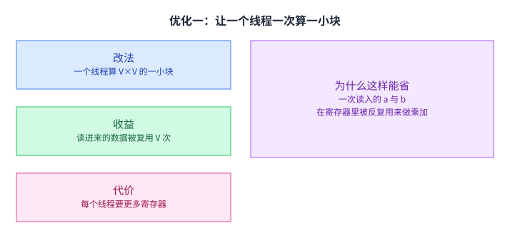
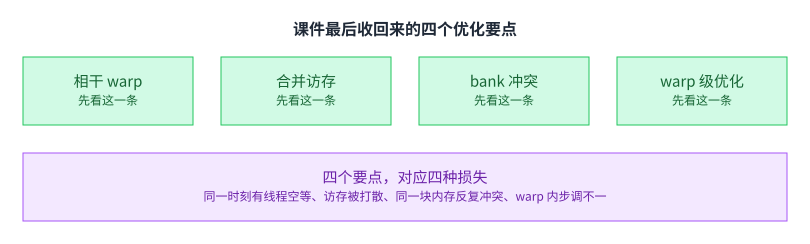

+++
title = "GPU 架构与 CUDA 编程（下）"
lecture = 7
slug = "cuda-programming-2"
status = "draft"
source_kind = "slides"
source_url = "https://mlsyscourse.org/slides/06-CUDA-programming.pdf"
source_title = "Week 4: GPU Architecture and CUDA Programming (2)（Zhihao Jia 主讲，2026-02-04）"
output_mode = "explanation"
+++

> 来源课程：Carnegie Mellon University 15-442 / 15-642 Machine Learning Systems（Tianqi Chen、Zhihao Jia）；
> 对应讲次：Week 4 — GPU Architecture and CUDA Programming (2)（Zhihao Jia 主讲，2026-02-04，第四教学周）。
> 本讲与第 6 讲共用同一份课件 `06-CUDA-programming.pdf`；按课件自己的分节页切分，本讲覆盖后两块案例研究，与第 6 讲不重叠；
> 原文课件：https://mlsyscourse.org/slides/06-CUDA-programming.pdf ；
> 上游许可：CC BY-NC 4.0（课程仓库根 LICENSE）—— 允许翻译与改编，须署名、且不得商用；
> 本文由 CourseLingo 原创撰写：按课件的推进顺序用中文重新讲解，关键定义处给出英文原文短引，配图为自绘 SVG，未转载原图与整页文字；本文非官方材料，CourseLingo 与 CMU 及本课程教学团队无隶属关系；如与原文有出入，以原文为准。

## 这一讲要解决什么

第 6 讲把 CUDA 的抽象与硬件讲清楚了。这一讲换一种讲法：不再逐条列概念，而是拿两个真实内核从头改到尾，看每一步改动换来了什么。

课件选的两个案例是矩阵乘与并行归约。它们不是随便挑的：矩阵乘是这一层最贵的操作，归约是很多算子共同的收尾步骤。把它们改好，等于把这一层最常见的两类开销都摸过一遍。

这一讲要解决的就是「怎么把第一版改成快版」这件事，而且要改得能说出理由：每一处改动对应哪一种损失，不这么改会损失多少。[[term:kernel]] 优化不是玄学，它有账可算。

## 优化一：让一个线程一次算一小块

最直白的矩阵乘写法，是让每个线程负责输出矩阵的一个元素。

这件事贵在哪。算一个输出元素，要读输入矩阵的一整行与另一整个矩阵的一整列，而相邻线程读的东西大量重叠。同一份数据被反复从全局内存取出来，取了又扔。

课件的第一个优化就是改这件事。

做法是把每个线程负责的输出从「一个元素」改成「一个 V 乘 V 的小方阵」。改完之后，读进来的 a 与 b 在寄存器里被反复用来做乘加，一次读入服务 V 次计算。

课件在这一页只给了三个访存量公式，没有提寄存器。代价要从代码里读：`float c[V][V]` 这个声明说明每个线程要占 V² 个寄存器，而寄存器是有限的，V 取大了会挤掉别的线程，反而让常驻的 warp 变少（下面这半句是我们把 V 与常驻 warp 数联系起来的推论，课件没有展开）。这个尺寸是要调的，不是越大越好。

顺带把两处复用的来源分清楚：寄存器分块复用是「同一个线程把读进来的值用很多次」，共享内存分块复用是「同一个块里的不同线程共用一份数据」。前者省的是寄存器与全局内存之间的往返，后者省的是全局内存与共享内存之间的往返。

## 优化二：再把块搬到共享内存

只做寄存器分块还不够，因为寄存器装不下一次要用的完整数据，线程还是得频繁回全局内存取。

课件给的第二层是共享内存分块。外层把 A 与 B 的一块搬进共享内存，块内所有线程共用这一份；内层让每个线程在共享内存里再取自己需要的那几条，用寄存器算自己的小方阵。

两层叠起来的效果是：一份数据从全局内存只读一次，然后在共享内存里被块内线程用很多次，再在寄存器里被复用 V 次。这和第 5 讲那条复用规律是同一件事，只是这次两级存储都由你显式安排。

## 协作加载

把一块数据搬进共享内存，这件事本身也要分给线程做。

课件在这一页只给了标题与代码，没有写理由。不难看出：一个线程搬一整块要太久，所以把这一块均分给块内所有线程，每个线程搬一份（这句理由是我们的推断）。分法是把这一块按元素编号摊平，用扁平的元素序号去取模，这样每个线程拿到的量差不多。

搬完之后必须同步一次，也就是第 6 讲讲的 `__syncthreads()`。少了这一步，有的线程会读到还没写好的数据，程序会时对时错。

这三步合起来就是「协作加载」：均分、各搬、同步。它在后面讲内核生成时会反复出现，是分块写法的固定套路。

均分这一步有个细节值得留意。共享内存里要装的那一块通常是二维的，而线程的编号是一维的。所以代码里会先算出一个扁平的元素序号，再用行宽把序号拆回两个坐标。课件给的写法是：第 j 个元素的行号等于序号除以块宽，列号等于序号对块宽取余。这类「一维编号换二维坐标」的算术在 CUDA 里随处可见，写错了不会报错，只会让某个位置的数据一直是错的。

## 案例二：并行归约

第二个案例换了一个任务：把一个很大的数组压成一个数。

课件说它是很多机器学习系统算子的公共原语，并点了两个名字：`normalization` 与 `softmax`，后面还跟了一个 `etc`。（下面这两条是我们就这两个算子各自补的解读：归一化要先求均值与方差，softmax 要先求指数和。课件在这一页没有写这一步。求最值也是归约的常见用法之一，不过课件的这一串名字里没有写它。）

块内的做法是树形归约：第一步让相邻两个数相加，参与的数减半；第二步再减半；如此下去，直到只剩一个数。这样每一轮并行度都很高，而不是让一个线程从头加到尾。

## 难点不在算法，在没有全局同步

归约的算法本身很简单，课件把难点放到了别处。

树形归约只能在一个块内做。可是数组往往比一个块能装下的大得多，你需要跨块地把各块的结果再合起来，而那需要一个横跨所有线程块的同步点。[[term:kernel]] 里没有这种同步。

课件解释了为什么硬件不做这件事。一是为高核数的 GPU 做全局同步电路，成本很高；二是一个更硬的理由：如果线程块数超过「同时能驻留的块数」，先开始的块就会一直等后开始的块，而后者根本还没被调度上来，程序直接死锁。

这里的因果值得停一下。死锁不是实现不好，而是「块可以任意顺序执行」这条假设的直接推论。既然顺序不确定，那么任何「等全部块到位」的写法都可能永远等不到。所以这不是一个可以被优化掉的限制，而是一条必须绕开的边界。

## 解法：用内核启动当同步点

既然块之间不能同步，那就把计算拆开，让同步发生在内核之间。

课件的解法是内核分解：把归约拆成多次内核启动，每一级处理上一级的结果，直到剩一个数。每一次内核启动的边界，天然就是一个全局同步点，因为后一次启动必须等前一次全部结束。

课件特意补了一句：每一级的代码是同一份，只是数据规模变小。这一点让实现很省事，也解释了为什么这类写法在框架里到处都是。

它还说了一句看起来矛盾的话：内核启动的软硬件开销都很低。为什么强调这个。因为如果你打算用启动当同步，那么启动就不能贵；否则同步的代价会盖过并行带来的好处。第 6 讲说内核启动开销必须低，理由就在这里。[[term:ml-framework]] 里那些「把算子切成多段」的调度，用的正是这件工具。

这个解法还有一个副作用值得留意：它把「一次算完」变成了「多趟走完」，每一趟都要把中间结果写回全局内存、下一趟再读出来。也就是说，用同步换来了额外的数据搬运。当级数很多、每级的数据又很小的时候，这些搬运本身就可能成为新的瓶颈。所以拆几级也是一个要权衡的决定，不是越多越好。

## 版本一：交错寻址，问题出在发散

拆好之后，块内那一层怎么写，课件在这一簇里给了三段代码，逐版改进。这里要说明一处容易看漏的地方：课件把其中两段都标成了 Version 2，所以「两个版本」其实是「三段代码、两个编号」。

版本一叫交错寻址：每一轮的步长翻倍，参与的条件是线程下标能被两倍步长整除。上一轮算出来的结果，被隔开一段的两两相加。

它能算出正确答案，但有一个毛病：参与条件只对一部分线程成立，于是在同一个 warp 里，一部分线程在做、另一部分在等。这就是第 6 讲讲过的发散执行。

发散为什么贵。因为 warp 里的 32 个线程共用一条指令流，只要有一个线程还要走这条指令，整个 warp 就得陪着走一遍，其余的线程只是在浪费电。所以发散不是「慢一点」，而是把并行度直接砍掉了。[[term:throughput]] 的损失就出在这里。

## 版本二：跨步索引，发散消失

课件的第二版换了下标算法。

它不再用「下标能被整除」当条件，而是让线程下标乘以两倍步长得到要访问的位置。课件把这一版标为 non-divergent：判断条件不再是交替的真假，而是随线程下标单调，下标小的先做、下标大的先不做。同一个 warp 里不再交替真假，发散就消除了。

但这一步只解决了发散，没有解决访存。按两倍步长取址，相邻线程拿到的位置仍然相差 2s，所以访问还是不连续的。课件后面还有一段，把循环反转过来、直接用线程下标取址，相邻线程这才真正访问相邻地址。两件事是两步，不是一步。

到这里性能已经好了不少，但课件说不止于此。它接着指出另一个维度的问题：就算没有发散，访存本身也可能是低效的。

## 另一个维度：合并访存

上面那段没做的事，由第三段代码补齐。

课件给了合并访存的定义：多个 GPU 线程访问连续的内存地址。

好处很直接：连续访问时，一次内存事务就能服务整个 warp 的请求，显存带宽才用得起来。反过来，如果每个线程各跳一段、访问的位置彼此隔得很远，那么一次事务只能服务少数几个线程，事务数成倍增加，带宽被浪费掉。

这条定义和第 5 讲的内存层级是同一件事的两面。第 5 讲讲的是「数据放在哪一级」，这里讲的是「同一级里的数据怎么取才划算」。这里要看的不是单个访问的延迟，而是一批访问合起来要占多少次内存事务，也就是带宽用得好不好。

## 回到两个版本：两处差别

把两个版本放在一起看，差别不止一处。

版本一的交错寻址让相邻线程访问的位置隔得很远，所以除了发散，它的访存也是次优的。版本二的顺序寻址让相邻线程访问相邻位置，既不发散，又是完全合并的。

这两处差别值得分开记。发散影响的是「有多少线程在有效工作」，合并影响的是「这批工作要占多少次内存事务」。一个关乎计算单元的利用率，一个关乎内存带宽的利用率。两个数字都可以被改善，而且改善的手段不同。

顺带一句：这两个问题在别的并行形式上都会换个名字再出现。[[term:compute]] 与带宽这两个瓶颈，几乎贯穿这门课的每一讲。

再补一句这两个版本的层次关系。消除发散是「让该工作的线程都在工作」，属于利用率问题；改成合并访存是「让这批工作少占几次事务」，属于带宽问题。前者不解决，算力白买；后者不解决，带宽白买。两个都做完了，才轮到讨论更高层的分块策略。

## 课件收回来的五个要点

这一讲最后，课件把整份内容收成五个词。

相干 warp、合并访存、共享内存 bank 冲突、warp 级优化，以及张量核心。前两个这一讲已经讲透；第三、第四项只在收尾提了一句，属于留给读者的钩子；第五项是硬件单元，第 6 讲讲 H100 时已经说过它为什么出现。

它们共同的地方是：前四个词对应四种损失。同一时刻有线程空等、访存被打散、同一块内存反复冲突、warp 内步调不一。写 CUDA 内核时的检查顺序，基本上就是把这四条挨个问一遍。第五项不属于「损失」，它属于「硬件给了你什么可以用」。

课件的这份收束也解释了这门课为什么要花两讲讲这么底层的东西。上面几讲讲的所有优化，最后都要在这一层兑现；而这一层的损失是具体可数的，不是「大概慢一点」这种模糊判断。[[term:hardware-accelerator]] 的能力再强，能被用上多少，取决于这一段代码有没有把这四种损失压下去。[[term:machine-learning-system]] 的端到端表现，就是从这些细节里累加出来的。

还有一层：这四种损失之间会互相拉扯。提高寄存器分块的 V 会减少访存次数，但会挤掉常驻的 warp，让线程级并行下降；把块做大能让共享内存复用更多，但每个核上能驻留的块就少了。所以调内核很少有「全都调好」的解法，通常是在几个数之间找一组让总时间最短的组合。这也解释了为什么内核生成那一层最终走向自动搜索，而不是靠人把每个参数试一遍。[[term:end-to-end]] 的最优，不等于每个局部的最优。

## 读完应该能回答

1. 最直白的矩阵乘写法贵在哪里。请说明「每个元素要读一整行与一整列」这句话里，重复的部分具体是什么。
2. 寄存器分块把复用倍数提高到了 V，请说明 V 的上界由什么决定，以及为什么还要再加一层共享内存分块。
3. 协作加载的三个步骤是什么，其中哪一步省掉之后程序不会崩、但会时对时错。
4. 课件为什么说 CUDA 不做全局同步。请给出两条理由，并说明哪一条是硬约束。
5. 内核分解为什么能绕开前一条限制，以及它成立的前提是什么。
6. 版本一的两个问题分别是什么，版本二分别是怎么解决的。请说明它们影响的指标不是同一个。

## 溯源

- 对应：CMU 15-442 / 15-642 Machine Learning Systems，Week 4 — GPU Architecture and CUDA Programming (2)（Zhihao Jia 主讲，2026-02-04）。
- 原文课件：https://mlsyscourse.org/slides/06-CUDA-programming.pdf
- 上游许可：CC BY-NC 4.0（课程仓库根 LICENSE，19,342 B）。允许翻译与改编，须署名且不得商用。本页未转载原图与整页文字，配图全部自绘。
- 与第 6 讲的切分依据是课件自己的分节页：本讲取材落在 p48 到 p70，第 6 讲落在 p1 到 p47，覆盖范围不重叠。两讲之间有三处交叉。一处方向相反：本讲范围最后一页（Recap）在总结整份课件，包含第 6 讲范围的「CUDA programming 与 GPU architecture」和「张量核心」，所以那一页跨两讲。另两处是本讲引用第 6 讲范围的内容（讲块之间不能同步时引用到「内核启动承担全局同步」、讲发散时引用到「Divergent execution」），都已在正文标明。
- 本讲取材范围分五块。一是矩阵乘：朴素实现与「一线程一元素」的代价、线程级寄存器分块与复用倍数、共享内存分块与两级嵌套、协作加载的分工与同步。二是在归约这一侧的难点：CUDA 没有全局同步的两条理由（硬件成本与死锁）。三是它的解法：内核分解、每一级代码相同、内核启动开销低这一前提。四是三段内核代码与合并访存的定义与对比。五是收尾的五个平级要点与「四种损失」归纳。
- 数字与定义以课件页面为准。课件未展开的推论属于 CourseLingo 的讲解，不当作原文引用。这类推论包括：把死锁读成「块可任意顺序执行」的直接推论、把发散读成并行度被砍掉、把 V 的取值与常驻 warp 数联系起来、把「两个问题影响不同指标」这一区分写出来，以及把前四个要点归纳成「四种损失」。此外，本讲与前后讲次的对应关系属于我们的编排。