+++
title = "Transformer、注意力与优化"
lecture = 8
slug = "transformer-attention"
status = "draft"
source_kind = "slides"
source_url = "https://mlsyscourse.org/slides/07-transformers-attention.pdf"
source_title = "Week 5: Case study: Transformer, Attention, Optimizations（Zhihao Jia 主讲，2026-02-09）"
output_mode = "explanation"
+++

> 来源课程：Carnegie Mellon University 15-442 / 15-642 Machine Learning Systems（Tianqi Chen、Zhihao Jia）；
> 对应讲次：Week 5 — Case study: Transformer, Attention, Optimizations（Zhihao Jia 主讲，2026-02-09，第五教学周）；
> 原文课件：https://mlsyscourse.org/slides/07-transformers-attention.pdf ；
> 上游许可：CC BY-NC 4.0（课程仓库根 LICENSE）—— 允许翻译与改编，须署名、且不得商用；
> 本文由 CourseLingo 原创撰写：按课件的推进顺序用中文重新讲解，关键定义处给出英文原文短引，配图为自绘 SVG，未转载原图与整页文字；本文非官方材料，CourseLingo 与 CMU 及本课程教学团队无隶属关系；如与原文有出入，以原文为准。

## 这一讲要解决什么

第 3 讲把注意力当作一个概念讲过一次。这一讲把它当成一个真实的内核来对待：它到底在算什么、在 GPU 上为什么贵、以及怎么把它改快。

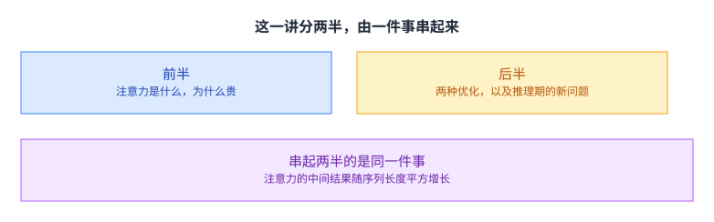

两半之所以能串在一起，是因为问题的根源只有一个：注意力的中间结果随序列长度平方增长。前半把这个结果算出来给你看，后半讲两类绕开它的办法，一类用于训练，一类用于推理。

这一讲也是这门课第一次把前面几讲的东西合起来用。分块来自第 5 讲，显存层级来自第 5、6 讲，[[term:ml-framework]] 与 [[term:machine-learning-system]] 的关系来自前几讲的整体视角。看完这一讲，应该能自己判断一个新算子在 GPU 上大概慢在哪。

## 注意力是什么

课件给的定义很朴素：注意力指的是把各个状态按权重组合起来的做法。

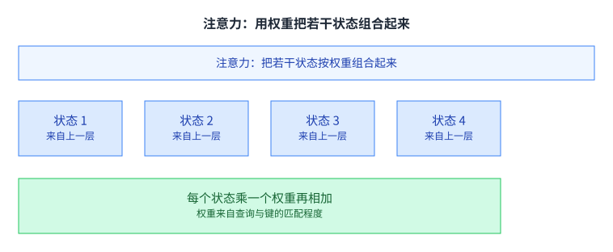

状态来自上一层。每个状态乘一个权重，再把它们加起来，得到注意力的输出。

重要的是权重从哪来。它不是人给的，也不是训练出来的固定值，而是由当前这一步的查询，与各个状态的键做匹配算出来的。匹配得好，权重就大，那个状态对输出的贡献就多。

这个定义解释了注意力的能力边界。它没有做任何非线性变换，只是在做一次带权平均。真正让它强大的是权重的来源：权重依赖输入本身，于是同一套参数在不同输入上会「关注」不同的位置。

这个「依赖输入」还有一层后果值得先记住。因为权重不是固定的，要比较的位置对的数量也就不固定：序列长度翻一倍，要比较的位置对就变成四倍。这一讲后面的所有麻烦，最终都能追到这句话上。

## 自注意力：四步

课件用 Jay Allamar 的一组插图讲自注意力。它的核心说法是：把一个查询与一组键值对映射成一个输出。

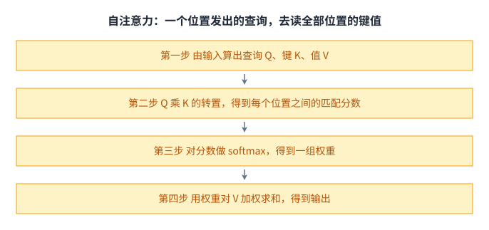

第一步，由输入算出查询 Q、键 K 与值 V。第二步，Q 乘 K 的转置，得到每两个位置之间的匹配分数。第三步，对分数做 softmax，把它们变成一个概率分布。第四步，用这组权重对 V 加权求和，得到输出。

课件在这里标了一句：这里面有多处矩阵乘法。这句话是后面所有性能讨论的起点，因为矩阵乘法的形状决定了显存占用，而形状里的一项是序列长度。

四步的形状也值得记一下。第一步是个线性投影，每个位置独立算，形状是 N 乘 d。第二步与第三步都作用在那个 N 乘 N 的分数矩阵上。第四步再乘回 V，回到 N 乘 d。

也就是说，四步里有两步在跟一个平方大小的东西打交道。而这几步是串起来的，前一步的完整结果要先出来，后一步才能开始——这一点在单条序列上是真的，也正是后面分块要打破的地方。

Transformer 这个名字的出处也在这条线上。课件引的是 Vaswani 等人的 Attention is all you need，架构是编码器与解码器，而自注意力是它的基本构件。

## 多头注意力

一个自然的改进是别只做一遍。

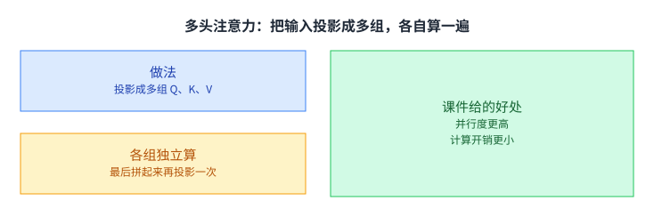

做法是把输入与输出各做若干组不同的线性变换，得到多组 Q、K、V，各组独立算一遍注意力，最后把结果拼起来再投影一次。

课件给的好处有两条：并行度更高，计算开销更小。第二条初看有点反直觉，因为分多头之后乘法的总次数并没有变少。它省的是别的东西：单个头的维度变小之后，中间的矩阵更小，更适合放进片上；而且多个头天然可以分给不同的线程块与 warp，并行度一下就上来了。这一点在后面的切分方案里会直接用上。

## 在 GPU 上算注意力：麻烦出在那个 N×N

把上面四步写成公式，就是课件给的那一行。

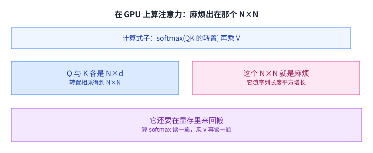

Q 与 K 各是 N 乘 d，转置相乘之后得到的是一个 N 乘 N 的矩阵，记为 A。对它做 softmax 还是 N 乘 N，再乘 V 得到 N 乘 d 的输出。

课件的挑战一栏写的是：中间结果很大。N 是序列长度，d 是每个位置的维度，而 N 通常远大于 d。于是这个 N 乘 N 的中间矩阵，比它两边参与运算的任何一个矩阵都大得多，而且增长得更快。

第二层的麻烦是它要被搬很多次。算 softmax 要从显存读一遍，乘 V 时要再读一遍。[[term:latency]] 在这两处都不便宜，因为这是显存，不是片上存储。

## 两级存储：FlashAttention 的出发点

要理解 FlashAttention，得先把它的出发点摆出来，也就是这两级存储的差距。

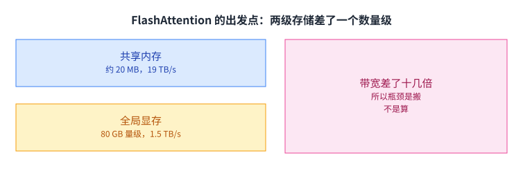

课件给的两个数字是：共享内存约 20 MB、带宽 19 TB/s；设备全局显存 80 GB 量级、带宽 1.5 TB/s。（这里要注明一处：课件把这两个容量记在「每块共享内存」与「设备全局显存」两行上，而 20 MB 其实是整片 SRAM 的量级，单个线程块能用的共享内存在 192 KB 量级。本页照录课件的写法，不把它当成一个块的额度。）

容量与带宽依旧是反向的，这一点和第 5 讲的内存层级是同一件事。不同的是这里的差距被摆得更直白：片上存储快十几倍，而那个 N 乘 N 的中间矩阵刚好大到放不进片上。

于是矛盾就清楚了：算一遍注意力需要读写的字节数，比真正参与运算的数据量大了很多倍；而多出来的这些读写，全都发生在慢的那一级上。[[term:compute]] 在这一层反而是够的，缺的是喂数据的带宽。

这里可以算一笔粗账，看看偏差有多大。真正参与运算的输入与输出只有 Q、K、V、O 四个矩阵，每个都是 N 乘 d，合起来是 4Nd 个元素；而中间那个 N 乘 N 的注意力矩阵是 N² 个元素。当序列长度是几千、每维是几十的时候，N² 比 Nd 大出一到两个数量级。

也就是说，绝大部分的访存量，花在了一个「本来只该短暂存在」的中间结果上。它被写出来、被读回去做 softmax、把结果写回去、再被读一遍去乘 V。按我们的数法，它至少四次经过慢的那一级（课件在这一页只写了「反复读写」，没有给次数），而它其实从头到尾都不必完整地出现。这个观察就是分块的全部动机。

## FlashAttention 的两个技术

课件的 FlashAttention 那一页给了两个技术，名字分别是分块与重算。

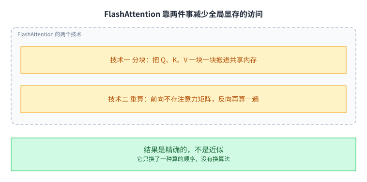

技术一是分块：把 Q、K、V 一块一块地从全局显存搬进共享内存，在片上算完再写回。这样那个 N 乘 N 的中间矩阵从来不需要完整地出现在显存里，它只以小块的形式短暂停留在片上。

技术二是重算：前向不保存那个注意力矩阵，反向的时候再算一遍。用一次额外的计算，换掉一大块显存。

这里有一个要点值得强调：课件的标题是 Exact Attention，也就是精确注意力。它没有近似、没有丢精度，改的只是计算的顺序与中间结果放在哪一级。这一点很重要，因为它意味着这类优化与「用近似换速度」是两回事，不需要在精度上做交易。

## 在线 softmax

分块听起来简单，但 softmax 是一个全局归一化，它天然需要看到全部数据。这是分块要解决的第一个技术难点。

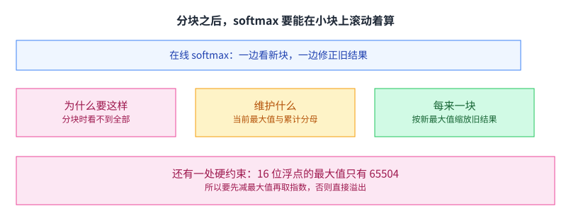

softmax 要除以所有分数的指数和，还要先减去最大值保证数值稳定。可是分块处理时，你看不到全局的最大值，也拿不到完整的和。

课件的解法叫在线 softmax：维护一个当前最大值与一个累计分母，每处理一个新块，就用新的最大值把之前已经算出的结果缩放一次。这个滚动的过程最终等于对全部数据做一次 softmax，结果完全一致。

还有一处硬约束写在课件上：16 位浮点能表示的最大值只有 65504。超过这个数就溢出成无穷。所以「先减最大值」不是可选的技巧，而是必须做的事，否则混合精度下直接算不出结果。

这条约束还有个副作用：减去最大值之后，剩下的指数项大多很小，小到在 16 位里会被舍成零。所以滚动更新时，之前那块算出来的部分和被重新缩放之后，精度损失要控制得住。课件把在线 softmax 放在数值稳定性那一节里讲，原因就在这里：它既是一个分块技巧，也是一个数值技巧，两件事在同一个算法里被解决了。

## 重算：用一次计算换一大块显存

第二个技术解决的是反向传播的问题。

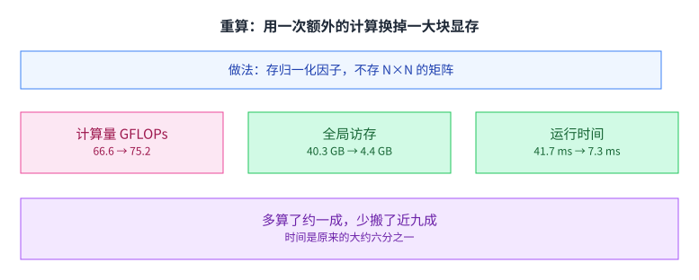

做法是：前向只保存 softmax 的归一化因子，它的大小正比于 N 而不是 N 的平方；反向的时候，从共享内存里的输入把注意力重算一遍。

课件给了一组很干净的实测对比。计算量从 66.6 GFLOPs 涨到 75.2，多算了大约一成；全局访存从 40.3 GB 降到 4.4 GB，少搬了近九成；运行时间从 41.7 毫秒降到 7.3 毫秒，大约是原来的六分之一。

这三个数放在一起说明了整节的主线：多算一点、少搬很多，净效果是快了好几倍。在带宽是瓶颈的地方，用计算换搬运几乎总是划算的。这句话在第 5 讲以「分块」的形式出现过，在这里以「重算」的形式又出现了一次。

## 线程块级切分：先分头，再分查询

算法改好之后，还得把它切给 GPU 上很多个执行单元。

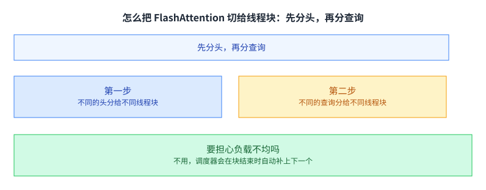

课件给的背景是一个具体的数字：一块 A100 有 108 个 SMM，也就是大约 108 个线程块的位置。

切法分两步。第一步，把不同的头分给不同的线程块；多头注意力的头数通常在 16 到 64 之间，一下子就给出了几十个块。第二步，再把不同的查询分给不同的线程块，块数继续乘上去。

课件还回答了一个很自然的疑问：要不要担心负载不均。答案是不要，因为 GPU 的调度器会在一个块结束时自动把它后面的块补上来。这一点正是第 6 讲讲过的「线程块可以任意顺序执行」的实际用途：你只管切，剩下的交给调度器。[[term:throughput]] 就是这么来的。

课件在这一页的第二步后面标了一个问号，然后自己给了答案：线程块之间不能通信，所以不能沿键值切，只能沿查询切。也就是说，这一步的约束是通信，而不是「头更划算」。把两条放在一起看，先分头再分查询的次序就有了两个理由：头本身是彼此独立的计算，切它不需要额外开销；而查询那一侧是唯一还能切的方向。[[term:hardware-accelerator]] 上有多少位置要填满，是这类切分的第一约束。

## warp 级切分：切查询，不要切键值

线程块内部还要再往下分给各个 warp。

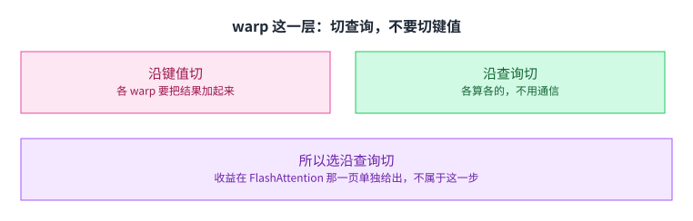

课件把两种切法并列。沿键值切，每个 warp 算出的是一部分和，必须把各 warp 的结果加回来，也就是需要通信。沿查询切，每个 warp 负责不同的输出位置，各算各的，不需要通信。

结论就写在课件上：选沿查询切。这是一个很典型的判断：两种切法在计算量上完全一样，差别只在要不要跨 warp 交换数据，而跨 warp 通信在 GPU 上是件昂贵的事。

接下来，课件用单独一页给出了 FlashAttention 整体的收益：2 到 4 倍加速、10 到 20 倍显存下降，并指出它的显存占用与序列长度是线性关系，不再是平方。这一页排在 warp 级切分之后，是对整个 FlashAttention 的收束，而不是 warp 级切分这一步的局部收益。

## 生成式推理分两个阶段

到这里注意力在训练上的故事讲完了。课件转向推理。

生成式模型的推理分两个形态完全不同的阶段。预填充阶段是第 0 次迭代，一次把全部输入 token 处理掉。解码阶段是之后每一次迭代，每一步只生成一个 token，但要读前面所有 token 的键与值。

这两个阶段对系统的要求差别很大。预填充阶段是一大堆查询，形状规整、并行度足；解码阶段只有一个查询，但要读很长的一段历史。也就是说，同一个模型在同一个请求里，先跑了一大批形状规整的活，然后转入一小步一小步的长尾。

这个长尾为什么值得专门讨论。因为它决定了用户感知到的速度。预填充阶段再快，也只发生一次；而解码阶段的每一步都决定下一个字什么时候出来，用户盯着屏幕看的就是这个节奏。所以两个阶段虽然在一个请求里，优化的目标却不一样：前者关心吞吐，后者关心单步延迟。

解码阶段要读的那一段历史，课件在这里就把它单独列成了一条，叫 [[term:kv-cache]]，并给了它的用途：把键与值存下来，避免后面每一步重算。后面几讲会反复用到它。它的存在让每一步不必重算前缀，但它也让每一步都要面对一段越来越长的数据。

## 解码阶段为什么用不上 FlashAttention

课件的下一页直接问了这个问题。

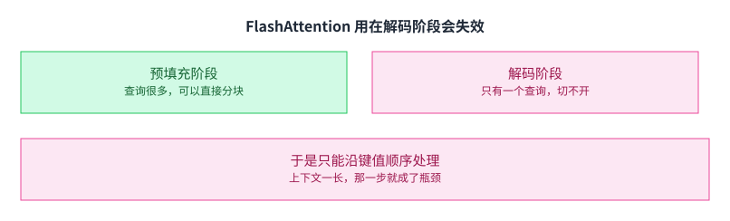

预填充阶段可以直接用：查询很多，按查询切分就行。

解码阶段不行。FlashAttention 的分块逻辑建立在「有很多查询可以切开」这个前提上，而解码阶段每一步只有一个查询，切不开。课件给的结论是它只能沿键值顺序处理，于是上下文一长，这一步就成了瓶颈。[[term:latency]] 在这里的表现很典型：请求的生成速度由每一步决定，而每一步都由一段越来越长的历史拖住。

## Flash-Decoding：改从键值这一侧切

既然查询那一侧没有东西可切，那就换一边。

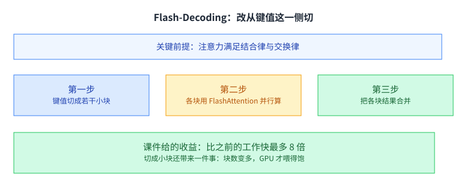

Flash-Decoding 把键值切成若干小块，各块用 FlashAttention 并行算，最后把各块的结果合并起来。

它能成立的关键是一条数学性质，课件把它单独写了出来：注意力运算满足结合律与交换律。也就是说，先算哪一块、按什么顺序合并，都不影响结果。有了这条性质，切分才不只是「可以试试」，而是可以放心做的。

课件给的收益是比之前的工作快最多 8 倍。它还顺带解决了一个问题：切成小块之后块数变多，GPU 才喂得饱。这句话把这一讲和前面几讲又连了起来：并行优化的第一步从来不是把单个块做快，而是先让硬件有足够多的活可以同时干。

## 读完应该能回答

1. 课件的注意力定义里，「权重」是从哪里来的。请说明为什么这一点决定了注意力的表达能力。
2. 自注意力的四步里，哪一步产生了一个 N 乘 N 的中间结果，以及为什么说它是全部麻烦的来源。
3. 多头注意力并没有减少乘法的总次数，请说明课件说的「计算开销更小」省的是什么。
4. 分块之后 softmax 为什么不能直接算，课件给的解法是什么。
5. 重算用一次额外的计算换掉了什么。请用课件那组 66.6 与 75.2、40.3 与 4.4、41.7 与 7.3 的数字说明这笔交易。
6. 解码阶段为什么用不了 FlashAttention，以及 Flash-Decoding 靠什么性质绕开它。

## 溯源

- 对应：CMU 15-442 / 15-642 Machine Learning Systems，Week 5 — Case study: Transformer, Attention, Optimizations（Zhihao Jia 主讲，2026-02-09）。
- 原文课件：https://mlsyscourse.org/slides/07-transformers-attention.pdf
- 上游许可：CC BY-NC 4.0（课程仓库根 LICENSE，19,342 B）。允许翻译与改编，须署名且不得商用。本页未转载原图与整页文字，配图全部自绘。
- 课件在这一讲里引了两处外部材料，本页照原样标注来源：自注意力的插图署名为 Jay Allamar，分块的动画署名为 Francisco Massa。这两处原图未转载，本页的相关配图为自绘。
- 本讲取材范围分四块。一是注意力本身：课件的定义、自注意力的四步、Transformer 与 Vaswani 等人的引用、多头注意力的做法与两条好处。二是在 GPU 上的开销：`softmax(QK^T)V` 与各矩阵的形状、挑战是中间结果很大、共享内存与全局显存的两个带宽数字。三是 FlashAttention：分块与重算两个技术、在线 softmax 与 65504 这个上界、重算的实测三行数字、线程块级的先分头再分查询与负载均衡的回答、warp 级沿查询切不用通信、2 到 4 倍加速与 10 到 20 倍显存下降。四是推理：预填充与解码两个阶段、FlashAttention 在解码阶段失效的原因、Flash-Decoding 的三步与结合律交换律这条前提、最多 8 倍的收益。
- 数字与定义以课件页面为准。课件未展开的推论属于 CourseLingo 的讲解，不当作原文引用。这类推论包括：把权重的来源读成注意力的能力边界、把「计算开销更小」解释成矩阵更小与更易切分、把两级存储与第 5 讲的内存层级联系起来、把三个实测数字读成「用计算换搬运」这笔交易、把解码阶段的长尾读成延迟问题，以及把 Flash-Decoding 与「先让硬件有足够多的活」这条并行原则联系起来。此外，本讲与前后讲次的对应关系属于我们的编排，其中 [[term:kv-cache]] 这个词不是我们造的：课件在那一页有一条独立的小节标题 Key-value cache，并写明它的用途是存下键与值以避免重算。正文按它的原话讲解。