+++
title = "并行化（上）：数据并行与零冗余优化"
lecture = 9
slug = "ml-parallelization-1"
status = "draft"
source_kind = "slides"
source_url = "https://mlsyscourse.org/slides/08-ML-parallelization-part1.pdf"
source_title = "Week 6: Parallelization Part 1 (Data Parallelism and Zero Redundancy)（Zhihao Jia 主讲，2026-02-11）"
output_mode = "explanation"
+++

> 来源课程：Carnegie Mellon University 15-442 / 15-642 Machine Learning Systems（Tianqi Chen、Zhihao Jia）；
> 对应讲次：Week 6 — Parallelization Part 1 (Data Parallelism and Zero Redundancy)（Zhihao Jia 主讲，2026-02-11，第六教学周）；
> 原文课件：https://mlsyscourse.org/slides/08-ML-parallelization-part1.pdf ；
> 上游许可：CC BY-NC 4.0（课程仓库根 LICENSE）—— 允许翻译与改编，须署名、且不得商用；
> 本文由 CourseLingo 原创撰写：按课件的推进顺序用中文重新讲解，关键定义处给出英文原文短引，配图为自绘 SVG，未转载原图与整页文字；本文非官方材料，CourseLingo 与 CMU 及本课程教学团队无隶属关系；如与原文有出入，以原文为准。

## 这一讲要解决什么

前面几讲都在一块卡上做文章。这一讲开始把训练铺到多块卡上。

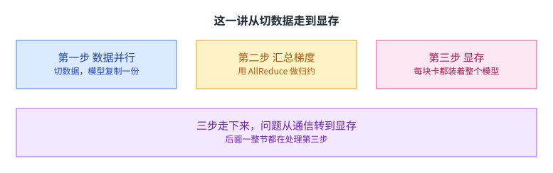

课件的推进顺序很像一份工程史。它先给最自然的做法，也就是把数据切开分给多块卡，这就是[[term:data-parallelism]]；然后发现真正要解决的问题是梯度怎么汇总；把通信改好之后，又撞上一个新问题：模型本身装不下了。

最后这个问题催生了这一讲后半的主角，ZeRO。它做的事说出来很简单：数据并行里有大量重复存储，把重复的那部分去掉。

这一讲也是这门课第一次正面处理「多机」这件事。后面几讲会把它继续展开，但难点与判断方式从这里就定型了：并行化的每一步，都是拿通信换显存、或者拿显存换通信。

## 训练一次迭代的三个阶段

课件先把训练回顾了一遍。

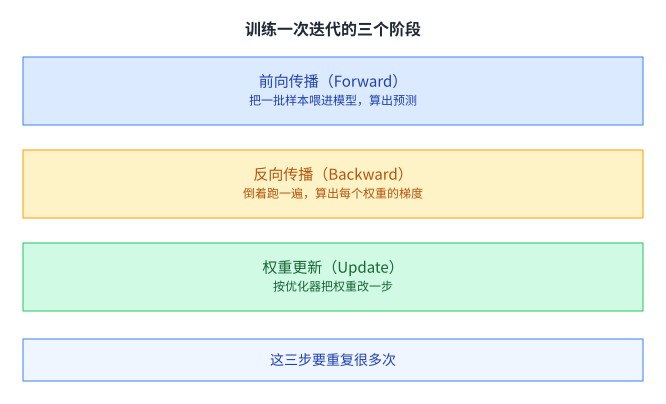

前向传播是把一批样本喂进模型，一路算过去得到预测。反向传播是把模型倒着跑一遍，算出每个可训练权重的梯度。权重更新是按优化器把权重改一步。

这三步是后面所有并行化的作用对象。哪一种并行方式其实都在回答同一个问题：这三步里的哪一步被切开、切开之后谁需要和谁通信。

[[term:gradient-descent]] 那一套在这里没有变，变的只是「谁来算梯度、梯度在哪里汇总」。课件后面还会专门回到 SGD 与 Adam，因为优化器状态在显存里占的位置比很多人预想的大。

## 数据并行：切数据，复制模型

最自然的做法是把训练集切开。

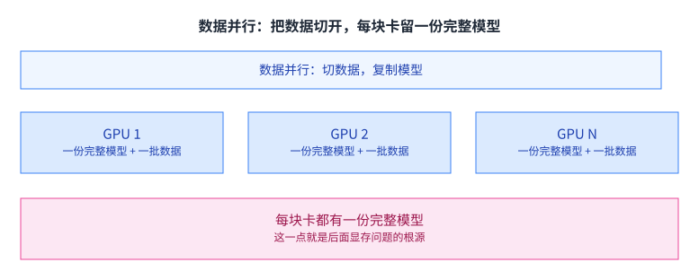

同一份模型被复制到每块卡上，训练集被切成若干份分给各卡。每块卡只算自己那批数据，算完把梯度汇总起来，然后再各自更新权重。

这个做法有一个非常好的性质：改动极小。模型代码不用动，只要在数据加载和梯度汇总两处加东西。于是它成了最常用的并行方式，也成了后面所有讨论的基线。

代价写在同一页上：每块卡都留着一份完整模型。在模型还不大的年代这不是问题；等到模型装不下一块卡的时候，这条前提本身就成了阻碍。

## 参数服务器：中心化的第一版

梯度怎么汇总，课件给了几版做法，从最直白的开始。

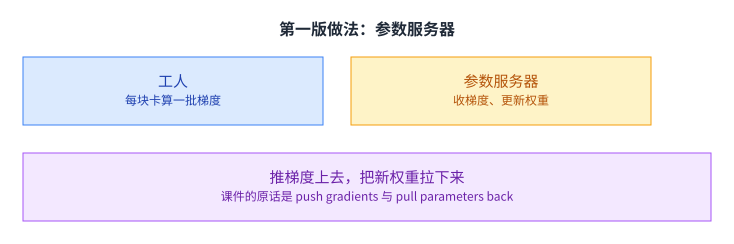

第一版叫参数服务器。工人把各自的梯度推上去，参数服务器负责更新权重，工人再把新权重拉回来。课件的原话是 workers push gradients to parameter servers and pull updated parameters back。

这个结构的优点是清晰：谁负责什么一目了然，加一个工人也不会改变拓扑。而且它把「参数的权威副本」放在一个地方，更新顺序天然是对的。

这一点在异步训练里很重要。如果让工人各自更新自己那份参数，那么不同工人手里的模型会在同一时刻不一样，后一步算出来的梯度对应的就不是同一套参数了。参数服务器用一个点消掉了这种不一致，代价是所有人都要排队等它。

缺点也同样清晰，而且是结构性的：所有工人只和同一个点说话。工人越多，这个点上的流量越大。

## 参数服务器为什么扩不动

课件把这条缺点单独列了一页。

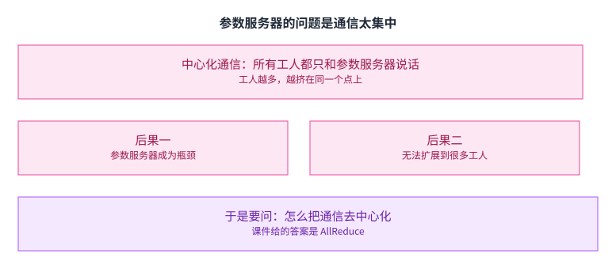

问题叫中心化通信。所有工人都要经过参数服务器才能更新权重，于是它的带宽成了整个系统的上限，工人数加不上去。

课件在这一页末尾直接提出了下一个问题：怎么把通信去中心化。这句话是这一讲的转折点——它把「并行」这个词从计算问题变成了通信拓扑问题。[[term:throughput]] 从这里开始，主要由网络而不是算力决定。

## AllReduce：真正必须的那一次通信

课件给的答案叫 AllReduce。

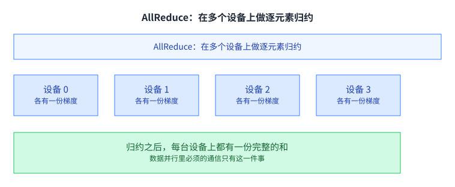

它的定义是在多个设备上做逐元素归约。每台设备各有一份梯度，归约之后，每台设备上都得到同一份完整的和。

这件事在数据并行里是必须的：各卡算的是不同数据的梯度，只有把它们加起来，才等于在一个大批次上算出的梯度。除此之外，卡与卡之间不需要交换别的东西。

所以数据并行的通信问题被压缩成了一句话：怎么高效地做一次 AllReduce。课件接着给了三种做法，一种比一种好。

这里可以顺便回答一个常见的疑问：为什么不用「让大家各自算、最后一个人汇总」这种更省事的办法。因为汇总的结果必须让所有人都拿到，否则下一步各卡手上的参数就不一样了。AllReduce 这个名字里的 All 就是这个意思：结果要落到所有设备上，而不是某一个点上。

## 朴素 AllReduce：平方级的通信量

第一种做法是让每个工人把自己的梯度发给所有其他人。

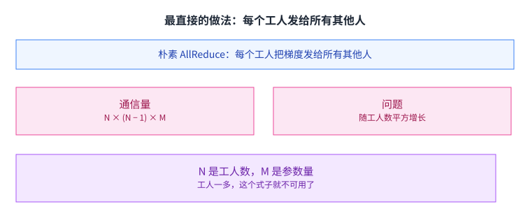

课件给的通信量是 N 乘 N 减 1 再乘 M，其中 N 是工人数，M 是参数量。它的来源很直白：每个工人要发 N−1 份，一共 N 个工人。

这个式子的问题在 N 的平方。工人数从 8 加到 16，通信量涨了大约 4 倍；而每块卡上的计算量只减半。也就是说，加卡带来的计算收益，很快会被通信吃掉。这就是并行化里最早也是最常见的那道墙。

把它写成「通信时间与计算时间的比值」会更直观。假设每块卡每轮的计算量是 C、要发的字节数是 B、网络带宽是 W，那么比值大致是 B 除以 W 再除以 C。工人数增加时，C 按 N 分之一下降，而 B 按 N 的量级上升，比值一下就翻了上去。这个比值一旦超过 1，加卡就是负收益。

## 环形 AllReduce

第二种做法把工人排成一个环。

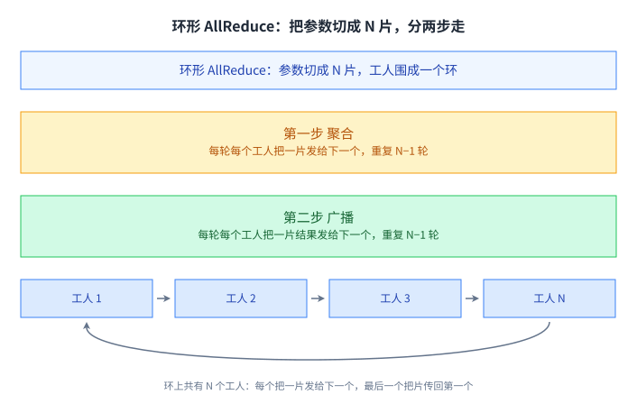

做法是这样的：N 个工人围成一个环，M 个参数切成 N 片。第一步叫聚合，每个工人把手上的一片发给环上的下一个工人，收到一片就加进去，重复 N 轮。走完 N 轮之后，每个工人手里都有一片已经聚合完的完整结果。

第二步叫广播，每个工人把手里那片聚合好的结果再沿环发出去，同样重复 N 轮。走完之后，所有工人都拿到了全部 N 片的完整结果。

算一下每个工人的收发量：两步各走 N 轮，每轮发一片也就是 M/N 个参数，所以总共大约 2M。关键在于这个数字里没有 N。工人数翻倍，每个工人的通信量不变，只是环上的轮数变多，而轮数变多可以和计算重叠。这就是环形 AllReduce 被广泛使用的原因。

还有一点值得注意：第一步结束时的状态很特殊。每个工人手里只有一片是完整的聚合结果，其余 N−1 片还是各自的局部值。第二步就是把这 N−1 片补齐的过程。理解这一点，就能明白为什么两步的轮数都是 N 而不是 log N：每一轮只能把一片往前推一格，而一圈有 N 个位置。

## 树形 AllReduce

第三种做法把工人连成一棵树。

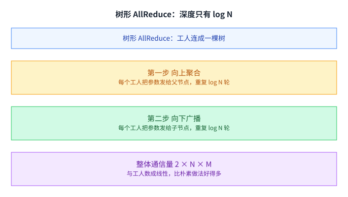

第一步向上聚合：每个工人把 M 个参数发给自己的父节点，重复 log N 轮，根节点就收齐了全部梯度。第二步向下广播：从根节点往下发，同样重复 log N 轮，所有节点都拿到结果。

轮数为什么是 log N。因为树的层数就是这么多：从叶子走到根，一共要经过 log N 条边。每一轮相当于所有节点同时往上走一层，走满层数就到根了。这也是树形与环形最本质的差别：环形一圈要走 N 步才回到原点，而树的高度只有 log N 层。

课件给的整体通信量是 2 乘 N 乘 M。这个数字比朴素做法好得多，因为它和 N 是线性关系，而不是平方。

它和环形做法的差别在于「轮数」与「每轮数据量」的取舍。树形的轮数是 log N，比环形的 N 小得多，但每一轮要传的是完整的 M 个参数，而不是 M/N 片。工人数少的时候树形更省，工人数多、带宽又紧张的时候，环形那套「小片多轮」通常更稳。

课件还提了一种蝶形网络的变体：重复 log N 轮，每轮把 M 个参数发给蝶形网络里的目标节点，然后各节点在本地聚合。它属于同一族思路的另一个取点。

## 三种做法放在一起看

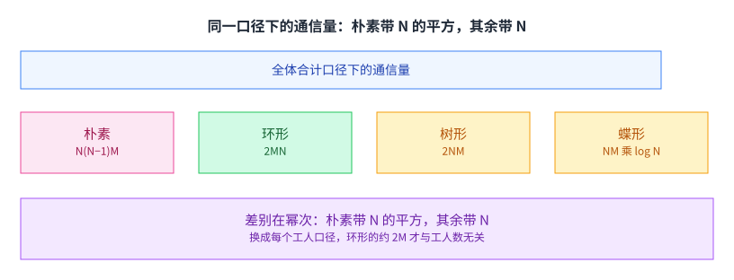

课件把参数服务器、朴素 AllReduce、环形、树形四种放在一页上比较。把它们的通信量并排写出来，差别一眼可见：朴素那一项带着 N 的平方，树形带着 N，而环形那两项里没有 N。

需要留意的是，「通信量小」不等于「一定更快」。真实的训练里，通信可以和计算重叠，所以还要看通信的次数与每次的大小、以及网络拓扑本身。环形之所以在实际系统里最常见，一部分原因就是它的通信模式非常规整：每一轮只和左右两个邻居说话，不依赖全局的树结构。

[[term:latency]] 在这里的含义也变了：不是单次传输要多久，而是一轮 AllReduce 里有多少次「等对方」。轮数越多，等待的层数越多；而每轮数据越小，越容易被隐藏到计算后面。这个权衡在后面的分布式训练系统里会反复出现。

## 数据并行的前提本身是个问题

通信解决之后，课件把注意力转回显存。

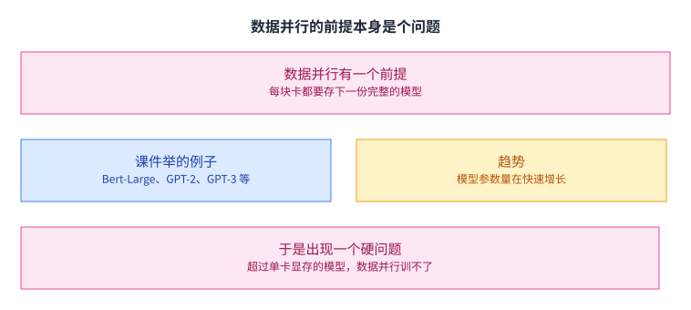

问题还是那一句：每块卡都要存下一份完整模型。课件把 Bert-Large、GPT-2、Turing 17.2 NLG、GPT-3 这几个模型排在一页上比参数量，趋势是越来越大。

于是出现一个硬约束：要训练的模型如果超过单卡显存，数据并行这种形式就训不了，无论你有多少块卡。加卡能增加算力，却不能让单块卡的显存变大。

这一点值得停下来想一下。在此之前，「加卡」是可以解决大部分问题的通用手段；而显存这道墙，加卡是绕不过去的。这也解释了为什么接下来几年里，大模型训练的进展很大程度上不是算力的进展，而是显存安排的进展。

换个角度说，这道墙还改变了人们衡量并行方案的标准。在显存够用的年代，衡量一个并行方案好不好，看的是它把计算加速了多少；而显存成为瓶颈之后，还要同时看它把每块卡的峰值占用压到了多少。两个指标方向不同，很多时候要牺牲一个换另一个。

## 显存里到底装了什么

要解决装不下的问题，先把装了什么列清楚。

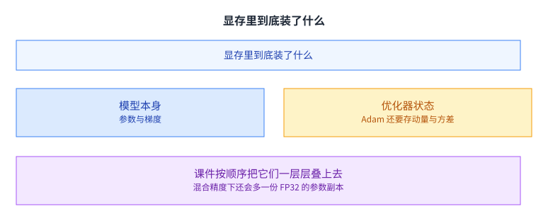

课件按顺序往上叠：模型参数，然后是每个参数的梯度，然后是优化器状态，混合精度下还会多一份 FP32 的参数副本。

优化器状态这一项容易被低估。以 Adam 为例，它要为每个参数保存一阶动量与二阶动量，也就是两份和参数同样大小的状态。课件之所以把优化器状态放在显存构成的第一位来讲，是因为它往往是占比最大的那一块。

把这些项加起来，一块卡上真正需要存的东西，比「模型有多大」多出好几倍。而数据并行让每一块卡都完整地存了一份。重复的正是这些。

按参数个数粗算一下会更清楚。假设模型有 P 个参数：参数本身一份，混合精度下还要一份 FP32 的副本，梯度一份，Adam 的一阶动量与二阶动量各一份。这里已经有好几份与 P 同量级的东西了。如果这些在 N 块卡上各存一份完整副本，那么总占用是这些之和乘以 N，而其中真正必要的部分只有一份。

ZeRO 要做的，就是把「乘以 N」这件事从这些项里去掉。

## ZeRO：把冗余一项项去掉

课件给出的方案叫 [[term:zero]]，全称 Zero Redundancy Optimizer，直译是零冗余优化器。

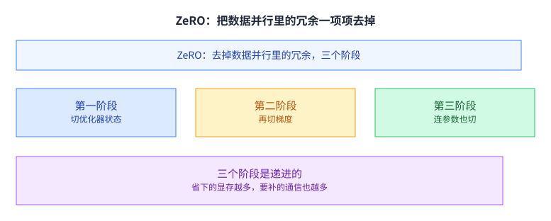

课件对它的描述是：消除数据并行训练里的冗余，并且已经在大型模型的数据并行训练里被广泛使用。

它分三个阶段，一个比一个切得深。第一阶段切优化器状态，第二阶段再切梯度，第三阶段连参数也切开。既然每块卡上存的是同一份东西，那就按卡数切开，每块卡只留自己那一片，需要的时候再从别人那里取。

三个阶段是递进的，代价也跟着递进：切得越深，省下的显存越多，需要补回来的通信也越多。所以实际用哪一阶段，取决于当前卡在哪一边，是显存不够，还是网络不够。

## 第三阶段：参数也被切开

课件用了好几页动画专门讲第三阶段，因为它的做法最反直觉。

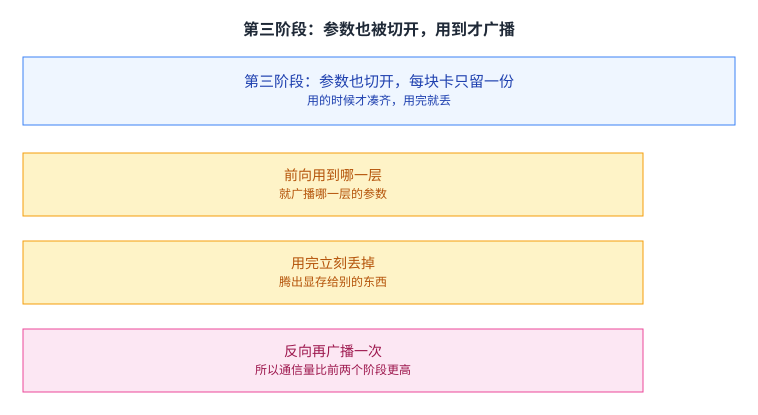

前两个阶段切的都是「本来就不止一份」的东西：优化器状态和梯度是每个工人各自算出来的，切开之后损失不大。而参数是模型的本体，切开它意味着某一层要做运算时，可能参数根本不在本卡上。

课件的做法是：参数分布在所有卡上，前向用到哪一层，就先把那一层的参数广播过来；用完立刻丢掉，腾出显存；反向传播需要它的时候，再广播一次。

于是通信量明显上升：每一层在前后向各广播一次。换来的收益也很明显：单卡显存里不再需要留下整个模型。

这就是这一讲最后那条主线：数据并行的每一步优化，本质都是在显存和通信之间挪动一个边界。[[term:machine-learning-system]] 的设计空间，很大程度上就是这条边界上的取点。[[term:compute]] 与[[term:hardware-accelerator]]决定你能算多快，而这套存储与通信的安排决定你算得动多大的模型。

回头看这三个阶段，它们其实在回答同一个问题：一份数据到底该在几块卡上重复。优化器状态重复得最没有必要，所以先切它；梯度也是每块卡各算一份，切掉影响也不大；参数是模型本体，切它最麻烦，但省下的显存也最多。切的顺序，就是「重复得多没必要」的顺序。

## 读完应该能回答

1. 数据并行为什么是最常用的并行方式。请从「要改多少代码」这个角度说明。
2. 参数服务器的结构性问题是什么，为什么加卡解决不了它。
3. 朴素 AllReduce 的通信量是 N(N−1)M，请说明这两个因子各自来自哪里。
4. 环形 AllReduce 的两步各自做了什么，为什么最后每个工人的通信量大约是 2M、与 N 无关。
5. 树形 AllReduce 的整体通信量是 2NM，它在什么情况下比环形更划算。
6. ZeRO 的三个阶段分别切开了什么。为什么第三阶段的通信量比前两个阶段高。
7. 训练一块卡上要存的显存由哪几项组成，其中哪一项容易被低估。

## 溯源

- 对应：CMU 15-442 / 15-642 Machine Learning Systems，Week 6 — Parallelization Part 1 (Data Parallelism and Zero Redundancy)（Zhihao Jia 主讲，2026-02-11）。
- 原文课件：https://mlsyscourse.org/slides/08-ML-parallelization-part1.pdf
- 上游许可：CC BY-NC 4.0（课程仓库根 LICENSE，19,342 B）。允许翻译与改编，须署名且不得商用。本页未转载原图与整页文字，配图全部自绘。
- 本讲取材范围分四块。一是训练回顾与数据并行：前向、反向、权重更新三步，数据并行的切法与「每块卡一份完整模型」这条前提，参数服务器的推拉结构与中心化通信的批评。二是 AllReduce 的四种做法：定义、朴素做法的 N(N−1)M、环形做法的两步各 N 轮与约 2M、树形做法的两步各 log N 轮与 2NM、蝶形网络的变体，以及课件那一页的四者对比。三是显存构成：Bert-Large 到 GPT-3 的参数量趋势、模型参数与梯度与优化器状态与 FP32 副本这几项、Adam 的一阶与二阶动量。四是 ZeRO：它的全称与定位、三个阶段各切什么、第三阶段的参数分布与前后向各广播一次、用完即丢。
- 数字与定义以课件页面为准。课件未展开的推论属于 CourseLingo 的讲解，不当作原文引用。这类推论分三组。一组是取舍判断：环形与树形之间怎么选、通信量小不等于更快、延迟可以理解成一轮里有多少次等待、第三阶段的代价与收益就是在显存与通信之间挪边界。一组是因果与量级：显存这道墙加卡绕不过去、优化器状态往往是占比最大的一项。还有一组是分工的区分：compute 与硬件加速器决定算多快，存储与通信的安排决定算得动多大。此外，本讲与前后讲次的对应关系属于我们的编排。
- 课件在那张大模型参数量的对照页上给的是图形化的柱状对比，文字层里只留下 Bert-Large、GPT-2、Turing 17.2 NLG、GPT-3 这几个名字，没有可直接引用的具体数值，所以本页只写趋势、不写数字。