+++
title = "并行化（下）：模型并行与流水线并行"
lecture = 10
slug = "ml-parallelization-2"
status = "draft"
source_kind = "slides"
source_url = "https://mlsyscourse.org/slides/09-ML-parallelization-part2.pdf"
source_title = "Week 6: Parallelization Part 2 (Model and Pipeline Parallelism)（Zhihao Jia 主讲，2026-02-17）"
output_mode = "explanation"
+++

> 来源课程：Carnegie Mellon University 15-442 / 15-642 Machine Learning Systems（Tianqi Chen、Zhihao Jia）；
> 对应讲次：Week 6 — Parallelization Part 2 (Model and Pipeline Parallelism)（Zhihao Jia 主讲；课件标题页日期 2026-02-17，课程表排的是 02/16 Mon，两者都在第六教学周）；
> 原文课件：https://mlsyscourse.org/slides/09-ML-parallelization-part2.pdf ；
> 上游许可：CC BY-NC 4.0（课程仓库根 LICENSE）—— 允许翻译与改编，须署名、且不得商用；
> 本文由 CourseLingo 原创撰写：按课件的推进顺序用中文重新讲解，关键定义处给出英文原文短引，配图为自绘 SVG，未转载原图与整页文字；本文非官方材料，CourseLingo 与 CMU 及本课程教学团队无隶属关系；如与原文有出入，以原文为准。

## 这一讲要解决什么

第 9 讲最后停在一道墙上：数据并行要求每块卡都装下一份完整模型，于是超过单卡显存的模型训不了。

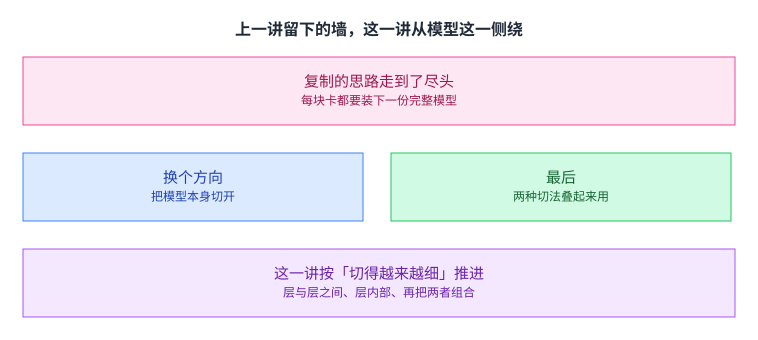

这一讲从模型的这一侧绕。思路很直接：既然复制不行，那就把模型本身切开。切法有两种粒度：粗的按层切，细到把一层内部的参数也切开。两种切法各有各的问题，最后要叠起来用。

课件的推进顺序是「切得越来越细」。先看按层切会出现什么毛病，再引出流水线，再解决流水线自己的问题。

## 回顾：数据并行卡在哪

先把第 9 讲的结论摆出来。

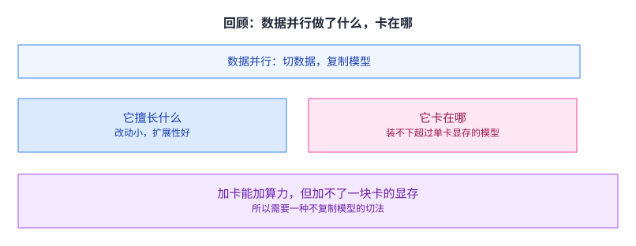

数据并行把训练集切开，每块卡留一份完整模型，算完把梯度汇总。它擅长的地方是改动小、扩展性好：模型代码几乎不用动，加卡就能加速。（「改动小、扩展性好」是我们的判断，课件那两页只有那张图、三步、以及「每块卡一份完整模型」这条限制。）

它卡住的地方只有一条，但这一条很硬：每块卡都要装下整个模型。加卡能加算力，却加不了一块卡的显存。所以接下来要找的，是一种不复制模型的切法。

## 模型并行：把模型切成子图

课件给的定义是把一个模型切成多个子图，分给不同设备。

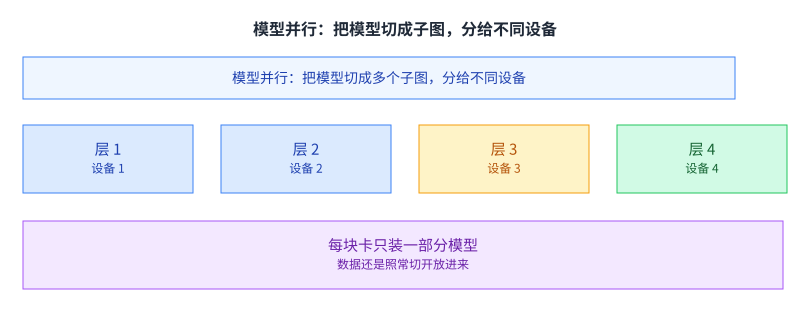

最直接的切法就是按层切：第一层放设备 1，第二层放设备 2，依此类推。数据仍然可以照常切开放进来，每块卡只负责模型的一部分。

这个切法看起来两全其美：模型不用复制了，数据还是并行的。但它立刻带来一个新问题，层是串行的，第二层要等第一层算完才能开始。下一节会看到这个问题有多严重。

课件的这一页还画了一张对照图：左边是数据并行的样子（每块卡都有完整模型，数据各切一份），右边是模型并行的样子（模型被切成分段，数据整批进去）。两张图放在一起，能看出两者改的其实是不同的东西：数据并行改的是「谁算哪批数据」，模型并行改的是「谁存哪段模型」。

## 张量并行：切开的是同一层内部

第二种切法细一级。

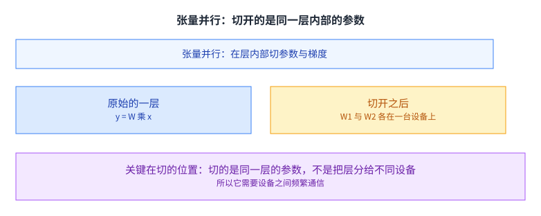

课件特意强调了切的位置：partition parameters/gradients within a layer，也就是在层的内部切参数与梯度。一个线性层算的是 y 等于 W 乘 x，把 W 按行或按列切成两块，各放一台设备，算完之后把结果拼起来或者加起来，得到的还是同一个 y。

这个切法的好处是每块卡上的计算量也变小了，不只是显存。代价是它需要设备之间频繁通信：每一层都要交换中间结果，而且这个交换嵌在计算里面，没法简单地挪到计算之外。

这一点是理解后面所有取舍的关键。[[term:data-parallelism]] 的通信发生在计算之外，可以整体挪走；张量并行的通信长在计算里，只能跟着每一层走。

课件的两张对照图把这件事画得很清楚。数据并行那张图上，前向与反向两段里各块卡之间没有箭头，只有最后梯度同步那一步有；张量并行那张图上，前向与反向每一段里都画着交换的箭头。同一条流水线，箭头的分布完全不同。

## 两种切法在通信上的差别

课件用前向、反向、梯度同步这三段来对照两种切法。

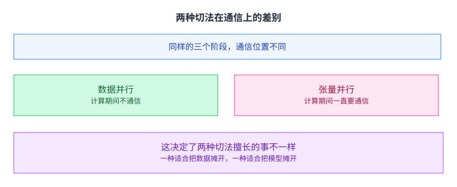

数据并行在计算期间不通信：各卡独立算完前向与反向，只在最后同步一次梯度。张量并行在计算期间一直要通信：每一层的输出都要跨设备凑齐。

这决定了两种切法擅长的事不一样。数据并行适合把大批数据摊开，因为它的通信与批大小几乎无关；张量并行适合把大模型摊开，因为它的瓶颈恰恰是单层装不下。

还有一层更细的差别在通信的时机上。数据并行的梯度同步可以等整个反向跑完再做，于是它有机会和别的计算重叠；张量并行的交换卡在每一层的出口，前一层不算完就没法开始下一层，重叠的余地小得多。这一点在网络慢的时候会直接决定能不能扩展。

## 例子：卷积网络里两类层的分工

课件用一个具体的网络把上面的判断落地。

课件给的两个数字是关键。卷积层占了 90% 到 95% 的计算量，但只占 5% 的参数，而且它产生的中间激活值非常大。全连接层恰好相反：参数占大头，计算量占比很小。

两个数字放在一起，分工就出来了。卷积层计算重、参数少，瓶颈在算力，用数据并行把数据摊开最划算；全连接层参数重、计算轻，瓶颈在显存，用张量并行把它切开最划算。

同一个网络里用两种切法，这不是妥协，而是按各自的瓶颈分别处理。这个思路在后面的模型里会一直沿用。

这里其实用上了一个更一般的判断方法：先看一层的时间花在哪。如果时间主要花在计算上，就把这一层的数据摊给多块卡；如果时间主要花在搬参数上，就把这一层的参数切开。卷积层是前一种，全连接层是后一种。[[term:kernel]] 这一层实现得好不好，也会直接改变这个判断的结果。

## 例子：Transformer 的一层怎么切

Transformer 是另一种情况：它的一层里同时有这两类层。

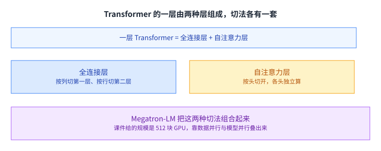

全连接层那部分，课件的切法是第一层按列切、第二层按行切，这样中间不需要额外的通信就能接上。自注意力层那部分，切法在第 8 讲已经出现过（那一讲讲多头注意力时列过这条好处）：按头切开，各头本来就是独立的计算。（更正：我原先写「上一讲」。按仓库讲次上一讲是第 9 讲，而第 9 讲全篇检索「多头注意力」「按头」「计算开销更小」命中 0；那两处内容都在第 8 讲。课件层面也一样：本讲自己的课件里出现的「按头切开」是跨设备切法，不是第 9 讲的内容。）

Megatron-LM 把这两种切法组合起来用。课件给的规模是 512 块 GPU，靠数据并行与模型并行叠出来。

这里也回答了第 8 讲留下的一个疑问。第 8 讲讲多头注意力时把「计算开销更小」列在好处里，那边只是一句结论；到了这一讲，按头切分正好用上了这一点：头是天然的切分边界，不需要额外通信。

## 模型并行自己的问题

按层切分看起来很自然，但课件立刻指出了它的毛病。

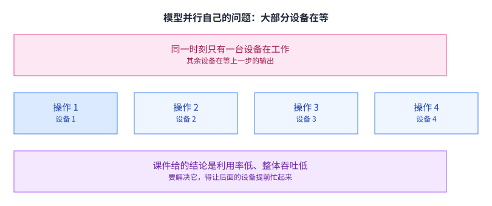

问题在于同一时刻只有一台设备在工作。设备 1 算完交给设备 2，设备 2 算的时候设备 1 在闲着；等设备 3 开始算，前两台都在闲着。

课件把这件事叫作计算资源的低利用率，后果是整体吞吐上不去。加更多的卡不会让情况变好，只会让更多卡同时闲着。

这里可以看出并行化的一个规律：把工作切开不等于让工作并行。切完之后如果各块之间是串行依赖的，那么增加资源只会增加空闲。

课件在这一页上画了一条时间轴，四个操作依次排开，同一时刻只有一个亮着。这条轴就是后面所有流水线改进要改写的东西：目标不是让单个操作变快，而是让那条轴上同时亮起的格子变多。

## 流水线并行：让后面的设备提前忙起来

解法从「微批次」这个词开始。

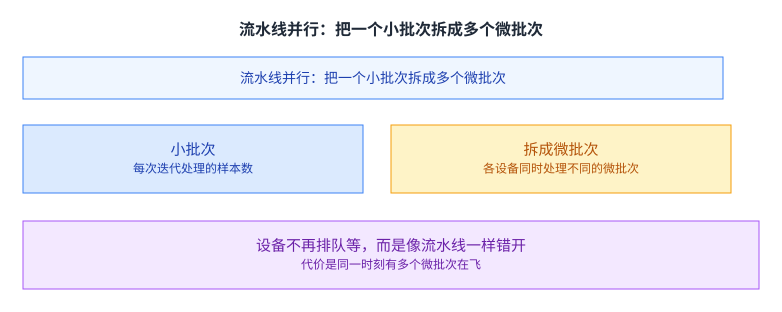

课件先定义：小批次是每次迭代处理的样本数。做法是把它拆成若干个微批次，让不同设备同时处理不同的微批次。设备 1 处理微批次 1 的时候，设备 2 已经开始处理更早的那个；等设备 1 处理微批次 2 时，设备 2 正好接上微批次 2 的第二步。

于是设备不再排队等，而是像工厂流水线一样错开。代价是同一时刻有多个微批次在系统里飞着，每个都要占显存。这一点后面会变成一个主要问题。

## 利用率的两个参数

课件用两个符号描述流水线的效率。

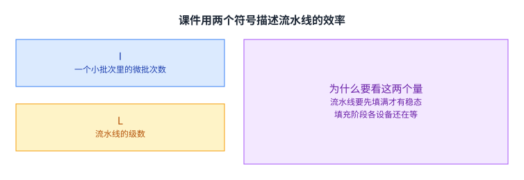

I 是一个小批次里的微批次数，L 是流水线的级数。课件的稳态利用率与这两个量的比值有关：微批次数相对于级数越多，越容易把流水线填满。

原因是流水线有一个填充阶段。刚开始的时候，只有第一级有活干，后面几级都在等；要等 I 个微批次陆续进入，流水线才进入稳态。

除了开头的填充，末尾还有一段排空：最后几个微批次走完之后，前面的几级会先空闲下来。所以真正满载的时间是总时间减去这两段，而这两段的长度都由流水线的级数决定、由微批次数摊薄。

于是填充阶段的占比大约与 L 除以 I 成正比。要看这个比值，而不是单独看 I 或 L。这一点也是课件后面所有改进的共同目标：把填充阶段压小。

课件在讲这一段时把「每个流水线级所耗时间相同」当成了前提。这个前提在真实系统里并不总成立：反向传播通常比前向贵一些，显存密集的层也比计算密集的层慢。所以实际调优时，还要额外处理级与级之间的快慢不均，而这一步往往比公式本身更花时间。

举个具体的情形：如果流水线有 8 级而一个批次只拆成 4 个微批次，那么填充与排空合起来占的时间比例相当可观，一部分设备至少有三分之一的时间在等。把微批次数加到 32，同样的 8 级流水线就基本能一直保持满载。这也是为什么「多拆几个微批次」是这类系统里最常动的一个旋钮。

## 提高效率的两条路

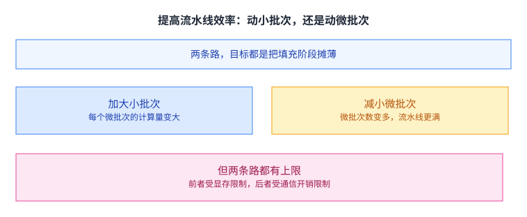

课件在这一页给了**两条旋钮、三条路**，这里照它逐字的意思写。

第一条旋钮是小批次里的微批次数（课件记作 `I`）：「加大**小批次**大小，或者减小**微批次**大小」，也就是让 `I` 变大。

第二条旋钮是流水线的级数（课件记作 `L`）：「**减小流水线深度**」。级数少了，填满它需要的微批次自然也少。

三条路各有一条课件写明的代价，逐字是：加大**小批次**「可能带来精度损失」；减小**微批次**「会降低 GPU 利用率」；减小流水线深度「会让**每一级变大**」。

**更正一处**：我原先把这两条代价写成「受显存限制」与「受通信开销限制」，还把它们说成「两条路」。那两条在工程上也说得通，但不是课件写的那两条；而 `L` 那条路我完全漏了。

这个「两头都有墙」的结构在本课程里出现过好几次：第 5 讲的块大小、第 8 讲的分块尺寸，都是同一个形状。[[term:throughput]] 的优化很少能靠一个方向一直推下去。

## 流水线的显存问题

流水线解决了闲置，却带出一个新的显存问题。

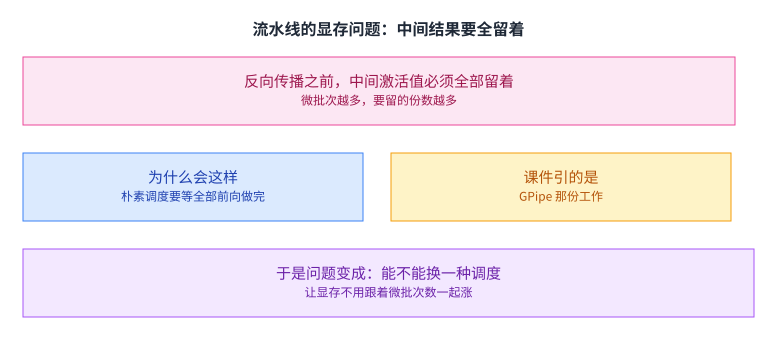

反向传播要用到前向算出的中间激活值，所以在反向开始之前，所有微批次的中间结果都得留着。微批次越多，要留的份数越多，显存就跟着微批次数一起涨。

这就抵消了一部分流水线带来的好处：为了填满流水线，你得多开几个微批次；而多开的每一个都要占一份中间结果。

这笔账可以粗算一下。如果每个微批次的中间激活值要占 C 的显存，一共开 I 个微批次，那么峰值就是 I 乘 C。而为了把 8 级流水线填满，I 至少要到八以上，于是这部分的占用就是单个微批次的八倍以上。

课件在这里引了 GPipe 那份工作，并把问题重述成一句可以动手改的话：能不能换一种调度，让显存不用跟着微批次数一起涨。

## 1F1B 调度

课件给的答案是改调度。

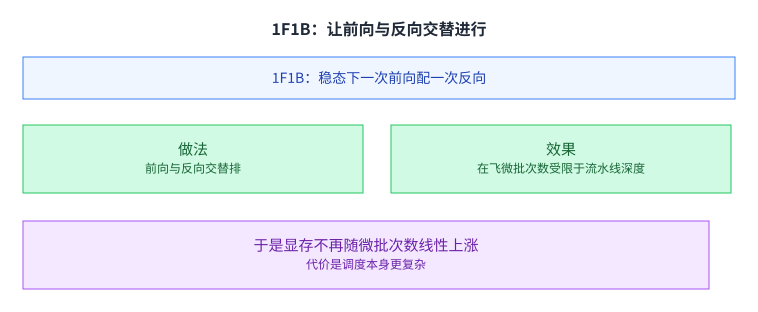

这个调度叫 1F1B，也就是 One-Forward-One-Backward：在稳态下，每做一次前向就做一次反向。同时把在飞的微批次数限制在流水线深度 L 以内。

这样做的效果是：需要同时留住的中间结果从「所有微批次」降到「最多 L 个」。显存不再随微批次数线性上涨，而是被流水线级数卡住。

代价是调度本身更复杂，而且反向的时机变早了。不过这个代价是可控的，因为它只影响实现，不影响结果。[[term:latency]] 与显存在这里做了一次交换，方向和前面几次一致：拿一点复杂度换掉一大块显存。

[[term:ml-framework]] 在这里的角色也值得点一句。这类调度靠手写是写不出来的：什么时候发前向、什么时候发反向、哪一块显存什么时候可以释放，都要按运行时状态动态决定。所以 1F1B 这类调度最终都是被做进框架里的，而不是写在用户的模型代码里。

## 交错式 1F1B

还能再压一点。

做法是把每个流水线级进一步切成 R 个子级，让本来属于同一级的计算分散排布。课件指出，这样能把填充阶段的空档进一步压小，因为每一级内部也有活可以错开。

代价是通信次数变多：子级之间也要交换数据。所以 R 也是一个要调的数，不是越大越好。

课件在两页上分别给出了子级的前向与反向耗时表达式，用的是同一个符号体系。这些式子的用途是估出在给定级数、微批次数与子级数之下，流水线的空档还剩多少。它们不改变结论，只把「交错到什么程度最划算」变成一个可以算的问题。

到这里，流水线这一支的改进路径是清楚的：先解决闲置，再解决显存，再解决剩下的空档。每一步都是在「利用率」与「显存和通信」之间换个位置。

## 课件最后的三方对照

课件把三种并行方式放进一张表。

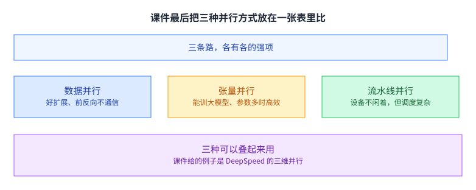

数据并行那一栏是「好扩展、前反向不通信」，也是三种里唯一不需要为模型形状做改动的；张量模型并行那一栏是「能训大模型、参数多的时候高效」；流水线模型并行的强项是「能训练很深的模型」，而它的短板恰恰是**利用率**：课件写的是「利用受限，前后向里有气泡」。（更正：我原先把「设备不闲着」记成这一栏的强项，方向反了 —— 课件那一栏的代价正是气泡。）

课件还逐条标了每种方式的短板，读起来很像一份选型表。它列的每一条都能追回这一讲前面的某一段：数据并行缺的是显存，张量并行缺的是通信带宽，流水线并行缺的是调度余量。真正要紧的是它最后那句：三种可以叠起来用，课件给的例子是 DeepSpeed 的三维并行。

课件的对照表给每一栏都打了勾与叉。**核对者在文字层里数到的是 6 条强项与 5 条代价**，而「每一栏各四条」这个说法在文字层里找不到依据（勾与叉落在哪一列属于表格对齐，文字层里丢了），所以本页不再说「四项」。能确认的是：没有哪一个方案把强项占全。数据并行能大规模扩展但装不下大模型；张量并行能装下大模型但通信密集；流水线并行能让设备不闲着但调度复杂。选型就是在这几组缺点里挑一组你能接受的。

这也是这一讲最后要留下的印象。做到大模型训练这一步，已经没有哪一种并行方式单独够用：数据并行负责把数据摊开，张量并行负责把单层切开，流水线并行负责把层与层之间填满。[[term:compute]] 与[[term:hardware-accelerator]]提供上限，而怎么把它们组织起来，就是[[term:machine-learning-system]]要回答的问题。

## 读完应该能回答

1. 数据并行卡住的那一条是什么，为什么加卡解决不了。
2. 张量并行切的位置与按层切有什么不同，这个差别为什么决定了它的通信特点。
3. 课件说卷积层占 90% 到 95% 的计算量与 5% 的参数，请说明这两个数字如何推出「卷积层用数据并行、全连接层用张量并行」。
4. 按层切分模型时，为什么会出现设备闲置，闲置的比例与什么有关。
5. 流水线并行里 I 与 L 各指什么，为什么稳态利用率要看这两个量的比值。
6. 流水线为什么会带来显存问题，1F1B 是怎么解决的。
7. 三种并行方式各自擅长什么，为什么大规模训练要把它们叠起来。

## 溯源

- 对应：CMU 15-442 / 15-642 Machine Learning Systems，Week 6 — Parallelization Part 2 (Model and Pipeline Parallelism)（Zhihao Jia 主讲，2026-02-17）。
- 原文课件：https://mlsyscourse.org/slides/09-ML-parallelization-part2.pdf（课件号的对照见第 8 讲溯源；本页一律用仓库讲次号指路。）
- 上游许可：CC BY-NC 4.0（课程仓库根 LICENSE，19,342 B）。允许翻译与改编，须署名且不得商用。本页未转载原图与整页文字，配图全部自绘。
- 本讲取材范围分四块：回顾与新方向（数据并行的做法与限制、模型并行的定义）；两种粒度（张量并行切参数与梯度、三段对照、卷积层与全连接层的反差与各自切法、Megatron-LM 的组合）；流水线（按层切的闲置、小批次与微批次、I 与 L 两个符号与三条路、中间激活值的显存问题、1F1B、交错式 1F1B 的 R 个子级）；以及收束（三种方式的对照表与 DeepSpeed 三维并行）。
- 数字与定义以课件页面为准。未展开的推论属于 CourseLingo 的讲解：把「切开不等于并行」写成规律、把填充占比说成约与 L/I 成正比、把 1F1B 的收益说成「用复杂度换显存」、把 R 说成要调的数、把三种方式的分工归到「算力给上限、组织方式给答案」，以及「改动小、扩展性好」这条评价。本讲与前后讲次的对应关系属于我们的编排。
- 跨讲承诺登记：第 2 讲溯源登记过「第 9、10 讲分别展开数据并行与模型并行」，**本讲是模型并行这一半（张量并行与流水线并行），已经兑现**。本讲自己作出的、带讲次编号的承诺为 0 条。
- 课件在流水线利用率那一页给的是公式化推导，文字层只留下 I、L 与若干符号，没有可引用的数值；本页依据的是同一页的文字说明，没有替课件补公式。