+++
title = "显存优化"
lecture = 11
slug = "memory-optimization"
status = "draft"
source_kind = "slides"
source_url = "https://mlsyscourse.org/slides/11-memory-optimization.pdf"
source_title = "Week 6: Memory Optimizations（课件署名行是 Tianqi Chen 与 Zhihao Jia，课件标题页日期 2026-02-17；课程表排的是 02/18 Wed、只列 Tianqi Chen。两者都在第六教学周）"
output_mode = "explanation"
+++

> 来源课程：Carnegie Mellon University 15-442 / 15-642 Machine Learning Systems（Tianqi Chen、Zhihao Jia）；
> 对应讲次：Week 6 — Memory Optimizations（Tianqi Chen、Zhihao Jia 主讲，2026-02-17）；
> 原文课件：https://mlsyscourse.org/slides/11-memory-optimization.pdf ；
> 上游许可：CC BY-NC 4.0（课程仓库根 LICENSE）—— 允许翻译与改编，须署名、且不得商用；
> 本文由 CourseLingo 原创撰写：按课件的推进顺序用中文重新讲解，关键定义处给出英文原文短引，配图为自绘 SVG，未转载原图与整页文字；本文非官方材料，CourseLingo 与 CMU 及本课程教学团队无隶属关系；如与原文有出入，以原文为准。

## 这一讲要解决什么

前面几讲反复撞到同一道墙：显存不够。这一讲把这道墙单独拿出来处理。

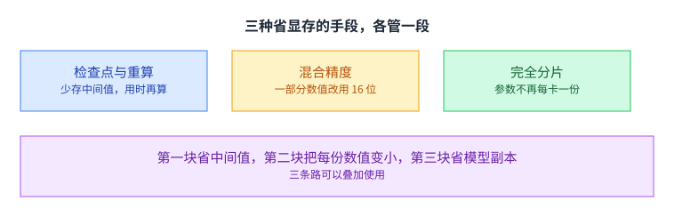

课件把内容分成三块：激活检查点与重算、混合精度、完全分片的数据并行。按它们动的是什么来分：**第一块省的是中间激活值；第二块把每一份数值都变小**（权重、优化器状态、激活值都降位宽）；第三块省的是模型本身的副本。（更正：我原先写「前两块省的是中间值」，那样会让读者以为混合精度只作用于激活值 —— 而课件那份显存底账是三份：权重、优化器状态、中间激活值。）三块作用的对象不重叠，所以可以叠起来用。

这也是这门课里比较特别的一讲：它给的三个手段都很具体，学了就能用，而它们背后的判断方式又都很一致，就是前面几讲反复出现的那句「拿什么换什么」。

课件的组织方式本身也值得留意。它没有把三块内容排成一条递进的线，而是并列成大纲上的三条。这个排法在暗示一件事：它们是三个可以分别打开的开关，而不是三个阶段。你完全可能只用其中一个，也可能三个一起用。

## 推理只要 O(1)，训练却要 O(N)

先把两笔账分清楚。

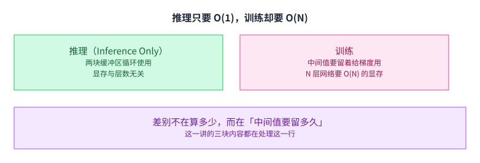

课件先讲了推理的情况：要算一个 N 层深层网络的输出，只要循环使用两块缓冲区就够了，显存占用与层数无关，是一个常数。

训练就不一样。反向传播要用到前向算出的中间值，所以这些值必须留着。课件给的说法是：训练一个 N 层的网络需要 O(N) 的显存。

差别不在算多少，而在中间值要留多久。推理一路往前算，用过的可以立刻扔；训练必须留到反向用过之后才能扔。这一讲的三块内容，都在处理这一行。

再往下想一层：为什么反向一定要用前向的中间值。因为链式法则里每一层的梯度都要乘上这一层的输入或者输出。也就是说，反向不是「重跑一遍」，而是「拿着前向的结果再算一遍」，那些结果因此不能提前释放。理解了这一点，也就理解了为什么检查点这类手段能成立：既然反向要的是「当时的值」，那么只要能在需要的时候把它重新算出来，就不必一直留着。

课件的这一页还放了显存层级的回顾：每核 64 KB 共享内存，寄存器更小，而设备显存是 RTX 3080 的 10 GB 与 RTX 3090 的 24 GB 这个量级。[[term:compute]] 与[[term:throughput]]在这一讲的语境里都退居次要，唯一的稀缺资源是容量。

## 检查点：只把一部分留下

第一个手段针对的正是「留多久」。

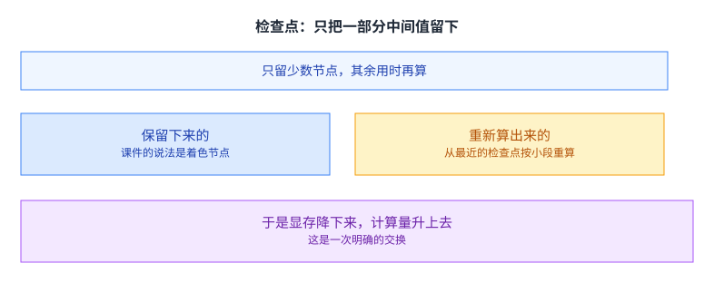

做法是在前向时只保存少数几个节点，课件把它们叫作着色的节点；其余节点在反向需要时，从最近的检查点出发，按小段重新算出来。

于是显存降下来了，计算量升上去了。这是一次方向非常明确的交换，和第 8 讲 FlashAttention 用重算换显存是同一个套路。区别在于第 8 讲重算的是注意力矩阵，这里重算的是一整段网络的前向。

课件把这段过程拆成两步来讲：第 0 步只在少数节点上做标记，第 1 步与第 2 步则在反向需要的时候，按小段把缺失的中间节点补算出来。之所以按段而不是按点，是因为重算一段的开销可以摊到这一段的多个节点上，而单独补一个点的开销几乎等于把那一小段重跑一遍。

## 隔几层放一个检查点

留多少个检查点，是一个可以调的数。

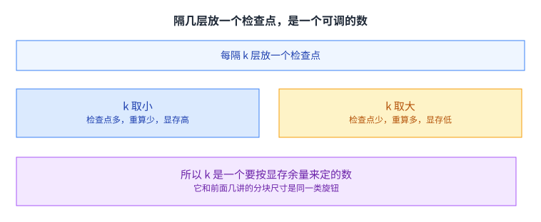

课件给的分析是：N 层的网络里每隔 k 层放一个检查点，前向与反向各自的开销都与这个 k 有关。

k 取小的时候，检查点多，重算少，但留下的中间值多，显存高。k 取大的时候反过来：检查点稀疏，重算多，显存低。所以 k 要按显存余量来定。

极端情形能帮我们看清两端。k 等于 1 就是每个节点都留，等于完全不做检查点，显存占用最高、重算为零；k 等于 N 就是整张网络只留一个入口，显存最低，但反向时要把整张网络重跑一遍。真实系统落在两者之间，而选点的方法通常是先压到显存刚好够用，再看多出来的计算量能不能被接受。

这个旋钮的形状和第 5 讲的块大小、第 8 讲的分块尺寸、第 10 讲的微批次数都是同一类：两头都有代价，中间有一段可用的区间。

课件在这一页给出了前向计算与每段梯度重算的开销表达式。值得留意的是它把「重算」也算进了反向的开销里，而不是当成额外成本：在实际实现里，重算的算子走的就是同一条前向路径，所以它的开销和正常前向没有区别，只是发生在反向期间。

## 16 位浮点有两种格式

第二个手段是混合精度，但它比「全部用 16 位」要细。

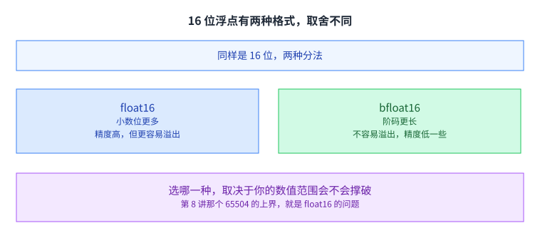

课件把 float16 与 bfloat16 摆在一起比。同样是 16 位，两者的分法不同：float16 留了更多的小数位，所以精度更高，但能表示的范围更窄，更容易溢出；bfloat16 的阶码更长，不容易溢出，代价是精度低一些。

[[term:tensor-core]] 这一类专用单元对这两种格式的支持不一样，所以选哪一种还要看硬件。第 8 讲提到的那个 65504 的上界，就是 float16 的问题。

用一个具体的数感受一下差距：float16 有 10 位小数位与 5 位阶码，bfloat16 有 7 位小数位与 8 位阶码。阶码多三位，能表示的范围就大了好几个数量级；代价是小数位少了三位，能区分的相邻数值变粗。所以训练里常见的做法是：前向反向用 bfloat16 求稳，需要精度的累加与更新留在 32 位。

## 混合精度：不是全都降到 16 位

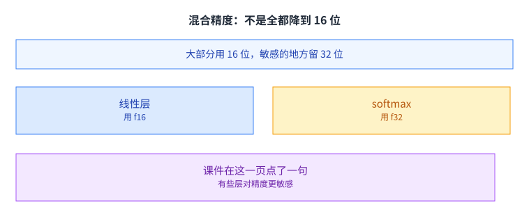

做法是大部分层用 16 位，但把对数值敏感的少数地方留在 32 位。课件举的例子是线性层用 f16、softmax 用 f32。

这个搭配有道理。线性层做的是矩阵乘加，输入输出都在正常范围内，降到 16 位损失的只是精度；而 softmax 里有指数运算，结果对指数的微小变化很敏感，而且要做归一化，留在 32 位更稳。

课件在这一页点了两条：**有些层对动态范围更敏感**，以及**大量元素求和本身也是个常见问题**。（后一条才是 softmax 的中间结果留在 f32 的课件理由；「指数运算加归一化」那个解释是我们的，已在上面说明。）这句话是一条判断依据，而不是一个固定的清单，具体哪几层敏感取决于模型与数值范围。

判断的方法也很直接：看这一层的输出会不会被拿去和很小的数比较，或者会不会经过指数、除法这类放缩剧烈的运算。会的话就留在 32 位；不会的话，16 位的误差在后续算子之间还会被平均掉一部分。[[term:latency]] 与显存在这里是同一个方向上的收益，降精度既省容量也省带宽。（「这是它比另外两个手段更受欢迎的原因」是我们的判断，课件没有把三个手段互相排名；四个大纲页都是并列三条。）

## AllReduce 其实是两件事

后三分之一讲完全分片的数据并行。要理解它，得先把通信原语拆开。

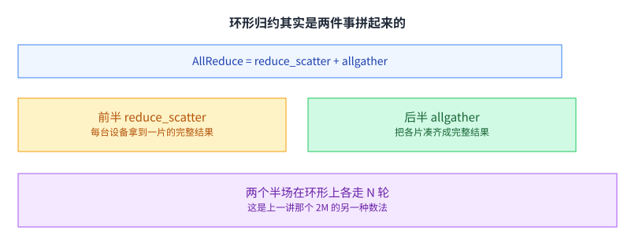

课件把 AllReduce 拆成两个可以单独调用的接口：先做 reduce_scatter，再做 allgather。前半负责把归约的结果按片分发，后半负责把各片凑齐。

为什么值得拆开看。因为在完全数据并行里，我们其实不需要「每个人都拿到完整结果」这件事本身，需要的只是「每个人都拿到自己负责的那一片」；只有等到要用的时候，才临时把某几片凑起来。拆开之后，这个「暂时不需要的部分先不传」就成了一句可以直接写下来的代码。

两个半场在环上各走 N 轮。这正是上一讲那个「每个工人约 2M」的另一种数法：一半花在聚合上，一半花在广播上。

## 前半场：reduce_scatter

上一节把 AllReduce 拆成了两个半场，这一节先看前半场。

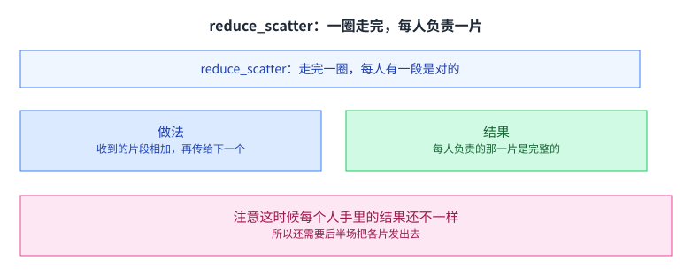

做法是沿着环做流式聚合：每台设备把收到的片段加进自己那份，再传给下一个。走完 N 轮之后，每台设备手上恰好有一片是已经聚合好的完整结果。

这里「流式」这两个字是关键。数据不是先全收齐再统一算，而是每收到一片就立刻加进本地的那一份，然后再传走。于是每一轮里，网络和计算是同时进行的，而不是先等网络再算。这也是这类环形算法能在带宽受限的环境里跑得比较好的原因。

课件把这一刻的状态写得很明确：每个节点都拿到了其中一段的正确归约结果。注意这时候每人手里的结果还不一样，所以还需要后半场。

## 后半场：allgather

前半场结束时，每台设备只握着其中一片的正确结果，剩下几片还是自己的局部值，后半场就是来补这个缺口的。

后半场沿同一个环继续走 N 轮，每台设备把自己负责的那一片传出去。走完之后，所有设备都拿到了完整结果。

课件在这一页问了一句：这个过程的复杂度是多少。算一下就知道，两个半场各走 N 轮，每轮传一片也就是 M/N 个参数，所以每台设备的总收发量是 2M。这个数字里没有 N，也就是可扩展性的来源。

## 三个抽象的接口

课件把三个通信原语并排列了出来。

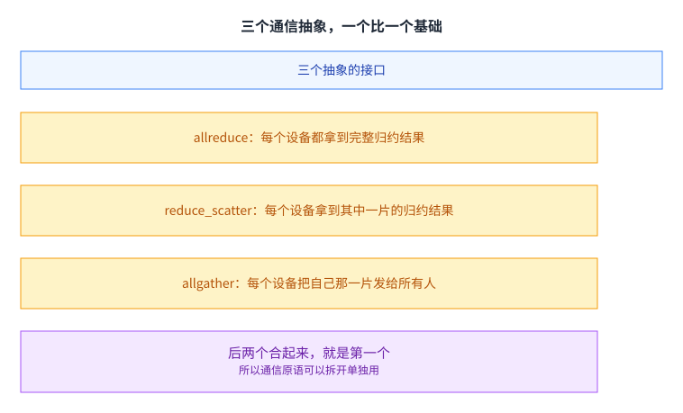

allreduce 让每个设备都拿到完整的归约结果；reduce_scatter 让每个设备只拿到其中一片的归约结果；allgather 让每个设备把自己那一片发给所有人。

后两个合起来就是第一个。这个拆分看起来只是形式上的改写，但它带来一个实际的好处：你可以只调用其中一半。而完全分片的数据并行，正是靠这个好处成立的。

课件在这一页用四个元素的例子把三者走了一遍，从初始值到每一步的中间状态都列了出来。这种逐元素的演示值得看一遍，因为它能验证一件事：这些原语在实现层面完全是数据搬运与加法，没有额外的语义。[[term:hardware-accelerator]] 之间的高速互联之所以重要，就是因为它决定了这些搬运能有多快。

## 完全分片的数据并行

这就是第三块内容。

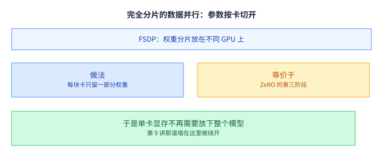

核心做法是把权重分片放在不同的 GPU 上：每块卡只留一部分权重。课件的说法是它的核心想法与 ZeRO 的第三阶段等价。

上一讲那道墙在这里被绕开了。[[term:data-parallelism]] 的前提是每块卡都存一份完整模型，而完全分片把这条前提换成了「每块卡只存一部分，需要时再凑齐」。

这个改动看着只是存储位置变了，实际上改变了扩展性的形状。原来的显存占用与模型大小成正比，与卡数无关；现在每块卡上的占用近似等于模型大小除以卡数，于是加卡真的能装下更大的模型。每块卡上不再有别人也有的那一份。（「零冗余」是第 9 讲那个 ZeRO 的名字；课件在这一页只说它与 ZeRO 第三阶段等价，而 FSDP 自己的名字是「完全分片的数据并行」。）

## 用到哪一层，就把那一层凑齐

那「需要时再凑齐」具体怎么发生。

前向的时候，先用一次 allgather 把这一层的完整权重凑出来，算完立刻丢掉这份完整副本。这里的关键词是「立刻」：如果忘了释放，显存就又回到原来的量级，整个分片就白做了。反向的时候再凑一次，算完之后把梯度用 reduce_scatter 分片归约回去，每块卡只留下自己负责的那一片梯度。

于是通信量上去了，显存降下来了。这正是上一讲 ZeRO 第三阶段的那笔账，只不过在那里它被写成「参数也切开」，而这里把支撑它的通信原语写清楚了。

[[term:ml-framework]] 与[[term:kernel]]的实现在这里也很关键：凑齐权重这件事必须和算子的执行紧密配合，否则每算一个算子就同步一次，通信开销会盖过省下的显存。

工程上常见的优化是把若干相邻的层合并成一次凑齐，让一次 allgather 服务好几层。这样通信次数降下来了，代价是瞬时显存占用变高，因为要同时凑齐更多层的权重。于是这里又出现了一个和前面同形的旋钮：凑多少层，取决于显存余量与网络速度的对比。

## 三种手段的分工

把三种手段放在一起看，它们省的东西并不重叠。

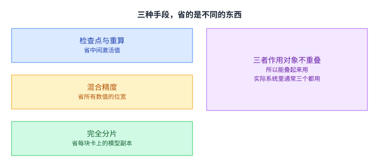

检查点与重算省的是中间激活值；混合精度省的是所有数值的位宽，也就是把每一份都变小；完全分片省的是每块卡上的模型副本。

三者作用的对象不同，所以可以一起用。课件的组织方式本身就说明了这一点：它把三块内容并列成大纲的三条，而不是按顺序推导，因为它们本来就是三个独立的杠杆。

也可以换个角度记：检查点动的是「时间维度」，把现在要存的东西推迟到以后算；混合精度动的是「每一份的大小」；完全分片动的是「同一份东西在几块卡上重复」。三个维度互不相干，所以乘在一起才是总的节省倍数。

实际训练里通常三个都用：精度降到能接受的最低，激活值只留关键几个，参数按卡切开。这三件事加起来，才是今天能训练出大模型的原因。

还要指出一点：三者之间并非完全独立。混合精度把每份数值变小，等价于给后面两个手段都留出了更多余量；检查点省下激活值之后，才有多余的显存去放更大批次。所以调参时通常的次序是先定精度、再定检查点密度、最后定分片策略，因为前一步的结果会改变后一步可用的空间。

## 显存这条线在这里收口

回头看，显存问题在这门课里出现了好几次。

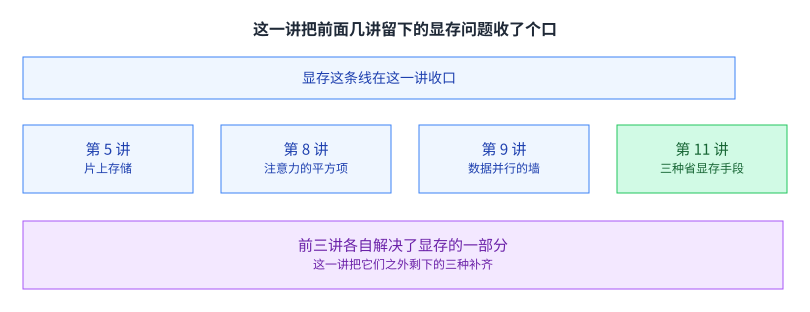

第 5 讲讲的是片上存储怎么用，解决的是「搬得太多次」；第 8 讲把注意力那个平方大小的中间结果消掉，解决的是「中间结果太大」；第 9 讲撞上数据并行的显存墙，并给了 ZeRO；这一讲把剩下三种省显存的手段补齐。

四讲连起来，是一条完整的线索：[[term:machine-learning-system]] 的很多设计取舍，最后都能落到「什么东西放在哪一级存储、留多久」这两个问题上。

这两句话也可以当成一把尺子用。看到一个新的系统设计时，先问它把哪一份数据从哪一级挪到了哪一级、又把它保留的时间缩短了多少。如果两个问题都没有答案，那么这个设计多半只是在换写法，没有真正改变资源占用。

## 读完应该能回答

1. 为什么推理只要 O(1) 的显存而训练要 O(N)，这个差别来自哪一件事。
2. 激活检查点做的交换是什么。请说明留下的与重算的各自是什么。
3. 每隔 k 层放一个检查点，k 取小和取大各有什么后果。
4. float16 与 bfloat16 的差别在哪，各自适合什么情况。
5. 为什么混合精度不是把所有运算都降到 16 位，课件举的搭配是什么。
6. 请说明 AllReduce 与 reduce_scatter、allgather 三者的关系。
7. 完全分片的数据并行在前向与反向各做了一次什么通信，它省下的是哪一份显存。

## 溯源

- 对应：CMU 15-442 / 15-642 Machine Learning Systems，Week 6 — Memory Optimizations（Tianqi Chen、Zhihao Jia 主讲，2026-02-17）。
- 原文课件：https://mlsyscourse.org/slides/11-memory-optimization.pdf
- **一处缺口要说明**：第 2 讲曾登记「第 11 讲会展开显存的两种省法（重算与换出）」，课程表的标题也写着「[[term:tensor]] Rematerialization and **Offload**」。但**这一讲的课件里没有「换出」那一节**：全文检索 offload / swap / cpu / host / pinned 命中全为 0，四个大纲页只有激活检查点与重算、混合精度、FSDP 三块。本课是照源课件的取材范围写的，所以**「换出」这条路在本课里没有展开**；第 2 讲那处的承诺也已同步改成说清这个缺口。
- 上游许可：CC BY-NC 4.0（课程仓库根 LICENSE，19,342 B）。允许翻译与改编，须署名且不得商用。本页未转载原图与整页文字，配图全部自绘。
- 本讲取材范围分三块，与课件的 outline 一致。一是激活检查点与重算：推理只要常数显存、训练需要 O(N)、保留着色节点与按小段重算、每隔 k 层放一个检查点的开销分析。二是混合精度：float16 与 bfloat16 的差别、线性层与 softmax 的不同搭配、以及课件那句「有些层对精度更敏感」。三是完全分片的数据并行：AllReduce 与 reduce_scatter 与 allgather 三个接口、环形归约的两个半场与各 N 轮、三者的整体关系、以及完全分片把权重分片放在不同 GPU 上、前向反向各凑齐一次、课件说它与 ZeRO 第三阶段等价。此外，课件还用一页回顾了显存层级（每核 64 KB 共享内存、RTX 3080 的 10 GB 与 RTX 3090 的 24 GB）。
- 数字与定义以课件页面为准。课件未展开的推论属于 CourseLingo 的讲解，不当作原文引用。这类推论包括：把检查点的 k 与第 5 讲和第 8 讲和第 10 讲的同类旋钮放在一起、把「留多久」提炼成这一讲的主线、把两个半场各 N 轮与上一讲那个 2M 对上、把混合精度的搭配解释成「线性层不敏感而 softmax 敏感」、把三种手段的分工说成作用对象不重叠，以及把显存这条线索在四讲之间串起来。此外，本讲与前后讲次的对应关系属于我们的编排。这里补登记四处先前漏列的判断：**按小段重算比按点重算划算**、**检查点密度 k 的两个极端**（k=1 等于不留、k=N 等于只留入口）、**把相邻若干层合并成一次 allgather**、以及**调参的次序**（先定精度、再定检查点密度、最后定分片策略）。