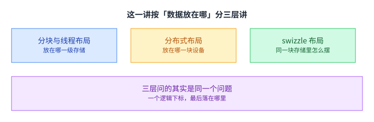
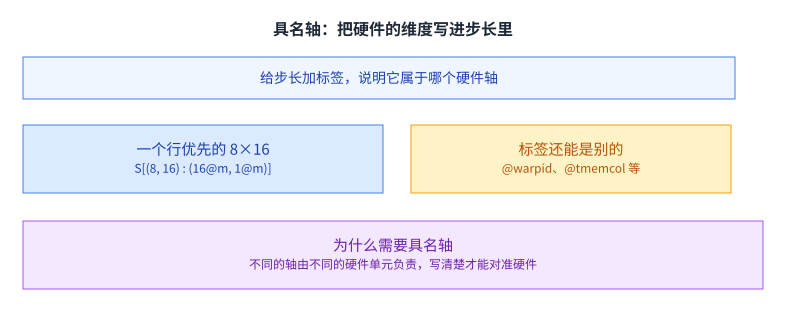
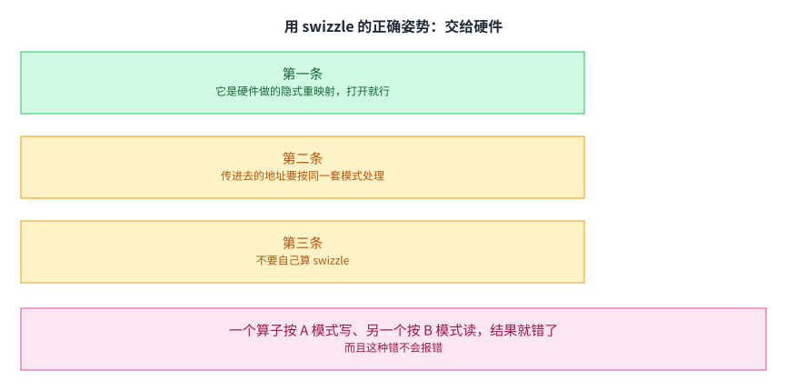

+++
title = "ML 编译器（上）：数据布局"
lecture = 12
slug = "ml-compiler-data-layout"
status = "draft"
source_kind = "slides"
source_url = "https://mlsyscourse.org/slides/data_layout/"
source_title = "Week 7: ML Compiler - Data Layouts（Tianqi Chen、Zhihao Jia 主讲，2026-02-23）"
output_mode = "explanation"
+++

> 来源课程：Carnegie Mellon University 15-442 / 15-642 Machine Learning Systems（Tianqi Chen、Zhihao Jia）；
> 对应讲次：Week 7 — ML Compiler: Data Layouts（Tianqi Chen、Zhihao Jia 主讲，2026-02-23）；
> 原文课件：https://mlsyscourse.org/slides/data_layout/ （网页版，含多个可交互示例）；
> 上游许可：CC BY-NC 4.0（课程仓库根 LICENSE）—— 允许翻译与改编，须署名、且不得商用；
> 本文由 CourseLingo 原创撰写：按课件的推进顺序用中文重新讲解，关键定义处给出英文原文短引，配图为自绘 SVG，未转载原图与整页文字；本文非官方材料，CourseLingo 与 CMU 及本课程教学团队无隶属关系；如与原文有出入，以原文为准。

## 这一讲要解决什么

前面几讲反复出现同一个动作：把数据切成块、搬到更近的地方、让相邻的线程读相邻的地址。这些动作背后有一个共同的东西，课件这一讲把它单独拎出来讲，叫数据布局。

课件的大纲是三条：分块与线程布局、分布式布局、swizzle 布局。前两条管数据放在哪一级存储、哪一块设备，第三条管同一块存储内部的地址顺序。

三层看起来跨度很大，从一块卡内部的寄存器一直到多机，但它们问的其实是同一个问题：一个逻辑下标，最后落在哪里。把这个问题用一套统一的记号写下来，就是这一讲的内容。这套记号也是[[term:ml-framework]]里做布局推导的基础。

课件把这一讲放在 ML 编译器这个系列的开头，而不是放在讲某一类算子的时候。这个位置说明了它的定位：布局不是某个算子的技巧，而是编译器的通用中间表示。有了它，上面几讲讲过的那些优化（分块、融合、分片）才有可能被写成不依赖具体硬件的变换。

## 从逻辑下标到物理位置

课件的定义很短：数据布局是把逻辑下标映射到数据所在的物理位置。

这里的「物理位置」有两种含义，课件都提到了。一种是一维内存里的某个偏移，也就是 `A[i, j]` 这种下标最后换算成内存地址的第几个字节；另一种是落在哪一块设备、哪一块存储上，课件在这一页补了一句「或者不同的设备」。

为什么这件事值得单独讲。因为同一份数据可以有很多种摆法，而摆法决定了后续能不能算得快。第 5 讲的分块、第 8 讲的分块重算、第 11 讲的权重分片，说的都是选一种摆法。

也可以反过来看：同样一段计算，如果布局选得不对，那么无论算子写得多精巧，性能都会被访存拖住。前面几讲里那些「优化之后快了好几倍」的例子，很大程度上是在换布局，而不是在换算法。[[term:latency]] 的高低，在很多情况下就是布局对不对的直接反映。

## 形状-步长：一种把布局说清楚的写法

课件用的记号来自 CuTe，并做了一点简化。

写法是 `S[(形状) : (步长)]`。课件给的例子是 `S[(4, 4) : (4, 1)]`，意思是这个张量的两个维度各有 4 个元素，第一个维度的步长是 4，第二个维度的步长是 1。

地址算起来就是各下标乘各自步长再相加：`i × 4 + j × 1`。所以 `A[2, 3]` 落在偏移 11 的位置。课件在页脚注明这套记号是 CuTe 的简化版，差别是本讲采用行优先的顺序。

这套写法的好处是把「形状」和「摆放」分开了：形状说的是数据有多少，步长说的是它在内存里怎么走。同一个形状配不同的步长，就是不同的布局。

课件的交互示例里，同一个矩阵可以按不同的步长摆成好几种样子，而逻辑下标始终是那一个。这就是「布局」这个词的准确含义：它描述的是一份数据与它的物理落点之间的关系，而不是数据本身。[[term:tensor-core]] 这类单元对数据摆放有额外要求，而这些要求最后都要落到步长上。

顺带一句：这套记号是给编译器看的，不是给人手算的。人的作用是说明「我想要什么样的摆放」，把它翻译成步长的工作交给[[term:ml-framework]]去做。

## 分块布局：在形状-步长上再叠一层

分块听起来是个新概念，其实用形状-步长就能表达。

课件给的例子是把 8 乘 8 的矩阵按 2 乘 4 分块。做法是把原来的形状重写成 `(4, 2, 2, 4)`：第一个 4 是行方向有多少块，第二个 2 是块内的行，第三个 2 是列方向有多少块，第四个 4 是块内的列。

对应的步长是 `(16, 4, 8, 1)`。下标也要跟着重写，从原来的 `(i, j)` 变成 `(i//2, i%2, j//4, j%4)`，也就是整除与取余各算一次。

把 `A[2, 3]` 代进去：行方向 i 等于 2，除以 2 得 1、余 0；列方向 j 等于 3，除以 4 得 0、余 3。于是偏移是 1 乘 16 加 0 乘 4 加 0 乘 8 加 3 乘 1，等于 19。课件把这一步叫分块布局的推导。

这也说明了为什么[[term:compute]]这一侧的工作最后会落到布局上：分块的收益要靠布局兑现，而布局是可以被形式化推导的，不必靠手算。

课件的交互示例允许拖动块大小，观察形状与步长怎么跟着变。那种「拖动一下就看到地址公式变了」的体验，比记住公式本身更有用：它说明布局是一个可以搜索的空间，而编译器要做的正是在这个空间里找一组好的取值。

## 具名轴：把硬件的维度写进步长里

到这一步，步长还只是数字。而真实的[[term:hardware-accelerator]]有很多种「轴」：同一块张量内存里的 lane 与列、不同线程、不同的 warp。

课件的做法是给步长加标签。一个行优先的 8 乘 16，写成 `S[(8, 16) : (16@m, 1@m)]`，其中 `@m` 表示「普通内存」这个轴。标签也可以换成别的东西，比如 `@warpid` 或者 `@tmemcol`。

为什么需要具名轴。因为不同的轴由不同的硬件单元负责，步长是 16 还是 1 只说明数值关系，不说明这段数据归谁管。加上标签之后，布局才能和硬件结构对上。

## 线程与寄存器：两级具名轴

课件给的第二个例子同时用到了两种轴。

`S[(8, 4, 2) : (4@laneid, 1@laneid, 1@reg)]` 里，前两段步长标着 `@laneid`，说明这部分由同一条线程内的不同 lane 分担；最后一段标着 `@reg`，说明它落在寄存器上。

这一步的意义在于：第 6 讲讲的「线程坐标」在这里变成了布局的一部分。也就是说，「谁算哪一块」不再是一段独立的映射代码，而是同一个布局记号里的一段。

这种统一带来一个直接的好处：编译器可以对布局做变换，而不必分别处理「数据怎么摆」和「谁算哪一块」这两件事。

课件的这个例子也是一个提醒：线程映射不是一层额外的、与数据无关的胶水，它和数据摆放是同一件事的两面。第 6 讲讲线程坐标时，那是从「谁在算」的角度描述；这一讲从「数据在哪」的角度描述同一个结构。

## 分布式轴：从一块卡扩到多块卡

同一套记号还能往上长一层。

课件给了两个轴名，`@gpuid_y` 与 `@gpuid_x`，用来表示数据落在哪一块设备上。加了这一层轴之后，同一套记号能同时描述卡内的摆放与卡间的分配。

[[term:data-parallelism]]、张量并行、流水线并行这些概念，在这套记号里就是设备轴上的不同切法。这一点在第 9、10 讲已经分别讲过，这里补上的是它们的统一写法。

## 复制：不是切开，而是各留一份

切分之外还有一种情况：数据在多块设备上各留一份完整的。

课件用 `R` 表示复制的维度。例子是 `R[2 : 1@gpuid_x]`，意思是这份数据在 `gpuid_x` 这个轴上有两份完全相同的副本，而不是被切开。

区分这两件事很要紧。切分意味着每块设备只有一部分，所以要通信才能凑齐；复制意味着每块设备都有完整的，不需要通信，但显存被重复占用。

课件的复制示例是一张 8 乘 8 的矩阵放到 2 乘 2 的 GPU 网格上。它的布局写成 `S[(2,4,8) : (1@gpuid_y, 8@m, 1@m)] + R[2 : 1@gpuid_x]`：前一段把数据切成两半分给 `gpuid_y` 上的两块卡，后面的 `R` 项则说明 `gpuid_x` 这一维上两块卡拿的是同一份数据。一张矩阵因此同时用上了两种不同的「多卡」关系。

这正是第 9 讲 ZeRO 与第 11 讲完全分片要处理的那条取舍。[[term:latency]] 与显存在这里被摆到了同一个天平的两端，而 R 这个记号把「我选了复制」这件事显式写了出来。

把复制写成记号的一部分，还有一层工程上的好处：编译器可以算出哪些通信是多余的。如果两个算子之间传递的数据在所有设备上本来就一样，那么它们之间的通信可以直接删掉。这类「因为布局而免费的优化」，正是把布局显式化的回报。

## 内存 bank：能并行读的前提

回到一块存储内部，课件讲了一个很具体的硬件事实。

不同 bank 可以被并行读出；判断规则是地址对 bank 数取模，落在同一个 bank 上的访问只能排队。

这条规则本身很简单，麻烦在于默认的行优先布局经常会让它踩雷。因为行优先的矩阵里，相邻的列在内存里是连续的，而相邻的行隔着一整行的距离。所以顺序读一行没问题，顺序读一列就可能全撞在同一个 bank 上。

课件把这一页放在 swizzle 之前讲，顺序上是有讲究的：先让人看清冲突长什么样，再给解法。如果先讲 swizzle，读者会以为它是个锦上添花的技巧，而实际上它是很多内核能不能跑满带宽的前提。

## 一次冲突的例子

课件用四个 bank 给了两组对照。

第一组是依次读地址 0、1、2、3：四个地址对 4 取模分别是 0、1、2、3，落在四个不同的 bank 上，可以并行。课件的两张图把这两种情况的 bank 活动都画了出来：第一种是四条同时亮，第二种只有一条反复亮。

第二组是读 0、4、8、12：四个地址对 4 取模都是 0，全落在同一个 bank 上，只能排队。同样是四次访问，花的时间可能差好几倍。

而第二种形状在矩阵运算里非常常见。按列访问一个行优先的矩阵，步长恰好就是行宽，于是就变成了这样。[[term:throughput]] 的损失就出在这里。

还有一个细节值得留意：这四次访问的地址间隔是 4，正好等于 bank 数。所以它们全都落在同一个 bank 上。如果 bank 数是 8 而步长是 4，那么四次访问会落在两个 bank 上，冲突减半但仍然存在。也就是说，冲突的严重程度取决于步长与 bank 数的最大公约数。

## swizzle：给地址做一次重映射

解法叫 swizzle。既然麻烦出在「地址怎么算」，那么解法也只能从地址上找。

做法是在地址里做一些位的交换，把本来会撞到同一个 bank 的一批访问打散到不同 bank 上。

它改变的是「地址落在哪个 bank」，不改变「存了哪些数据，算出来是什么」。所以它是一种纯粹的访存优化：和精度无关，和结果无关，只和快慢有关。

「位的交换」这个说法也解释了它为什么很快：交换几个位是纯组合逻辑，不需要查表，也不需要额外的存储。

也需要说清楚它的边界。swizzle 打散的是地址，不能凭空增加并行度：如果一批访问本来就需要读同一份数据，那么怎么重映射都还是要串行。它能解决的只是「本来不冲突、却因为摆放而撞在一起」这一类问题。

## 课件给的实例：SWIZZLE_128B

课件给的收益是：fp16 下一次能无冲突地访问 8 行与 8 列。也就是说，原本只能顺序访问的列方向，被打开成了可以并行访问的形状。

而这一句是这一节的落点：swizzle 本质上是一种让列方向访问变高效的手段，而这个想法并不只属于 GPU 的共享内存。任何有 bank 结构的存储都会遇到同一个问题。

为什么是 8 行 8 列这个形状。因为 fp16 的一个元素占 2 字节，8 列就是 16 字节，正好是一个 128 字节事务的八分之一；而 bank 的宽度也是按字节定的，于是 128B 这个模式恰好把这 8 行铺到 8 个不同的 bank 上。这个数字不是随便取的，它是存储宽度与元素大小共同决定的结果。

## 用 swizzle 的正确姿势

课件最后给了三条建议。

第一条，它是硬件施加的隐式重映射，打开即可。这一条听起来像是「什么都不用做」，但它其实是三条里最容易出错的一条：既然重映射是隐式的，那么代码里就看不出来数据被搬到了哪里，出问题时也无从对照。第二条，把已经 swizzle 过的地址传进去，并在各个算子之间保持一致的模式，课件举的模式是 SWIZZLE_128B。这一条也解释了为什么跨算子传数据时要连布局一起传：地址一旦被重映射过，接收方就必须知道用的是哪一套映射。第三条，不要自己算 swizzle。

三条合起来是一个词：一致。如果一个算子按 A 模式写数据，另一个算子按 B 模式读，读出来的就是错位的内容。而且这种错不会报错，只会静默地算错。

## 三种布局的分工

把这一讲的内容收一下。到这里，三种布局各自解决的问题已经清楚，接下来看它们为什么可以共用一套记号。

分块与线程布局管「数据在一块卡内部怎么摆」，分布式布局管「数据在哪几块卡上」，swizzle 管「同一块存储里的地址顺序」。三者解决的问题不一样，但用的是同一套记号。这一点也解释了[[term:kernel]]这一类底层代码为什么越来越依赖布局推导：手写的地址计算既容易出错，也很难在不同硬件之间搬。

这也是把布局当成一等公民的好处：从寄存器到多机，编译器只需要处理一种对象，而不必为每一层单独写一套映射逻辑。第 13 讲会看到这套记号怎么用在 GEMM 上。[[term:machine-learning-system]] 里那些看起来自动的优化，前提就是布局可以被形式化地描述和变换。

## 读完应该能回答

1. 课件对数据布局的定义是什么，「物理位置」有哪两种含义。
2. 请用 `S[(4, 4) : (4, 1)]` 说明 `A[2, 3]` 的偏移是怎么算出来的。
3. 8 乘 8 的矩阵按 2 乘 4 分块之后，形状与步长各变成什么，下标要怎么重写。
4. 具名轴解决的是什么问题，请举两个具体的轴名。
5. `R[2 : 1@gpuid_x]` 表达的是什么，它与切分有什么区别。
6. bank 冲突是怎么产生的，为什么按列访问一个行优先的矩阵容易撞 bank。
7. swizzle 改变了什么、不改变什么，课件说使用时最要紧的是什么。

## 溯源

- 对应：CMU 15-442 / 15-642 Machine Learning Systems，Week 7 — ML Compiler: Data Layouts（Tianqi Chen、Zhihao Jia 主讲，2026-02-23）。
- 原文课件：https://mlsyscourse.org/slides/data_layout/ （网页版 reveal.js 课件；正文的若干示例是嵌套的交互页面）（课件号的对照见第 8 讲溯源；本页一律用仓库讲次号指路。）
- 上游许可：CC BY-NC 4.0（课程仓库根 LICENSE，19,342 B）。允许翻译与改编，须署名且不得商用。本页未转载原图、整页文字与任何交互示例，配图全部自绘。
- 证据来源与提取方式：本讲的源是一份网页课件，正文之外的说明分散在若干被嵌入的交互页面里。本页用到的依据有两部分：一是课件主页面（`mlsys-deck-datalayout.html`）上的小节标题与文字段落；二是它嵌入的六个说明页面，分别是「为什么需要布局」「形状-步长记号」「分块布局的推导」「复制的布局」「内存 bank 冲突」「线程与寄存器布局」。两部分的原文都缓存为本地的 HTML 文件，逐字比对的是这两份 HTML 里的可见文字。
- 本讲取材范围分三块。第一块是记号：数据布局的定义与两种物理位置、形状-步长记号的写法与它的来源（课件的说法是 CuTe 的简化版、采用行优先）。第二块是分块与线程：8×8 按 2×4 分块的推导（形状 (4,2,2,4)、步长 (16,4,8,1)、A[2,3] 落在 19）、具名轴与 @m 与 @warpid 与 @tmemcol、线程与寄存器的两级轴、分布式轴 @gpuid_x 与 @gpuid_y、复制维度 R 的写法。第三块是 bank 与 swizzle：内存 bank 的并行读取与取模规则、0/1/2/3 与 0/4/8/12 两组对照、swizzle 的重映射性质、SWIZZLE_128B 的收益与「这个想法不只属于共享内存」这句、使用 swizzle 的三条建议。
- 数字与定义以课件页面为准。课件未展开的推论属于 CourseLingo 的讲解，不当作原文引用。这类推论包括：把分块收益与布局推导联系起来、把具名轴的价值解释成「让布局能与硬件结构对上」、把「布局统一记号」说成编译器只需处理一种对象、把切分与复制的取舍与第 9 讲和第 11 讲对上、把 bank 冲突解释成「行优先矩阵按列访问」的必然后果，以及把位交换的廉价性归因于组合逻辑。此外，本讲与前后讲次的对应关系属于我们的编排。
- 一处需要说明的取舍：课件的交互示例（可点击的分块与线程分配演示、swizzle 的 8×8 演示等）本页没有复现，也没有转载；正文对它们的描述只依据这些页面上的可见文字与标题，没有依据动画过程本身。