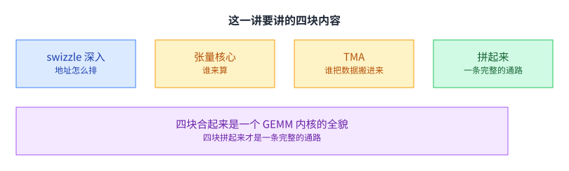
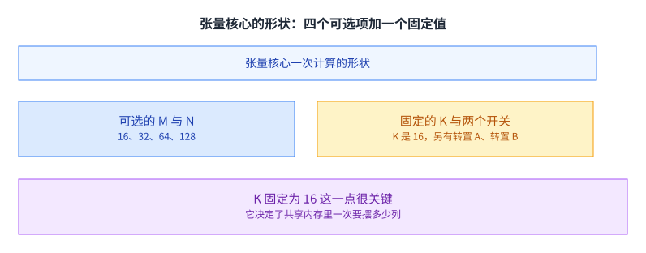
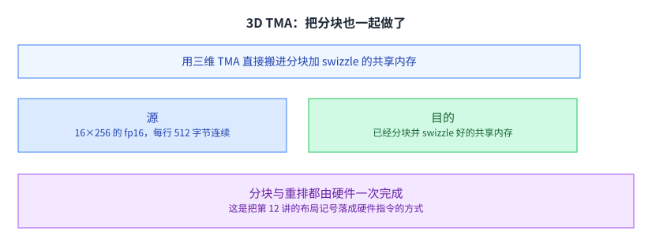
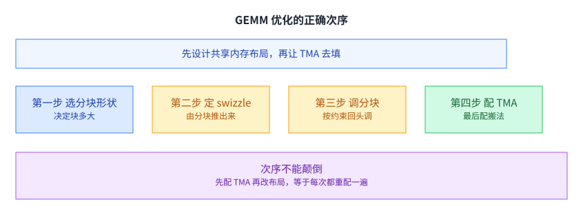
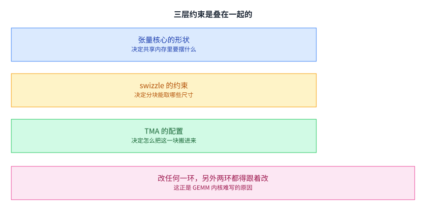
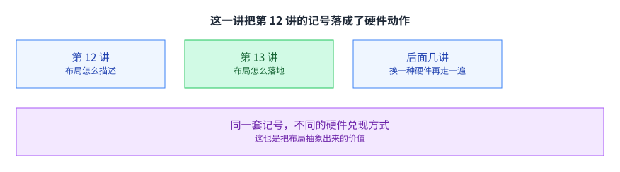

+++
title = "ML 编译器（下）：现代 GPU 上的 GEMM"
lecture = 13
slug = "ml-compiler-gemm"
status = "draft"
source_kind = "slides"
source_url = "https://mlsyscourse.org/slides/modern-gpu-gemm/"
source_title = "Week 7: ML Compiler - GEMM on Modern GPUs（Tianqi Chen、Zhihao Jia 主讲，2026-02-25）"
output_mode = "explanation"
+++

> 来源课程：Carnegie Mellon University 15-442 / 15-642 Machine Learning Systems（Tianqi Chen、Zhihao Jia）；
> 对应讲次：Week 7 — ML Compiler: GEMM on Modern GPUs（Tianqi Chen、Zhihao Jia 主讲，2026-02-25）；
> 原文课件：https://mlsyscourse.org/slides/modern-gpu-gemm/ （网页版，含多个可交互示例）；
> 上游许可：CC BY-NC 4.0（课程仓库根 LICENSE）—— 允许翻译与改编，须署名、且不得商用；
> 本文由 CourseLingo 原创撰写：按课件的推进顺序用中文重新讲解，关键定义处给出英文原文短引，配图为自绘 SVG，未转载原图与整页文字；本文非官方材料，CourseLingo 与 CMU 及本课程教学团队无隶属关系；如与原文有出入，以原文为准。

## 这一讲要解决什么

上一讲把数据布局讲成了一套记号。这一讲看这套记号在真实硬件上是怎么兑现的，用一个具体的算子：矩阵乘，也就是 GEMM。

课件的大纲是四条：swizzle 深入、张量核心、TMA（张量内存加速器）、把三者拼起来。这个顺序不是随意的，它正好是一条数据从全局内存走到计算单元的路。

[[term:kernel]] 写得好不好，很大程度上就取决于这条路有没有走顺。这一讲会看到，四块内容之间的耦合比想象中紧：选分块会牵动 swizzle，选 swizzle 会牵动 TMA 的配置，而 TMA 的配置又反过来限制分块。

这一讲也是本课程里少有的、把一个真实算子的完整优化路径走一遍的地方。前面几讲给的是通用手段，这一讲给的是一个完整例子：从「数据摆在哪」一直到「哪条指令把它搬进来」。[[term:compute]] 在这一层不再是一个速率数字，而是「共享内存里那一块有没有在正确的时间就位」。

## 回顾：8×8 的 swizzle

上一讲最后的例子是 8 乘 8 的方块。

做法是对列号做一次异或，目的是让同一列的多行落在不同的 bank 上。上一讲讲了它的动机，这一讲要把它推到真实硬件的尺寸。

推的方向是尺寸。8 乘 8 只是一个便于画图的最小例子，真实硬件的共享内存与张量核心都有各自的宽度，重映射的粒度必须和它们对上。

课件的这一页在结构上是一个转折点：前面讲的都是「怎么描述布局」，从这里开始讲的是「布局必须满足哪些硬性条件」。描述给出的是可能性，而条件是约束，两者合起来才是工程师面对的实际情况。

## swizzle 原子：8 行、8 个扇区列

课件给了一个新词，叫 swizzle 原子。

定义是 8 行乘 8 个扇区列，合起来是 8 个 128 字节，也就是 8 个 bank 扇区。课件特意说明，它把「一个扇区里的所有 bank 缩成一格」来画，只是为了让地址算起来简单。

这个尺寸不是随便定的。8 行乘 8 个扇区正好铺满一次无冲突访问需要的跨度：每一行落在 8 个不同的扇区上，8 行合起来就把整个原子覆盖了一遍。

需要留意「扇区」这个单位与 bank 的关系。一个扇区由若干个 bank 组成，所以「一个扇区里的所有 bank 缩成一格」这件事并不改变地址计算，只是让图上少画几列。课件特意交代这一点，是为了让读者不至于把扇区数当成 bank 数。

## 那个公式：列号与行号做一次异或

重映射本身只有一行。

课件的写法是 `swizzled_col = logical_col XOR row`。列号与行号做一次异或，得到重映射之后的列号。

为什么用异或。因为同一列的不同行，与同一个行号异或之后，结果必然各不相同，也就必然落在不同的扇区上。这是异或这个运算的性质，不需要额外的判断。

为什么可逆。因为异或两次就还原。这意味着不需要额外的存储来记录映射关系，硬件只要在地址通路上加几个异或门就行。可逆性是它能做成组合逻辑的前提。

## 反过来：swizzle 给分块加了约束

到这里 swizzle 看起来是一份免费的午餐。课件下一页就指出它不是。

既然地址要被重映射，那么分块就不能随便切。课件给的约束是：共享内存的分块尺寸要**与 swizzle 原子对齐**（也就是分块在行方向与扇区方向上都要能被原子整除），否则重映射会把一批地址映射到块外去。课件还给了一条补救做法：**尺寸对不齐时，可以改用更小的那个 swizzle 原子**（`swizzle_atom_general` 那一页讲的就是这件事）。（更正：我原先只写「必须能被 swizzle 原子整除」，比课件更含糊，也漏掉了这条补救做法。）

这条约束在后面会一路传下去。它先限制了共享内存的分块尺寸，再通过分块限制 TMA 的配置方式。也就是说，选 swizzle 不是优化的最后一步，而是中间的一步，它会把限制往回传。

课件把「分块加 swizzle 的探索页」和「swizzle 原子」放在相邻两页，用意就在这里：一个让读者试各种分块尺寸，另一个给出允许的尺寸集合。试过之后会发现，不是所有看起来合理的分块都能用。

## 张量核心的形状

第二块内容是计算单元本身。

课件给的参数表是：M（输出的行）与 N（输出的列）各可以是 16、32、64、128 四档，K 固定是 16，另外还有两个开关：是否转置 A、是否转置 B，这一点在讲布局时很要紧。

K 固定为 16 这一点很关键。它意味着无论你怎么选 M 和 N，共享内存里每一次要摆出来的都是 16 列。[[term:tensor-core]] 这个固定的内部形状，正是决定共享内存布局的第一约束。而 这也解释了为什么这类单元需要专门的布局：通用 ALU 对数据摆放没有要求，而张量核心的输入是以一个固定形状的小块送进去的，摆错了就得多几个周期。

## 张量核心为什么正好需要 swizzle

课件把两件事对上了。

张量核心从共享内存里读的是一个 M 乘 16 的小块，而这个读取需要一次 8 乘 8 的无冲突访问，正好是 swizzle 能保证的。

课件还算了一笔：这个 8 乘 8 就是 8 个 16 字节的格，swizzle 之后恰好无冲突。也就是说，swizzle 的原子尺寸与张量核心的读取粒度是同一个数量级，两者是配套设计的，不是凑巧。

这类「硬件的两个部分互相配合」的设计在 GPU 里很常见。理解它有一个实际好处：当你要换一种计算模式时，先看这个模式能不能被塞进 8 乘 8 这个格子，就能大致判断它能不能跑满。

课件在这一页还把 A 的分块画成了 2 乘 2 个 8 乘 8 的小块。这个画法说明一件事：那个 M 乘 16 的读取并不是一整块连续的内存，而是由若干个小块拼起来的。于是「无冲突」这个要求必须对每一个小块都成立，这也是原子尺寸不能随意缩小的原因。

## TMA：一条指令搬一整块

第三块内容是数据搬运。

课件说 TMA 是带可选 swizzle 的硬件二维拷贝，一条指令就能完成，不需要线程参与。

它省掉的是「一堆线程去搬数据」这件事。在此之前，把一块数据从全局内存搬进共享内存需要整个块协作：每个线程算自己要搬哪些元素，还要同步一次。TMA 把这一整套压成了一条指令。

省下线程也有第二层好处：那些本来负责搬数据的线程，现在可以去算别的东西。在第 6 讲讲协作加载时，「谁搬哪一块」是一个要手工安排的细节；到了 TMA 这一代（也就是 Hopper 架构的 H100），这件事从程序里消失了。

课件给的指令写法是 `cp.async.bulk tensor.2d` 加上 `SWIZZLE_128B`。这一行也说明了前面几讲反复讲的那件事：越接近硬件的抽象，参数就越具体；而越具体的参数，越需要前面的布局推导把它算出来。

它顺带做的是重排。因为搬运的目标地址可以带一个 swizzle 模式，于是数据在搬进来的同时就已经按无冲突的布局摆好了。

把「搬」和「排」合成一步，省下的不只是一点时间。原来那套做法里，线程搬完数据之后必须同步一次，而同步会让快线程等慢线程；现在这条依赖被硬件内部消化掉了，线程只需要在数据到达之后开始算。

课件给的例子是：全局内存里一块 16 乘 128 的 fp16，每一格是 16 字节，也就是 8 个 fp16；经过 TMA 之后，共享内存里就是已经 swizzle 好的 8 乘 8 扇区。

## 3D TMA：把分块也一起做了

再进一步，是把分块也交给硬件。

课件给的用法是用三维 TMA 直接搬进已经分块好的共享内存。全局内存那边是一块 16 乘 256 的 fp16，每一行是连续的 512 字节。

多了第三维之后，硬件一次就能完成「按块切」与「按模式重排」两件事。课件把源那一侧的行宽 512 字节也标了出来，因为这正是它比二维版本多出来的信息：硬件需要知道从哪里断开一行。这正是把第 12 讲那套布局记号落成硬件指令的方式：记号里写的分块与 swizzle，在硬件上就是一条 TMA 指令的两个参数。

[[term:hardware-accelerator]] 这一层的趋势在这里能看得很清楚：越来越多本来由程序员写的循环与地址计算，被搬进了硬件单元的参数里。

这对写内核的人意味着什么。意味着工作的重心从「怎么算」转移到了「怎么描述」。你需要说清楚的是「我想要一块 16 乘 256 的数据，按 128B 的模式摆好」，而不是写出一段循环去把这件事做出来。

## 为什么偏好 128B

swizzle 有很多种格式，课件专门讲了为什么默认选 128B。

课件从两侧各给了一条理由。张量核心那一侧：任何 swizzle 格式都能用，因为一个 16 乘 16 的块可以拆成任意大小的原子。全局内存那一侧：原子的每一行在全局内存里是连续的，所以行越宽，读的次数越少、每次读的越大，带宽就用得越好。

两条线一交，结论就出来了：SWIZZLE_128B 给出每行 128 字节连续，是这两条约束下最好的默认值。课件的限定条件是：除非分块宽度小于 64 个 fp16。

这个「两侧各退一步取交点」的推理方式值得留意。前面几讲的旋钮大多是一侧有代价、另一侧有收益，而这里是两侧都倾向同一个方向，只是有一个下限。

课件在图里做了一件事：它把不同格式下原子的每一行在全局内存里的连续长度高亮出来，让读者直接看到「更宽 = 更长的连续段」。这种把参数与后果在图上连起来的做法，比记住一个结论更可靠。

那个「小于 64 个 fp16」的限定也有具体的来由：64 个 fp16 正好是 128 字节。如果分块的宽度比这还窄，那么按 128B 的模式去搬，每一行都会读进用不到的字节，多出来的部分反而浪费带宽。

## GEMM 优化的正确次序

课件把上面这些串成了一条工作流。

课件给的次序是：先设计共享内存的布局，再去配置 TMA 来填满它。展开成四步就是：选分块形状、定 swizzle、按约束回头调分块、最后配 TMA。

次序不能颠倒的原因在第三步。选完 swizzle 之后分块可能要回头调整，如果你已经按旧分块配好了 TMA，那么这一步的改动就要把配置重做一遍。

[[term:ml-framework]] 做自动调优时遇到的就是这个组合问题：三个选择互相约束，不能各自独立地取最优。这也是为什么这一类内核的自动搜索空间需要被约束，而不是把三个维度直接做笛卡尔积。

## 端到端的数据通路

课件最后给了一条完整的通路。

数据通路是：TMA 把全局内存里的分块搬进共享内存，张量核心从共享内存里读出两块做乘加，结果写进 C。课件注明 B 的搬运路径被省略了，因为它和 A 完全一样。

课件在这一页标出的是**三级**，而不是两级：**N 方向的分块**、以及把 K 方向拆成的 **Outer K 与 Inner K**。

**更正一处**：我原先写「两重循环：外层是 N 方向的分块，内层是 K 方向的分块」，把 K 那一级当成了单层。课件标的是 Outer K 与 Inner K 两级，所以连同 N 方向一共三级。

这个区分不只是数数：「K 方向的每一轮都要换一块新的 A 和 B」这句话**只对 Outer K 成立**。Inner K 是在已经搬进共享内存的那一块里继续切，不需要重新搬。共享内存之所以要反复被填，是 Outer K 在推进，而这个填充动作就是 TMA 的工作。

于是共享内存的容量与分块尺寸就在这里互相牵制。块分得大，每一轮的计算量更大、访存更少，但共享内存可能摆不下两块同时在飞的 A 与 B；块分得小，共享内存宽裕，但每一轮的计算量不足以把张量核心喂饱。这个权衡与第 5 讲的分块、第 8 讲的分块尺寸是同一类。

还有一个不那么显眼的收益：因为 TMA 是异步的，填下一块与算当前块可以重叠。于是「共享内存在某一时刻够不够」这件事，其实取决于有没有把填充提前安排好。

[[term:latency]] 与[[term:throughput]]在这条通路上被安排得很紧凑：数据只在全局内存、共享内存、张量核心三级之间流动，每一级都有明确的职责。上限就取决于这三级的配合有没有卡住。

## 三层约束叠在一起

把这一讲的内容收一下。

张量核心决定了共享内存里要摆成什么形状，swizzle 反过来约束了分块能取哪些尺寸，TMA 的配置要同时满足前两条。三者不是三个独立步骤，而是一条链。

这就是现代 GEMM 内核难写的真正原因。它不难在算术上，而难在这几条约束互相咬住：改任何一环，另外两环都得跟着改。而这也是自动生成内核的价值所在：人很难同时把三条约束记在脑子里，而编译器可以。

第 20 讲要讲的内核超优化，走的就是这条线：把可选的实现方案写成搜索空间，让机器去试。而搜索空间划得好不好，取决于有没有把这几条约束写进去——写漏一条，搜出来的方案就会在真实硬件上跑不起来。

## 这一讲与第 12 讲的关系

第 12 讲讲了布局怎么描述，这一讲讲了布局怎么落地：swizzle 对应地址重映射，张量核心对应计算单元，TMA 对应数据搬运。

后面几讲会换一种硬件再走一遍同样的路，而思路不变。[[term:machine-learning-system]] 里那些换硬件的适配工作，本质上就是把同一套布局记号在不同硬件上重新兑现一遍。这也是把布局抽象出来的价值。

## 读完应该能回答

1. swizzle 原子是什么尺寸，课件为什么强调它把扇区缩成一格来画。
2. 重映射公式 `swizzled_col = logical_col XOR row` 为什么用异或，可逆性带来了什么好处。
3. swizzle 给分块加了什么约束，这条约束会往下传到哪一步。
4. 张量核心的 M、N、K 各有什么可取值，哪一项是固定的，为什么这一点重要。
5. 张量核心为什么正好需要 swizzle，请从读取粒度说明。
6. TMA 省掉了什么，三维 TMA 又多做了什么。
7. 为什么默认选 SWIZZLE_128B，两侧各自的理由是什么。

## 脉络回顾

前面十几讲给的都是可以带走的手段：怎么分块、怎么把布局写下来、怎么让搬与算重叠。这一讲把这些手段第一次合成一条完整的路，一个算子从数据摆在哪儿一直走到哪条指令把它搬进来，中间不跳步。它值得单独占一讲的原因在结尾才显出来：三条约束互为条件，共享内存里摆成什么形状由张量核心定，swizzle 反过来限制分块能取哪些尺寸，TMA 的配置又要同时满足前两条，改一环要动两环。人很难同时把三条记住，于是这一讲留下的不只是写法，还有一个方向：把这几条约束写成搜索空间，让机器去试。第 20 讲接的正是这一步，约束漏写一条，搜出来的方案在真实硬件上就跑不起来。

## 溯源

- 对应：CMU 15-442 / 15-642 Machine Learning Systems，Week 7 — ML Compiler: GEMM on Modern GPUs（Tianqi Chen、Zhihao Jia 主讲，2026-02-25）。
- 原文课件：https://mlsyscourse.org/slides/modern-gpu-gemm/ （网页版 reveal.js 课件；正文的说明分散在若干嵌套的交互页面里）（课件号的对照见第 8 讲溯源；本页一律用仓库讲次号指路。）
- 上游许可：CC BY-NC 4.0（课程仓库根 LICENSE，19,342 B）。允许翻译与改编，须署名且不得商用。本页未转载原图、整页文字与任何交互示例，配图全部自绘。
- 证据来源与提取方式：本讲的源是一份网页课件。本页用到的依据有两部分：一是课件主页面的小节标题与文字段落；二是它嵌入的说明页面。**更正一处计数**：主页面实际嵌入了 **12 个**本地 iframe（我原先写成九个，那是我们当时取到的页数）。12 个是：`demo/swizzle_8x8`、`demo/swizzle_128B`、`demo/swizzle_atom_128b`、`demo/swizzle_atom_general`、`demo/tiling_exploration`、`demo/tensor_core_shapes`、`demo/tensor_core_to_swizzle`、`demo/tma_copy`、`demo/tma_3d`、`demo/why_128b`、`demo/gemm_workflow`、`demo/gemm_endtoend`。本页依据的是其中与取材范围对应的那些（张量核心形状、张量核心与 swizzle、两种 TMA、为什么偏好 128B、工作流、端到端、两种 swizzle 原子、以及分块探索页）。两部分的原文都缓存为本地的 HTML 文件，逐字比对的是这两份 HTML 里的可见文字。
- 本讲取材范围分四块，与课件的 outline 一致。一是 swizzle 的深入：8×8 的回顾、swizzle 原子的尺寸（8 行 × 8 个扇区列 = 8 × 128B）、`swizzled_col = logical_col XOR row`、以及 swizzle 反过来加给分块的整除约束。二是张量核心：M 与 N 的四个取值（16、32、64、128）、K 固定为 16、两个转置开关、以及「读 M×16 需要 8×8 无冲突」这条对应。三是 TMA：带可选 swizzle 的硬件二维拷贝、一条指令不需要线程、16×128 fp16 的搬运例子、三维 TMA 搬进分块加 swizzle 的共享内存、16×256 fp16 每行 512 字节这个例子。四是拼起来：为什么偏好 128B（两侧各自的理由与「分块宽度小于 64 个 fp16」这个限定）、四步工作流、以及端到端的数据通路与两重循环。
- 数字与定义以课件页面为准。课件未展开的推论属于 CourseLingo 的讲解，不当作原文引用。这里补记四处先前漏列的机制级展开：把 swizzle 的收益解释成「把同一列的多行打散到不同 bank」、把「地址要被重映射所以分块不能随便切」这层因果写出来、把 Inner K 与 Outer K 的差别说成「要不要重新搬」，以及把 TMA 的填充动作与 Outer K 的推进绑在一起。这类推论包括：把可逆性解释成「不需要额外存储」的前提、把三块内容的耦合说成一条约束链、把硬件与布局配套的设计说成可以据此判断新模式能不能跑满、把工作流的次序不可颠倒归因于第三步的回调、把自动调优的困难说成组合约束、以及把「换硬件适配」归结为同一套记号重新兑现。此外，本讲与前后讲次的对应关系属于我们的编排。
- 一处需要说明的取舍：课件的交互示例（可点击的分块探索、swizzle 的逐周期读取演示、张量核心形状选择器等）本页没有复现，也没有转载；正文对它们的描述只依据这些页面上的可见文字与标题，没有依据动画或交互过程本身。