+++
title = "LLM 服务技术（上）：连续批处理、PagedAttention 与 RadixAttention"
lecture = 14
slug = "llm-serving-1"
status = "draft"
source_kind = "slides"
source_url = "https://mlsyscourse.org/slides/14-LLM-serving-part1.pdf"
source_title = "Week 9: LLM Serving Techniques Part 1: Continuous Batching, PagedAttention, RadixAttention（Tianqi Chen、Zhihao Jia 主讲）"
output_mode = "explanation"
+++

> 来源课程：Carnegie Mellon University 15-442 / 15-642 Machine Learning Systems（Tianqi Chen、Zhihao Jia）；
> 对应讲次：LLM Serving Techniques Part 1: Continuous Batching, PagedAttention, RadixAttention；
> 原文课件：https://mlsyscourse.org/slides/14-LLM-serving-part1.pdf ；
> 上游许可：CC BY-NC 4.0（课程仓库根 LICENSE）—— 允许翻译与改编，须署名、且不得商用；
> 本文由 CourseLingo 原创撰写：按课件的推进顺序用中文重新讲解，关键定义处给出英文原文短引，配图为自绘 SVG，未转载原图与整页文字；本文非官方材料，CourseLingo 与 CMU 及本课程教学团队无隶属关系；如与原文有出入，以原文为准。

## 这一讲要解决什么

前面几讲讲的是怎么把模型训出来。这一讲换到另一个场景：模型已经训好，现在有很多人同时在用它。

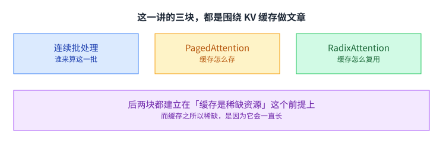

课件的大纲是三条：连续批处理、PagedAttention、RadixAttention。前一条管「这一轮算哪些请求」，后两条管「算过的中间结果怎么存、怎么复用」。

后两条都建立在一个前提上：[[term:kv-cache]] 是这一类系统里最稀缺的资源。而它之所以稀缺，是因为它在生成过程中会一直长大，而长到多大事先并不知道。

## 生成式推理的两个阶段

先把推理的形状说清楚。

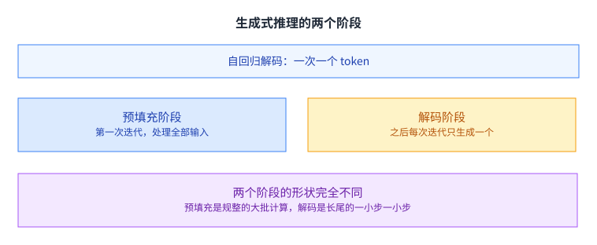

课件给的划分是：预填充阶段是第一次迭代，一次把全部输入 token 处理完；解码阶段是其余每一次迭代，每一步只生成一个 token。

两个阶段的形状完全不同。预填充是一次规整的大批计算，输入的长度是已知的；解码则是长尾的一小步一小步，每一步只算一个 token，却要读前面全部 token 的键与值。

课件的演示把这条时间线画了出来：左边一段是预填充，很短；右边是很长一串解码步。这个形状也解释了为什么两者要用不同的策略处理：预填充是计算密集的，解码是访存密集的，前者关心算力，后者关心带宽。

这个「一大多小」的形态是所有后续问题的根源。批处理要处理的是「很多个这样的一步一步」怎么排；缓存管理要处理的是「每一步留下的那些键与值」放在哪里。

这一讲的内容大多被做进了[[term:ml-framework]]与推理引擎里，而不是写在模型代码里。[[term:machine-learning-system]] 在这里的职责很清楚：模型不动，变的是它外面那一圈。

## 为什么服务起来又慢又贵

课件用了三个数字。

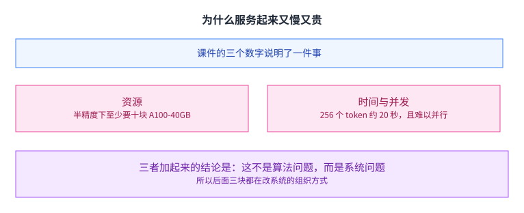

半精度下服务 1750 亿参数的 GPT-3，至少需要十块 A100-40GB。生成 256 个 token 要大约 20 秒。而且没法并行处理很多请求。这三个数字背后是[[term:latency]]与[[term:throughput]]的双重受限：单次生成的速度上不去，同时能服务的请求数也上不去。

三个数字放在一起说明的是同一件事：这不是算法问题，而是系统问题。这三个数字也解释了为什么这个方向后来成了独立的一类系统研究：它要解决的问题与训练完全不同，用的手段也不同。模型的算术量是固定的，但怎么把 GPU 用起来、怎么把显存放好，是可以改的。[[term:compute]] 在这里是够的，缺的是把算力组织起来的那一层。

课件后面三块内容，改的都是这一点。它们没有动模型，动的是请求怎么组织、缓存怎么管理。

## 静态批处理为什么浪费 GPU

最直接的做法是把一批请求打包一起算。

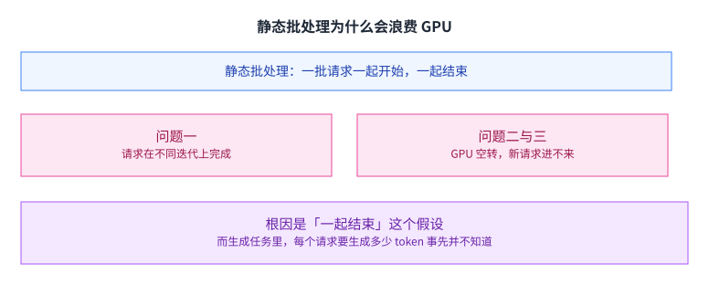

课件列了三个问题：不同请求会在不同的迭代上结束；于是 GPU 出现空转周期；新的请求也不能立刻进来。

根因在「一起结束」这个假设。如果一批请求必须同时开始、同时结束，那么这一批的整体时间就由最慢的那一个决定，而快的那几个在这段时间里白占着位置。

更麻烦的是，在生成任务里每个请求要生成多少 token 事先并不知道。有的请求几个 token 就结束了，有的要生成几百个。也就是说，这种「长短不一」不是异常情况，而是常态。

## 连续批处理：每一步都重新组队

课件给的解法叫连续批处理。

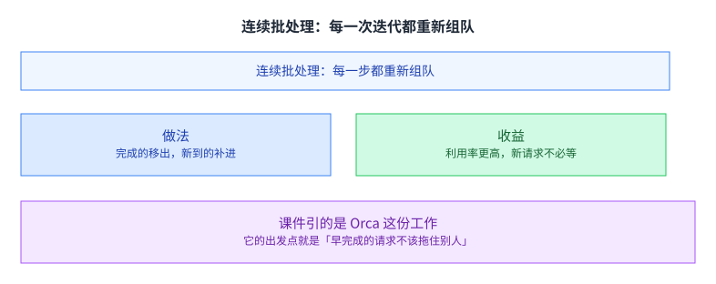

做法是不再等整批结束，而是每一步都重新决定这一轮算哪些请求：已经完成的移出去，新到的补进来。

课件给的收益是两条：GPU 利用率更高，新请求可以立刻开始。第二条是第一条的直接结果：不再需要等待整批结束，也就没有那段空转。

课件在这一页引了 Orca 这份工作。它的出发点就是「早完成的请求不该拖住别人」，这也是这一块最核心的那句判断。

## 逐步看一遍

课件用了五页演示连续批处理。

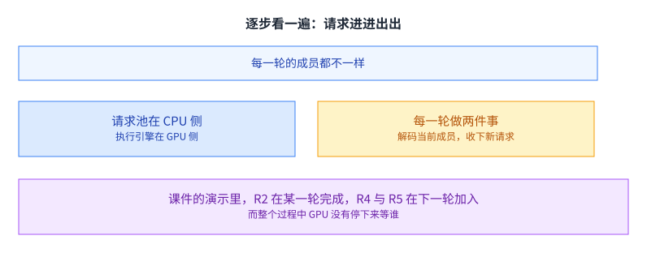

演示里有五个请求 R1 到 R5。开始时 R1 与 R2 进来，第一轮解码它们；接着 R3 到达，同时 R1 与 R2 各生成了新的 token；再下一轮，R4 与 R5 加入，而 R2 在这一轮完成并离开。

课件的每一页都在图里标出两件事：这一轮的解码集合，以及请求池里新到的那几个。把五页连起来看，能看出「成员一直在变」这条特征，也能看出它为什么不会让 GPU 空转：任何一轮都有一批请求可算。

值得留意的是每一轮的成员都不一样。这不是实现上的不优雅，而是这套机制的本质：批的边界从「一次请求的处理」变成了「一次迭代」。

课件的演示里，GPU 侧从来没有停下来等过谁。这是连续批处理真正要达成的东西：让 GPU 一直有活干。

## KV 缓存会一直长

第二块内容从缓存的形状开始。

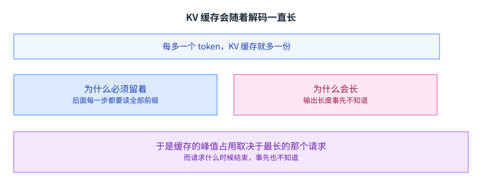

每生成一个 token，它的键与值就要被存下来，因为后面每一步都要读全部前缀。这一点在第 8 讲已经出现过：那一步要读前面所有 token 的键与值。

于是缓存的大小随序列长度线性增长，直到请求结束才释放。而麻烦在于，请求什么时候结束、最终会长到多长，都是事先不知道的。

一个必须留、又不知道要留多久的东西，就是资源管理问题的典型形态。后面的两节都是在处理它。

从另一面看，这也是「预测不准」带来的代价。如果能提前知道每个请求要生成多长，那么按长度分配就够了，分页这套机制也就不必要。而真实的负载里，输出长度既取决于输入，也取决于采样策略，甚至同一个请求两次运行都可能不一样。

## 静态分配：按最大长度预留

最直接的分配方式是按上限要。

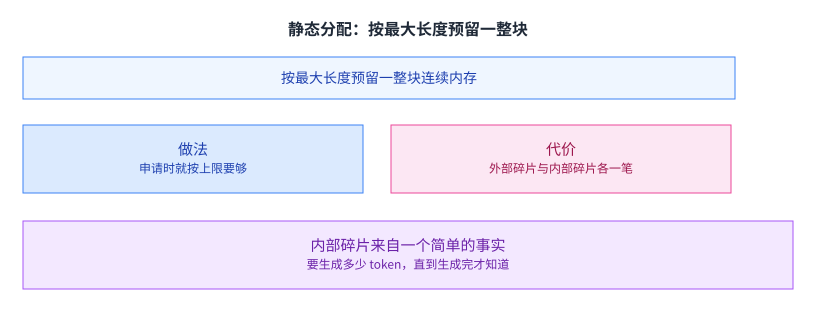

课件给的做法是提前给请求分配一整块连续内存，大小按它能生成的最大长度算。

代价是两笔碎片。一笔是内存碎片：因为每块大小不一，分配与回收之后会留下空洞。另一笔是内部碎片：你按最大长度要了，但实际只用了一小部分，剩下的就是空的。

课件的演示把这两笔分开画：外部碎片是那些再也拼不回一整块的小空洞，内部碎片则是每一块里空着的尾巴。两者都会让可用的显存变少，但成因不同，缓解的办法也不同。

内部碎片的来源是一个简单的事实：要生成多少 token，直到生成完才知道。所以「按最大长度预留」这个动作，本质上是在为一件不确定的事预留确定的空间。

## 浪费有多严重

这不是小数点后面的问题。

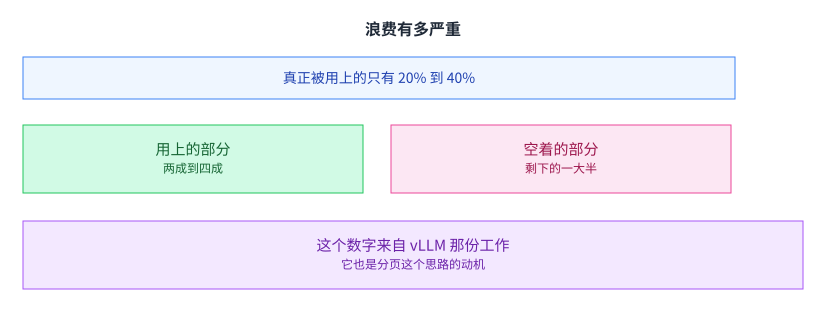

课件引 vLLM 的数字：KV 缓存里真正用来存 token 状态的只有 20% 到 40%。

也就是说，一大半的显存是空着的。而这些显存本来可以用来放更多请求，或者放更长的上下文。

在服务这个场景里，显存直接等于并发数：能同时装下多少个请求的 KV 缓存，就能同时服务多少个用户。所以这里的浪费不是「多花点钱」，而是「能服务的用户数少了三分之二」。

这个数字也解释了为什么分页这个思路值得从操作系统搬过来：当浪费超过一半时，改分配方式比改模型更有效。

课件的这一页还顺带说明了一件事：这 20% 到 40% 不是某个实现写得不好，而是「按最大长度预留」这个策略本身的下限。换一个实现，只要策略不变，浪费的比例就在同一个量级。

## PagedAttention：把分页搬过来

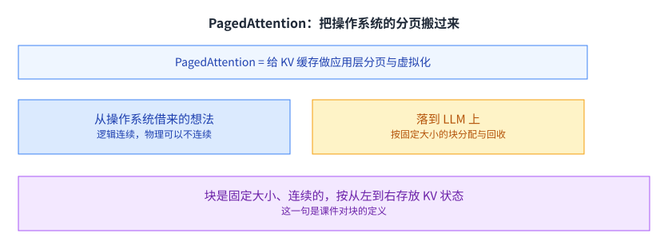

课件的定义是：给 KV 缓存做应用层的分页与虚拟化。

这个思路直接借自操作系统：让逻辑上连续的东西，在物理上可以不连续。操作系统用页表把两者对上，这里用块表。

课件用一张进程与物理页的对照图来说明这件事：**两个进程**各自的地址空间是连续的，而它们真正的物理页交错分布。把这张图里的「进程」换成「请求」、把「页」换成「块」，就是 PagedAttention 的全部机制。（更正：我原先写「三个进程」，而课件那张图上只有两个，标的是 `Process A` 与 `Process B`。）

落到 LLM 上，就是按固定大小的块来分配与回收。课件对块的定义是：一块固定大小、连续的内存，按从左到右的顺序存放 KV 状态。也就是说，块内部仍然是连续的，不连续的是块与块之间的关系。

这一层抽象之所以成立，是因为注意力这个运算是「可加」的：它不要求所有数据物理上挨在一起。[[term:kernel]] 里按块取数据这件事也因此不需要额外的拷贝步骤。

## 虚拟化之后，注意力怎么算

课件给了两步。

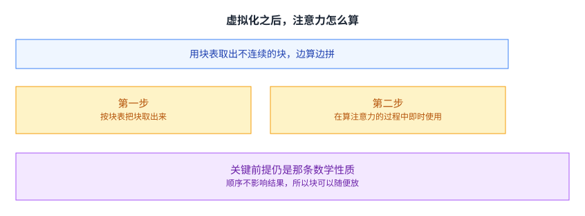

第一步，用块表把那些物理上不连续的块取出来。第二步，在算注意力的过程中即时使用它们，而不必先把它们拷到一块连续内存里。

课件又一次点出了那个关键前提：注意力满足结合律与交换律。第 8 讲讲 Flash-Decoding 时，同一条性质也被用来支持「把键值切成小块分别算再合并」。

同一条数学性质在三个地方被用上：分块计算、按块管理、跨请求复用。这不奇怪，所有「把整体拆开再拼回去」的手法都要靠它。

## 分页之后的两个碎片改善

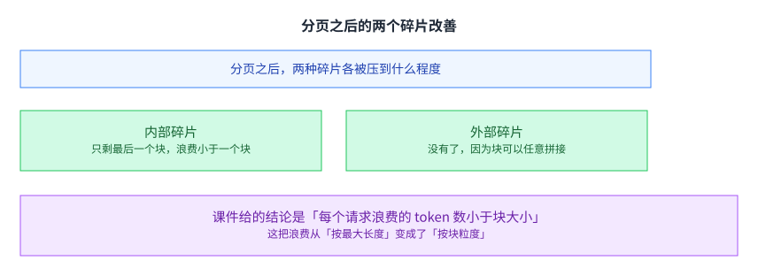

内部碎片只剩下最后一个块：因为块大小固定，一个序列只会用满若干个块，最后那个块可能没填满，浪费的 token 数小于一个块大小。外部碎片则完全消失，因为块可以放在任何位置，不需要找到一块连续的空间。

课件给的结论是「每个请求浪费的 token 数小于块大小」。这句话把浪费的粒度从「按最大长度」改成了「按块」，两者差着一个数量级。

块的大小本身也是一个可调的数。块大一点，块表更短、管理开销更小，但每个请求最后那块浪费得更多；块小一点，浪费更少，但块表变长、查找更频繁。这个旋钮的形状与本课程里前面出现过的那些完全一样：两头都有代价。

这也是一个值得记住的模式：当碎片问题严重时，把分配粒度变小往往比提高分配算法的聪明程度更有效。

这件事和[[term:hardware-accelerator]]里的分块是同一个思路：把大块拆成小块，管理的灵活性就上来了。区别只在于，这里的「块」是软件概念，而硬件那边是真实的存储单元。

## RadixAttention：把前缀复用起来

第三块内容问的是另一个问题：这些缓存能不能不只服务一个请求。

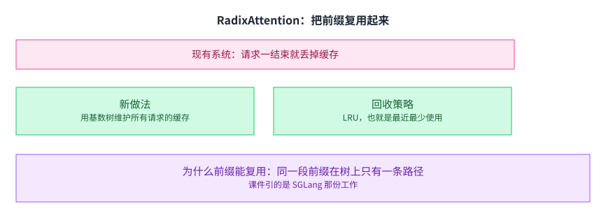

课件先指出现在的做法：一个请求结束，它的 KV 缓存就被丢掉了。可是很多请求之间共享着同一段前缀，比如同一个系统提示词，或者同一段被反复引用的上下文。

这类共享在实际负载里非常多。课件列的三个场景逐字是：(a) 少样本示例、(b) 多轮对话的历史、以及 **(c) 自一致性**（让同一个问题采样出多条推理路径再投票，于是这些路径共享同一段提示）。它们的共同点是前缀很长、而且会被重复用到很多次。

**更正一处**：我原先把第三类写成「需要反复引用同一段材料的结构化程序」，那不是课件列的那一类。

新做法是 RadixAttention：用一个基数树，也就是紧凑前缀树，对所有请求维护一份 LRU 缓存。两个请求如果前缀相同，它们在树上走的是同一条路径，于是那段前缀的键与值只需要算一次。

为什么前缀能复用，因为树上同一条路径对应的就是同一段 token 序列。这也是树这个结构在这里的意义：它天然地把「共同的前缀」表示成了「共同的路径」。

课件用**三页**（连成一段共九帧）演示了带前缀共享的注意力计算。（更正：我原先写「两页」。）和 PagedAttention 一样，这里用到的仍然是那条结合律与交换律：前缀那一段可以独立算好、存起来，后面接上的部分再在它之上继续算。

课件引的是 SGLang 那份工作。和第 8 讲一样，这一页的原图未转载，本页的配图为自绘。

## 别忘了 CPU 这一侧

课件最后回到一个容易被忽略的地方。

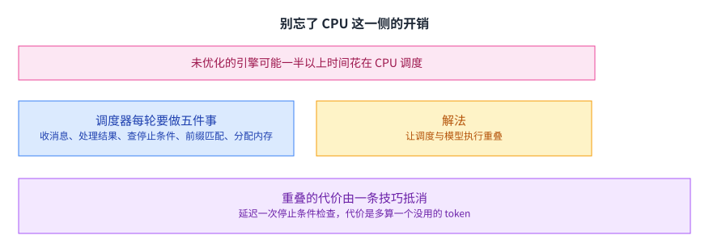

课件指出：一个没优化好的推理引擎，可能有一半以上的时间花在 CPU 调度上。也就是说，GPU 在等 CPU 决定下一步做什么。

课件把调度器每一轮的工作列成五件事：收下用户的输入消息、处理模型侧返回的结果、检查停止条件、做前缀匹配与请求重排、为下一批分配内存。

解法是让调度器与模型执行重叠起来。课件说 `run_batch` 是非阻塞的，所以调度可以在 GPU 算的同时进行。

课件把要重叠的两件事写得很具体：一边是 GPU 上的 `run_batch`，另一边是 CPU 上的 `process_batch_result`。前者把一批请求送进模型，后者把上一批的结果收回来、更新状态。两者可以并行，因为它们操作的对象不同。

重叠有一个代价：调度器在决定下一批发什么时，还不知道上一批里哪些请求已经结束。课件的解法是延迟一次停止条件检查：先假设某个请求还没结束、把它放进下一批，等结果回来再判断。代价是多算一个没用的 token，换掉等待的时间。

这是一笔很小的账，但它很典型：在多机与多卡系统里，为了消除等待，往往愿意多算一点。第 9 讲与第 10 讲里的那些通信优化，走的也是同一条路：宁可多做一点计算，也不要让设备空等。

## 读完应该能回答

1. 预填充与解码两个阶段的形状差别是什么。
2. 静态批处理的三个问题与根因。
3. 连续批处理改了什么，使它同时提高了利用率并让新请求不必等待。
4. KV 缓存为什么必须留着、为什么会长，其中哪一件是未知的。
5. 静态分配造成哪两种碎片，内部碎片的来源是什么。
6. PagedAttention 从操作系统借了什么想法，它成立靠的是注意力的哪条性质。
7. RadixAttention 用基数树解决了什么问题，为什么前缀能在树上被复用。

## 脉络回顾

训练那一侧的问题在前十几讲里基本处理完了，剩下的一半是模型训好之后同时被很多人使用。这一场景里最稀缺的资源是显存里的键值缓存，因为它在生成过程中一直长大，而会长到多大事先并不知道，按最大长度预留就等于把大部分显存空占着。转折在于解法不用自己发明，把操作系统那一套搬过来就够：分页让逻辑上的连续与物理上的连续分开，显存可以按需一块块给；前缀相同的请求在树上走同一条路径，那段键值只算一次。两件事的收益都来自不再按最坏情况预留。第 16 讲接着问解码本身为什么慢，第 17 讲则要点出提示变长在推理侧就是这块缓存变长。

## 溯源

- 对应：CMU 15-442 / 15-642 Machine Learning Systems，LLM Serving Techniques Part 1: Continuous Batching, PagedAttention, RadixAttention（Tianqi Chen、Zhihao Jia 主讲）。
- 原文课件：https://mlsyscourse.org/slides/14-LLM-serving-part1.pdf
- 上游许可：CC BY-NC 4.0（课程仓库根 LICENSE，19,342 B）。允许翻译与改编，须署名且不得商用。本页未转载原图与整页文字，配图全部自绘。
- 课件引了三处外部材料，本页照原样标注且未转载原图：Orca（连续批处理那一节）、vLLM（KV 缓存利用率那一页）、SGLang（RadixAttention 与 CPU 开销那几页）。
- 本讲取材范围分四块：推理的形态与动机（两个阶段与课件给的三个数字）；连续批处理（三个问题、两条收益、R1 到 R5 的演示、Orca 的出处）；KV 缓存管理（动态增长、两笔碎片、20% 到 40%、块与块表、分页后的改善）；以及前缀复用与 CPU 开销（基数树与 LRU、调度器每轮的五件事、重叠隐藏开销、多算一个 token）。
- 数字与定义以课件页面为准。未展开的推论属于 CourseLingo 的讲解。一是因果判断（一大多小说成根源、根因是「一起结束」、分页的成功归于浪费超过一半）。二是提炼出的模式（长短不一是常态、「碎片靠改小分配粒度」、多算一个 token 换掉等待）。三是跨讲联系（同一数学性质用在三处、分页与硬件分块对比）。四是四处机制级展开（把进程与物理页那张图类比到请求与块、前缀复用的收益与前缀长度成正比、三条场景的共同点是前缀长且反复用到、前缀共享的依据是结合律与交换律）。本讲与前后讲次的对应关系属于我们的编排。
- 与第 16 讲的关系：两份 PDF 各自独立（part1 与 part2），页码各自从 1 开始，主题不重叠，故未做切分；但 part2 有一页与 part1 同名同图。