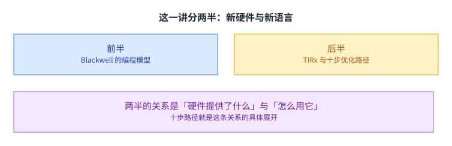
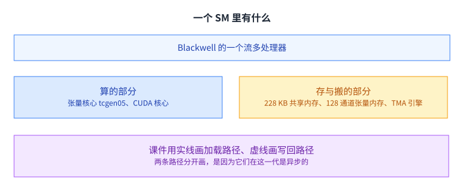
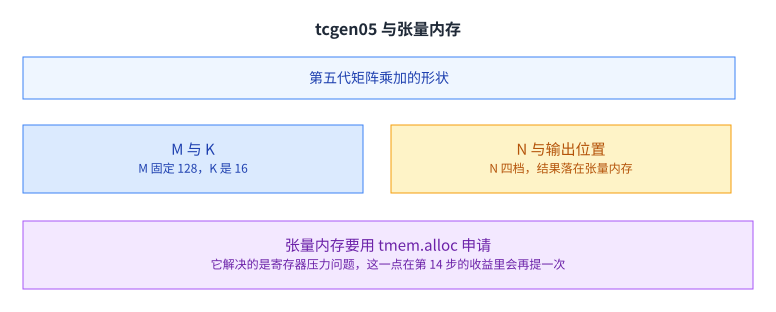
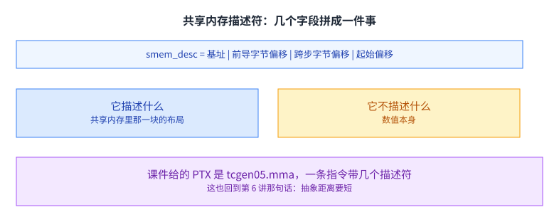
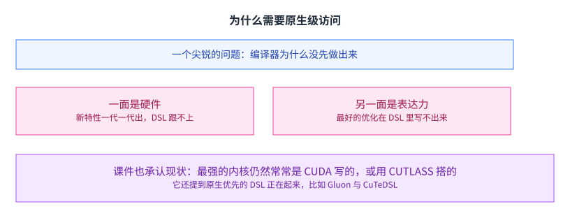
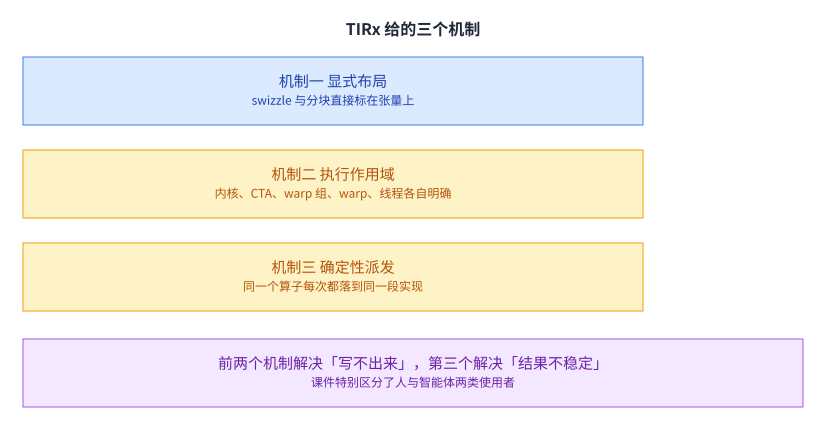
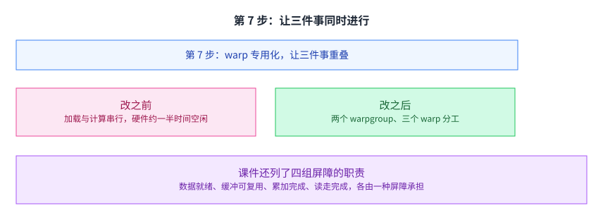
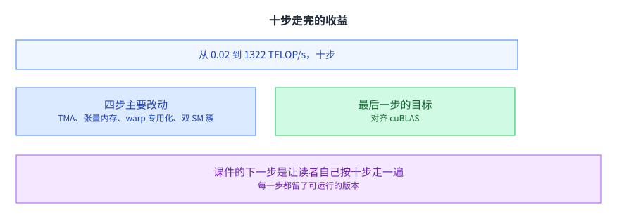

+++
title = "Blackwell GPU 与 TIRx"
lecture = 15
slug = "blackwell-tirx"
status = "draft"
source_kind = "slides"
source_url = "https://mlsyscourse.org/slides/tirx-gemm/"
source_title = "Week 9: Blackwell GPU and TIRx（Tianqi Chen、Zhihao Jia 主讲，2026-03-11）"
output_mode = "explanation"
+++

> 来源课程：Carnegie Mellon University 15-442 / 15-642 Machine Learning Systems（Tianqi Chen、Zhihao Jia）；
> 对应讲次：Week 9 — Blackwell GPU and TIRx（Tianqi Chen、Zhihao Jia 主讲，2026-03-11）；
> 原文课件：https://mlsyscourse.org/slides/tirx-gemm/ （网页版，含多个可交互示例）；
> 上游许可：CC BY-NC 4.0（课程仓库根 LICENSE）—— 允许翻译与改编，须署名、且不得商用；
> 本文由 CourseLingo 原创撰写：按课件的推进顺序用中文重新讲解，关键定义处给出英文原文短引，配图为自绘 SVG，未转载原图与整页文字；本文非官方材料，CourseLingo 与 CMU 及本课程教学团队无隶属关系；如与原文有出入，以原文为准。

## 这一讲要解决什么

第 13 讲在一个具体硬件上把 GEMM 写了一遍。这一讲换到更新的一代硬件，同时换一个角度：不只是「怎么写快」，而是「写成什么样才写得出来」。

课件分两半。前半讲 Blackwell 这一代 GPU 的编程模型：多出了张量内存、TMA 引擎、以及一套基于屏障的异步协调机制。后半讲 TIRx 这套语言怎么把这些写出来。

把两半连起来的是一条十步的优化路径：从最朴素的同步内核开始，每一步只改一件事，最后对齐商用库的性能。这条路径是这一讲最有价值的部分，因为它把「怎么调」变成了一串有序的动作，而不是一堆可以任意尝试的技巧。

## 一个 SM 里有什么

先看硬件。课件用一张可点击的架构图把这一代 SM 的组成摊开，这里按它列出的单元讲。

课件的架构图列出这些单元：张量核心（`tcgen05`，第五代矩阵乘加）、CUDA 核心（浮点与整数运算）、每个 SM 228 KB 共享内存、128 条通道的张量内存、寄存器堆、TMA 引擎，以及外部的全局内存。

和前面几讲见过的 SM 相比，多出来的是张量内存与 TMA 引擎。这也解释了为什么这一讲讲得比第 13 讲更细：多出来的两个单元改变了数据通路，而通路变了，写法也得跟着变。

两个新单元各自解决一类问题。张量内存解决的是「累加结果放在哪里」：矩阵乘的输出不再占用寄存器，于是可以有更多的 warp 同时驻留。TMA 引擎解决的是「谁来搬数据」：搬运从一组线程的协作变成一条指令，于是线程可以去干别的。

课件的图里用实线画加载路径、虚线画写回路径。把两者分开画不是画法上的讲究，而是因为在这一代硬件上它们是异步的：加载和写回可以同时进行，也各自需要自己的完成通知。

## GEMM 的数据通路

把一次矩阵乘的每一步标在架构图上，通路就很清楚了。

A 与 B 从全局内存经 TMA 进共享内存；张量核心从共享内存取数，把累加结果写进张量内存；再由寄存器取回、做类型转换、写回共享内存；最后经 TMA 写回全局内存。

这条通路比第 13 讲见过的长。多出来的两级是张量内存与 TMA 引擎，而每一级都要有对应的同步手段，否则你不知道数据是不是已经到了。这也解释了为什么后半要花那么多篇幅讲屏障：通路越长，需要被通知的边界就越多。

## tcgen05 与张量内存

先看算的那一部分。

课件给的形状是：M 固定为 128，N 可以是 16、32、64、128 四档，K 是 16。A 与 B 来自共享内存，结果 C 落在张量内存里，按 128 条通道（对应 M）与若干列（对应 N）分配。

和第 13 讲讲过的张量核心相比，最大的差别是结果不落在寄存器里，而落在一块专门的存储里。课件在最后总结时点出了它的价值：张量内存避免了寄存器压力，而且派发可以由单个线程完成。

这两点合起来意味着：一个 warp 里只有一个线程需要发这条指令，其余线程可以去干别的。这是后面 warp 专用化能成立的前提。[[term:tensor-core]] 这一层的演化方向，就是不断把「谁来发指令」「结果放哪里」这两件事重新安排。

## 共享内存描述符

张量核心要读共享内存里的数据，但这条指令不能带一堆地址参数。

课件给的描述符是几项按位拼起来的：基址、前导字节偏移、跨步字节偏移、起始偏移。它描述的是共享内存里那一块的布局，而不是数值本身，这一点和上一讲的描述符是同一个思路。

写成 PTX 就是一条 `tcgen05.mma`，带上几个描述符与一个标识。这一行也回应了第 6 讲那句「抽象距离要短」：指令直接吃布局描述符，而不是让硬件去猜。

对写内核的人来说，这意味着第 12 讲那套布局记号不是纸上的推导，它最终会变成指令里的一个字段。布局推导错了，指令就会读到错的数据，而且不会报错。

## MBarrier：一个 64 位的同步对象

异步化之后，第一个要解决的问题是「怎么知道数据到了」。

课件给的结构在共享内存里，是一个 64 位对象，有四个字段：当前相位（0 或 1）、还差几次到达、每相位期望的到达次数、以及待完成的异步字节数。

完成条件是两项同时满足：该到的线程都到了，该传的字节都传完了。这个「同时」很重要，它使得同一个对象既能等线程，也能等数据传输，而后者正是异步拷贝需要的。

课件还给了一组 API：初始化、到达、带字节数的到达、尝试等待等等。它们的作用各有分工，生产者用到达，消费者用等待。

## 相位翻转

屏障要在循环里被反复使用，这就带来一个具体的问题。

课件的原话是：这一次触发的是第 i 轮的屏障，还是第 i-1 轮的。如果分不清，那么等待就可能立刻返回，读到的是上一轮的数据。

解法是给屏障一个相位位，每完成一次就翻转一次，同时把计数复位。消费者等待时带上是自己期望的相位，于是「等的是哪一轮」就被写进了参数里。课件在演示里把这个翻转循环画成了一串 0 与 1。

翻过来之后，屏障就不需要重新初始化了。这在 K 循环里很关键：每一轮都要用一次同一个屏障，如果每轮都要重建，开销就太大了。

课件的演示把这一点画成了两条交替的时间线：生产者到达、消费者等待、相位翻转，然后下一轮重复。看几轮之后会发现一个模式：谁等谁其实是固定的，变的只有相位这个数字。

## 为什么需要原生级访问

讲完硬件，课件问了一个尖锐的问题。

问题是：为什么在 FlashAttention 那种内核出现之前，机器学习编译器没能自己生成出来。

课件给的答案有两面。一面在硬件这一侧：工作负载与硬件一代一代地演进，速度超过 DSL 的适配与维护能力。另一面在使用者这一侧：最好的那些内核优化，在 DSL 里表达不出来。

课件也如实承认了现状：实践中最强的内核，仍然常常是用 CUDA 写的，或者用 CUTLASS 这类跟随 CUDA 的库搭出来的。它还提到一个反向的趋势：原生优先的 DSL 正在起来，比如 Gluon 与 CuTeDSL。

这一段值得留意，因为它不是技术论证，而是一份现状判断。它解释了为什么这门课在讲了那么多编译器之后，还要专门讲一讲直接写底层这件事。

## TIRx 给的三个机制

课件的答案是一套机制，叫确定性的算子派发。

第一个是显式布局：把 swizzle 与分块直接标在张量上，用它决定逻辑到物理的映射，并因此获得对某些切片模式的高效访问。第二个是显式的执行作用域，从内核、CTA、warp 组、warp 一直到线程，每个算子由哪一级执行被写清楚。第三个是确定性的派发规则。

前两个解决的是「写不出来」，第三个解决的是「结果不稳定」。三者的共同目标是让同一份程序在不同时候、不同人手里产生同一段机器码，这样性能才是可复现的。课件还特意区分了两类使用者：人写代码时习惯在高层的张量与切片上操作，而智能体处理指令级细节时很容易引入错误。

[[term:ml-framework]] 在这里的位置很清楚：它要么替使用者把布局与作用域推导出来，要么就得让使用者自己写清楚。TIRx 选的是后者，但把写法规整成有确定性的形式。

## 第 1 步：同步版

十步路径的起点是一版完全同步的内核。

加载、矩阵乘、写回三件事依次做，中间用同步隔开。这一版最好懂，也最慢：因为每一步都要等上一步彻底结束。

把它当起点有一个好处：它是对的。后面九步每一步只改一件事，而每一步都能拿它当对照。

课件在这一步给了完整的代码。有意思的是它并不短：加载要算每个线程搬哪些元素，算完要同步，写回还要再来一次。这段代码也回答了一个常见疑问：直接写底层是不是就不用管并行细节了。答案恰恰相反，细节更多。对一个只是想算一次矩阵乘的人来说，这已经足够复杂了，而这正是后面要引入更高层机制的理由。这种「先写对的、再改快的」次序，比一上来就追求最高性能更可靠。

## 第 4 步：把搬数据交给 TMA

第一次大改动是把搬数据这件事交出去。

加载与写回都换成 TMA 异步版本。课件在最后总结这一处的收益时写得很具体：让硬件去做，解放 127 个线程。

「127」这个数字来自一个 warp 有 32 个线程、而 TMA 只需要一个线程发指令这个事实的推广：在更早的实现里，搬一块数据需要一整组线程协作，而现在一条指令就够了。

省下来的线程不是没事做，而是要去做别的事，这就需要在程序里显式安排角色。于是第 4 步之后紧接着的必然是第 7 步：先有异步，才谈得上分工。这两步的先后关系不是教学上的编排，而是技术上的依赖。

但异步也带来一个新问题：你怎么知道数据到了。这就把前面讲的屏障机制引了出来。[[term:latency]] 在这里的性质变了：从「等一段时间」变成了「等一个通知」。

## 第 7 步：让三件事同时进行

课件把这一步的价值讲得最清楚。

在第 4 步里，加载与计算是串行的：加载完才能算，算完才能加载下一块。课件直接给了结论：硬件有一半时间闲着。

到第 7 步把角色分开之后，搬数据、算、写回三者可以同时进行。课件用一条时间轴对比了两种情况，还在下面标出了四组屏障的职责：数据就绪、缓冲可复用、累加完成、读走完成。每一组由特定的一类屏障承担，有的等线程到达，有的等异步字节数。

这一步也说明了为什么前面要先讲屏障：warp 专用化的本质是「三组人各自按通知行事」，而通知的机制就是屏障。分工越细，需要写清楚的「谁通知谁」就越多。[[term:throughput]] 的提升在这里来自重叠，而不是来自任何一处计算变快了。

## 第 9 步：把两个 SM 连起来

最后一步改的是硬件的用法。

课件的说法是：相邻的两个 SM 可以互读对方的共享内存。一次矩阵乘因此可以从两个 CTA 的共享内存里取数，而结果分布在两边的张量内存里，各 128 行，合起来是 256 乘 256。

课件还注明了一件事：这次矩阵乘由 CTA-0 驱动，CTA-1 的引擎是闲着的。分工不对等，但换来的是每个共享内存块的产出翻倍：同一块数据被两个 SM 的计算能力用上了。

这也是这一讲最后要留下的印象：优化的空间不只是「怎么算得快」，还包括「怎么把硬件的连接关系用起来」。这一类机会在每一代硬件上都会重新出现一次。[[term:hardware-accelerator]] 之间的互联，从第 9 讲的多机通信一路缩到了两个 SM 之间，而思路是同一个。

## 十步走完

走完这十步之后，课件用一页把整条路径的收益收了起来。

课件给的总结是：从每秒 0.02 万亿次浮点运算到 1322 万亿次，一共十步。它把四处关键改动各自的价值列了出来：TMA 解放线程、张量内存避免寄存器压力并且单线程派发、warp 专用化让三个角色重叠、两个 SM 组成簇让每个共享内存块的产出翻倍。

最后一步的目标是对齐 cuBLAS，也就是商用库的性能。课件给出的下一步是让读者自己按这十步走一遍，每一步都留了可运行的版本。

这份安排本身也值得说一句：它把「性能优化」从一种靠直觉的手艺，变成了一条有顺序、可验证的路径。每一步都能单独跑、单独测，于是「哪一处改动带来了多少收益」是可以被证实的，而不是靠事后归因。[[term:compute]] 与[[term:machine-learning-system]] 在这一讲合到了一起：前者给出上限，后者给出把上限吃满的那一串动作。[[term:kernel]] 这一层的写法也因此变了：它不再是从零写起，而是从一条已知的路径上选一个位置开始改。

## 读完应该能回答

1. Blackwell 的一个 SM 里比前几代多出哪两个单元，它们各自改变了通路的哪一段。
2. 张量内存解决的是什么问题，为什么它能让派发由单个线程完成。
3. 共享内存描述符描述的是什么，为什么指令要吃描述符。
4. MBarrier 的四个字段是什么，相位完成需要同时满足哪两个条件。
5. 相位翻转要解决的是什么问题，不翻转会发生什么。
6. 课件说为什么机器学习编译器没能先做出 FlashAttention 那类内核，它给了哪两面原因。
7. 十步路径里第 4、7、9 步各自改了什么，为什么说第 7 步的收益来自重叠而不是计算变快。

## 溯源

- 对应：CMU 15-442 / 15-642 Machine Learning Systems，Week 9 — Blackwell GPU and TIRx（2026-03-11）。
- 原文课件：https://mlsyscourse.org/slides/tirx-gemm/ （网页版 reveal.js 课件；正文的说明分散在若干嵌套的交互页面里）
- 上游许可：CC BY-NC 4.0（课程仓库根 LICENSE，19,342 B）。允许翻译与改编，须署名且不得商用。本页未转载原图、整页文字与任何交互示例，配图全部自绘。
- 证据来源：本讲的源是一份网页课件，依据分两部分，一是主页面上的小节标题与文字段落，二是它嵌入的说明页面（SM 架构、GEMM 数据通路、tcgen05 与张量内存、MBarrier、相位追踪、原生级访问的动机、双 CTA 簇、warp 专用化、十步总结）。两部分的原文都缓存为本地的 HTML 文件，逐字比对的是这些 HTML 里的可见文字。
- 本讲取材范围分四块。一是硬件：SM 的组成（tcgen05、CUDA 核心、228 KB 共享内存、128 通道张量内存、寄存器堆、TMA 引擎）、一次 GEMM 的数据通路、tcgen05 的形状（M 固定 128、N 四档、K 为 16）、共享内存描述符与对应的 PTX。二是异步协调：MBarrier 的四个字段与相位完成条件，以及相位翻转要解决的问题。三是 TIRx：课件对「编译器为什么没先做出那类内核」的两面回答、它对现状的承认、以及三个机制。四是十步路径：第 1 步的同步版、第 4 步的 TMA 异步、第 7 步的 warp 专用化与四组屏障职责、第 9 步的双 CTA 簇，以及总收益与四处改动的价值。
- 数字与定义以课件页面为准。课件未展开的推论属于 CourseLingo 的讲解，不当作原文引用。这类推论分三组。一组是因果判断：把多出的两个单元与「通路变长所以需要屏障」这层因果写出来、把张量内存的收益归成「派发只需一个线程」这一前提、把第 7 步的收益归因于重叠。一组是跨讲的联系：把描述符与第 12 讲的布局记号联系起来、把双 CTA 簇与前面几讲的多机通信放在同一条线上。还有一组是关于方法的判断：把相位机制解释成「等的是哪一轮」、把十步路径的次序说成「先写对的再改快的」、把这份安排说成把优化从手艺变成可验证的路径。此外，本讲与前后讲次的对应关系属于我们的编排。
- 一处取舍：课件的交互示例（可点击架构图、通路高亮、相位动画、十步代码对照）本页未复现也未转载，正文只依据这些页面上的可见文字与标题。中间若干步的代码页本页只引用其原理说明，未逐行转述。