+++
title = "LLM 服务技术（下）：投机解码"
lecture = 16
slug = "llm-serving-2"
status = "draft"
source_kind = "slides"
source_url = "https://mlsyscourse.org/slides/15-LLM-serving-part2.pdf"
source_title = "LLM Serving Techniques Part 2: Speculative Decoding（Tianqi Chen、Zhihao Jia 主讲，2026-03-16）"
output_mode = "explanation"
+++

> 来源课程：Carnegie Mellon University 15-442 / 15-642 Machine Learning Systems（Tianqi Chen、Zhihao Jia）；
> 对应讲次：LLM Serving Techniques Part 2: Speculative Decoding（Tianqi Chen、Zhihao Jia 主讲，2026-03-16）；
> 原文课件：https://mlsyscourse.org/slides/15-LLM-serving-part2.pdf ；
> 上游许可：CC BY-NC 4.0（课程仓库根 LICENSE）—— 允许翻译与改编，须署名、且不得商用；
> 本文由 CourseLingo 原创撰写：按课件的推进顺序用中文重新讲解，关键定义处给出英文原文短引，配图为自绘 SVG，未转载原图与整页文字；本文非官方材料，CourseLingo 与 CMU 及本课程教学团队无隶属关系；如与原文有出入，以原文为准。

## 这一讲要解决什么

第 14 讲处理的是「很多请求怎么排、缓存怎么放」。这一讲处理的是更根本的一件事：解码这个动作本身就慢。

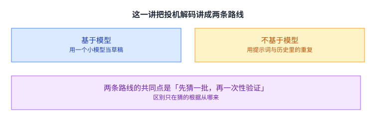

课件把投机解码分成两类：基于模型的，用一个单独的草稿模型去猜大模型的输出；不基于模型的，用**已经生成出来的 token** 去猜后面的 token（这是课件对它的逐字定义）。

两条路线的手法不同，但共同点是一样的：先一次猜出一批 token，再让大模型一次性验证。为什么要这样做，第 14 讲其实已经给出了答案，这一讲把它讲透。

课件的这个分法也很有用。当你想在一个新场景里用投机时，先问一个问题就够了：这个场景里有没有现成的、便宜的「猜」的来源。有草稿模型就用基于模型的，输入里重复多就用不基于模型的。

## 回顾：瓶颈到底是哪一个

先把第 14 讲留下的两个问题摆出来。

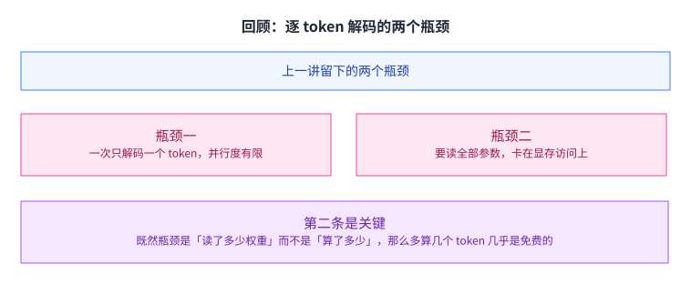

课件重申了两点：一次只解码一个 token，并行度有限，GPU 资源用不满；而且每生成一个 token 都要读一遍全部参数，所以瓶颈在显存访问而不是计算。

第二条才是关键。如果瓶颈是「读了多少权重」，那么在一次前向里多算几个 token 几乎是免费的：权重已经读进来了，多乘几次并不贵。[[term:kv-cache]] 与 [[term:latency]] 在解码阶段的性质，正是被这一条决定的。

换个说法，解码阶段的瓶颈是[[term:throughput]]而不是算力。GPU 的浮点单元大部分时间是空着的，等的是数据从显存里搬过来。[[term:compute]] 没有被用满，这也是为什么投机这类方法有空间。

这也解释了为什么这一讲的所有方法都在同一个方向上下功夫：让一次前向的产出变多。

## 大模型与小模型的取舍

课件把两类模型放在一起比。

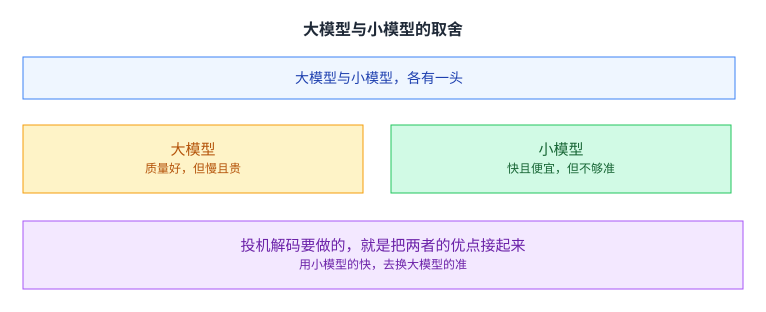

大模型生成质量更好，但慢且贵；小模型便宜又快，但不够准。课件给的五档参数量是 1750 亿、130 亿、27 亿、7.6 亿、1.25 亿，跨度很大（这里更正一处：我原先只写了三档，少认了两档；后两档课件还各带了 TriviaQA、PIQA、SQuAD 与延迟、所需 A100 数几列数值）。这个跨度也解释了为什么「换一个小模型来猜」在直觉上成立：两者要读的权重差了近两个数量级，读一遍的时间自然差很多。

投机解码要做的就是把两者的优点接起来：用小模型的快，去换大模型的准。关键在于「换」这个字——用小模型猜出来的东西不直接采信，而是要过大模型的验证。

## 投机解码的两步

课件给的做法只有两步。

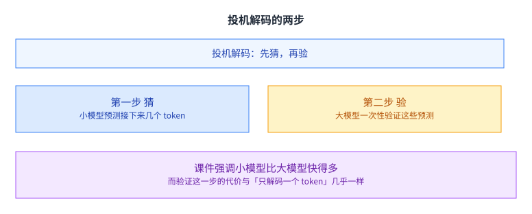

第一步，让一个小模型（课件缩写为 SSM）去预测大模型的输出。它跑得快得多。第二步，让大模型去验证这些小模型的预测。

为什么第二步不贵。因为验证是「一次性把这一批候选都过一遍」，而不是逐个重新生成。它读到的是同一批权重，算的却是好几个位置。

这里有一个直觉上的反差值得留意：按常识，「多猜多验」听起来更费；而在解码这个场景里，验证一批候选的代价与验证一个候选几乎一样。原因还是那一条：瓶颈是读权重。

不过「几乎一样」也有边界。候选变多，注意力那一部分的计算与键值缓存都会跟着涨，所以一次验证多少候选仍然是一个要调的数。第 8 讲的分块尺寸、第 11 讲的检查点间隔，说的都是这一类旋钮。

## 验证为什么划算

课件用了三页来讲验证的过程。

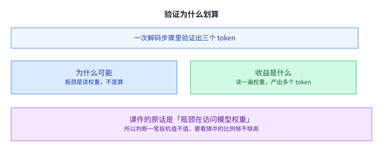

课件给的例子是一次大模型解码步骤里生成三个新 token。它把关键结论写得很直接：大模型推理的瓶颈在访问模型权重，所以用它一次解码多个 token 反而提高了 GPU 利用率。

这个例子里「三个」来自课件的设定：它在那一页写的是「用一次大模型解码步骤生成三个新 token」。（「它取决于小模型猜得准不准」那句是我们的延伸，课件没有给这个解释。）

课件的演示把这一次前向的结果画得很直观：三个位置同时被算出概率，然后从左往右逐个判断是否与草稿一致，遇到第一个不一致的地方就停下。停下之后，后面那些位置算出来的结果就被丢弃了。

于是判断一笔投机值不值，就变成了一个可以算的问题：猜中的比例够不够高。如果小模型猜的三个里有两个被接受，那么这一次前向就赚了一个 token；如果一个都没接受，那就白读了一遍权重。

## SpecInfer：把大模型当成并行的树验证器

课件给的第一个框架叫 SpecInfer，它的做法把上一节的两步具体化了。

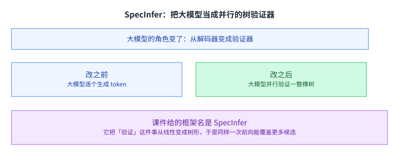

它的关键想法是不再把大模型当逐个解码器，而是当成一个并行的 token 树验证器。课件给的收益是比现有系统快 1.3 到 2.4 倍，另外还有一条是显存访问减少 2.5 到 4.4 倍。（区间成因是我们的解读，课件在同一页只给了结论：我们把它归到「任务里前缀的重复程度」与「草稿模型与目标模型的接近程度」这两条上。）

「树」这个字是这里的重点。既然小模型可以一次猜好几个候选，而这些候选之间往往共享前缀，那么把候选组织成一棵树，就能让同一次前向覆盖更多路径。

课件给的流程里，多个小投机模型各自提出候选，合起来长成一棵树，再交给大模型一次验证。这也解释了「基于树」与「基于序列」的差别：前者是并行覆盖，后者是逐个扩展。

从线性变成树形，是这一讲里第一个重要的结构变化。线性的解码器一次只能沿一条路径走，而树形的验证器可以同时覆盖多条路径，最后只保留与草稿一致的那一条。

## 小模型从哪来

草稿模型不是天上掉下来的。

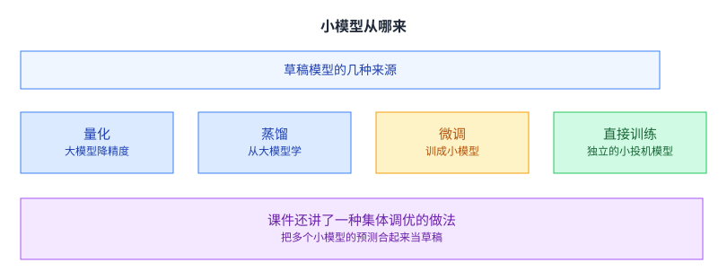

课件给的四项逐字是：量化后的大模型、蒸馏出来的大模型、**微调出来的小投机模型**、以及独立训练的投机模型。（更正：我原先把第三项写成「把大模型微调成小的」，那是另一种做法；课件那一项是微调一个小的投机模型，计数四项是对的。）

这几种途径的差别在于「草稿与大模型有多像」。越像，猜中的概率越高，收益越大；但训练或准备它的成本也越高。这个取舍和第 9 讲讲过的「切数据还是复制模型」、第 12 讲讲过的「复制不是切开，而是各留一份」是同一类。（更正：我原先写「上一讲讲的「复制还是切分」」。按仓库讲次上一讲是第 15 讲，那一讲讲的是 Blackwell 与 TIRx，没有这个二分法；全仓检索「复制还是切分」只命中本页自己。这个二分法实际在第 9 与第 12 讲。）

课件还讲了一种集体调优的做法：把多个小模型的预测合起来当草稿。它的好处是几个小模型各自弱一点没关系，合起来就能覆盖更多情况。这也解释了课件为什么把多个小模型并排画在同一张图上。课件给的实验设置是大模型用 LLAMA-7B、小模型用 LLAMA-160M、数据集是 Alpaca、显卡是 A10。

## 令牌树

有了多个候选，接下来就是怎么表示它们。

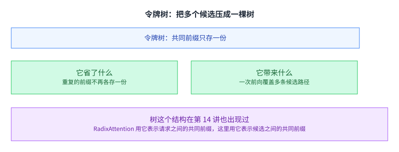

课件把令牌树描述成「一种紧凑地表示投机出来的多个 token 的方式」。不同候选共享相同的前缀，于是只有分叉的地方才需要各存一份。

这个结构在第 14 讲出现过一次：RadixAttention 用一棵基数树来表示请求之间的共同前缀。这里用的是同一个想法，只是把「请求之间」换成了「候选之间」。

同一个数据结构在两个不同的地方被用来解决同一类问题，这说明「共享前缀」这件事在服务系统里反复出现。[[term:kernel]] 在处理这类结构时也要专门适配，第 8 讲的 Flash-Decoding 就是类似的例子。

## 顺序解码的问题

课件对比了另一种做法：把多个候选当成多条独立序列来解码。

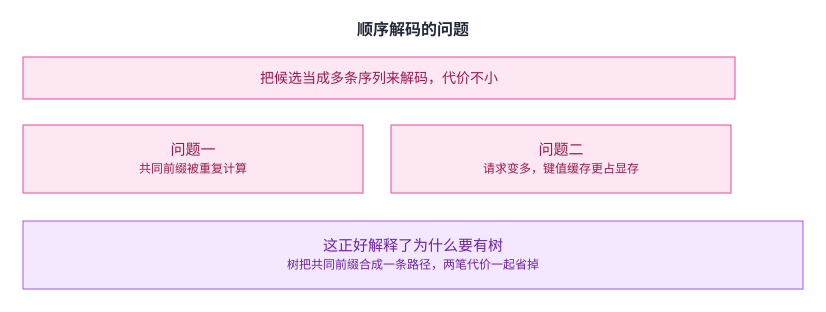

它的两个问题是：共同前缀被重复计算；请求数变多，键值缓存占用更多显存。

第二点值得留意。它说明「把候选拆成多条序列」不只是多算几次，还会把第 14 讲刚解决好的显存问题重新带回来。[[term:data-parallelism]] 在推理侧的影子在这里也能看到：把工作摊开固然好，摊开之后每一份都要有自己的缓存。也就是说，一个看起来只是实现选择的决定，会牵动整个系统的资源平衡。

这正好解释了树为什么值得引入：它把共同前缀合成一条路径，两笔代价一起省掉。

## 树注意力与两个关键优化

课件给的解法叫树注意力。

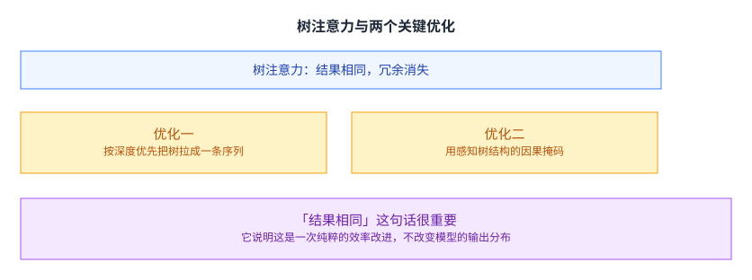

课件说树注意力对每个 token 的输出与序列注意力相同，没有冗余。它给的两个关键优化是：用深度优先的方式把令牌树线性化，以及一个感知树拓扑的因果掩码。

「线性化」这件事是把树摊平成一条序列，好让硬件按老办法处理；而因果掩码则是保证一个 token 只能看到它在树上真正的祖先，而不是线性化之后恰好排在它前面的那些。第二个优化不做好，结果就错了。

两个优化合起来说明一件事：树这个抽象只在算法层面成立，到了[[term:hardware-accelerator]]这一层仍然要摊平成一条序列。掩码就是那道把抽象折算回线性的桥，它把「谁该看到谁」重新写进了一个方阵里。

「结果相同」这句话也很重要：它说明这是一次纯粹的效率改进，不改变模型的输出分布。这一点后面讲采样时还会再回到，因为随机采样下「相同」这个词的含义会变得微妙。

## 采样带来的困难

到这里讲的都是确定性解码的情况：猜对了就接受，猜错了就拒绝。

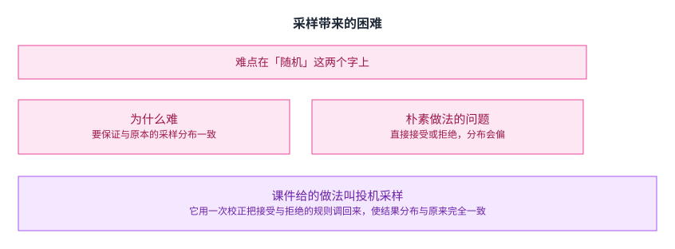

课件指出一个挑战：要验证的是随机采样下的等价性。课件用一页说明，最朴素的采样做法可能是次优的，并给出了一个具体的反例设定：一个大模型、两个小模型、四个可能的 token。

难在哪。课件那一页给的最朴素做法是「让大模型去采样」，然后检查采出来的 token 是不是在候选树里。问题在于：这个做法与直接接受小模型的猜测，两者给出的验证概率并不一样。（更正：我原先把它写成「大模型说这个 token 概率高就接受」，那不是课件给的反例规则。）

课件用一页算了一笔账来说明这一点：在一个大模型、两个小模型、四个候选 token 的设定下，朴素的接受规则会系统性地偏向某几个 token。这类偏差在产品里会表现为「模型好像变了」，而排查起来非常困难。

课件给的做法叫投机采样。它用一次校正把接受与拒绝的规则调回来：接受概率按两个分布的比值来定，被拒绝时则从修正后的分布里重新采。结果是最终分布与原本完全一致。

这一段是这一讲技术含量最高的部分。值得记住的是它的目标：加速可以，但输出分布不能变。吞吐的提升不能以改变模型行为为代价。

## 后续的两条路线

课件列了两条后续工作。

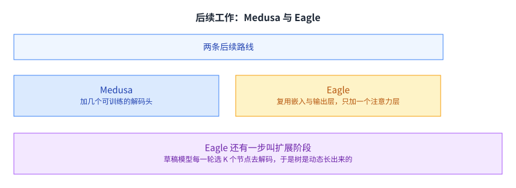

Medusa 引入可训练的多余解码头来预测未来的 token，相当于不用另起一个小模型，而是在大模型自己身上长出几个「猜下一个」的头。

Eagle 的草稿模型复用大模型的嵌入与输出层，只新增一个可训练的注意力层。这样做的好处是草稿与大模型共享了大部分表示，猜起来的分布更接近。

Eagle 还有一步叫扩展阶段：草稿模型每一轮选 K 个节点去解码，于是树是动态长出来的，而不是一开始就固定形状。

**更正一处指路**：我原先写「第 15 讲讲的那种「由静态到动态」的演进」。按仓库讲次第 15 讲是 Blackwell 与 TIRx，没有这条线；按课件号则第 15 讲就是本讲，成了自指。这条演进线在第 14 讲（从静态批处理到连续批处理），改成指第 14 讲。

## 不基于模型的路线

不是所有场景都能准备一个草稿模型。

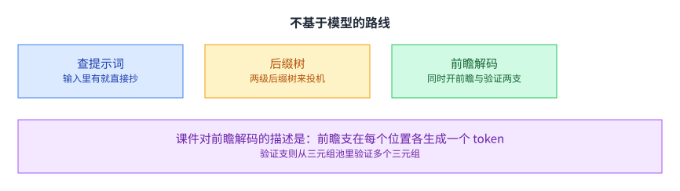

课件给了三条不依赖草稿模型的路线。Prompt lookup 直接从提示词里查：如果输入里刚出现过同样的片段，就直接把后面那一段抄过来当草稿。SuffixDecoding 用两级后缀树来做投机。Lookahead 解码则同时开前瞻与验证两支。

课件对前瞻解码的描述是：前瞻支在每个位置各生成一个 token；验证支从三元组池里验证多个三元组；然后收集并把新生成的三元组缓存起来。最后课件强调它把批量验证与前瞻两支放在一次前向里完成。

这一类路线的适用场景与基于模型的不同：它的素材来自已经生成的内容，所以在一段话里反复出现相似结构时特别有效，比如代码补全、摘要改写这类任务。它省掉的不只是草稿模型的计算，还有准备与维护草稿模型这件事本身。

## SSD：让验证不再空等

课件在讲完基于模型的两条路线之后、转到不基于模型的路线之前，指出一个容易被忽略的问题。

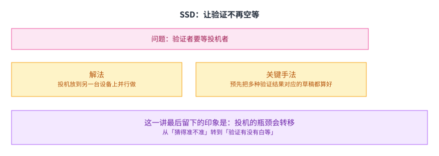

问题是：验证者必须空等投机者把草稿算出来。也就是说，第 14 讲好不容易把 GPU 喂满，这里又出现了一段等待。

解法叫 SSD：让投机跑在一台独立的设备上，与验证并行进行；并且让草稿模型预先为多种可能的验证结果各算好一份，一旦某种结果真的出现，就立刻把对应的草稿返回。

这一讲最后留下的印象是：投机的瓶颈会转移。一开始瓶颈是「猜得准不准」，等这一层解决好了，瓶颈就变成「验证有没有白等」。[[term:machine-learning-system]] 的优化就是这样一层一层往下剥的：每解决一个瓶颈，下一个就会露出来。

**更正一处**：我原先写「课件的这一页之后，这一讲就结束了」。SSD 在课件里是第 34–35 页，后面还有九页：分隔页、Prompt lookup 解码、SuffixDecoding，以及前瞻解码的两页，最后又回到「今天的主题」那一页收尾。课件真正放在最后讲的是不基于模型的路线（尤其前瞻解码）。

## 读完应该能回答

1. 课件说解码阶段的瓶颈是哪一个，为什么它让一次多算几个 token 变便宜。
2. 投机解码的两步各是什么，验证为什么可以与解码一个 token 代价相当。
3. SpecInfer 把大模型的角色从什么变成了什么，为什么树结构能提升覆盖范围。
4. 草稿模型有哪几种来源，它们之间的取舍是什么。
5. 把候选当多条独立序列来解码有什么问题，树注意力是怎么解决的。
6. 随机采样下为什么不能简单接受或拒绝，课件给的解法保证了什么。
7. Medusa 与 Eagle 各改了什么。

## 脉络回顾

解码慢的根子不在算力：每一步都要把全部权重读一遍，算出来的却只有一个字，这个错配是这一讲要对付的东西。第 14 讲已经把它算进了服务链路的两个瓶颈，而这里把代价落到「一次能不能多出几个 token」上，对策是先一次猜出一批，再让大模型一次性验证；草稿的来源决定收益能有多少，猜得越准省得越多，而准备草稿的成本越高越不划算，这个取舍和第 9 讲的切数据还是复制模型属于同一类。转折出现在瓶颈转移上：猜得准之后，验证者要空等草稿算完，于是改法变成让投机跑在一台独立设备上，预先为几种可能的验证结果各算一份。它留下的东西第 21 讲还要再用一次：投机解码依赖运行时才知道的信息，而把整份服务合并成一个静态内核，最怕的正是这个。

## 溯源

- 对应：CMU 15-442 / 15-642 Machine Learning Systems，LLM Serving Techniques Part 2: Speculative Decoding（Tianqi Chen、Zhihao Jia 主讲，2026-03-16）。
- 原文课件：https://mlsyscourse.org/slides/15-LLM-serving-part2.pdf（课件号的对照见第 8 讲溯源；本页一律用仓库讲次号指路。）
- 上游许可：CC BY-NC 4.0（课程仓库根 LICENSE，19,342 B）。允许翻译与改编，须署名且不得商用。本页未转载原图与整页文字，配图全部自绘。
- 课件在这一讲里引了若干外部工作，本页照原样标注，且均未转载其原图。课件有独立标题页的外部工作**至少七处**：SpecInfer（基于树的投机推理与验证）、Medusa（带多个解码头）、Eagle 与 EAGLE-2（动态草稿树）、Speculative Speculative Decoding（SSD）、**Prompt Lookup Decoding**、**SuffixDecoding（两级后缀树投机）**、以及前瞻解码（Lookahead Decoding）。（更正：我原先只列了五处，漏掉的 Prompt Lookup Decoding 与 SuffixDecoding **恰好是正文自己写了名字的那两处**。）课件给出的实验设置是：大模型 LLAMA-7B、小投机模型 LLAMA-160M、数据集 Alpaca、显卡 NVIDIA A10。
- 本讲取材范围分五块。一是动机：第 14 讲两个瓶颈的重申、大小模型各自的优缺点与课件那一页的五档参数量（1750 亿 / 130 亿 / 27 亿 / 7.6 亿 / 1.25 亿）。二是基于模型的投机：用小模型猜、用大模型验的两步、一次解码步骤生成三个 token 的例子、以及「瓶颈在访问权重」这条结论。三是 SpecInfer：把大模型从解码器变成并行的树验证器、1.3 到 2.4 倍的收益、草稿模型的几种来源与集体调优、令牌树的定义、顺序解码的两个问题、树注意力的两个关键优化（深度优先线性化与感知树拓扑的因果掩码）。四是随机采样：验证随机等价性的挑战、朴素采样次优的反例、以及投机采样。五是后续与另一条路线：Medusa、Eagle 与它的扩展阶段、Prompt lookup、SuffixDecoding、前瞻解码的三步、以及 SSD 要解决的问题与做法。
- 数字与定义以课件页面为准。课件未展开的推论属于 CourseLingo 的讲解，不当作原文引用。这类推论分三组。一组是判断：把「瓶颈是读权重」推成「判断投机值不值要看猜中比例」、把草稿来源的取舍与第 9、12 讲的复制与切分归为同一类。一组是结构上的观察：指出令牌树与第 14 讲的基数树是同一个想法用在不同对象上、指出把候选拆成多条序列会把上一讲刚解决的显存问题带回来、指出「结果相同」意味着不改变输出分布。还有一组是关于优化次序的判断：把这一讲的演进说成瓶颈在逐层转移、把 Eagle 的扩展阶段与第 15 讲的静态到动态联系起来。此外，本讲与前后讲次的对应关系属于我们的编排。
- 与第 14 讲的关系：两份 PDF 是各自独立的课件（part1 与 part2），页码各自从 1 开始，内容不重叠，故未做切分。两讲引的外部材料不同，各自在本讲与第 14 讲的溯源里标注。