+++
title = "LLM 微调技术"
lecture = 17
slug = "llm-finetuning"
status = "draft"
source_kind = "slides"
source_url = "https://mlsyscourse.org/slides/16-LLM-finetuning.pdf"
source_title = "Week 10: LLM Finetuning Techniques（Tianqi Chen、Zhihao Jia 主讲，2026-03-18）"
output_mode = "explanation"
+++

> 来源课程：Carnegie Mellon University 15-442 / 15-642 Machine Learning Systems（Tianqi Chen、Zhihao Jia）；
> 对应讲次：Week 10 — LLM Finetuning Techniques（Tianqi Chen、Zhihao Jia 主讲，2026-03-18）；
> 原文课件：https://mlsyscourse.org/slides/16-LLM-finetuning.pdf ；
> 上游许可：CC BY-NC 4.0（课程仓库根 LICENSE）—— 允许翻译与改编，须署名、且不得商用；
> 本文由 CourseLingo 原创撰写：按课件的推进顺序用中文重新讲解，关键定义处给出英文原文短引，配图为自绘 SVG，未转载原图与整页文字；本文非官方材料，CourseLingo 与 CMU 及本课程教学团队无隶属关系；如与原文有出入，以原文为准。

## 这一讲要解决什么

前面几讲讲的是训练与服务。这一讲处理一个更日常的问题：手上有一个预训练好的大模型，怎么让它适配自己的任务。

课件的大纲把高效微调分成两条：一条是调提示，改的是输入，不动模型；另一条是调适配器，往模型里加一小部分可训练的参数，把主干冻住。

两条路线的共同目标是「可训练的参数越少越好」。原因在下一节的数字里：全量微调的代价和从头训练差不多。

## 为什么需要微调，以及它有多贵

先把「微调」这个词定清楚。

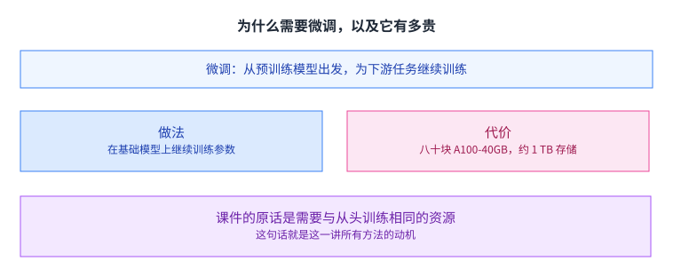

课件的定义是：从一个预训练好的基础模型出发，为下游任务继续训练模型参数。

代价写在同一页上：它需要与从头训练相同的资源。课件给的数字是微调 1750 亿参数的 GPT-3 要八十块 A100-40GB，还要约 1 TB 的存储。

补充一处先前漏掉的：课件在讲成本**之前**先用一张四任务表说明微调带来的提升，列的是「GPT-3 少样本」对「GPT-3 微调」：SQuAD V2（F1）69.8% 到 88.4%、RTE（准确率）69% 到 85.4%、WikiSQL（准确率）20% 到 73%、Spider（准确率）18% 到 62%。（更正：我先前把这一页说成只有定义，于是读者会以为课件给出的动机只有成本。）

这个数字就是这一讲的动机。如果适配一个任务的成本与训练一个模型相当，那么这项技术就只能少数人有条件用。

课件给这一页的标题是「微调大模型极其昂贵」。这个判断不需要额外解释，因为「与从头训练相同」已经说明了一切。后面所有方法的共同目标，就是把这个「相同」变成一个小得多的数（「百分之几」是我原先写的说法，课件里没有这个百分比，这里不替它填一个数）。于是接下来的所有方法，都在回答同一个问题：能不能只训练一小部分参数，效果还不掉。[[term:throughput]] 在这里不是指生成速度，而是指「同一块卡上能同时跑几个微调任务」。

## 上下文学习与提示工程

课件先讲了一条完全不动参数的路线。

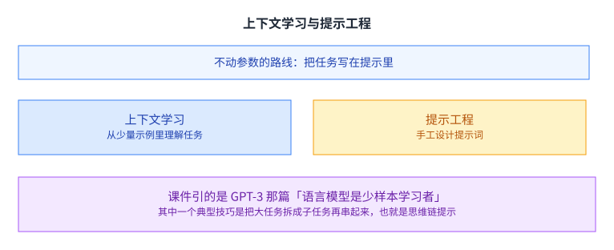

大模型能从几个输入输出示例里理解任务描述，这件事叫上下文学习。课件引的是 GPT-3 那篇「语言模型是少样本学习者」。

这件事在当时的冲击力来自它与「每个任务都要重新训练」的对比：同一个模型不改一个参数，只换几段示例，就能做不同的任务。这条路线后来演变成今天提示词工程的实践基础。

提示工程则是手工为具体任务设计提示词。课件还给了一个典型技巧：把一个大任务拆成若干子任务再串起来，也就是思维链提示。（课件那一页只有「把一个大任务拆成子任务再串起来」这句做法；「它在推理类任务上尤其明显」这个效果侧的说法是我们的补充。）

这条路线的吸引力在于成本：不用训练，改几行输入就行。它的局限也很明显，而且课件把它讲成了下一节的问题来源。

从系统的角度看，提示工程还有一个隐藏成本：它把工作量从训练侧挪到了推理侧。提示变长意味着每次请求要处理的 token 更多，而上下文长度直接对应上一讲讲的那块键值缓存。所以「不训练」并不等于「不花钱」。

## 提示工程的局限

课件列了两条明确的问题。

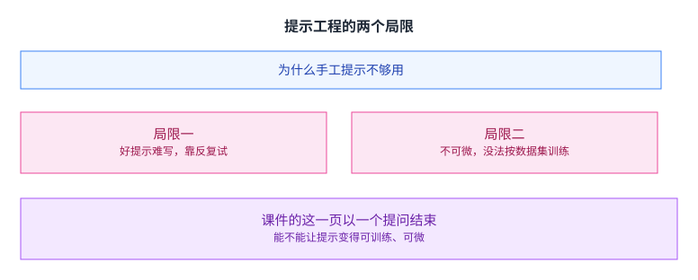

第一条：好的提示很难设计，需要大量精力去反复试。第二条更要紧：提示不可微，所以不能直接在一个数据集上微调它。

第二条是技术上的硬伤。整个深度学习的方法论建立在梯度上：有一个可微的目标，就可以用数据去把它调好。而提示是离散的文本，梯度传不进去。

课件由此提出了一个问题：能不能让提示变得可训练、可微。下一节就是对这个问题的回答。

这个提问方式本身值得学一下。它没有停在「提示工程有哪些毛病」这份清单上，而是把毛病收敛成一个可以动手的技术问题：把离散换成连续，梯度就有地方可传了。前半讲的很多转折点，都是这样一次「把抱怨改写成问题」的动作。

## 前缀调优：把前缀变成参数

答案是给输入接上一段不是文字的「前缀」。

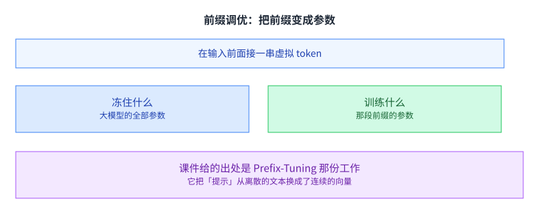

做法是在输入前面接上一串虚拟 token。大模型会像对待普通 token 序列一样去关注这段前缀，因为对它来说，这串向量与真实的 token 嵌入没有区别。

关键在于参数归属：大模型的全部参数冻住，只训练那段前缀的参数。（我原先写了「可训练参数从几十亿降到几百万」，这两个数课件里没有，属于我们的举例，这里去掉。）优化仍然是标准的梯度下降，这一点是它比手工提示更根本的优势。

课件在这一页对比了提示工程与前缀调优。前者用的是普通 token，靠大模型的上下文学习能力；后者用的是连续向量，靠梯度去学。[[term:ml-framework]] 在这里的作用是把那段虚拟 token 变成一个可以求导的张量。

## 适配器：在模型里插小模块

第一条路线改的是输入，第二条路线改的是模型内部。

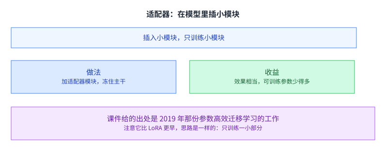

做法是往大模型里加入参数很少的适配器模块；微调时冻住原来的网络，只训练这些适配器。

课件给的收益是：效果与全量训练相当，而可训练参数少得多。这句话是这一整条路线的立足点，因为如果不掉效果，那就没有理由去训全量。

适配器与全量微调的另一个差别在工程上。全量微调之后，每个下游任务都要存一份完整的模型；而适配器只增加很少的参数，同一个主干可以配很多个适配器。这在多任务场景里省下的存储是成倍的。（「几 MB」这个量级是我们的举例，课件没有给这个数。）

课件给的出处是 2019 年的参数高效迁移学习工作。它比 LoRA 早两年，思路是一样的：只训练一小部分。课件把两页放在相邻位置，也是为了让这层传承显出来。[[term:pruning]] 与[[term:knowledge-distillation]] 也在处理「怎么把模型变小」，但它们的目标是推理，而这里是训练。

## LoRA：把增量写成低秩分解

适配器是加模块，LoRA 换了一个更巧的写法。

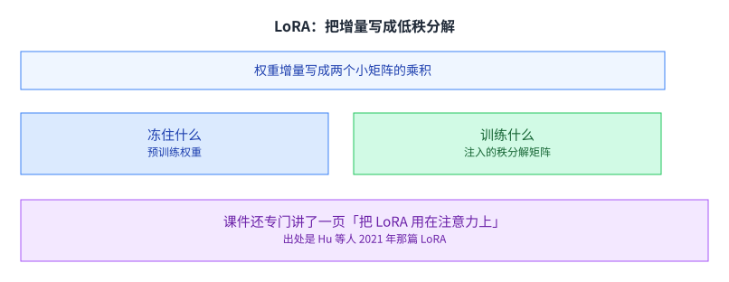

课件的定义是：冻住预训练权重，在每一层里注入可训练的秩分解矩阵。也就是说，权重增量不再是一个与原来同样大的矩阵，而是两个小矩阵的乘积。

低秩假设是这里的核心。它赌的是「为一个下游任务所需要的改动，比整个权重矩阵小得多」。如果这个假设成立，那么用很少的参数就能表达出那个改动；如果不成立，效果就会掉。[[term:compute]] 在这里是被省下来的对象：训练全量权重的那部分算力，被换成了一个低秩近似。

课件还专门用一页讲「把 LoRA 用在哪里」，那一页上并排列了两块：**多头自注意力**与 **MLP 层**，所以它不是只讲注意力。出处是 Hu 等人 2021 年那篇 LoRA。（「注意力那几层最值得调」这个理由是我们的补充，课件那一页没有给。）

## LoRA 为什么不增加推理延迟

这是 LoRA 相比适配器的一个明显优势。

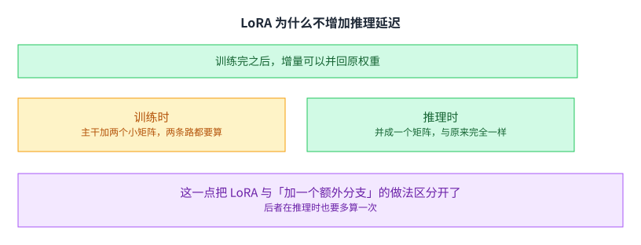

训练时，主干与那两个小矩阵都要算，所以计算量是增加的。但训练完之后，两个小矩阵的乘积可以直接并回原来的权重里。

于是推理时看到的还是同一个形状的权重，与没有用 LoRA 时完全一样，不需要额外计算。[[term:latency]] 在这一层没有任何损失。

课件那一页的对比是**训练时的权重（多一条低秩支路）**与**并回之后的权重**两项，它要说明的是「并回去之后延迟回到原样」。（「这一点把 LoRA 与加一个额外分支的做法区分开了」是我们的延伸：课件没有拿适配器与 LoRA 做这个对比。）对在线服务来说，这个区别很重要，因为服务侧的成本是按每一个请求累积的。

也正因为可以并回去，LoRA 支持一件实践上很受欢迎的事：同一个主干挂多份不同的低秩增量，按请求切换。切换的成本只是把权重换成另一份，而不需要重新加载整个模型。

**这里要说明一处缺口**：课件在 `Tuning adapters` 这一支的 outline 里列了**四项**（LoRA、QLoRA、侧调优、**服务多个适配器**），但**全篇没有「服务多个适配器」这一页**，最后的 Recap 里这一项也已经消失（只剩前三项）。**上面这段「同一个主干挂多份、按请求切换」是我们用自有叙述补上的**，课件没有展开。

## 两个变体：换一种乘积

课件给了 LoRA 的两个变体。

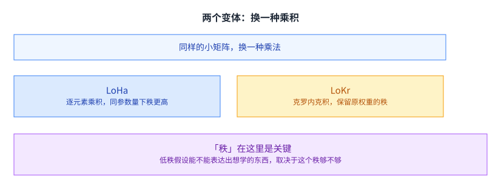

LoHa 用逐元素乘积（哈达玛积）替换矩阵乘积，它可以在同样多可训练参数的前提下得到更高的秩。LoKr 用克罗内克积替换矩阵乘积，它能保留原权重矩阵的秩。

两个变体改的都是同一个东西：用什么样的乘积把两个小矩阵组合起来。而组合方式决定了「同样的参数量下能表达多大的秩」。

秩在这里是关键。低秩假设能不能表达出想学的东西，取决于这个秩够不够。所以「在同样的参数预算下把秩做高」是一个有实际价值的方向。

课件把两个变体放在紧邻的两页，也是为了让这个共同点显出来：改的不是「训练哪里」，而是「两个小矩阵怎么组合」。这一点与第 5 讲讲的「同一个形状配不同步长就是不同布局」在思路上是一样的。

## 量化：把浮点压成更少的位

到这里讲的都是「训练哪些参数」。课件接下来换了一个角度：参数本身能不能存得更小。

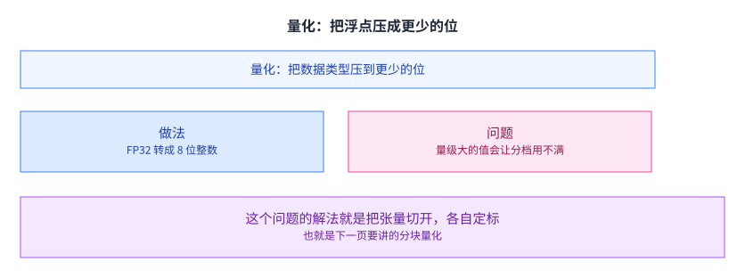

课件的定义是把一种数据类型转换成更少的位。例子是把 FP32 张量转成取值在 -128 到 127 的整数张量。（课件量化那两页通篇没有提到硬件；「这一代张量核心对低位宽格式的支持是它落地的前提」这句是我们的补充。）

它指出的问题是：当数值里有特别大的量级时，量化的分档用不满。因为分档的范围必须覆盖最大值，而大多数值都比最大值小很多，于是它们被挤在很少的几个档里。

这个问题的解法就是把张量切开、各自定标。这正是下一页的内容。

## 分块量化与双重量化

分块量化的做法是把输入张量切成若干块，每块独立量化，各自有一个存在 FP32 里的量化常数。这样每块的范围都由自己决定，分档就用得满了。

双重量化则是把这些常数本身再量化一次。理由是常数虽然不多，但每块一个、以 FP32 存着，加起来也不少。

课件在这一页给了量化开销的算式。块越小，常数越多，开销的占比越高。课件的处理办法很直接：既然这些常数本身也占地方，那就把它们也压一次。所以块大小也是一个要调的数——这个旋钮的形状，和前面几讲讲过的那些完全一样：分得越细越精确，开销的占比也越高。

## QLoRA：量化加 LoRA

两条线在这里合起来。

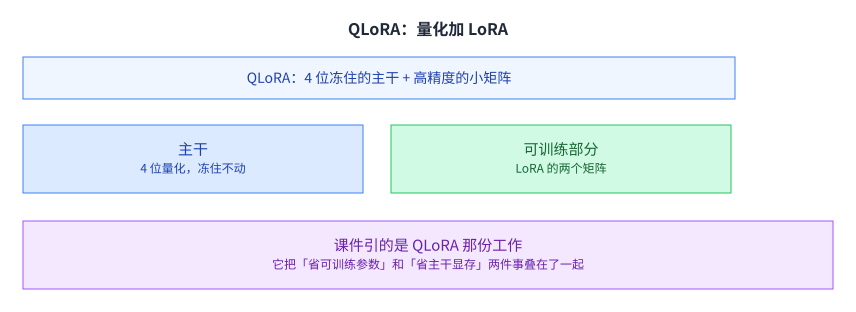

课件讲的是单个线性层的做法：主干权重冻成 4 位，LoRA 的两个小矩阵仍然以较高精度训练。它给的结论是与全量微调效果相当。

这个组合很自然：LoRA 省的是可训练参数与优化器状态，量化省的是主干权重本身的显存。两者作用在不同对象上，所以可以叠加。

课件在这一页画的是单个线性层：4 位的主干负责前向，LoRA 分支负责学习增量，两者的输出相加。这张图也解释了为什么 QLoRA 的实现难点在数值上而非结构上：4 位整数要参与浮点计算，中间需要反量化，而反量化的时机与精度直接影响结果。

课件引的是 QLoRA 那份工作。它把「省可训练参数」和「省主干显存」两件事叠在了一起。（「于是单卡能微调的模型规模又上了一个台阶」是我们的推论，课件那几页只给了单层的构成与「与全量微调效果相当」这条结论。）[[term:hardware-accelerator]] 的显存上限在这里不再是硬约束，而是一个可以用精度去换的参数。

## LoRA 留下的问题：激活值还要存

课件接下来指出一个容易被忽略的地方。

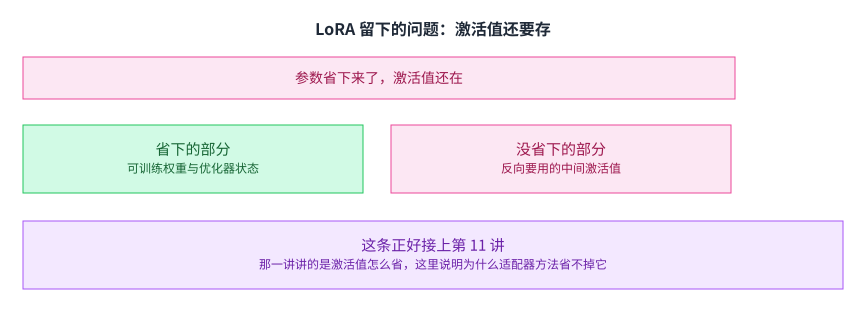

适配器类方法减少了可训练权重与优化器状态，但反向传播仍然需要保存中间激活值。

而这一点本来是可以省的：如果主干不参与反传，那么主干的中间激活值就不必留着。可是常见的适配器做法仍然要把梯度从适配器回传到主干靠近输入的那几层，于是激活值还得存。

这条正好接上第 11 讲。那一讲讲的是激活值怎么省，这里说明为什么适配器方法省不掉它：省的维度不同。适配器省的是参数，而激活值取决于「有多少层参与了反传」。两件事看似都在省显存，管的却是不同的那一半。

## 量化侧调优：两步走

解法是让主干彻底不参与反传。

课件给的解法是用侧网络当适配器：把一个更小的、与主干分离的网络接在旁边，梯度只在这个侧网络里回传。这样主干的中间激活值完全不需要保存。

它分两步：第一步做 4 位分块双重量化；第二步引入一个与主干分离的侧网络，让梯度只在这个侧网络里回传。

「分离」这两个字是整套做法的关键。只要主干不参与反传，它的中间激活值就不必保留，第 11 讲那条 O(N) 的显存开销就被绕开了。这比在适配器上继续做文章更彻底，因为它改的是反传路径本身。课件给的结论是与 QLoRA 精度相当而显存更省，并且它还用 GPT-4 当裁判做了对话质量的对比。

这一讲最后留下的是一个清晰的分工图景：提示这一侧改输入，适配器这一侧改参数，量化这一侧改存储，而侧网络这一侧改的是「哪一部分需要留下中间结果」。四者作用的对象各不相同，所以可以叠加使用。[[term:machine-learning-system]] 在微调这件事上的设计空间，就是这四个方向的组合。

也可以把这四个方向记成四句话：改输入、改参数、改存储、改反传路径。遇到一个新的微调方法时，先问它改的是哪一句，就能判断它和已有方法能不能叠加。

## 读完应该能回答

1. 课件给出的全量微调代价是什么。
2. 提示工程的两条局限各是什么，其中哪一条是技术上的硬伤。
3. 前缀调优与提示工程的根本差别在哪，它训练的是什么。
4. LoRA 的低秩假设是什么，如果这个假设不成立会怎样。
5. LoRA 为什么不增加推理延迟。
6. 分块量化解决的是什么问题，双重量化又在压什么。
7. 适配器类方法为什么省不掉激活值，侧调优怎么绕开。

## 脉络回顾

全量微调的代价和从头训练差不多，而多数任务要的只是让预训练模型往自己的方向偏一点，这一讲处理的正是这条落差。它的答案是可训练的参数越少越好，而这句话往下走分成四个方向：改输入、改参数、改存储、改反传路径，四者动的对象不同，所以能叠加使用，遇到一个新方法先问它改的是哪一句，就能判断它和已有方法能不能放在一起。真正把这条路走通的转折是让主干完全不参与反传，中间激活值于是不必保留，第 11 讲那条随层数线性增长的显存开销就被绕开了，这比在适配器里继续做文章更彻底，因为它改的是反传路径本身。提示这一侧的开销也没有消失，只是从训练挪到了推理，落回第 14 讲那块会随上下文变长的缓存上。

## 溯源

- 对应：CMU 15-442 / 15-642 Machine Learning Systems，Week 10 — LLM Finetuning Techniques（Tianqi Chen、Zhihao Jia 主讲，2026-03-18）。
- 原文课件：https://mlsyscourse.org/slides/16-LLM-finetuning.pdf（课件号的对照见第 8 讲溯源；本页一律用仓库讲次号指路。）
- 上游许可：CC BY-NC 4.0（课程仓库根 LICENSE，19,342 B）。允许翻译与改编，须署名且不得商用。本页未转载原图与整页文字，配图全部自绘。
- 课件引了若干外部材料，本页照原样标注且未转载原图：GPT-3「语言模型是少样本学习者」、提示工程插图（Cobus Greyling）、Prefix-Tuning、参数高效迁移学习（2019）、LoRA（Hu 等 2021）、QLoRA、以及 Quantized Side Tuning。
- 本讲取材范围分四块。一是动机：微调的定义、四任务表的准确率对比、以及全量微调的代价（八十块 A100-40GB、约 1 TB 存储）。二是调提示：上下文学习、提示工程与思维链、两条局限、以及前缀调优接上一串虚拟 token 并只训练这段前缀。三是调适配器：适配器模块与「效果相当、参数更少」、LoRA 的秩分解、它不增加推理延迟、两个变体（LoHa 与 LoKr）。四是量化与侧调优：量化的定义与分档用不满、分块量化与双重量化、QLoRA、适配器省不掉激活值、以及量化侧调优的两步。
- 数字与定义以课件页面为准。课件未展开的推论属于 CourseLingo 的讲解，不当作原文引用。这类推论分三组。一组是因果判断：把「低秩假设不成立会掉效果」这层风险写出来、把宿主的取舍与「准备草稿的成本」联系起来。一组是跨讲的联系：把适配器与剪枝、知识蒸馏放在一起区分目标、把激活值这一条与第 11 讲接上、把块大小这个旋钮与前面几讲的同类旋钮并列。还有一组是关于版本的判断：把 LoHa 与 LoKr 的共同点归结为「换一种乘积」、把量化与 LoRA 说成作用在不同对象上所以可以叠加。此外，本讲与前后讲次的对应关系属于我们的编排。
- **更正一处署名归属（两件）**：先前把「全量微调与从头训练同价是动机」与「不可微是提示工程的技术硬伤」列成我们的判断，而这两点**课件自己就写了**（前者是那一页的标题，后者是它自己给出的转折）。把源自己的话标成我们补的，等于少认了源材料。
- 一处说明：课件对量化那两页给出的算式里含符号化占位，本页只转述其结论（块越小、常数越多、开销占比越高），未替课件补公式。