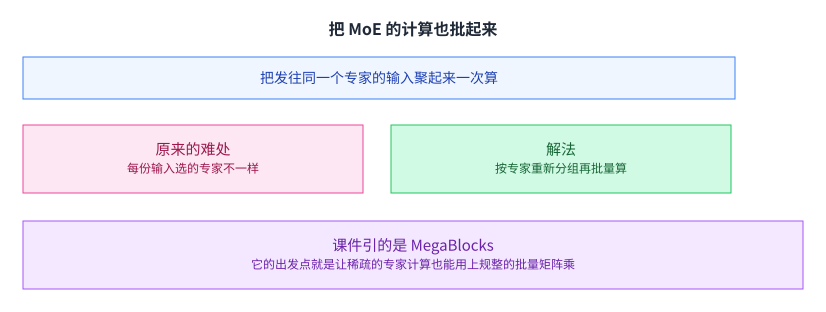

+++
title = "混合专家"
lecture = 18
slug = "mixture-of-experts"
status = "draft"
source_kind = "slides"
source_url = "https://mlsyscourse.org/slides/16-mixture-of-experts.pdf"
source_title = "Mixture of Experts（Tianqi Chen、Zhihao Jia 主讲，2026-03-25）"
output_mode = "explanation"
+++

> 来源课程：Carnegie Mellon University 15-442 / 15-642 Machine Learning Systems（Tianqi Chen、Zhihao Jia）；
> 对应讲次：Mixture of Experts（Tianqi Chen、Zhihao Jia 主讲，2026-03-25）；
> 原文课件：https://mlsyscourse.org/slides/16-mixture-of-experts.pdf ；
> 上游许可：CC BY-NC 4.0（课程仓库根 LICENSE）—— 允许翻译与改编，须署名、且不得商用；
> 本文由 CourseLingo 原创撰写：按课件的推进顺序用中文重新讲解，关键定义处给出英文原文短引，配图为自绘 SVG，未转载原图与整页文字；本文非官方材料，CourseLingo 与 CMU 及本课程教学团队无隶属关系；如与原文有出入，以原文为准。

## 这一讲要解决什么

第 3 讲把混合专家当成一个概念讲过：让每个专家只管一部分情况，于是参数量可以远大于每次计算用的参数量。这一讲把它当成一个真要写出来的层。

之所以值得单独讲一讲，是因为它把一个平时被藏起来的矛盾摆到了台面上。通常我们写的算子都是「同一段代码作用在一批数据上」，形状规整；而 MoE 天生不规整，因为每一份数据走的路不一样。[[term:compute]] 与[[term:throughput]]在这一讲里第一次直接冲突。

课件的大纲只有两条：混合专家本身，以及如何高效地计算它。第一条讲结构，第二条讲系统。

两块之间的衔接很紧。结构一旦确定下来，「稀疏」和「不规整」这两件事就同时出现了：同一批输入里，每一份走的是不同的专家，而硬件喜欢的是规整的批量计算。这一讲后半的内容，几乎都在处理这个矛盾。

## 回顾：Transformer 里那个前馈层

先看要被替换掉的东西。

课件用一页回顾了 Transformer 块：归一化、注意力、再归一化、前馈层。注意力那一半是矩阵乘、softmax、再矩阵乘；前馈那一半是两个线性层夹一个激活。

这个回顾不是复习，而是为了确定边界。课件要在这一页之后说「换掉前馈层」，所以必须先把这一层在整体里指出来。阅读时留意这种「先定位、再替换」的讲法，它让后面的改动不至于含糊。

这一讲换掉的是后一半。这一点值得先记住，因为它决定了后面所有讨论的边界：注意力不动，动的是那个本来就很规整的前馈层。

## MoE 的核心想法

把前馈层换成很多个前馈层，是这一讲的起点。

课件给的关键想法是：让每个专家专注预测一部分情况下的正确答案。它同时点明了一件容易被忽略的事：这里的每个专家在实践中就是一个前馈网络。

也就是说，MoE 并没有发明一种新的运算，它只是把原来一个前馈层换成了很多个前馈层，再想办法让每一份输入只经过其中少数几个。

这个想法在第 3 讲出现过一次。当时讲的是它带来的好处：参数量可以远大于单次计算用到的参数。这一讲要讲的是它在系统上要付出什么。

两讲合起来才是完整的判断：MoE 换来的容量是真实的，代价也是真实的。值不值取决于你的瓶颈在哪：如果瓶颈是模型的表达能力，它划算；如果瓶颈是硬件的利用率，它反而更难伺候。

## 门控

那「只经过少数几个」是怎么决定的。

课件的结构里有一个门控环节。它根据输入算出一组专家上的权重，再据此挑出要用哪几个专家。

关键在于这个挑选是**按输入做的**：同一批里，每一份输入算出来的权重都不一样，于是选的专家也可能不一样。

这一个细节同时带来了这一讲的全部好处与全部麻烦。[[term:ml-framework]] 在这一层的职责，就是把这个「按输入而变」的选择变成硬件能执行的指令序列。

训练与推理在这里的差别也值得提一句。训练时每一批的输入是固定的，路由分布相对稳定，调度可以按批来安排；推理时请求一个接一个来，每一份输入随时可能选到完全不同的专家，于是调度要做得更细。第 14 与第 16 讲讲的那些服务侧手法，在这里都还要再用一遍。好处是参数量与计算量脱钩了：模型可以有很多参数，但每份输入只算其中一小部分。麻烦是这一小部分在哪里、有多少，事先都不知道。

## 与线性层相比，优势在哪

课件在这一页留了一道讨论题（这一页的标题就叫 `Discussions`）。

题目是：用混合专家相比直接用线性层有什么好处。

课件没有在这一页给出答案。从它的结构可以推出两个角度：一个是容量与计算量解耦，也就是参数量可以很大而单次计算量不必跟着涨；另一个是不同输入可以用到不同的参数，于是同一套模型对不同类型的输入能有不同的处理方式。

要留意的是，这两条是我们就它的结构补的解读，不是课件上的文字。[[term:pruning]] 与[[term:knowledge-distillation]]走的是另一条路：它们让模型变小，而 MoE 让模型变大但每次只用一部分。课件在这一讲里有好几页都是这种「只提问、不回答」的讨论页，本页在溯源里逐条标了出来。

## 装进 Transformer：只换一层

课件的做法很直接：把 Transformer 里的前馈层换成混合专家，其余结构不动。

这是一个局部替换。它的好处是改动可控：模型的其他部分、训练流程、以及大部分推理代码都不用变。

代价是稀疏性会从这一层向外扩散。一旦某一层的输出依赖于「哪些输入走了哪些专家」，那么调度、显存分配、以及跨设备的负载均衡就都要跟着考虑这件事。后半讲的就是这些。

这里也能看出替换与重写的差别。如果真的从零设计一个稀疏模型，可以把稀疏性写进整体结构；而把一个稠密模型的前馈层换掉，等于在一套原本假设「形状规整」的基础设施上，硬塞进一个不规整的算子。后面几页的许多做法，都可以理解成在给这套基础设施打补丁。

## 从单份输入看起

课件先讲最简单的设定。

只有一份输入时：门控算出每个专家上的权重，取权重最大的几个得到专家下标，然后这份输入只被送到那几个专家去算。

这个过程没有歧义，也没有浪费。问题出在输入变多的时候：每一份选的专家可能都不一样，于是「把所有输入一起送进一个矩阵乘」这件事就不成立了。

换个角度看，这也是并行化的一种。同一批输入被分给了不同的专家，本来就是并行；只是这种并行是「数据自己挑的」，而不是程序员事先切好的。凡是把切分权交给数据的地方，都会遇到负载不均这个后续问题。

这也是这一讲后半所有技巧的出发点。

## 批量线性层

课件接着给出批量的形式，作为参照。

一批输入一起过一个线性层，可以写成一次矩阵乘。它规整、好并行，是所有高性能内核最喜欢的样子。

课件给的是矩阵形式，形式的好处在于它把一切细节都压进了两个维度里：行是样本、列是特征。这种压缩正是硬件喜欢它的原因：没有分支、没有大小不一的分段，每个计算单元都在做同样的事。

课件把它单独列一页，是为了让后面的对比有个基准：MoE 要做的事情，本质上是在保留稀疏性的前提下，尽量把计算拉回到这个形状上来。

这一点也是[[term:kernel]]优化的通用套路：先找出一个规整的参考形状，再看真实问题离它有多远。离得越远，中间需要补的机制就越多。MoE 属于离得比较远的那一类。

## 把 MoE 的计算也批起来

这就是后半的核心问题。

课件引 MegaBlocks 这份工作来讲批量化。它的核心思路是：不再按「一个专家一次」来算，而是把同一批里所有发往同一个专家的输入聚在一起，一次算完。

原来的难处是每份输入选的专家不一样，所以发往每个专家的输入个数也不一样。聚在一起之后，每个专家面对的是一段连续的输入，于是又回到了规整的矩阵乘。

这个转换在概念上很简单，实现上却不轻：它需要一次重排、一次批量计算、再一次重排回来。三次操作里，两次是纯粹的搬运。所以「批量化」这个名字听起来像是省了计算，实际上是拿搬运换规整。

[[term:tensor-core]] 这类单元只认规整的形状，所以这一步不是优化，而是让稀疏计算能落到硬件上的前提。没有这一步，MoE 的专家就只能是逐个小批量地算，硬件大部分时间在空转。

## 路由与置换

要把输入聚起来，就得先重排它们。

做法是根据路由结果算出每个输入该去哪个专家，然后按专家顺序把它们排好：同一个专家的输入连续存放。算完之后还要排回原来的顺序，因为下游的层期望输入保持原样。

于是需要两套下标：一套是把原顺序映射到分组后的位置，另一套是反过来。课件用两份以上输入的例子演示了这个重排过程。

这件事在系统上有一个代价：重排意味着一次真实的数据搬动。数据量越大，这一次搬动的开销越不能忽略。

## 用前缀和求置换下标

重排怎么算，课件给了一个很干净的技巧。

先用一次计数，数出每个专家分到了几个输入；再对这些计数做一次前缀和，就得到了每个专家在那一维数组里的起始位置。

这两步不贵。课件给的理由是**前缀和可以在 GPU 上高效并行**（它的说法是 `prefix sum` 这类扫描能被高效并行化）。这里补一句边界：**第一步无论如何都要遍历输入**（不遍历就数不出每个专家分到几个），而扫描的元素数是**输入数乘专家数**（课件那一页的做法就是把选择掩码压平再累加）。（更正：我原先写「这两步都是 O(专家数) 的，与输入总量无关」，这与课件的做法不符。）真正贵的仍然是数据本身的搬动，也就是按算出来的位置把输入逐个放过去。

前缀和的最后一个值就是总数，于是「缓冲区要开多大」也能一次算出来。这一点在实现上很重要：如果事先不知道总数，就只能在运行时动态扩容，而动态扩容既慢又难写。

这个技巧在很多地方都能看到：只要有「按某个键把元素分组」的需求，前缀和几乎总是第一步。这类小操作写得好不好，往往决定了整个层能不能跑快，而它本身并不涉及任何矩阵运算，纯粹是一次索引的预处理。

## 再看一次批量计算

有了置换之后，计算就回到了规整的样子。

每个专家各自处理一段连续的输入。从计算的角度看，这就是几个大小不一的稠密矩阵乘，而不是一个稀疏的大矩阵乘。

还剩的问题是各段大小不一。某一段可能很长、某一段可能很短，而这个分布由路由决定，事先不知道，而且在训练过程中还会变化。

这一点和第 10 讲讲过的负载不均是同一个问题，只是粒度更细：那里的不均衡来自「请求的长度不同」，这里来自「每份输入的偏好不同」。两者的处理思路也相似：要么把大的段再切开，要么把多个小段合并起来一起算。

于是「怎么把这些段分给各个设备、让它们尽量同时做完」就成了一个真正的系统问题。这正是课件最后一道讨论题问的。

## 课件留下的两道讨论题

课件在这一讲里一共留了**四处**只提问不给答案的地方：**三页**标题就叫 `Discussions`（关于混合专家与线性层的优劣、关于加速的机会与挑战、关于并行的机会与挑战），加上**一处行内提问**（在「再看一次批量计算」那一页，问的是「怎么从已有数据得到那个下标数组」）。

这两道题问的是同一件事的两面。第一道在单卡范围内：怎么把稀疏的计算尽量排成规整的形状，让硬件吃满。第二道在多卡范围内：各段的负载天然不均，怎么把它摊平，同时不让通信把收益吃掉。两道题的分界可以概括成「卡内靠切分，卡间靠通信」。（更正：我原先写「正好是第 9 讲与第 10 讲讲过的那个分界」，而这两讲页面里检索「卡内」「卡间」命中 0 —— 那是我自己的概括，不是那两讲的说法。）

课件没有给出答案。但从这一讲的结构可以看出来，答案的方向就在前缀和那一步：既然分组的位置是算出来的，那么「谁处理哪一组」也可以被调度，而不是被固定。

把「谁处理哪一组」变成可调度的，会带来一串连锁的好处。负载不均可以在调度时补齐；同一台设备可以同时接好几个小段；而跨设备搬运的必要性也随之下降。这一类「先把结构算出来，再按结构分发」的模式，在后面的高级编译与内核生成里还会再出现。

## 这一讲在课程里的位置

第 3 讲把混合专家当概念讲过一次；这一讲把它当成一个要落地的层来讲。于是第 10 讲讲过的并行化问题，在一个新的形状下重新出现：那时候要切的是层与数据，这里要切的是「大小不一的专家分组」。

[[term:machine-learning-system]] 在这一讲的位置很清楚：模型结构给出了稀疏性，而[[term:hardware-accelerator]]只认规整的形状，中间那一层要负责把前者翻译成后者。这一类「结构造出的不规则、系统去填平」的模式，在这门课里反复出现。

## 读完应该能回答

1. 混合专家的核心想法是什么，专家在实践中是什么。
2. 门控的输出是什么，它为什么让每一份输入只经过少数几个专家。
3. 为什么把 Transformer 的前馈层换成混合专家之后，问题会从模型转到系统。
4. 单份输入时 MoE 的计算很简单，为什么输入变成一批之后就不简单了。
5. MegaBlocks 那一类做法的核心思路是什么，它把计算拉回到了什么形状。
6. 为什么需要按专家重排输入，重排在系统上的代价是什么。
7. 用前缀和求置换下标解决了哪两件事。

## 溯源

- 对应：CMU 15-442 / 15-642 Machine Learning Systems，Mixture of Experts（Tianqi Chen、Zhihao Jia 主讲，2026-03-25）。
- 原文课件：https://mlsyscourse.org/slides/16-mixture-of-experts.pdf（课件号的对照见第 8 讲溯源；本页一律用仓库讲次号指路。）
- 上游许可：CC BY-NC 4.0（课程仓库根 LICENSE，19,342 B）。允许翻译与改编，须署名且不得商用。本页未转载原图与整页文字，配图全部自绘。
- 课件引了一处外部工作，本页照原样标注且未转载原图：MegaBlocks（Efficient Sparse Training with Mixture-of-Experts，Gale 等人）。
- 本讲取材范围分四块。一是结构与动机：Transformer 块的回顾、前馈层的形状、混合专家的关键想法（让每个专家专注一部分情况，且每个专家是一个前馈网络）、门控的作用、课件给的一个实例（`Mixtral-8x7B` 从八个专家里选两个，以及「从 N 个里贪心选前 K 个」这条一般做法）、以及把前馈层直接替换成混合专家。二是单批次与批量：单份输入时门控给出权重与专家下标、批量线性层的矩阵形式。三是高效计算：MegaBlocks 的批量化思路、按专家的路由与置换、用前缀和求置换下标、以及置换之后每个专家处理一段连续输入。四是课件留下的两道讨论题（加速专家层的机会与挑战、并行化专家层的机会与挑战）。
- 需要说明课件这一讲的形态：它一共只有二十页，其中有**四处**是只提出问题、不给答案的（三页 `Discussions` 加一处行内提问；行内那处问的是「怎么从已有数据得到下标数组」）。本页在正文里逐处标明了哪些是课件的问题、哪些是我们就它的结构补的解读。**更正一处计数**：我先前只数了两道题，漏了三页 `Discussions` 里的一页、也漏了那处行内提问。
- 数字与定义以课件页面为准。课件未展开的推论属于 CourseLingo 的讲解，不当作原文引用。这类推论分三组。一组是对讨论题的回答：把「容量与计算量解耦」「不同输入用不同参数」作为优势的两个角度、把两道讨论题归成「单卡填满稀疏」与「多卡摊平不均衡」两面。一组是因果判断：把稀疏与不规整说成同一个结构的两个后果、把批量化说成「让稀疏计算能落到硬件上的前提」、把重排说成一次真实的数据搬动。还有一组是跨讲的联系：把这一讲与第 3 讲的概念放在一起，并指出「结构造出的不规则由系统填平」这条反复出现的模式。**更正一处署名归属**：先前把「批量化是让稀疏计算能落到硬件上的前提」整体列成我们的因果判断，而**硬件那一半是课件自己说的**（它的理由是「B 变大之后，矩阵乘里的访存可以复用、并且能用上张量核心这类专用硬件」）。此外，本讲与前后讲次的对应关系属于我们的编排。
- 一处说明：课件里若干页只有标题与图形（例如门控那一页与置换的演示页），文字层没有留下公式或说明文字。本页对这些页的描述只依据页面上可见的标题与少量文字，没有依据图形本身复原细节，也没有替课件补公式。