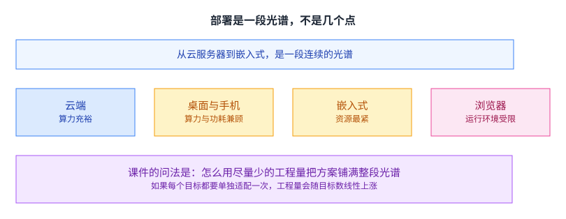
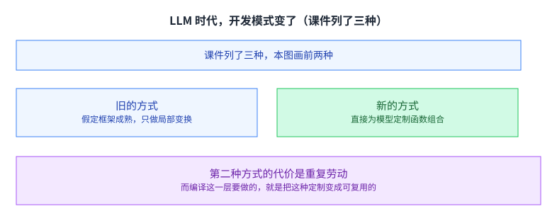
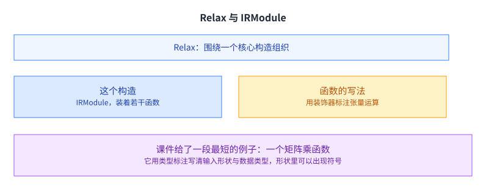
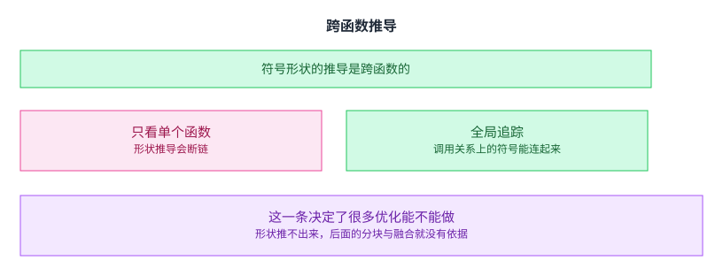
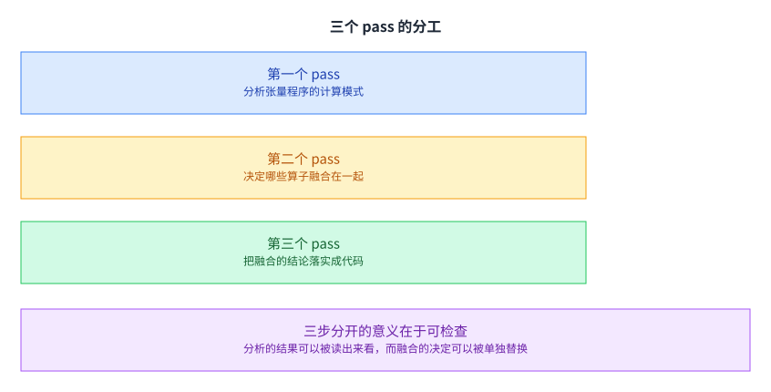
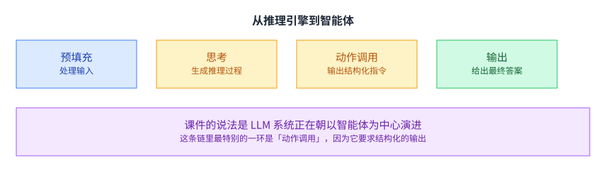
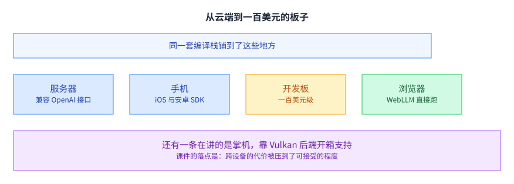

+++
title = "机器学习编译进阶：把模型部署到云与端"
lecture = 19
slug = "advanced-ml-compilation"
status = "draft"
source_kind = "slides"
source_url = "https://mlsyscourse.org/slides/advanced-topic-mlc.pdf"
source_title = "Week 12: Advanced topics: ML Compilation — Enable Model Deployment across Cloud and Edge（Tianqi Chen 主讲，2026-03-30）"
output_mode = "explanation"
+++

> 来源课程：Carnegie Mellon University 15-442 / 15-642 Machine Learning Systems（Tianqi Chen、Zhihao Jia）；
> 对应讲次：Week 12 — Advanced topics: ML Compilation: Enable Model Deployment across Cloud and Edge（Tianqi Chen 主讲，2026-03-30）；
> 原文课件：https://mlsyscourse.org/slides/advanced-topic-mlc.pdf ；
> 上游许可：CC BY-NC 4.0（课程仓库根 LICENSE）—— 允许翻译与改编，须署名、且不得商用；
> 本文由 CourseLingo 原创撰写：按课件的推进顺序用中文重新讲解，关键定义处给出英文原文短引，配图为自绘 SVG，未转载原图与整页文字；本文非官方材料，CourseLingo 与 CMU 及本课程教学团队无隶属关系；如与原文有出入，以原文为准。

## 这一讲要解决什么

课件这一讲的题目是「用机器学习编译把模型部署到云与端」。它要解决的问题听上去很朴素：同一份模型，要在差异极大的设备上都能跑起来，而工程投入要尽量少。

这一讲既是技术讲，也是一次回顾。前面十几讲讲过的分块、融合、并行、显存优化，在这一讲里被放到「跨设备部署」这个目标下重新组织了一遍。看完这一讲，应该能明白为什么这些手段需要一个统一的中间表示来承载。

[[term:ml-framework]] 在这里的位置很特别：它既是要被编译的对象，也是承担编译结果的地方。左手的模型描述与右手的设备执行之间，那一层就是这一讲的主题。这一讲也是全课的收束，[[term:hardware-accelerator]] 的多样性在这里第一次成为主角。

## 部署是一段光谱

课件把部署目标排成一段光谱。

从云服务器到嵌入式设备，中间还有桌面与笔记本、平板、手机、以及浏览器。两端的需求差别极大：云端算力充裕、关心吞吐；嵌入式资源最紧、关心能不能装下；浏览器还有运行环境的额外限制。

课件在这一页提了一个问题：怎么用尽量少的工程量，把一个方案铺满整段光谱。

这个问法是这一讲的关键。如果每个目标都要单独适配一次，那么工程量会随目标数量线性上涨；而现实中目标的数量还在不断增加。所以要找的是一种「一次描述、多处适配」的办法。

光谱这个词用得也准确。真实的部署目标不是几个离散的点，而是一段连续区间：同一款手机的不同型号、同一台服务器上的不同加速卡，都会落在区间里的不同位置。为每一点单独优化，成本上不成立；为整段区间找一个统一的办法，才是可维护的。

## 机器学习编译能帮上什么

课件给的答案是编译这一层：它把模型与设备解耦，让同一份模型描述可以被翻译到不同的后端。课件还提到它把模型与内存规划放在一起考虑。

「解耦」是这里的关键词。模型描述写一次，后端各自适配一次，而不是每个「模型乘设备」的组合都适配一次。这正是编译器这一层存在的理由，也是它在部署场景里比在单个算子优化里更有价值的地方。

用组合数算一下会更清楚。假设有十种模型、十种设备，两两适配就是一百份工作；而如果模型与设备各自独立适配，工作量是二十份。差别随规模迅速拉开，这也是为什么「加一层抽象」在部署这件事上几乎是唯一可行的方向。

## 课件问：最大的挑战在哪

课件把最难的一组问题列了出来。

偏向模型一侧的有稀疏权重与参数分片；偏向工程一侧的有内存、规划、算子库、派发与算子融合。

这一页课件没有给单一答案，它把清单摆出来当成提问。这组问题的共同点是它们都跨在「模型的意图」与「硬件的约束」之间：稀疏与分片是模型层面的选择，而内存、派发与融合是硬件层面的现实。

[[term:kernel]] 优化解决的是清单里的最后几项；而整段光谱能不能铺开，取决于前几项有没有在编译这一层被处理好。[[term:compute]] 在这里不再是某一台设备的属性，而是一组需要被映射的目标。

## LLM 时代，开发模式变了

课件对比了两种开发方式。

一种是假设底层框架已经成熟、自己只做封闭的变换；另一种是直接为模型定制函数的组合。课件认为后一种正在变多。

这个变化的原因不难理解：模型形态的变化速度快过框架的适配速度。第 15 讲讲 TIRx 的动机时，说的正是同一件事。

两种方式的差别最终落在「谁承担变化」上。旧方式里变化由框架承担，用户改动小；新方式里变化由用户承担，于是迭代快。课件认为后者在变多，这个判断与它在第 15 讲给出的现状判断是一致的。

第二种方式的代价是重复劳动。每个新模型都要重新写一遍相似的东西，而这些写法之间本来有大量共同部分。编译这一层要做的，就是把这些共同部分抽出来，让定制变成可复用的。

## Relax 与 IRModule

课件给出的方案叫 Relax。

它的定位是「为端到端动态机器学习提供的可组合抽象」。课件说它围绕一个核心构造组织，那个构造叫 IRModule，里面装着若干函数。

「可组合」这三个字是它的设计取向。它不试图把所有的优化都做成一个大 pass，而是把能力拆成可以拼接的部件，让使用者按需要组合。课件的这一页之后给的都是这种小例子，而不是一个完整的大程序，原因也在这里。

课件给了一段最短的例子：一个矩阵乘函数，用装饰器标注，用类型标注写清输入的形状与数据类型。这里有一处细节值得留意：形状的写法里可以出现符号，而不只是具体数字。

这也是这一讲后面几页的重点。[[term:throughput]] 与[[term:latency]] 这两个指标，在这一层变成了「针对不同目标做不同取舍」的参数。

## 符号形状是一等公民

做法是让形状里的某一维不再是一个具体数字，而是一个可以参与推导的符号。课件给的例子是一个形状为「问号乘 2 乘 2」的张量，那个问号就是未知的批大小。

好处是同一份代码可以适配不同的批大小，而不必为每一种批大小重新编译一遍。代价是形状要在编译期被推导出来，而不是直接从程序里读出来。

这件事在部署场景里格外重要。第 14 讲讲服务时，请求的批次大小是随时变化的；如果每来一种批次就要重新编译，那么这套方案在真实负载下就没法用。

课件给的写法也说明了它的实现方式：形状写成符号，符号在编译期参与推导，而推导的结果可以被用来决定分块大小、缓冲区大小这些具体参数。也就是说，动态性没有被推开，而是被翻译成了「编译期的一组约束」。

## 跨函数推导

课件强调的不只是「支持符号」，还有「在哪里推导」。

课件的说法是：Relax 会在多个函数之间全局地追踪并推导符号形状。也就是说，它不只看一个函数内部的形状，还会沿着调用关系把符号传下去。

这一条决定了很多优化能不能做。如果形状在函数边界处就断了，那么后面的分块、融合与内存规划都失去了依据——它们都需要知道张量的准确形状。

[[term:computational-graph]] 这一层之所以值得单独设计，很大程度上就是因为形状信息需要跨越函数与层级地流动。

## 跨层级追踪动态性

课件还讲了在多个层级上追踪动态性。

从图这一级的端到端动态模型，一直到底层运行时才知道的具体取值，同一份程序在不同层级上表现出不同程度的「不确定」。

把「不确定」分成层级来处理，是一个很实用的做法：越靠上的层级越抽象，能做的判断越多；越靠下的层级越具体，剩下的不确定性越少。于是同一个程序在每一层都拿到一份「这一层能确定什么」的清单，优化就按这份清单来做。

课件给的例子是一个端到端动态的模型。它的关键在于同一套程序要能同时容纳两类信息：一类在编译期就已知，可以据此做优化；另一类要到运行时才知道，只能留出处理路径。

这个「两层并存」的结构在很多编译器里都能看到。它的难点不在支持动态，而在动态存在的前提下仍然尽可能多地做静态优化。

换个角度说，动态性的代价不是「慢」，而是「少知道」。编译器知道的越少，能做的优化就越少。所以整套设计的努力方向是：把尽可能多的信息从运行时提到编译期，同时保留一条运行时才知道时的处理路径。

## 案例：量化模型的算子融合

课件用一个量化模型讲了融合。

反量化是一个逐元素操作，课件把它的计算模式标注成单射，于是它可以和相邻的逐元素操作融合在一起，省掉中间结果的写与读。

这一条与第 2 讲的规则式融合是同一个目标，区别在于手段：第 2 讲里那些融合规则是人手写进优化器的；这里是靠分析每个算子的计算模式，自动得出「哪些能融」的结论。

课件的例子还说明了「计算模式」这个概念的用处：它不是算子的名字，而是算子对数据的处理方式。名字不同但模式相同的两个算子可以融合；名字相同但模式不同的两个算子则不行。判断依据从名字换成了性质，这正是自动化的前提。

[[term:end-to-end]] 的收益也在这里体现：融合省下的不是某一处计算，而是整个通路上的一次往返。

## 三个 pass 的分工

课件把融合拆成三步。

第一个 pass 分析每个张量程序的计算模式；第二个 pass 决定哪些算子应该融合在一起；第三个 pass 把结论落实成实际的代码。

三步分开的意义在于可检查。分析的结果可以被读出来看，融合的决定可以被单独替换，而代码生成只负责兑现决定。

换个说法，这三步把「事实」「判断」「动作」分了家。事实是每个算子的计算模式，判断是哪些该融合，动作是生成对应的代码。把判断从事实里独立出来之后，同一份事实可以配不同的判断策略，于是调优不需要重写分析器。如果三步揉在一起，那么当融合结果不理想时，你无法判断问题出在哪一步。

这也是编译器的通用设计原则：把「判断」与「兑现」分开，让每一步的中间结果都可见。[[term:ml-framework]] 里那些可以打印出来看的 IR，就是这条原则的产物。

## 从推理引擎到智能体

课件把 LLM 系统的形态画了出来。

它的说法是 LLM 系统正在朝以智能体为中心演进：一次请求不再只是「输入到输出」，而是预填充、上下文、思考、动作调用、再输出这样一串环节。

这条链里最特别的一环是「动作调用」，因为它要求结构化输出：模型必须按一个约定的格式吐出内容，否则下游程序没法解析。

而结构化输出对推理引擎提出了一个新要求，也就是下一页要讲的约束解码。

## 结构化输出与约束解码

做法是在每一步用一个掩码把不合文法的 token 挡掉，只让模型在合法的候选里挑。这样采样出来的内容一定符合给定的文法。

难点有两个。一个是规模：词表有十几万个 token，而复杂文法可能对应无穷多个状态。另一个是位置：掩码目前大多在 CPU 上生成，而 GPU 越来越快，CPU 这一环跟不上，于是它变成了新的瓶颈。

课件引的是 XGrammar 这份工作。它的关键洞察是：**绝大多数 token（课件说超过 99%）只看解析栈顶就能提前定下来**，也就是它们与上下文无关。

这个洞察的价值在于它把「每一步都要重新判断全部 token」变成「大部分 token 一次算好、只有少数要现算」。

课件给的加速比也说明了这一步的收益量级：在不同的文法上，掩码生成的效率提升从几倍到两百多倍不等。这个跨度的存在说明「上下文无关」的占比随文法而变，于是这个优化的收益也随负载而变。这与前面几讲的思路一致：先找出哪些部分是稳定的，再把它们从关键路径上移走。

## 从云端到一百美元的板子

课件最后用一组真实部署收尾。

服务器上有兼容 OpenAI 接口的服务；手机上有 iOS 与安卓的 SDK；一百美元级的开发板上能跑；浏览器里也能直接跑。课件还提到掌机，靠 Vulkan 后端开箱支持。

课件的落点是：跨设备的代价被压到了可接受的程度。这一点也可以从另一个方向读：如果没有这一层，那么上面这些落地目标里的大部分根本不会出现。也就是说，前面那些看起来抽象的东西，最后换来的是一份能铺到这么多目标上的实际能力。

这也是这门课最后一讲的合适落点。[[term:latency]] 与[[term:throughput]] 这两个从第 1 讲就出现的词，在这里被同时放到了很多种设备上。前面十几讲讲的都是「怎么让一件事在一台设备上更快」；这一讲把视角拉到最远：怎么让同一件事在很多很多种设备上都能跑。两个目标用的是同一批手段，区别只在组织的层次。

[[term:machine-learning-system]] 的边界，到这里算是画完整了。

## 读完应该能回答

1. 课件提的那个部署问题是什么，为什么「每个目标单独适配」不可行。
2. 机器学习编译在部署这件事上解决的是什么，它说它把哪两件事放在一起考虑。
3. 符号形状解决了什么问题，为什么它在服务场景里格外重要。
4. 为什么「跨函数推导形状」比「支持符号形状」更难也更要紧。
5. 课件的融合案例里，反量化为什么能与相邻算子融合。
6. 融合被拆成哪三个 pass，分开的好处是什么。
7. 约束解码的两个难点是什么，XGrammar 的关键洞察为什么能把大部分判断提前。

## 溯源

- 对应：CMU 15-442 / 15-642 Machine Learning Systems，Week 12 — Advanced topics: ML Compilation: Enable Model Deployment across Cloud and Edge（Tianqi Chen 主讲，2026-03-30）。
- 原文课件：https://mlsyscourse.org/slides/advanced-topic-mlc.pdf
- 上游许可：CC BY-NC 4.0（课程仓库根 LICENSE，19,342 B）。允许翻译与改编，须署名且不得商用。本页未转载原图与整页文字，配图全部自绘。
- 课件在这一讲里引了两处外部材料，本页照原样标注，且均未转载其原图：Relax（Composable Abstractions for End-to-End Dynamic Machine Learning，用于讲 IRModule 与符号形状那几页）、XGrammar（Efficient and Flexible Grammar Engine，用于讲约束解码那几页）；课件还标注了 XGrammar 在 vLLM 里的集成以及一份来自 vLLM 博客的来源。
- 本讲取材范围分五块。一是动机与光谱：机器学习系统在三次浪潮中的角色、云与端两类机会、部署光谱的六个目标与「用最少工程量铺满」这个提问、机器学习编译能提供的解耦、以及课件列出的那组最难问题（内存、规划、算子库、派发、算子融合、参数分片、稀疏权重）。二是开发模式与 Relax：两种开发方式的对比、Relax 的定位与 IRModule、一段最短的矩阵乘例子。三是动态性：一等的符号形状（问号形状的例子）、跨函数的全局形状推导、以及跨层级的动态性追踪。四是融合案例：量化模型里反量化的计算模式分析、三个 pass 的分工。五是收尾：LLM 系统朝智能体中心演进、结构化输出与约束解码的两个难点、XGrammar 的关键洞察与加速比、以及一组从服务器到浏览器的真实部署。
- 数字与定义以课件页面为准。课件未展开的推论属于 CourseLingo 的讲解，不当作原文引用。这类推论分三组。一组是因果判断：把「每个目标单独适配不可行」解释成工程量随目标数线性上涨、把开放框架与快速演进的矛盾与第 15 讲 TIRx 的动机联系起来、把「两层并存」的难点归结为「在动态存在的前提下仍要尽量多做静态优化」。一组是设计原则：把三个 pass 分开的好处说成「判断与兑现分离、中间结果可见」。一组是跨讲的联系：把融合案例与第 2 讲的规则式融合、把符号形状与第 14 讲的服务批次变化、把 XGrammar 的洞察与「先把稳定部分移出关键路径」这条通用做法联系起来。此外，本讲与前后讲次的对应关系属于我们的编排。
- 一处说明：课件里有若干页是代码页与图示页（例如符号形状与动态性追踪那几组），文字层留下的是代码片段与少量注释。本页对这些页的描述只依据可见的代码骨架与标题，没有逐行转述代码，也没有替课件补公式。