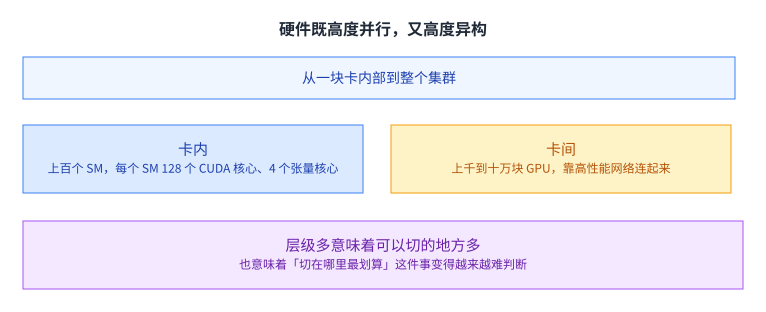
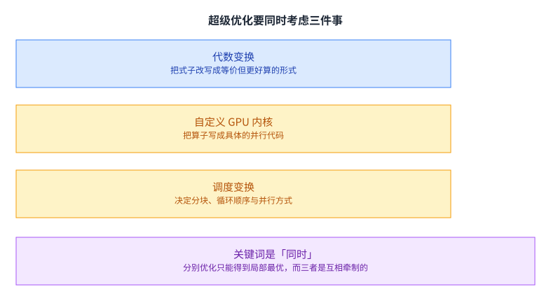
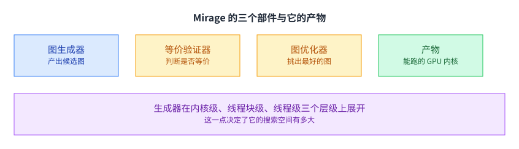

+++
title = "ML 超级优化"
lecture = 20
slug = "kernel-superoptimization"
status = "draft"
source_kind = "slides"
source_url = "https://mlsyscourse.org/slides/18-kernel-superoptimization.pdf"
source_title = "Advanced Topics: ML Superoptimization（Tianqi Chen、Zhihao Jia 主讲，2026-04-06）"
output_mode = "explanation"
+++

> 来源课程：Carnegie Mellon University 15-442 / 15-642 Machine Learning Systems（Tianqi Chen、Zhihao Jia）；
> 对应讲次：Advanced Topics: ML Superoptimization（Tianqi Chen、Zhihao Jia 主讲，2026-04-06）；
> 原文课件：https://mlsyscourse.org/slides/18-kernel-superoptimization.pdf ；
> 上游许可：CC BY-NC 4.0（课程仓库根 LICENSE）—— 允许翻译与改编，须署名、且不得商用；
> 本文由 CourseLingo 原创撰写：按课件的推进顺序用中文重新讲解，关键定义处给出英文原文短引，配图为自绘 SVG，未转载原图与整页文字；本文非官方材料，CourseLingo 与 CMU 及本课程教学团队无隶属关系；如与原文有出入，以原文为准。

## 这一讲要解决什么

课件从一个很大的问题开始：推动机器学习成功的根本动力是什么。

它给的答案是算力与规模。顺着这个答案往下问，就会落到一个很具体的问题上：这些算力是买来了，但怎么才能真正用上。

这一讲讲的是一种用自动搜索来回答这个问题的方法。它的目标不是优化某一个算子，而是把「哪个式子怎么写、写成几个内核、每个内核怎么分块」这几件事放在一起搜。

[[term:hardware-accelerator]] 这一讲里是主角：硬件的形态决定了搜索空间有多大，也决定了「人写不过来」这件事有多严重。[[term:compute]] 在这里第一次成为「花了钱但未必用得上」的东西。

## 三条推动力是相互咬合的

课件把三条线画在一起。

训练与推理的算力需求在涨；硬件走向更并行、更专用；模型的精度与能力在提升。课件在这一页标了两个来源，分别是 OpenAI 与 NVIDIA。

三条线的关系是互相推动。模型要更多算力，硬件给出更多算力，而更多的算力又让更大的模型变得可行。课件的另一页引了一组关于单位成本算力的长期曲线，并标出它预测的某个时间点。

这组曲线解释了这一讲为什么值得单独存在：既然推动力是算力，那么「能不能把算力用满」就是最值得投入的方向之一。课件引的那条曲线跨越了几十年，而模型侧的变化只发生在最近十几年，两者的时间尺度差别很大，而正是这个错位让「把算力用满」成了一件长期有价值的事。

## 硬件既高度并行，又高度异构

课件给了一组具体的数字。

卡内是上百个流多处理器，每个 SM 有 128 个 CUDA 核心与 4 个张量核心。卡间是上千到十万块 GPU，靠一张高性能网络连起来。

层级多意味着可以切的地方多，这本来是好事。第 9 讲与第 10 讲讲过数据切分、第 13 讲讲过共享内存分块、第 15 讲讲过两个 SM 组成簇，每一层都提供了一类切分方式。

但层级多也意味着「切在哪里最划算」变得越来越难判断。组合的数量随层级数迅速增长，而人只能同时考虑两三个维度。[[term:throughput]] 的差距，往往就来自有没有找到那个组合。

## 硬件还在快速演进

课件用了两页对照不同代的硬件结构。

变的是单元的数量、组织与互联方式；不变的是「都要把数据搬进来再算」这条基本结构。课件的对照图里，设备内存、SM、CUDA 核心与张量核心的位置关系在每一代都不太一样，而这些位置关系恰恰决定了数据该沿哪条路走。

这个「变与不变」的分法很有用，因为它说明手写的内核为什么会过时。一个针对上一代硬件手调好的内核，它的分块尺寸、寄存器分配、数据搬运路线都是按那一代的结构定下来的；换代之后这些具体决定就未必对了。

这就是自动搜索值得投入的理由：如果搜索的依据是硬件的结构描述，那么换一代硬件只需要换一份描述，而不是重写所有内核。[[term:compute]] 的增长也让这件事的收益随之放大：硬件越强，用不满的代价越高。

## 超级优化要同时考虑三件事

课件给这一讲的定义就在这里。

要在同一套流程里同时考虑代数变换、自定义 GPU 内核、以及调度变换。

- **代数变换**：把式子改写成等价但更好算的形式，比如把一个除法移到矩阵乘之后。
- **自定义 GPU 内核**：把算子落成具体的并行代码。
- **调度变换**：决定分块大小、循环顺序、以及并行方式。

关键词是「同时」。这三类变换是互相牵制的：换了式子，可用的分块方式就变了；换了分块，寄存器的压力又变了。分别优化只能得到局部最优，而它们的组合里可能藏着远更好的点。[[term:kernel]] 这一层的工作，本质上就是在这个组合空间里找点。

## Mirage 的核心想法

课件给出的系统叫 Mirage。

它被定位成给机器学习用的超级优化器，关键想法是为深度网络自动生成高度优化的 GPU 内核。课件给的对比很形象：数千行 CUDA 代码，换成几行 Python。

省工程量只是表层收益，[[term:ml-framework]] 这一层也因此从「提供算子」变成「提供搜索的起点」。更深的一层是：搜索可以覆盖人想不到的组合。前面说过，三类变换的组合空间远大于人能同时考虑的维度，而自动搜索恰好擅长在这样的大空间里找人不会去看的角落。

## 回顾：GPU 编程的基本单位

课件先花一页回顾了基础。

一个内核分成若干线程块，每个块分成若干线程；它们共同操作设备内存，块内还可以用共享内存协作。

这一层的结构在第 6 讲讲过。这一讲要在它之上再叠一层表示，用来描述「怎么把若干算子组合起来」。

课件把这一页放在这里，是为了给出最小单位。后面的图里，每一个节点最终都要落成这一层的东西：一个内核、或者一个线程块里的协作。也就是说，第 6 讲解决的是「一个内核怎么写」，这一讲要解决的是「写几个内核、每个内核里放什么」。

## 分层图：把组合方式写下来

课件给的核心表示叫 **μGraph**（课件的写法，念「微图」；本页下面简称「图」），它是分层的。

同一层内的算子可以合并成一个内核；而合并的边界由共享内存的容量决定：放不下就只能拆成两个内核。

课件举的例子是 RMSNorm 与矩阵乘。**更正一处**：现有系统之所以启动两个内核，课件给的理由是 **RMSNorm 的那个缩放系数放不下共享内存**（课件公式里的 γ），不是笼统的「中间结果」。这一页还同时列了两条性能问题：共享内存没法复用，以及内核启动本身的开销。

这句话看起来只是在描述现状，其实已经指明了搜索的方向：如果能换一种等价的写法，让要常驻的那部分变小，两个内核就能合成一个。课件的案例里，第一个例子走的正是这条路（把分母移到矩阵乘之后）。

共享内存的容量在这里扮演了一个很具体的设计约束。它不大（第 6 讲讲过的 96 KB、第 15 讲的 228 KB 都是同一个量级），所以「中间结果能不能放下」往往就是「一个内核还是两个内核」的分界线。而这条分界线会跟着硬件的换代一起移动。

[[term:latency]] 与带宽的收益也来自这里：合成一个内核省下的不是计算，而是中间结果往返设备内存的那两趟。

## 例子：分组查询注意力

课件用一个注意力变体把「同一个计算有多种图」讲清楚。

PyTorch 的写法是一串重复与矩阵乘。另一种做法（课件引的是 FlashDecoding）把它拆成两个内核，前提是把 softmax 拆成指数、三次求和与一次除法。

两者算的是同一件事，但代价结构完全不同。课件把这两种写法都画成了图，于是比较就从「读代码」变成了「比结构」。前者可能要重复计算键值，后者的额外代价在拆分与合并上。哪一边更划算，取决于张量的具体形状与硬件的具体参数，而这恰好是自动搜索擅长、人却难以逐例判断的地方。

## 两个核心挑战

课件把「找出高性能的图」拆成两个问题。

第一，怎么生成候选的图。第二，怎么验证它们彼此等价。

第一个问题是搜索空间问题：候选的数量可能大到无法穷举。课件在这里给了一组对比数字，说明朴素的搜索规模有多大。

严格来说，「大」还不是最难的：候选空间里既有连续的小改动（挪一个分块尺寸），也有离散的跳变（换一种算子组合方式）。搜索算法要同时应付这两类变化，这也是为什么这一讲的解法偏向「换表示」而不是「换搜索算法」。（「连续结构 / 挪一格」这组对立词是我们的刻画，课件那一页给的是搜索耗时随算子数跳变的曲线。）

第二个问题是正确性问题：换了一种写法之后，结果必须与原来完全一致。在一个自动搜索的系统里，「完全一致」这件事不能靠人来看，必须有可自动执行的判断办法。

这一点对系统的可信度很关键。自动生成的代码如果偶尔算错，而错误又只出现在某些形状上，那么排查成本会高到让整套方法不可用。所以在自动生成这类系统里，验证器的成熟度往往决定它能不能被真正采用。所以验证器不是「顺手加的一个检查」，而是这套方法能落地的前提。

两个问题缺一不可：只生成不验证会算错，只验证不生成则无从搜索。

## Mirage 的三个部件

课件给的总览很干净。

图生成器负责产出候选，它会在**内核级、线程块级、线程级**三个层级上展开（课件也把这三层写作 GPU 级、SM 级、线程级）；等价验证器负责判断候选是否与原来等价；图优化器负责在候选里挑出最好的；最后落成真正能跑的 GPU 内核。（更正两处：层级名不是「算子」，而是内核 / 线程块 / 线程；另外课件的框只有三个，「后端」是我加的术语，源里没有这个词。）

这三个部件正好对应上一节的两个挑战，再加上一个「挑最好」。这个结构也解释了为什么标题是「超级优化」而不是「自动调优」：调优是在给定的写法上调参数，这里连写法本身都在搜。

这个区别的代价也不小。调优的参数空间通常是几个维度的连续取值，而这里是「图」本身，每一种都是离散结构。所以这一讲的难点几乎全部集中在「怎么把离散结构压到一个能搜的大小」上，后面的抽象表达式与概率验证都是为这一件事服务的。

## 抽象表达式：让搜索变得可扩展

搜索空间太大，课件给的解法是换一种表示。

这种表示叫抽象表达式，做法是把张量计算里的下标细节抹掉，只保留子表达式之间的关系。抹掉下标之后，两个「形状不同但结构相同」的表达式就会被看成同一个东西，于是搜索不必在那些无关的差异上浪费。

课件用两个目标来概括它的用途：一是抓住子图之间的关系，二是判断两个表达式是否等价。它还说，Mirage 用一阶逻辑来推理这两种关系。

换个说法，这一步做的是「把问题抽象到合适的层级」。搜索空间大，往往不是因为答案多，而是因为表示里带了太多与答案无关的细节。

课件用两组数字说明了这一步的效果。**更正一处**：那两组数字的量纲是**搜索耗时（分钟）**，不是「规模」，而具体数值是 **332.2 分钟 → 1.0 到 3.1 分钟**（后者是随线程块图里算子数从 5 增到 12 的一串取值），所以是**两个数量级**的差别，不是我先前写的「从三百多降到十几」。横轴才是规模，标的是「线程块图里最多几个算子」。这个倍数不是靠更快的机器拿到的，而是靠换了一种表示。

## 等价性验证：随机输入加有限域

那「是否等价」具体怎么判。

课件引的是 Schwartz-Zippel 引理，做法是在有限域里取随机输入，用它们去检验两个图是否给出相同结果。

这不是形式化证明，它给出的是「以极高概率成立」的判断。这个取舍在搜索场景里是合理的：证明等价可能非常贵，而搜索要反复判断成千上万次候选；用极小的出错概率换掉大量的证明时间，是很划算的一笔交易。

课件的这一页也顺带回应了第一节留下的那个问题：怎么验证。它没有选择「写一个完备的证明器」，而是选择了一个概率性的判断工具。这个选择本身就说明了自动搜索这类系统的设计取向：先让整条链路能跑起来，再逐步收紧每一环的严格程度。

[[term:kernel]] 的自动生成之所以能成立，一部分就建立在这类「够用就好」的判断上。[[term:throughput]] 的收益则来自它能评估的候选数量：判断越便宜，单位时间内能比较的图就越多。它不追求绝对，而是追求在可接受的代价下给出足够可靠的答案。

## 三个案例与收益

课件最后给了三个具体案例。

一个是 RMSNorm 加线性层：做法是把 RMSNorm 的分母移到矩阵乘之后，于是两个内核可以融合、共享内存可以复用。这一步用的是代数变换，也就是这一讲定义里的第一类手段。一个是 LoRA：把三次矩阵乘与一次加法融进一个内核，课件说这比 Triton 快 2.3 倍。还有一个是门控多层感知机。

课件给的总体加速比是 1.4 到 2.7 倍，这个区间跨在几个不同的算子上。它还提到两点观察：一是它发现的图与专家手写的实现在结构上相似；二是它能在新硬件上用上新的互联方式，比如在 H100 上利用 **GPC（图形处理簇）这一级做归约**（课件的原话是「利用 GPC 级 AllReduce 在 H100 上加速注意力」）。

最后这一点是这一讲很好的收尾。搜索出来的结果与专家的手写实现相似，说明搜索确实找到了那些「对的东西」；而它还能用上人可能没注意到的新互联方式，说明搜索不只是复现人的判断，也能补上人的疏漏。这两点合起来，才是「自动生成内核」这件事真正的说服力。[[term:machine-learning-system]] 自动化到这一步，省下的就不只是工程量了。

## 读完应该能回答

1. 课件把机器学习成功的推动力归到什么上，它用了哪三条线来画这件事。
2. 课件说超级优化要同时考虑哪三类变换，为什么「同时」是关键。
3. 为什么硬件快速演进这件事本身构成了自动搜索的理由。
4. 分层图里的「层」是由什么界定的，课件举的例子中现有系统为什么要启动两个内核。
5. 找出高性能图的两个核心挑战各是什么。
6. 抽象表达式抹掉了什么、保留了什么，它为什么能让搜索变得可扩展。
7. 等价性验证用的是什么方法。

## 脉络回顾

这一讲的起点是一个很大的问题：算力与规模推动了机器学习的成功，那么这些算力怎么才能真正用上。做法是把代数变换、自定义内核与调度变换放进同一套流程里一起搜，理由不在省工程量，而在这三类变换互相牵制，分别优化只能拿到局部最优，它们的组合里却可能藏着人不会去看的点。难点因此集中在中间：候选多到无法穷举，而且换一种写法之后结果必须与原来完全一致，验证器于是成了这套方法能不能被采用的前提，用有限域上的随机输入判定等价，是拿极小的出错概率换掉大量证明时间。第 21 讲把搜索的对象从内核内部抬到内核之间，而「把困难的判断交给搜索与验证」这条思路没有变。

## 溯源

- 对应：CMU 15-442 / 15-642 Machine Learning Systems，Advanced Topics: ML Superoptimization（Tianqi Chen、Zhihao Jia 主讲，2026-04-06）。
- 原文课件：https://mlsyscourse.org/slides/18-kernel-superoptimization.pdf（课件号的对照见第 8 讲溯源；本页一律用仓库讲次号指路。）
- 上游许可：CC BY-NC 4.0（课程仓库根 LICENSE，19,342 B）。允许翻译与改编，须署名且不得商用。本页未转载原图与整页文字，配图全部自绘。
- 课件在这一讲里引了若干外部材料，本页照原样标注，且均未转载其原图：单位成本算力那条长期曲线（**这是第三方插图**：课件页脚署的是 Ray Kurzweil 的《The Singularity Is Near》，2005，图上一句绿字是「2023 年超过人脑算力」。正文转述了它的跨度与那个预测，配图是我们自绘的，未转载原图）、规模定律那一页的两个来源（OpenAI 与 NVIDIA）、Mirage、FlashDecoding、Triton、以及 Schwartz-Zippel 引理。
- 本讲取材范围分五块。一是动机：推动力这个问题与算力这条答案、三条互相推动的线、硬件的高度并行与异构、以及硬件的快速演进。二是超级优化的定义与 Mirage 的定位：同时考虑代数变换、自定义 GPU 内核与调度变换。三是表示与例子：GPU 编程层次的回顾、分层图与共享内存对合并边界的决定、RMSNorm 与矩阵乘、分组查询注意力的两种写法与 FlashDecoding 的 softmax 分解。四是两个挑战与三个部件：生成候选与验证等价、三个部件、抽象表达式、以及基于 Schwartz-Zippel 引理的随机输入验证。五是案例与收益：RMSNorm 加线性层、LoRA、门控多层感知机，总体 1.4 到 2.7 倍。
- 数字与定义以课件页面为准。课件未展开的推论属于 CourseLingo 的讲解，不当作原文引用。这类推论分三组。一组是因果判断：层级多导致组合数增长而人只能顾两三个维度、硬件换代让手写内核过时、省工程量是表层收益而覆盖人想不到的组合是更深一层。一组是对设计意图的解读：三类变换互相牵制所以分别优化只能得局部最优、抽象表达式是把问题抽象到该抽象的层级、概率性验证是搜索场景里划算的取舍。还有一组是跨讲的联系：分层图与第 6 讲的内核编程、融合的收益与第 2 讲和第 13 讲、新互联方式的利用与第 15 讲的处理簇。本讲与前后讲次的对应关系属于我们的编排。
- 一处说明：课件有若干页是结构图与代码页，文字层只留下标签与片段；本页只依据可见的标签与标题描述，未逐行转述代码。