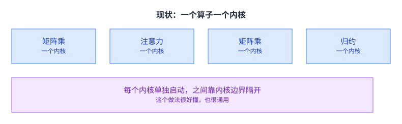
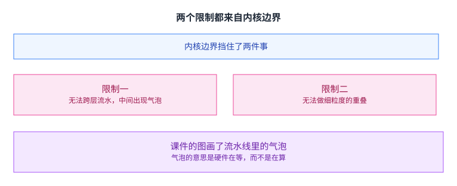
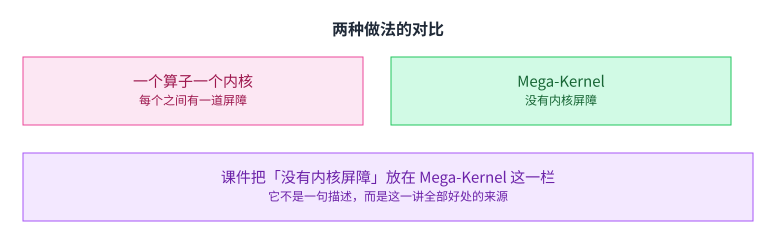
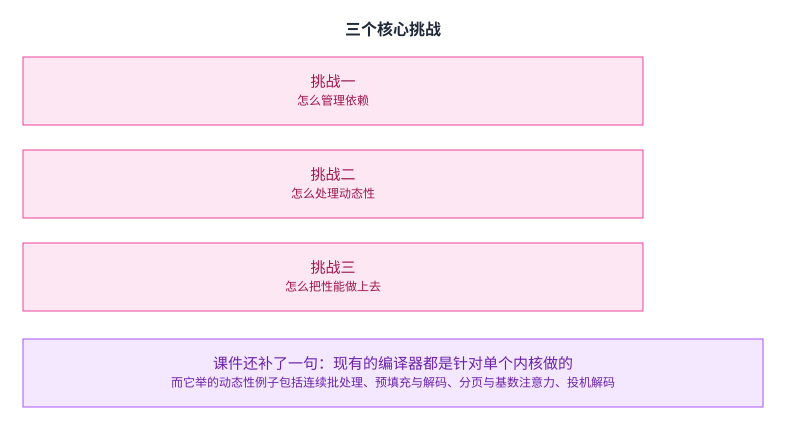
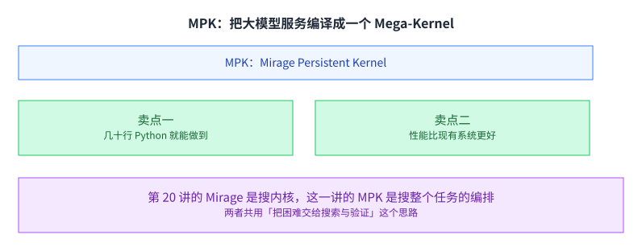
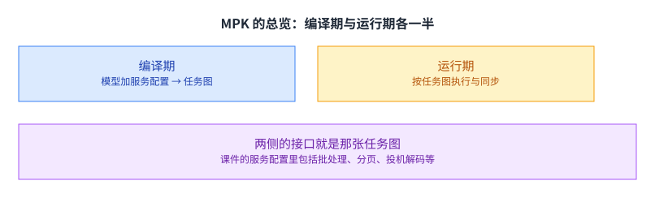
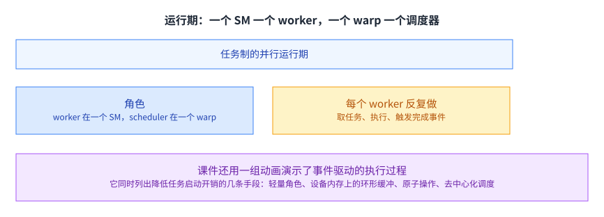
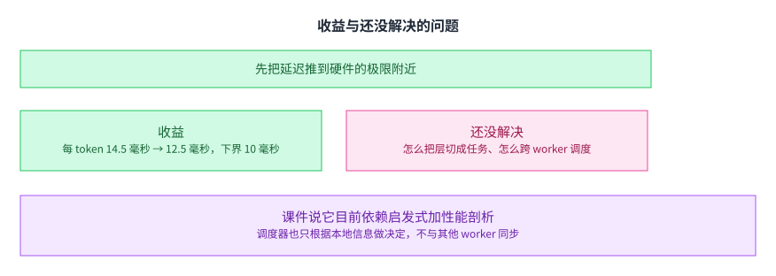

+++
title = "Mega-Kernel"
lecture = 21
slug = "mega-kernel"
status = "draft"
source_kind = "slides"
source_url = "https://mlsyscourse.org/slides/19-mega-kernel.pdf"
source_title = "Advanced Topics: Mega-Kernel（Tianqi Chen、Zhihao Jia 主讲）"
output_mode = "explanation"
+++

> 来源课程：Carnegie Mellon University 15-442 / 15-642 Machine Learning Systems（Tianqi Chen、Zhihao Jia）；
> 对应讲次：Advanced Topics: Mega-Kernel（Tianqi Chen、Zhihao Jia 主讲）；
> 原文课件：https://mlsyscourse.org/slides/19-mega-kernel.pdf ；
> 上游许可：CC BY-NC 4.0（课程仓库根 LICENSE）—— 允许翻译与改编，须署名、且不得商用；
> 本文由 CourseLingo 原创撰写：按课件的推进顺序用中文重新讲解，关键定义处给出英文原文短引，配图为自绘 SVG，未转载原图与整页文字；本文非官方材料，CourseLingo 与 CMU 及本课程教学团队无隶属关系；如与原文有出入，以原文为准。

## 这一讲要解决什么

前面几讲都在同一个框架里做事：把一个算子写快。这一讲换了一个提问方式：如果那个框架本身有问题呢。

课件先回顾了内核的基本单位：一个内核分成若干线程块，块里是线程，大家共同操作设备内存。而「Mega」指的是把这些内核合并成一个。

合并成一个之后，好处在哪、难处在哪，以及怎么把它自动做出来，这是这一讲的三件事。它也是这门课的最后一讲，所以值得留意的是它把前面很多讲的东西都收在了一个新的提问下。[[term:kernel]] 这个概念在这一讲里第一次成了被质疑的对象，而[[term:compute]] 与[[term:throughput]] 这对老对手也跟着换了衡量方式。

## 现状：一个算子一个内核

先看常见做法。

课件画的是：矩阵乘、注意力、又一个矩阵乘、归约，每一个都是一个独立启动的内核，按顺序排下去。

这个做法很好懂：每个内核只干一件事，写起来清楚，也便于复用。它也很通用，换一个模型把内核换一换就行。所以它长期是默认做法。

它的另一个好处是责任清楚。哪个算子慢就去看哪个内核；换一块卡只影响那几处与硬件相关的写法。这种「一格一格对齐」的结构降低了排查成本，代价是把全局的排布可能性丢掉了。

问题不在单个内核写得好不好，而在它们之间的那道边界。

## 两个限制都来自内核边界

课件在 `Limitations` 那一页列了**三点**，而且前两点的成因是**分开写的**：

一是**没有跨层流水**，课件给的成因是「内核之间的屏障挡住了跨层流水」；二是**没有重叠**，成因是「**粗粒度的依赖**挡住了计算与通信的重叠」——注意这一条不是屏障；三是**动态性受限**，因为要靠 CUDA 图来降低内核启动开销。

**更正两处**：我原先只写了两点（漏了第三条），并且把第二点的成因也说成「内核屏障」。「两条的根源是同一个」那句也是我的归纳，课件没有这么说。

课件的图是**两张泳道图的对比**：左边两张各自标着内核 1、内核 2，泳道是张量内存引擎、张量核心、CUDA 核心，每张里都标了「流水线气泡」；右边是一张「融合后的内核」，没有气泡。（更正：我原先写「画在一条时间轴上、被切成一段一段」——三条泳道是对的，但它是左右对比，不是一条轴。）

气泡的意思是硬件在等，而不是在算，于是[[term:latency]] 被拉长而[[term:throughput]] 掉下来。

课件在这一页放了三类单元：张量内存、张量核心、CUDA 核心。它们在同一个内核里本来可以互相覆盖彼此的等待，但内核的边界把这种覆盖切断了。所以这两个限制看起来是两条，其实是同一条边界造成的两种后果。这也是这一讲最直接的动机：前面十几讲想尽办法让每一段跑满，而边界把这些努力割开了。

## 两种做法的对比

课件把两种做法摆在一起。

一个算子一个内核时，内核之间有一道屏障；而 Mega-Kernel 里没有内核屏障，整个模型在一次启动里跑完。

「没有内核屏障」听起来只是一句描述，其实是这一讲全部好处的来源。它也解释了为什么这一讲要把它放在对比里当唯一的分界：别的差别都是这一条的后果。没有屏障意味着两件事可以同时进行，不必等前一件彻底结束；而排布它们的自由度，正是前面几讲反复想要的。

[[term:machine-learning-system]] 在这两讲里的角色变化也值得留意：前面几讲是在给定的框架里找最优，这一讲是在问框架本身能不能换。这也是把这一讲放在最后的原因。

## 三个核心挑战

合并成一个内核之后，原来的便利没有了，得自己补上。

课件列了三个问题：怎么管理依赖、怎么处理动态性、怎么把性能做上去。前两个不解决会算错，第三个不解决则白做。

课件还补了一句很关键的话：现有的编译器都是针对单个内核做的。也就是说，合并之后没有现成的工具可以依赖，从依赖分析到调度都得自己来。

它举的动态性例子包括连续批处理、预填充与解码、分页与基数注意力、以及投机解码，四件事都依赖运行时才知道的信息。这四件事恰好是第 14 讲与第 16 讲的主题，而一个合并起来的静态内核最怕的就是这个。

## MPK：把大模型服务编译成一个 Mega-Kernel

课件给出的系统叫 MPK。

它的两个卖点是工程量低与性能更好，前者关于人、后者关于机器。工程量低的说法是：几十行 Python 就能把一个模型 mega 化。性能更好则要靠后面的实验数字说话。

这两个卖点值得分开看。工程量低意味着这条路不是只有专家才能走；性能更好意味着它不只是好写，也确实更快。两者同时成立，一种方法才有被采用的理由。

第 20 讲的 Mirage 是在搜单个内核怎么写，这一讲的 MPK 是在搜整个任务怎么编排；搜索的对象从「一个内核内部」升到了「内核之间」。两者共用同一个思路：把困难的判断交给搜索与验证，人只提供问题与约束。

这个思路的代价也相同：它依赖一个可信的验证手段，以及一个足够快的搜索过程。没有可信的验证，搜出来的东西不敢用；没有足够快的搜索，编译一次要等太久。

## MPK 的总览：编译期与运行期

课件的总览分成两侧。编译期把模型加上服务配置变成一张任务图；运行期按这张图把任务分给各个 worker 执行。（「自己不做分析」是我们的推断：课件那一页只画了两侧各自的输入输出，没有这句话。）两侧的复杂度不对称，重的都在编译期。

两侧的接口就是那张任务图。运行期的每一步开销都要乘以任务数量，所以把分析尽量放在编译期、让运行期只做轻量调度，这一步的分工很关键。

课件的服务配置里明确列了批处理、分页、投机解码等项，与第 14、16 讲讲的手法是同一批。也就是说这些服务侧的手法没有被绕开，而是被当成编译期的输入。第 14 与第 16 讲讲的那些运行时技巧，在这里被提前到了编译期，代价是每换一种配置就要重新编译一次。

## 任务图：任务与事件交替

课件给的定义是：任务是「在一个 SM 上的一份工作」，事件是任务之间的同步；两者在图上交替出现。图里任务与事件交替出现，于是依赖关系被写得很细。

「在一个 SM 上」这句话很关键。它把任务的粒度钉在了一个硬件单位上：再大就要跨 SM，再小就要多个任务挤一个 SM，两种都会让依赖与同步变复杂。

这个粒度选择与前面几讲的分块很不一样，它衡量的不是「算得快不快」而是「好不好调度」。第 12 与第 13 讲的分块是为了让一个内核跑得快；这里的粒度是为了让一张图能在多个 [[term:hardware-accelerator]] 单元之间调度。

## 任务图与 CUDA 图的关系

课件说任务图是一种「更低层」的 CUDA 图：它能刻画子内核之间的依赖，同时保持静态、不可变的性质。所谓更低层，指的是它描述的东西更靠近硬件单位，而不是更靠近用户写的算子。

静态这一点有好有坏。好处是运行期不用重新分析，调度可以做得很轻；代价是动态的部分要另想办法，而前面提到的那四件事（连续批处理、预填充与解码、分页注意力、投机解码）恰恰都是动态的。

这个矛盾是这一讲最核心的张力：要细粒度的控制，就得把结构静态化；而真实的服务负载是动态的。两者的方向相反，所以解法不可能是「让它动态起来」，只能是「把动态的部分提前确定下来」。课件给的解法是让动态性在编译期被参数化：服务配置作为输入进来，不同的配置编译出不同的任务图。

## 编译流程第一步：算子分解与依赖分析

课件的编译流程有五步，前一步的产物是后一步的输入，五步合起来把初稿化简成运行期好处理的形式。

第一步有三件事：按可用的 SM 数量来优化「算子到任务」的切法；插入同步事件来准确刻画任务之间的依赖；以及**为每个任务生成高性能的 CUDA 实现**。前两件分别决定任务有多大、任务怎么连，第三件是把任务真正落成代码。

（更正：我原先只写了前两件，漏掉第三件 —— 而它恰好与后文「运行期只做轻量调度」是配套的。）

两件事都很具体。切法由 SM 数量决定，意思是同一份模型在不同大小的卡上会切出不同的任务图。依赖要「准确」，意味着既不能漏也不能多：漏了会算错，多了会白白等待。两个方向的代价不对称，前者是正确性问题，后者是效率问题。

这一步的产物是任务图的初稿，后面四步都是在化简它。

## 第二步与第三步：两种事件融合

课件第二、三步都是在合并事件：后继集合相同的事件可以合并，输入依赖相同的事件也可以合并。

两条规则的方向正好相对：一条看「谁在等我」，一条看「我在等谁」。[[term:computational-graph]] 这一层在第 2 讲是给优化器看的，在这里是给调度器看的；同一个表示，服务的读者换了。凡是这两类集合相同的事件，它们在调度上就是不可区分的，于是可以合成一个，图随之变小，运行期要处理的对象也变少。

这也是编译器里很常见的一类化简：找出行为上没有区别的对象，把它们并成一个。

## 第四步与第五步：归一化与线性化

课件第四步的难处是：一个任务可能既依赖多个事件，又触发多个事件。它的做法是把图规范成「每个任务至多依赖一个事件、至多触发一个事件」。

第五步的难处是：一个事件可能触发很多任务，于是要把这些任务的编号都存下来。它的做法是给同一个事件触发的任务分配连续下标，于是表示可以压成「第一个任务与最后一个任务」。

两步合起来做的事情是一样的：把图变得更规整，让运行期只需要处理少数几种情况。规整带来的收益在第 12 讲讲布局时出现过一次，这里换到了图的形状上。

这正是编译期该干的事，也是这份流程值得单独讲的原因。运行期的每一次判断都要乘以任务数量，所以把复杂度从运行期挪到编译期，收益是线性放大的。这也是编译器与解释器的老分工：能提前算的，就不要留到运行的时候算。第 19 讲把这句话用在了图上，这一讲用在了调度上。[[term:ml-framework]] 与编译这一层在系统里的价值，很大一部分就在这里。

## 运行期：一个 SM 一个 worker

课件的运行期由两类角色组成：worker 跑在一个 SM 上，scheduler 跑在一个 warp 上；一个干活，一个派活，两者的资源都不多，这样才有余量留给真正的计算。每个 worker 反复做三件事：取一个任务、执行它、触发完成事件。这个循环里没有「查询全局状态」这一步，所以它可以一直转下去。

课件还用一组动画演示事件驱动的执行过程，让读者看到任务怎样在 worker 之间流动、事件怎样把它们接起来。

它同时列出了降低任务启动开销的四条手段：轻量的 worker 与 scheduler、设备内存上的环形缓冲作为任务与事件队列、用原子操作做事件通知与入队出队、以及去中心化的调度。最后一条的意思是每个 scheduler 只用本地信息决定把任务分给谁。

最后这一条尤其值得注意。去中心化意味着调度器之间不通信，于是调度是快的；代价是它不做全局最优的分配，可能出现某些 worker 忙而另一些闲的情况。这是又一次「用局部信息换速度」，与第 14 讲的连续批处理属于同一类取舍。

## 收益与还没解决的问题

课件给的收益很具体：某个模型每个 token 的延迟从 14.5 毫秒降到 12.5 毫秒，而理论下界是 10 毫秒；它把这个差距从四点五毫秒压到了二点五毫秒。课件还说明它在不同模型、不同批量、不同 GPU 上都优于现有系统。

课件也如实列了两个未解的问题。一个是「怎么把层切成任务」，它说目前还依赖启发式加性能剖析。另一个是「怎么在 worker 之间调度任务」，它的调度器只根据本地信息做决定，不与其他 worker 同步。

把这两个问题放在一起看，能看出这一讲的边界：它证明了「合并成一个内核」这条路是可行的，也给出了把它自动化的方法，但整体的最优切分与全局最优调度还没有被解决。换句话说，可行性已经被证明，最优性还没有。

[[term:hardware-accelerator]] 的上限在这一讲里第一次被直接当成目标：课件的说法是把延迟推向硬件的极限附近，而不是与自己上一版比较。从第 1 讲问「为什么需要机器学习系统」，到这里问「能不能贴着硬件的极限跑」，这门课要解决的问题在两端之间走了一遍。中间的每一讲，都是在回答「这一步离极限还差什么」。

## 读完应该能回答

1. 「一个算子一个内核」有什么好处，为什么它成了默认做法。
2. 内核边界造成的两个限制各是什么，它们为什么有同一个根源。
3. 课件列的三个核心挑战各是什么，其中哪些属于正确性、哪些属于效率。
4. 任务与事件分别定义为什么，任务粒度为什么钉在「一个 SM」上。
5. 任务图的静态性有什么好处与代价。
6. 五步编译流程各自在解决什么问题，哪两步在做「把图变规整」。
7. 运行期的调度为什么是去中心化的。

## 脉络回顾

「一个算子一个内核」在前二十讲里从来没被当过问题，它是所有优化的默认单位。这一讲把这个单位本身拿来问，而毛病落在两个限制上，它们又是同一个根源的两面：内核之间有边界，跨内核的同步做不了，片上数据也留不下来复用，服务系统里那几件依赖运行时信息的事因此排不开。转折是把整份服务编译成一个内核，任务与事件交替流动，运行期一个 SM 一个 worker，调度只用本地信息，快却拿不到全局最优，这和第 14 讲连续批处理用的取舍是同一类。它也是这门课里唯一把提问对象从算子换成整张任务图的地方：第 20 讲搜索的是一个内核怎么写，这里搜索的是任务怎么编排。

## 溯源

- 对应：CMU 15-442 / 15-642 Machine Learning Systems，Advanced Topics: Mega-Kernel（Tianqi Chen、Zhihao Jia 主讲）。这是这门课 21 讲的最后一讲。
- 原文课件：https://mlsyscourse.org/slides/19-mega-kernel.pdf（课件号的对照见第 8 讲溯源；本页一律用仓库讲次号指路。）
- 上游许可：CC BY-NC 4.0（课程仓库根 LICENSE，19,342 B）。允许翻译与改编，须署名且不得商用。本页未转载原图与整页文字，配图全部自绘。
- 课件在这一讲里引了它自己的系统与仓库，本页照原样标注，且未转载其原图或代码：Mirage Persistent Kernel（MPK，课件给了它的 GitHub 地址）、以及它与 CUDA 图的对比。
- 本讲取材范围分五块。一是问题：内核单位的回顾、一个算子一个内核的现状、内核边界造成的两个限制、两种做法的对比、三个核心挑战与「现有编译器都针对单个内核」这句说明。二是系统定位：MPK 的两个卖点、编译期与运行期总览、服务配置作为编译输入。三是任务图：任务与事件的定义、它与 CUDA 图的关系。四是五步编译流程。五是运行期与结果：一个 SM 一个 worker、一个 warp 一个 scheduler、三步循环、降低启动开销的四条手段、延迟从 14.5 到 12.5 毫秒而理论下界 10 毫秒、以及两个未解的问题。
- 数字与定义以课件页面为准。课件未展开的推论属于 CourseLingo 的讲解，不当作原文引用。这类推论分三组。一组是因果判断：把两个限制归结为同一个根源（内核边界）、把「没有内核屏障」说成全部好处的来源、把服务侧那四件事与「静态内核最怕运行时才知道的事」联系起来。一组是设计意图的解读：把任务粒度解释成「不能再大也不能再小」、把五步编译流程的后两步概括成「把复杂度从运行期挪到编译期」、把去中心化调度说成「用局部信息换速度」。还有一组是跨讲的联系：把任务粒度与第 12、13 讲的分块对比、把事件融合与第 5 讲的循环变换、把去中心化调度与第 14 讲的连续批处理、把动态性的例子与第 14、16 讲的主题联系起来。此外，本讲与前后讲次的对应关系属于我们的编排。
- 一处说明：课件有若干页是结构图与动画帧（两个限制的时间轴图、运行期事件驱动执行的多页动画），文字层只留下重复标签（「Worker on an SM」「Scheduler on a warp」）。本页只依据可见的标题与标签描述，未依据动画过程复原执行细节。